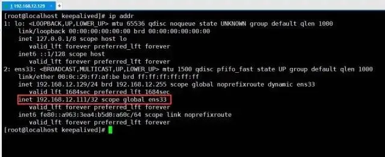

# Nginx的高可用

## 目录

- [Keepalived+重启脚本+双机热备搭建](#Keepalived重启脚本双机热备搭建)
- [Nginx高可用性测试](#Nginx高可用性测试)

线上如果采用单个节点的方式部署`Nginx`，难免会出现天灾人祸，比如系统异常、程序宕机、服务器断电、机房爆炸、地球毁灭....哈哈哈，夸张了。但实际生产环境中确实存在隐患问题，由于`Nginx`作为整个系统的网关层接入外部流量，所以一旦`Nginx`宕机，最终就会导致整个系统不可用，这无疑对于用户的体验感是极差的，因此也得保障`Nginx`高可用的特性。

❝

**接下来则会通过**\*\*`keepalived`****的****`VIP`****机制，实现****`Nginx`****的高可用。****`VIP`****并不是只会员的意思，而是指****`Virtual IP`****，即虚拟****`IP`。\*\*​

❞

`keepalived`在之前单体架构开发时，是一个用的较为频繁的高可用技术，比如`MySQL、Redis、MQ、Proxy、Tomcat`等各处都会通过`keepalived`提供的`VIP`机制，实现单节点应用的高可用。

#### Keepalived+重启脚本+双机热备搭建

①首先创建一个对应的目录并下载`keepalived`到`Linux`中并解压：

```nginx 
[root@localhost]# mkdir /soft/keepalived && cd /soft/keepalived  
[root@localhost]# wget https://www.keepalived.org/software/keepalived-2.2.4.tar.gz  
[root@localhost]# tar -zxvf keepalived-2.2.4.tar.gz  

```


②进入解压后的`keepalived`目录并构建安装环境，然后编译并安装：

```nginx 
[root@localhost]# cd keepalived-2.2.4  
[root@localhost]# ./configure --prefix=/soft/keepalived/  
[root@localhost]# make && make install  
```


③进入安装目录的`/soft/keepalived/etc/keepalived/`并编辑配置文件：

```nginx 
[root@localhost]# cd /soft/keepalived/etc/keepalived/  
[root@localhost]# vi keepalived.conf  

```


④编辑主机的`keepalived.conf`核心配置文件，如下：

```nginx 
global_defs {  
    # 自带的邮件提醒服务，建议用独立的监控或第三方SMTP，也可选择配置邮件发送。  
    notification_email {  
        root@localhost  
    }  
    notification_email_from root@localhost  
    smtp_server localhost  
    smtp_connect_timeout 30  
    # 高可用集群主机身份标识(集群中主机身份标识名称不能重复，建议配置成本机IP)  
 router_id 192.168.12.129   
}  
  
# 定时运行的脚本文件配置  
vrrp_script check_nginx_pid_restart {  
    # 之前编写的nginx重启脚本的所在位置  
 script "/soft/scripts/keepalived/check_nginx_pid_restart.sh"   
    # 每间隔3秒执行一次  
 interval 3  
    # 如果脚本中的条件成立，重启一次则权重-20  
 weight -20  
}  
  
# 定义虚拟路由，VI_1为虚拟路由的标示符（可自定义名称）  
vrrp_instance VI_1 {  
    # 当前节点的身份标识：用来决定主从（MASTER为主机，BACKUP为从机）  
 state MASTER  
    # 绑定虚拟IP的网络接口，根据自己的机器的网卡配置  
 interface ens33   
    # 虚拟路由的ID号，主从两个节点设置必须一样  
 virtual_router_id 121  
    # 填写本机IP  
 mcast_src_ip 192.168.12.129  
    # 节点权重优先级，主节点要比从节点优先级高  
 priority 100  
    # 优先级高的设置nopreempt，解决异常恢复后再次抢占造成的脑裂问题  
 nopreempt  
    # 组播信息发送间隔，两个节点设置必须一样，默认1s（类似于心跳检测）  
 advert_int 1  
    authentication {  
        auth_type PASS  
        auth_pass 1111  
    }  
    # 将track_script块加入instance配置块  
    track_script {  
        # 执行Nginx监控的脚本  
  check_nginx_pid_restart  
    }  
  
    virtual_ipaddress {  
        # 虚拟IP(VIP)，也可扩展，可配置多个。  
  192.168.12.111  
    }  
}  

```


⑤克隆一台之前的虚拟机作为从（备）机，编辑从机的`keepalived.conf`文件，如下：

```nginx 
global_defs {  
    # 自带的邮件提醒服务，建议用独立的监控或第三方SMTP，也可选择配置邮件发送。  
    notification_email {  
        root@localhost  
    }  
    notification_email_from root@localhost  
    smtp_server localhost  
    smtp_connect_timeout 30  
    # 高可用集群主机身份标识(集群中主机身份标识名称不能重复，建议配置成本机IP)  
 router_id 192.168.12.130   
}  
  
# 定时运行的脚本文件配置  
vrrp_script check_nginx_pid_restart {  
    # 之前编写的nginx重启脚本的所在位置  
 script "/soft/scripts/keepalived/check_nginx_pid_restart.sh"   
    # 每间隔3秒执行一次  
 interval 3  
    # 如果脚本中的条件成立，重启一次则权重-20  
 weight -20  
}  
  
# 定义虚拟路由，VI_1为虚拟路由的标示符（可自定义名称）  
vrrp_instance VI_1 {  
    # 当前节点的身份标识：用来决定主从（MASTER为主机，BACKUP为从机）  
 state BACKUP  
    # 绑定虚拟IP的网络接口，根据自己的机器的网卡配置  
 interface ens33   
    # 虚拟路由的ID号，主从两个节点设置必须一样  
 virtual_router_id 121  
    # 填写本机IP  
 mcast_src_ip 192.168.12.130  
    # 节点权重优先级，主节点要比从节点优先级高  
 priority 90  
    # 优先级高的设置nopreempt，解决异常恢复后再次抢占造成的脑裂问题  
 nopreempt  
    # 组播信息发送间隔，两个节点设置必须一样，默认1s（类似于心跳检测）  
 advert_int 1  
    authentication {  
        auth_type PASS  
        auth_pass 1111  
    }  
    # 将track_script块加入instance配置块  
    track_script {  
        # 执行Nginx监控的脚本  
  check_nginx_pid_restart  
    }  
  
    virtual_ipaddress {  
        # 虚拟IP(VIP)，也可扩展，可配置多个。  
  192.168.12.111  
    }  
}  

```


⑥新建`scripts`目录并编写`Nginx`的重启脚本，`check_nginx_pid_restart.sh`：

```nginx 
[root@localhost]# mkdir /soft/scripts /soft/scripts/keepalived  
[root@localhost]# touch /soft/scripts/keepalived/check_nginx_pid_restart.sh  
[root@localhost]# vi /soft/scripts/keepalived/check_nginx_pid_restart.sh  
  
#!/bin/sh  
# 通过ps指令查询后台的nginx进程数，并将其保存在变量nginx_number中  
nginx_number=`ps -C nginx --no-header | wc -l`  
# 判断后台是否还有Nginx进程在运行  
if [ $nginx_number -eq 0 ];then  
    # 如果后台查询不到`Nginx`进程存在，则执行重启指令  
    /soft/nginx/sbin/nginx -c /soft/nginx/conf/nginx.conf  
    # 重启后等待1s后，再次查询后台进程数  
    sleep 1  
    # 如果重启后依旧无法查询到nginx进程  
    if [ `ps -C nginx --no-header | wc -l` -eq 0 ];then  
        # 将keepalived主机下线，将虚拟IP漂移给从机，从机上线接管Nginx服务  
        systemctl stop keepalived.service  
    fi  
fi  

```


⑦编写的脚本文件需要更改编码格式，并赋予执行权限，否则可能执行失败：

```nginx 
[root@localhost]# vi /soft/scripts/keepalived/check_nginx_pid_restart.sh  
  
:set fileformat=unix # 在vi命令里面执行，修改编码格式  
:set ff # 查看修改后的编码格式  
  
[root@localhost]# chmod +x /soft/scripts/keepalived/check_nginx_pid_restart.sh  

```


⑧由于安装`keepalived`时，是自定义的安装位置，因此需要拷贝一些文件到系统目录中：

```nginx 
[root@localhost]# mkdir /etc/keepalived/  
[root@localhost]# cp /soft/keepalived/etc/keepalived/keepalived.conf /etc/keepalived/  
[root@localhost]# cp /soft/keepalived/keepalived-2.2.4/keepalived/etc/init.d/keepalived /etc/init.d/  
[root@localhost]# cp /soft/keepalived/etc/sysconfig/keepalived /etc/sysconfig/  

```


⑨将`keepalived`加入系统服务并设置开启自启动，然后测试启动是否正常：

```nginx 
[root@localhost]# chkconfig keepalived on  
[root@localhost]# systemctl daemon-reload  
[root@localhost]# systemctl enable keepalived.service  
[root@localhost]# systemctl start keepalived.service  
```


其他命令：

```nginx 
systemctl disable keepalived.service # 禁止开机自动启动  
systemctl restart keepalived.service # 重启keepalived  
systemctl stop keepalived.service # 停止keepalived  
tail -f /var/log/messages # 查看keepalived运行时日志  

```


⑩最后测试一下`VIP`是否生效，通过查看本机是否成功挂载虚拟`IP`

```nginx 
[root@localhost]# ip addr  

```




虚拟IP-VIP

❝

从上图中可以明显看见虚拟`IP`已经成功挂载，但另外一台机器`192.168.12.130`并不会挂载这个虚拟`IP`，只有当主机下线后，作为从机的`192.168.12.130`才会上线，接替`VIP`。最后测试一下外网是否可以正常与`VIP`通信，即在`Windows`中直接`ping VIP`：

❞


Ping-VIP

外部通过`VIP`通信时，也可以正常`Ping`通，代表虚拟`IP`配置成功。

#### Nginx高可用性测试

经过上述步骤后，`keepalived`的`VIP`机制已经搭建成功，在上个阶段中主要做了几件事：

- 一、为部署`Nginx`的机器挂载了`VIP`。
- 二、通过`keepalived`搭建了主从双机热备。
- 三、通过`keepalived`实现了`Nginx`宕机重启。

由于前面没有域名的原因，因此最初`server_name`配置的是当前机器的`IP`，所以需稍微更改一下`nginx.conf`的配置：

```nginx 
sever{  
    listen    80;  
    # 这里从机器的本地IP改为虚拟IP  
 server_name 192.168.12.111;  
 # 如果这里配置的是域名，那么则将域名的映射配置改为虚拟IP  
}  

```


最后来实验一下效果：


Nginx宕机

❝

在上述过程中，首先分别启动了`keepalived、nginx`服务，然后通过手动停止`nginx`的方式模拟了`Nginx`宕机情况，过了片刻后再次查询后台进程，我们会发现`nginx`依旧存活。

❞

从这个过程中不难发现，`keepalived`已经为我们实现了`Nginx`宕机后自动重启的功能，那么接着再模拟一下服务器出现故障时的情况：


服务器故障

❝

在上述过程中，我们通过手动关闭`keepalived`服务模拟了机器断电、硬件损坏等情况（因为机器断电等情况=主机中的`keepalived`进程消失），然后再次查询了一下本机的`IP`信息，很明显会看到`VIP`消失了！

❞

现在再切换到另外一台机器：`192.168.12.130`来看看情况：


130的IP情况

❝

此刻我们会发现，在主机`192.168.12.129`宕机后，VIP自动从主机飘移到了从机`192.168.12.130`上，而此时客户端的请求就最终会来到`130`这台机器的`Nginx`上。

❞

**「「最终，利用**\*\*`Keepalived`对`Nginx`做了主从热备之后，无论是遇到线上宕机还是机房断电等各类故障时，都能够确保应用系统能够为用户提供`7x24`小时服务。」」\*\*

\##
