# 结合 Docker；nginx的缓存策略

## 目录

- [静态文件托管:location语法](#静态文件托管location语法)
  - [总结一下](#总结一下)
- [总结
  ](#总结)

Nginx 是流行的服务器，一般用它对静态资源做托管、对动态资源做反向代理。
Docker 是流行的容器技术，里面可以跑任何服务。
那 Docker + Nginx 如何结合使用呢？
我们来试一下：
首先要下载 Docker，直接安装 Docker Desktop 就行：


它是用来管理容器和镜像的：

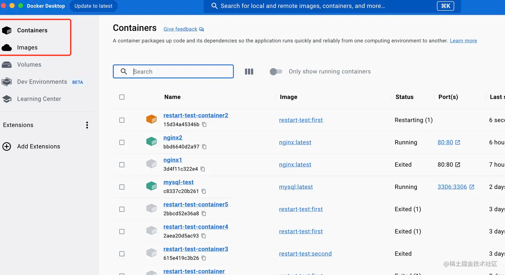

安装它之后，docker 命令也就可用了：

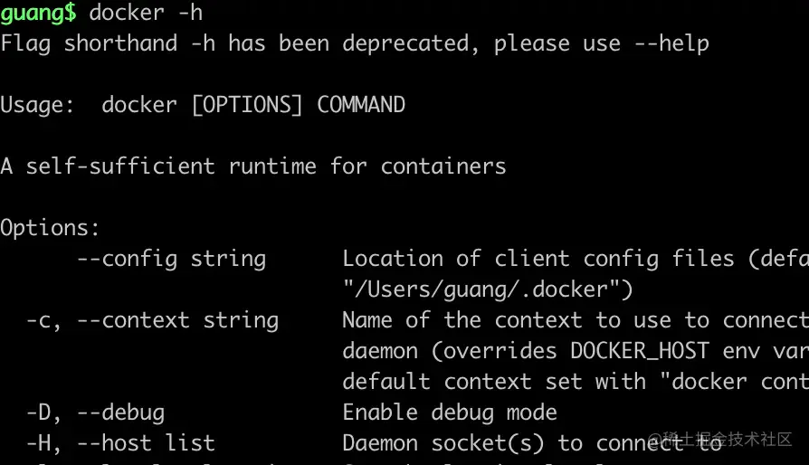

然后我们来跑下 nginx 的镜像。

搜索 nginx（这一步需要科学上网，因为要访问 [hub.docker.com](http://hub.docker.com "hub.docker.com") 这个网站），点击 run：

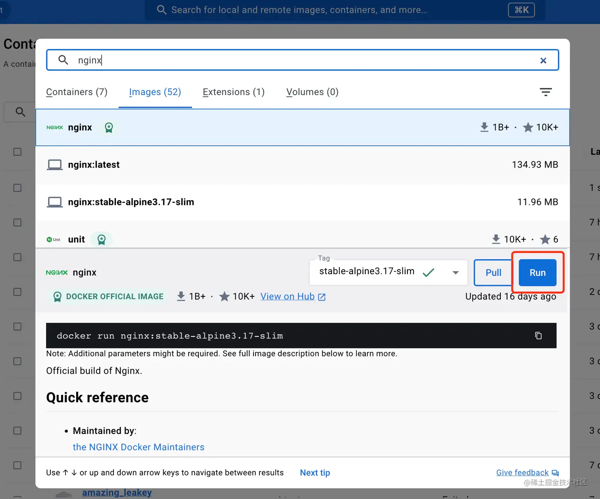

输入容器名和要映射的端口：

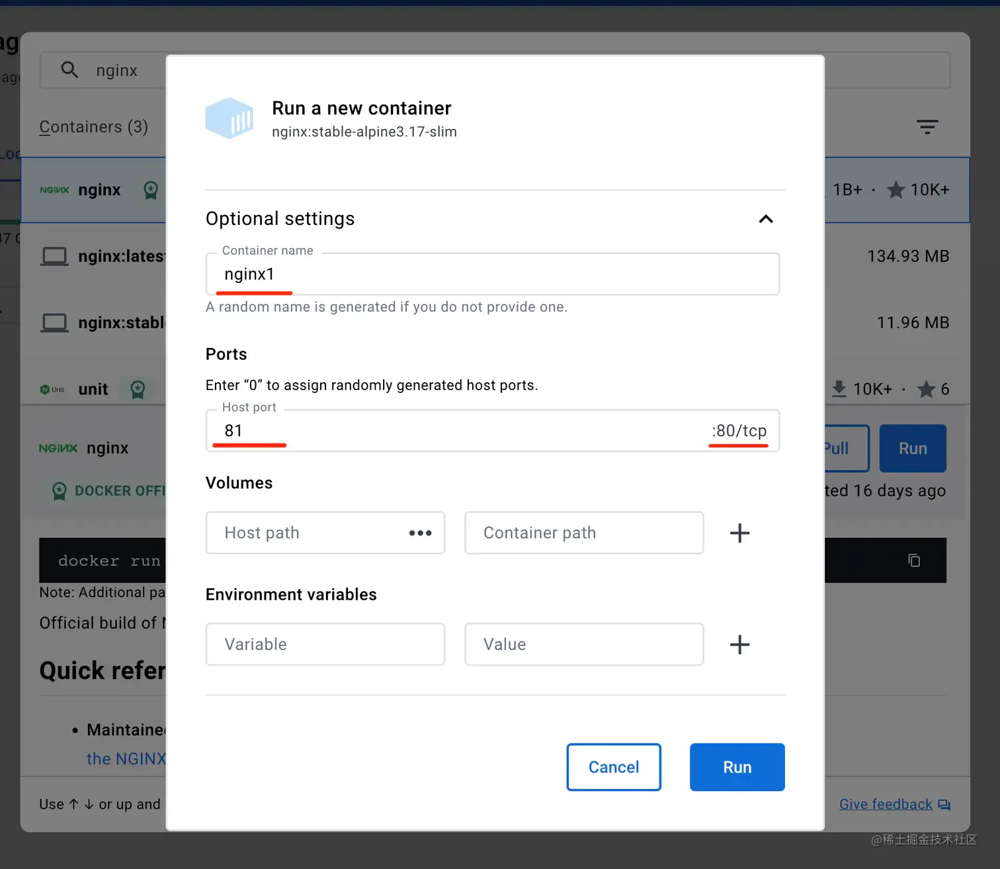

这里把宿主机的 81 端口映射到容器内的 80 端口，点击 run。

这时候就可以看到 docker 容器跑起来了，并且打印了日志：

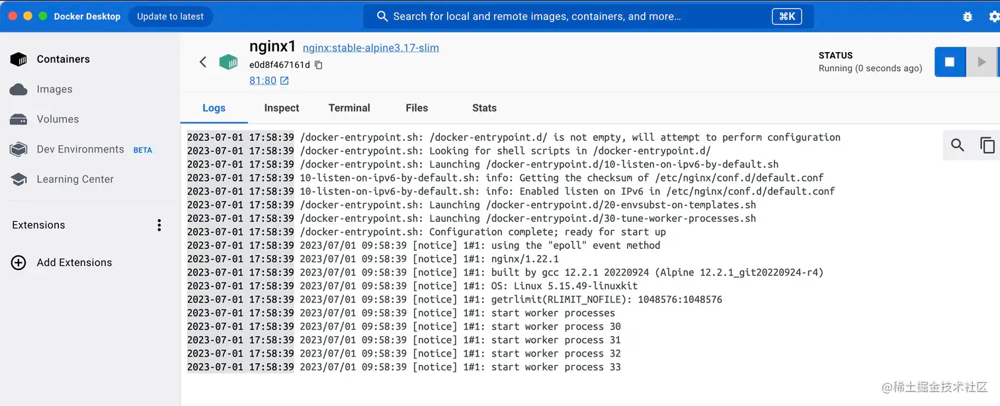

浏览器访问下 [http://localhost:81](https://link.juejin.cn/?target=http://localhost:81 "http://localhost:81") 可以看到 nginx 欢迎页面：

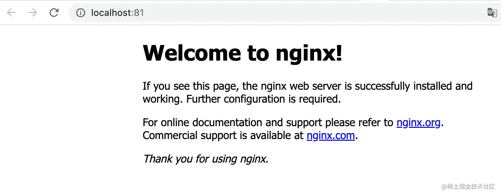

这很明显是容器里跑的服务。

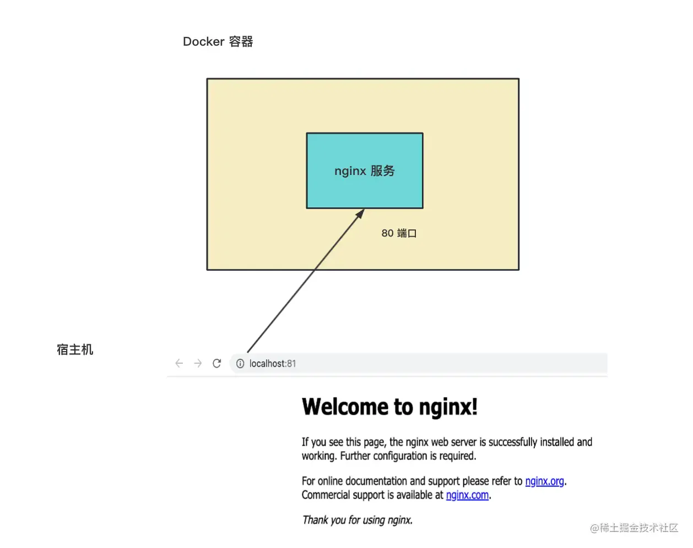

但是现在的页面是默认的，我想用 nginx 来托管我的一些静态 html 页面怎么做呢？

首先我们要知道现在的配置文件和页面都存在哪里。

在 files 面板可以看到容器内的文件：

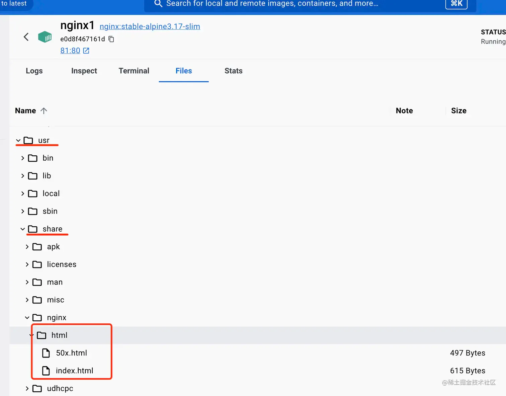

里面的 /usr/share/nginx/html/ 目录下面就是所有的静态文件。

双击点开 index.html 看看：

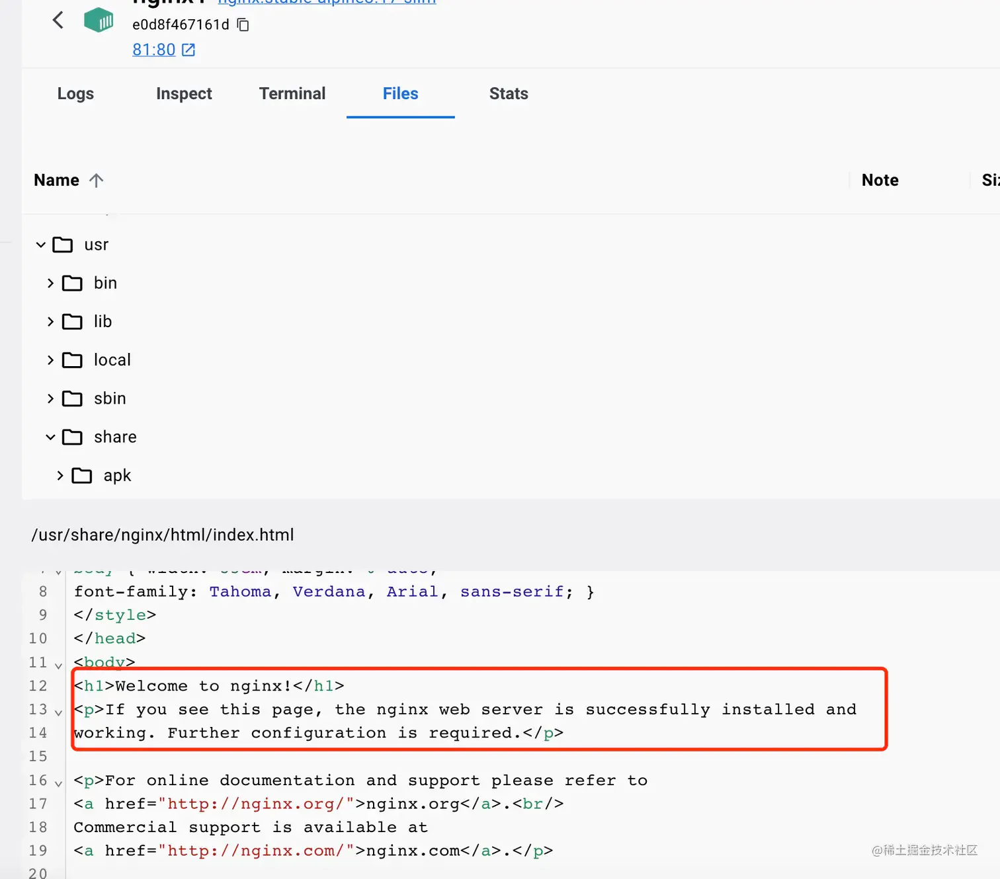

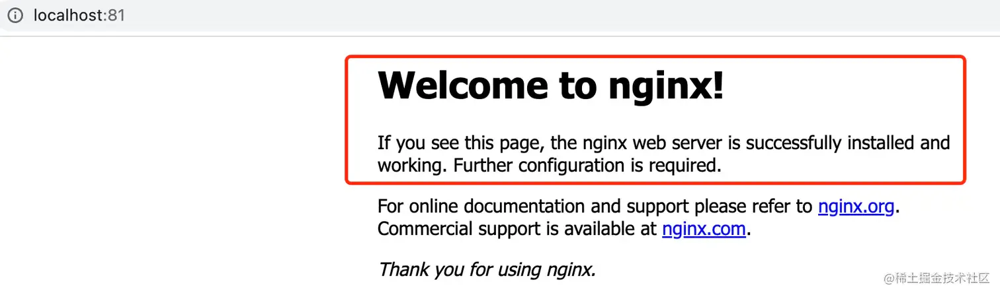

和我们浏览器看到的页面一毛一样。

也就是说，这个目录就是保存静态文件的目录。

那我们在这个目录下放我们自己的 html 不就行了？

我们先把这个目录复制出来：

```bash 
docker cp  nginx1:/usr/share/nginx/html ~/nginx-html

```


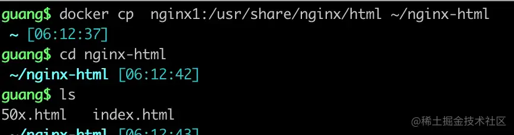

docker cp 这个命令就是用于在宿主机和容器之间复制文件和目录的。

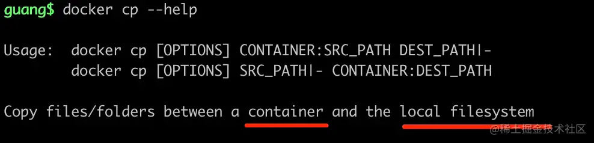

比如我们把这个目录再复制到容器里：

```bash 
docker cp  ~/nginx-html nginx1:/usr/share/nginx/html-xxx

```


可以看到容器内就多了这个目录：

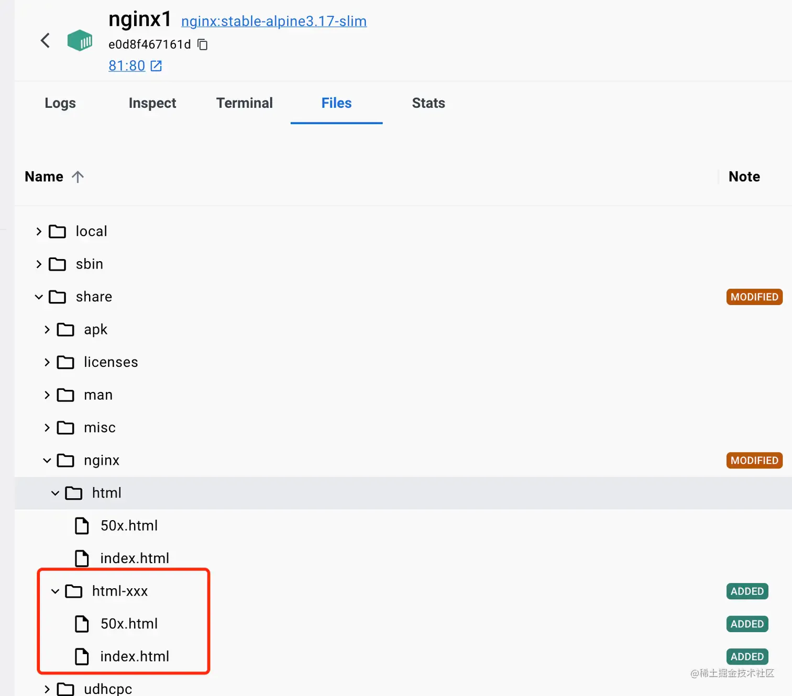

然后我们在这个目录下添加两个 html 来试试看：

```bash 
echo aaa > aaa.html

echo bbb > bbb.html

docker cp  ~/nginx-html nginx1:/usr/share/nginx/html

```


**但当目标目录存在的时候，docker 会把他复制到目标目录下面：**

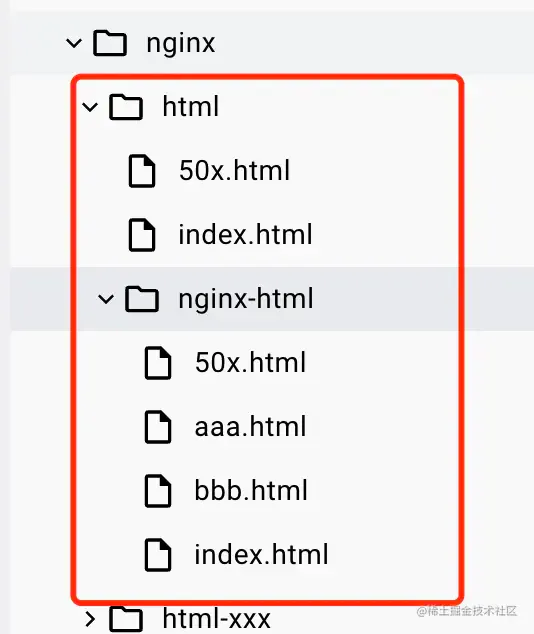

我们需要先删除容器的这个目录，再复制：


```bash 
docker cp  ~/nginx-html nginx1:/usr/share/nginx/html

```


这样就好了：


然后浏览器访问下试试：


现在就可以访问容器内的这些目录了。

**也就是说只要放到 /usr/share/nginx/html 下的文件，都可以通过被访问到。**

可是为什么呢？

这是因为 nginx 的默认配置。

我们看下 nginx 配置文件，也就是 /etc/nginx/nginx.conf。

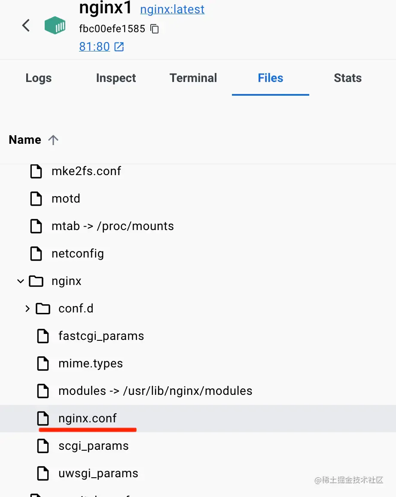

复制出来看看：

```bash 
docker cp  nginx1:/etc/nginx/nginx.conf ~/nginx-html

```


这是就是 nginx 的默认配置：

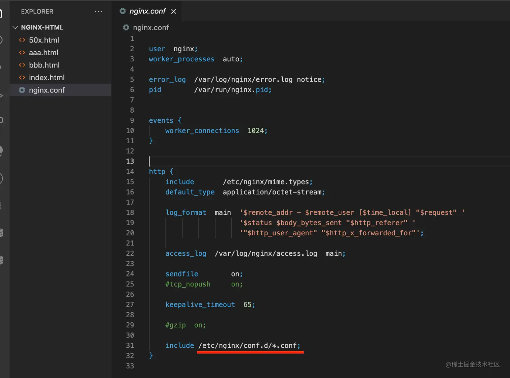

其实这个\*\* nginx.conf 叫做主配置文件，里面一般做一些全局的配置，\*\* 比如错误日志的目录等等。

可以看到 http 下面有个 **include 引入了 /etc/nginx/conf.d/ \*.conf 的配置。**

一般具体的路由配置都是在这些子配置文件里。

目录\*\* conf.d 是 configuration directory 的意思。\*\*

我们把这个目录也复制出来看看：

```bash 
docker cp  nginx1:/etc/nginx/conf.d ~/nginx-html

```


这里面就配置了 localhost:80 的虚拟主机下的所有路由。

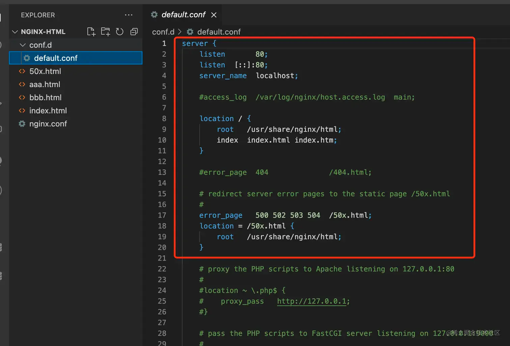

**虚拟主机是什么呢？**

**就是可以用一台 nginx 服务器来为多个域名和端口的提供服务。**

只要**多加几个 server 配置**就可以。

这里我们就配置 localhost:80 这一个虚拟主机。

下面的 location 就是路由配置。

比如这个配置：

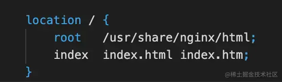

它就配置了 / 下的所有路由，都是在 root 指定的目录查找。

所以 [http://localhost/aaa.html](https://link.juejin.cn?target=http://localhost/aaa.html "http://localhost/aaa.html") 就是从 /usr/share/nginx/html/aaa.html 找的。

# 静态文件托管:location语法

location 支持的语法有好几个，我们分别试一下：

```bash 
location = /111/ {
    default_type text/plain;
    return 200 "111 success";
}

location /222 {
    default_type text/plain;
    return 200 $uri;
}

location ~ ^/333/bbb.*\.html$ {
    default_type text/plain;
    return 200 $uri;
}

location ~* ^/444/AAA.*\.html$ {
    default_type text/plain;
    return 200 $uri;
}

```


把之前的 location / 删掉，添加这样几个路由配置。

具体这些配置都是什么意思待会再说。

把这个文件复制到容器内：

```bash 
docker cp ~/nginx-html/conf.d/default.conf nginx1:/etc/nginx/conf.d/default.conf

```


然后**在容器内的 terminal 执行：**

```bash 
nginx -s reload

```


重新加载配置文件。


然后来看第一条路由：

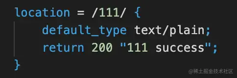

location 和路径**之间加了个 =，代表精准匹配，** 也就是只有完全相同的 url 才会匹配这个路由。


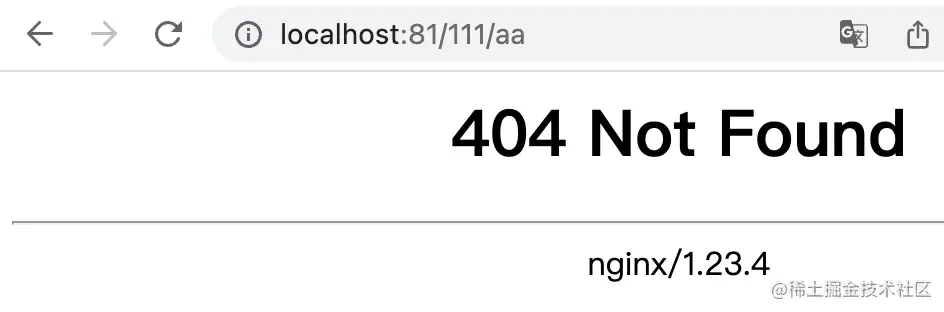

**不带 = 代表根据前缀匹配，后面可以是任意路径。**

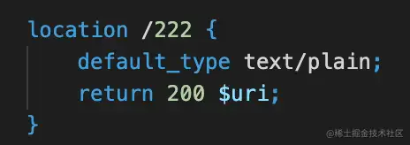

**这里的 \$uri 是取当前路径。**

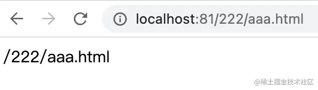


然后**如果想支持正则，就可以加个 \~。**

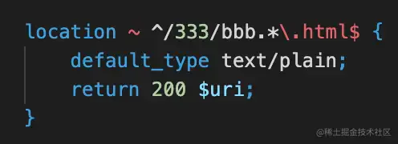

这里的正则语法不难看懂，就是 /aaaa/bbb 开头，然后中间是任意字符，最后 .html 结尾的 url。


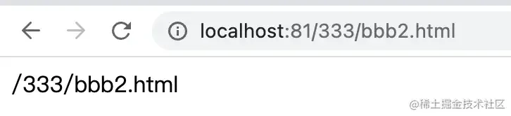

**但是它是区分大小写的，比如这样就不行了：**

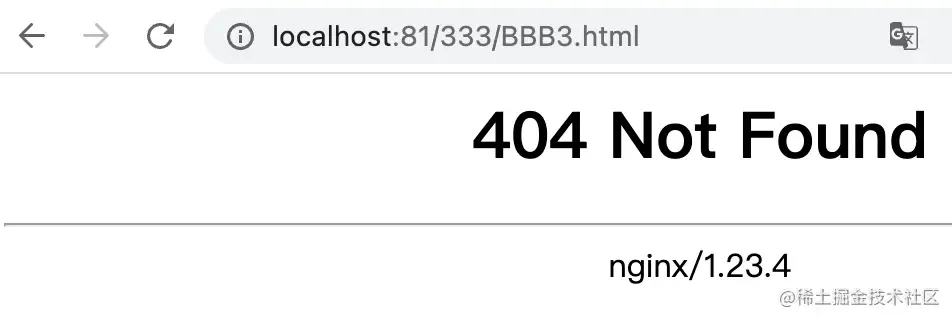

换成小写就可以：


如果**想让正则不区分大小写，可以再加个 \***


试一下：


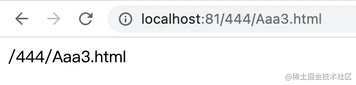

任意的大小写都是可以的。

此外，还有一种语法：

在配置文件加上这个配置：

```bash 
location /444 {
    default_type text/plain;
    return 200 'xxxx';
}

```


然后复制到容器里，并 reload：

```bash 
docker cp ~/nginx-html/conf.d/default.conf nginx1:/etc/nginx/conf.d/default.conf

```


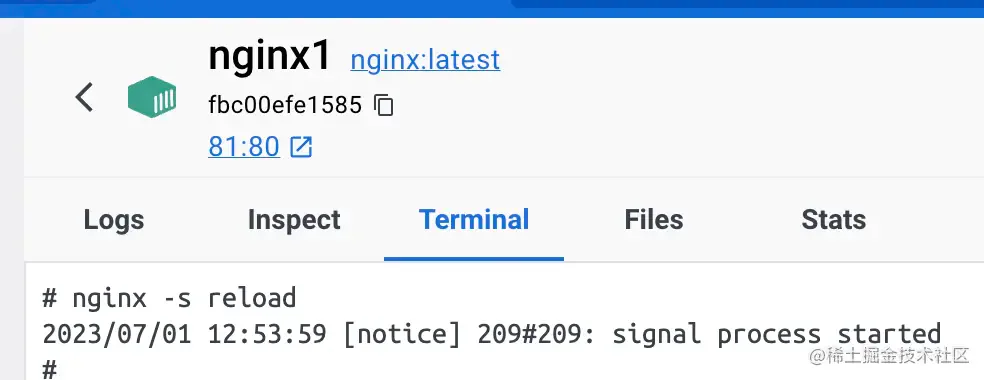

这时候就有两个 /444 的路由了：

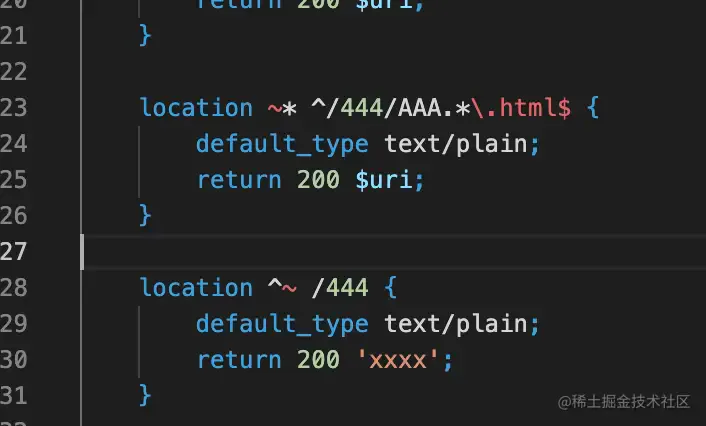

这时候浏览器访问，还是匹配上面的那个路由：


如果想**提高优先级，可以使用 ^\~**

改成这样：

```bash 
location ^~ /444 {
    default_type text/plain;
    return 200 'xxxx';
}

```


然后复制到容器里，并 reload：

```bash 
docker cp ~/nginx-html/conf.d/default.conf nginx1:/etc/nginx/conf.d/default.conf

```


这时候同一个 url，匹配的就是下面的路由了：


**也就是说 ^\~ 能够提高前缀匹配的优先级。**

## 总结一下

总结一下，一共 4 个 location 语法：

**location = /aaa 是精确匹配 /aaa 的路由。**

**location /bbb 是前缀匹配 /bbb 的路由。**

**location \~ /ccc.*****.html 是正则匹配。可以再加个 \* 表示不区分大小写 location \~*****\* /ccc.\*.html**

**location ^\~ /ddd 是前缀匹配，但是优先级更高。**

这 4 种语法的优先级是这样的：

**精确匹配（=） > 高优先级前缀匹配（^\~） > 正则匹配（～ \~ \*） > 普通前缀匹配**

我们现在是直接用 return 返回的内容，其实应该返回 html 文件。

可以这样改：

```bash 
location /222 {
    alias /usr/share/nginx/html;
}

location ~ ^/333/bbb.*\.html$ {
    alias /usr/share/nginx/html/bbb.html;
}

```


然后复制到容器里，并 reload：

```bash 
docker cp ~/nginx-html/conf.d/default.conf nginx1:/etc/nginx/conf.d/default.conf

```


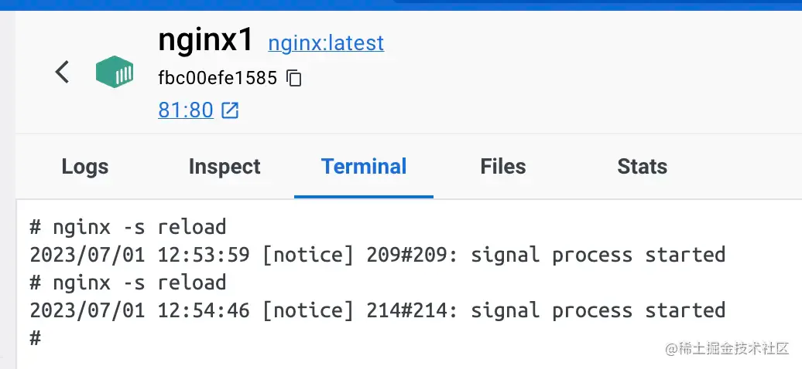

都是能正确返回对应的 html 的：


前面用过 root：


总结

我们通过 docker 跑了 nginx 服务器，并使用了它的静态资源托管功能，还有动态资源的反向代理功能。
nginx **的配置文件在 /etc/nginx/nginx.conf 里，它默认还引入了 /etc/nginx/conf.d 下的子配置文件。**
默认 html 都放在 /usr/share/nginx/html 下。
我们可以通过 docker cp 来把容器内文件复制到宿主机来修改。
修改 nginx 配置，在 server 里配置路由，根据不同的 url 返回不同的静态文件。

有 4 种 location 语法：

- location /aaa 根据前缀匹配
- location \~^ /aaa 根据前缀匹配，优先级更高
- location = /aaa 精准匹配
- location \~ /aaa/.\*html 正则匹配
- location \~\* /aaa/.\* html 正则匹配，而且不区分大小写

**优先级是 精确匹配（=） > 高优先级前缀匹配（^\~） > 正则匹配（～ \~ \*） > 普通前缀匹配**
