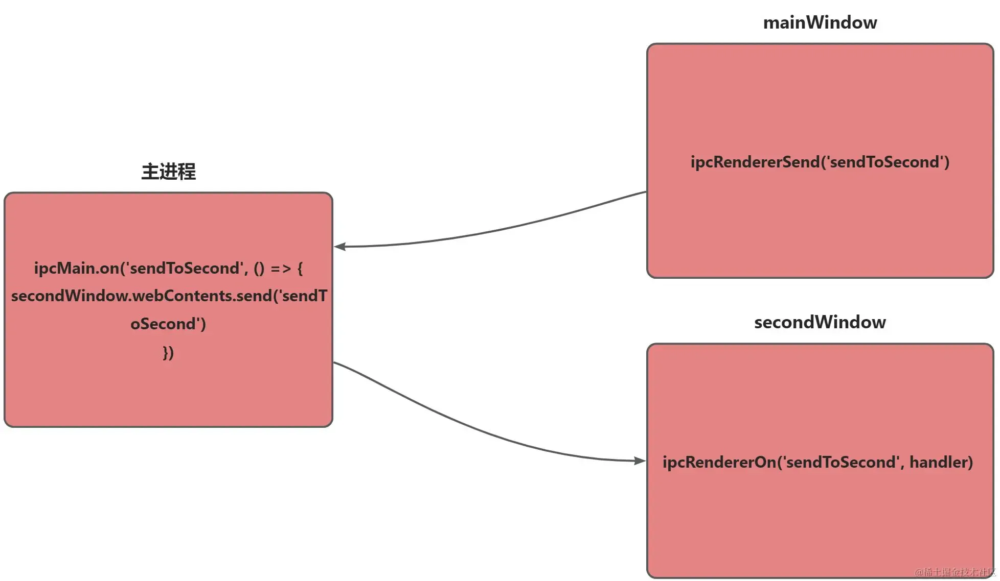

# 主进程转发

要实现**窗口之间的通信**，我们实际上就是使用**应用层和主进程之间**的通信，由于**主进程可以接收到任意窗口发过来的事件**，因此我们想**实现窗口之间的通信，只需要在主进程中进行转发就好**，下面是图解。



```javascript 
// 主窗口
ipcRendererSend('sendToSecond', '123')

// 主进程
ipcMain.on('sendToSecond', (e, data) => {
  secondWindow.webContents.send('sendToSecond', data)
})

// 第二窗口
ipcRendererOn('sendToSecond', handler)


```
