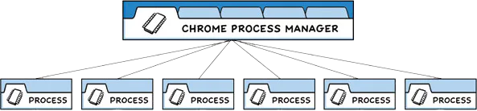

# 多进程模型

为了解决这个问题，Chrome 团队决定让**每个标签页在自己的进程中渲染，** 从而限制了一个网页上的有误或恶意代码可能导致的对整个应用程序造成的伤害。 然后用单个浏览器进程控制这些标签页进程，以及整个应用程序的生命周期。 下方来自 [Chrome 漫画](https://www.google.com/googlebooks/chrome/ "Chrome 漫画") 的图表可视化了此模型：

`Electron` 应用程序的结构非常相似。 作为应用开发者，你将控制两种类型的进程：[**主进程**](https://www.electronjs.org/zh/docs/latest/tutorial/process-model#the-main-process "主进程")\*\* 和 **[**渲染器进程**](https://www.electronjs.org/zh/docs/latest/tutorial/process-model#the-renderer-process "渲染器进程")**。\*\* 这类似于上文所述的 Chrome 的浏览器和渲染器进程。
