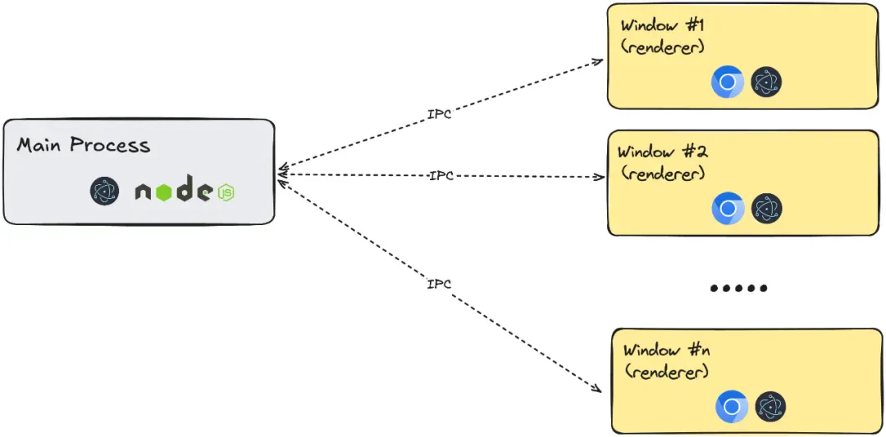
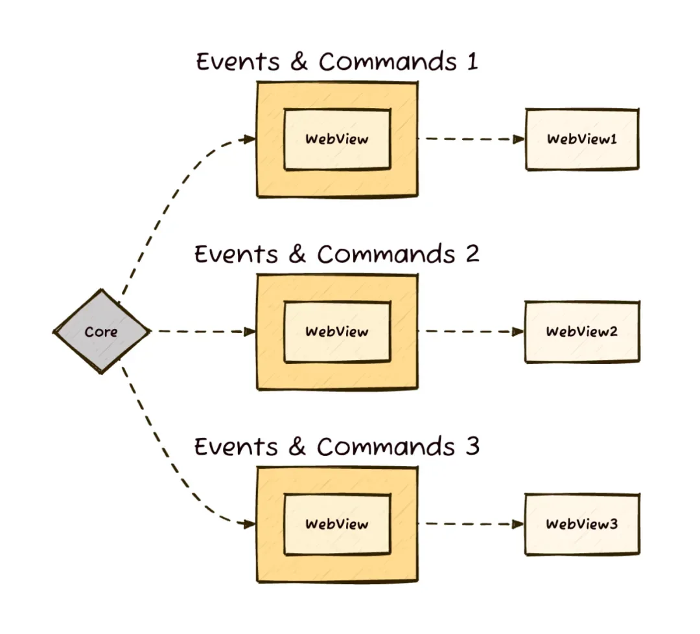
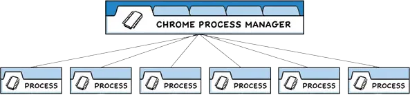
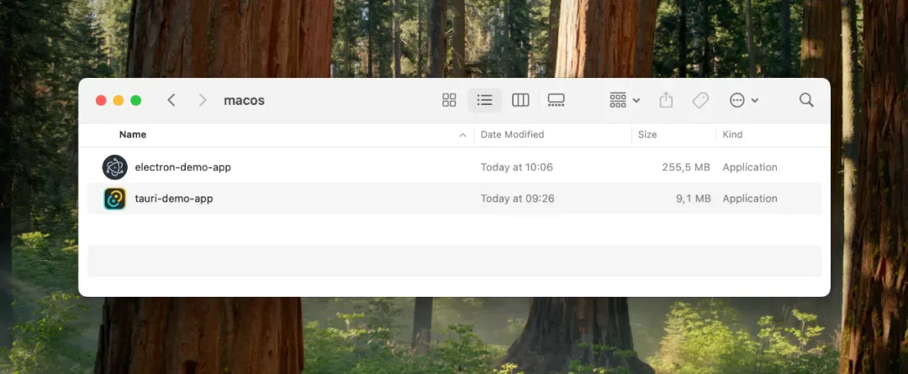
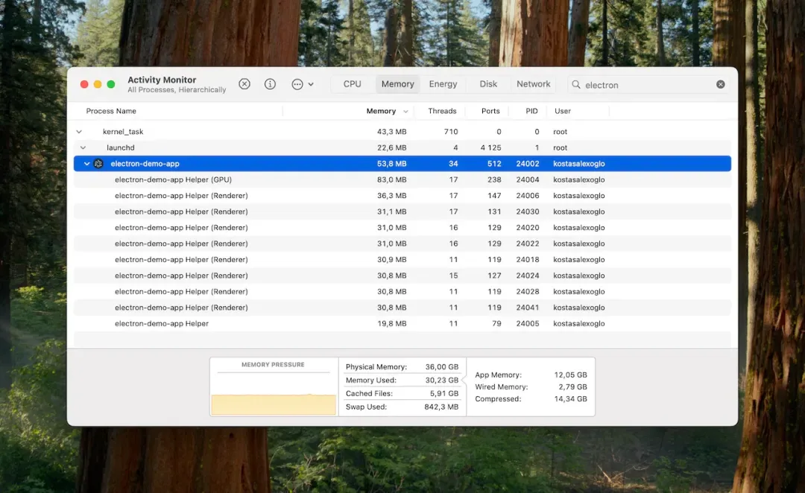
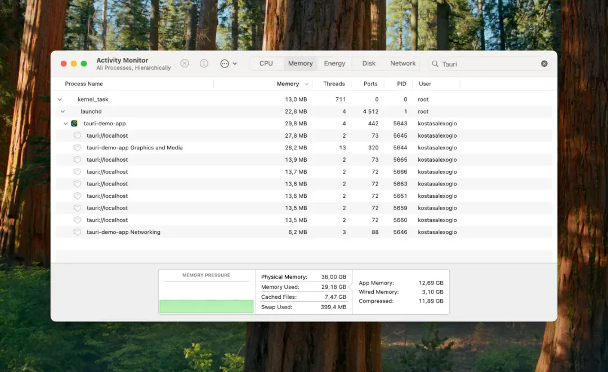
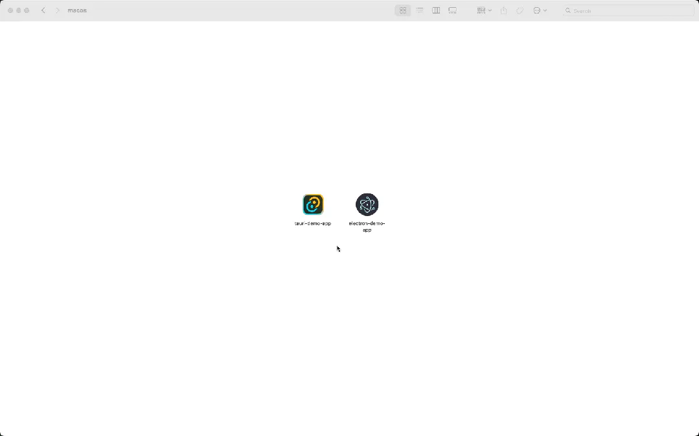

# Tauri vs. Electron

## 目录

- [Tauri 和 Electron 的主要区别](#Tauri-和-Electron-的主要区别)
- [Electron 的主进程](#Electron-的主进程)
  - [Electron 的渲染进程](#Electron-的渲染进程)
- [Tauri 的主进程](#Tauri-的主进程)
  - [Tauri 的 WebView 进程](#Tauri-的-WebView-进程)
- [功能对比](#功能对比)
  - [应用基准测试](#应用基准测试)
  - [构建时间](#构建时间)
  - [应用包体积](#应用包体积)
  - [内存使用](#内存使用)
  - [启动时间](#启动时间)
- [我们为什么为 Hopp 选择了 Tauri](#我们为什么为-Hopp-选择了-Tauri)
  - [1. 后端性能](#1-后端性能)
  - [2. Sidecar（伴随进程）支持](#2-Sidecar伴随进程支持)
  - [3. 功能趋同](#3-功能趋同)
- [结语](#结语)

在 Hopp，我们正在打造一款跨平台的远程控制应用程序，旨在提供低延迟的远程结对编程体验。为用户提供最佳使用体验始终是我们的首要任务。

在开发初期，团队决定是使用[Tauri](https://mp.weixin.qq.com/s?__biz=MjM5MTA1MjAxMQ==\&mid=2651273286\&idx=2\&sn=4c53f4d4470c1d27cc368842f1a66353\&scene=21#wechat_redirect "Tauri")还是 Electron 来构建应用程序。这两个框架都能让我们避免为每个操作系统（Windows、macOS、Linux）单独编写原生代码，这意味着需要慎重考虑做出一个关键的选择。

Tauri 和 Electron 都提供了功能强大的框架，但它们在架构上存在一些本质差异。为了选择最适合 Hopp 长期发展的方案，我们对这些差异进行了深入分析。

如果你现在也在考虑在项目中使用 Tauri 还是 Electron，希望这篇文章能帮到你。

#### Tauri 和 Electron 的主要区别

当开发者第一次接触 Tauri 时，常常会看到有人把它称为 “**轻量版 Electron**”，或者强调 “**需要学 Rust**”。这些说法并非全无道理，但也只是冰山一角。这两个领先的跨**平台框架在架构上有明显区别，这些差异会影响开发方式和应用性能。**

我们先来看看它们背后是如何运行的。



Electron 的架构模型



#### Electron 的主进程

Electron 的主进程是一个[**Node.js**](https://mp.weixin.qq.com/s?__biz=MjM5MTA1MjAxMQ==\&mid=2651276114\&idx=1\&sn=775732ccf24a78288480c12f83ad89eb\&scene=21#wechat_redirect "Node.js")进程。这意味着你的应用需要自带 Node.js 运行环境，以确保能在任何用户设备上正常运行。

这也导致事件处理依赖于 `Node.js` 的事件循环。对于性能要求更高的任务或更深入的系统级交互，通常需要启动一个额外的进程，并通过进程间通信（`IPC`）或类似 `Unix` 套接字的方式与之交互。

##### Electron 的渲染进程

可以将渲染进程**视为由主进程生成的单个浏览器标签页。实际上，每打开一个 Electron 窗口，就会启动一个新的渲染进程。**

这意味着一个**拥有多个窗口的应用会同时运行多个渲染进程**。开发者需要特别关注这些进程带来的内存和 CPU 占用，就像后台同时运行多个迷你版的 Chromium 浏览器一样。

Electron 官方也用过一个很形象的比喻来说明这一点：



#### Tauri 的主进程

[Tauri](https://mp.weixin.qq.com/s?__biz=MjM5MTA1MjAxMQ==\&mid=2651272122\&idx=2\&sn=9af11ca1b08860f3020a6ecaeff163cc\&scene=21#wechat_redirect "Tauri")使用 `Rust`作为后端语言。一个关键优势**在于 Rust 可编译为原生二进制文件，无需将运行时（如 Node.js）与应用程序捆绑在一起。** 这让应用体积更轻，不过也伴随着一些后面会讲到的权衡。

##### Tauri 的 WebView 进程

`Tauri` 并未将整个 `Chromium`引擎打包，而是**使用操作系统自带的原生 WebView 组件来渲染用户界面。** 该组件通常比完整的浏览器引擎要轻量。当前 Tauri 使用的 WebView 如下：

- 基于 Microsoft Edge/Chromium 的 Windows 系统上的 WebView2
- macOS 上的 WKWebView（基于 Safari/WebKit）
- Linux 上的 WebKitGTK

通过利用**系统内置的 WebView，Tauri 能构建出更小的应用包，但这也带**来了一些代价。

开发者在使用 Tauri 时，**可能会遇到跨平台 UI 表现不一致的问题**。例如，在 Safari 上会出现的 bug，在 Chrome 上却没有，或者 Firefox 在不同操作系统上表现不同。因为 Tauri 使用的是每个系统不同的浏览器内核，这种平台差异在开发过程中是必须考虑的因素。

#### 功能对比

下面是一张对比表，展示了 Tauri 和 Electron 的一些关键特性，其中稍微强调了我们在 Hopp 特别看重的因素。表格后面还有一组简单的基准测试，比较**了两者在应用体积、启动时间和内存占用方面的差异。**

| 特性          | Tauri 🦀 | Electron ⚛️ |
| ----------- | -------- | ----------- |
| 启动时间        | 🏎️ 快    | 🏎️ 快       |
| 内存占用（基准测试）  | 172 MB   | 409 MB      |
| 浏览器技术       | WebView  | Chromium    |
| 后端语言        | Rust     | JavaScript  |
| 初次构建时间      | 🐢 慢     | 🏎️ 快       |
| 应用包体积（基准测试） | 8.6 MiB  | 244 MiB     |

##### 应用基准测试

为了更直观地展示差异，我们做了一组基准测试，测试了两个使用不同框架开发的应用。它们的功能很简单：

- 显示一个主窗口，里面有个按钮可以打开新窗口
- 同时打开 6 个窗口，观察资源占用情况

应用是用以下命令搭建的：

```bash 
 # 创建 Electron 应用
 npx create-electron-app@latest electron-demo-app --template=vite-typescript

 # 创建 Tauri 应用（选用 TypeScript + Vite + React）
 yarn create tauri-app

```


最终生成的应用大致如下所示：


Electron 应用界面


🚧**提示**：这只是一次在我个人 MacBook Pro 上进行的基础测试（N=1），结果仅供参考。

##### 构建时间

由于需要编译[Rust](https://mp.weixin.qq.com/s?__biz=MjM5MTA1MjAxMQ==\&mid=2651273229\&idx=2\&sn=4f3688db19588c273d247bc528b6f3cf\&scene=21#wechat_redirect "Rust")，**Tauri 的首次构建时间明显比 Electron 慢。不过后续的增量构建通常会快很多。**

```markdown 
 # Electron
 ❯ time yarn make
 ...[LOGS]...
 yarn make  13.23s user 1.55s system 93% cpu 15.818 total

 # Tauri
 ❯ time yarn tauri build
 ...[LOGS]...
 yarn tauri build  380.11s user 28.37s system 504% cpu 1:20.94 total

```


##### 应用包体积

由于架构差异，**Tauri 构建出的应用体积要小得多**，主要原因有两个：

- **Tauri 不需要打包 JavaScript 运行时（如 Node.js）**
- **Tauri 利用系统自带的 WebView，而不是打包整个 Chromium**

如下所示，Tauri 构建出的应用只有 8.6MiB，而 Electron 的则达到 244MiB：

```bash 
 ❯ du -h -d 1 .
 8.6M    ./tauri-demo-app.app
 244M    ./electron-demo-app.app

```




##### 内存使用

这一部分清楚展现了[Tauri](https://mp.weixin.qq.com/s?__biz=MjM5MTA1MjAxMQ==\&mid=2651272122\&idx=2\&sn=9af11ca1b08860f3020a6ecaeff163cc\&scene=21#wechat_redirect "Tauri")被称为 “轻量级” 框架的原因。差异主要来自两个方面：

**Electron 主进程**

Node.js 本身就会占用一定内存

**渲染进程**

在 macOS 系统上，对于相同的窗口，基于 Chromium 的 Electron 渲染器进程所消耗的内存大约是 Tauri 的 WKWebView 进程的两倍。

在两个应用都打开 6 个窗口后，内存占用大致如下：



Electron - 约 409 MB



Tauri - 约 172 MB

##### 启动时间

启动速度通常也是大家关注的点。在这次简单的测试中，**两者启动时间差异非常小**。老实说，如果一个应用只是启动时间相差不到 1,500 毫秒，完全没必要单独以此作为框架选择的决定性因素。



如果你想了解更多不同框架的详细基准测试数据，可以参考 Web to Desktop Framework Comparison 的 GitHub 仓库。[https://github.com/Elanis/web-to-desktop-framework-comparison?ref=hopp#benchmarks](https://github.com/Elanis/web-to-desktop-framework-comparison?ref=hopp#benchmarks "https://github.com/Elanis/web-to-desktop-framework-comparison?ref=hopp#benchmarks")

#### 我们为什么为 Hopp 选择了 Tauri

上面的对比展示了 Tauri 和 Electron 各自的优劣。最终，我们在 Hopp 项目中选择了 Tauri，主要基于以下几点关键原因：

##### 1. 后端性能

Hopp 使用了**经过定制的**[**WebRTC**](https://mp.weixin.qq.com/s?__biz=MjM5MTA1MjAxMQ==\&mid=2651273128\&idx=1\&sn=428f8cc9b5ec7cccfab9e9d83f5125a6\&scene=21#wechat_redirect "WebRTC")**技术，** 以实现超低延迟的屏幕共享。我们需要从后台进程直接进行视频流传输，而不是依赖浏览器自带的屏幕共享 API。

Rust 的高性能非常适合完成**这种计算密集型任务**。如果用 Electron 来实现，我们还需要额外管理一个独立的进程来处理视频流，这样会让整体架构变得更复杂

##### 2. Sidecar（伴随进程）支持

虽然 Tauri 的主进程是用 Rust 编写的，但在 Hopp 中，我们还需要一个额外的进程（即 “Sidecar”）来处理屏幕视频流以及远程控制的输入（如点击和键盘操作）。这使得我们可以将这部分功能独立出来开发和测试。

Tauri 原生就支持 Sidecar 的概念，能很好地管理这些外部可执行文件的生命周期。如果在 Electron 中实现类似功能，则需要手动启动、监控并与这个外部进程通信，复杂度明显更高。

> 注：`Tauri` 的 `Sidecar` 虽然和 `Kubernetes` 中的 `Sidecar` 模式在概念上不同，但作用类似，都是用来管理一个 “配套进程”。

此外，我们还使用这个 Sidecar 进程来绘制控制端的鼠标光标。将来我们也可能会切换使用 Tauri 的 egui（图形界面库）来实现这部分功能。

##### 3. 功能趋同

虽然 Tauri 是比 Electron 更新的框架，但它发展非常迅速。特别是 Tauri v2，在不断缩小与 Electron 的功能差距，例如集成了内置的自动更新器，并把它作为一等公民来支持。Tauri 项目在性能、安全性方面的专注，也正好与我们的需求高度契合。

#### 结语

希望这篇对比能对你有所帮助，特别是当你正在考虑为下一个项目选择 Tauri 还是 Electron 时。

说到底，其实没有唯一正确的答案。最合适的选择，取决于你具体的使用场景、团队技术栈以及项目的实际需求。Tauri 和 Electron 都是强大的工具，都能用来构建优秀的桌面应用，只是各自有不同的优点和限制。
