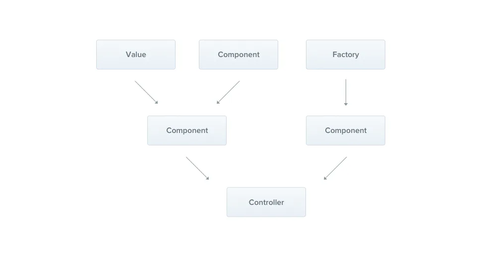

# Providers

Providers 是 `Nest` 的**一个基本概念**。**许多基本**的 `Nest` 类都可能被视为 `provider` - `service`, `repository`, `factory`, `helper` 等等。 他们都可以通过 `constructor`\*\* 注入依赖关系\*\*。 这意味**着对象可以彼此创建各种关系**，并且“连接”**对象实例的功能在很大程度上可以委托给`Nest`运行时系统。**&#x20;

**Provider 只是一个用 ****`@Injectable()`**** 装饰器注释的类。**

在前面的章节中，我们已经创建了一个简单的控制器 `CatsController` 。**控制器应处理 ****`HTTP`**** 请求并将更复杂的任务委托**给 **providers**。`Providers` 是**纯粹的** `JavaScript` 类，在其**类声明之前带有** `@Injectable()`装饰器。

> 由于 `Nest` 可以以**更多的面向对象方式设计**和组织依赖性，因此我们强烈建议遵循 [SOLID](https://en.wikipedia.org/wiki/SOLID "SOLID") 原则。

[服务service](./服务service/index.md "服务service")

[依赖注入](./依赖注入/index.md "依赖注入")

[作用域](./作用域/index.md "作用域")

[自定义提供者](./自定义提供者/index.md "自定义提供者")

可选提供者

[可选提供者](./可选提供者/index.md "可选提供者")

[基于属性的注入](./基于属性的注入/index.md "基于属性的注入")

[注册提供者](./注册提供者/index.md "注册提供者")

[手动实例化](./手动实例化/index.md "手动实例化")
