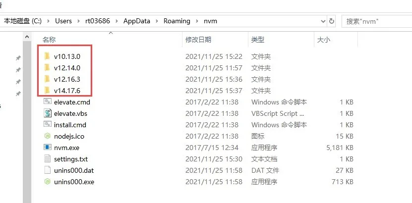

# 版本管理

## 目录

- [nvm](#nvm)
  - [内网环境](#内网环境)
- [n](#n)

# nvm

&#x20;     `nvm `不是一个 `npm package`，而是一个独立软件包。这意味着我们需要单独使用它的安装逻辑,他是`node`的父级，**不能用node来安装**。&#x20;

&#x20;        与 fnm 相比 ，您可能会注意到它要慢得多。此外，此应用程序不支持 Windows 操作系统。作为一种解决方法，nvm 团队建议使用 `nvm-windows`，但它不受官方支持。

- nvm install v10.4.0：安装指定版本号使用nvm install {version}安装指定版本的node&#x20;
- nvm install latest     #安装最新版本
- nvm current：当前node版本
- 验证是否成功 nvm -v
- nvm list available 查看可下载版本
- &#x20;nvm ls-remote：列出所有可以安装的node版本号
- nvm ls：列出所有已经安装的node版本;nvm list   #罗列已经安装的版本
- nvm use v10.3.0：切换node的版本，这个是全局的 使用nvm use {version} 切换到指定版本
- nvm node\_mirror  {url} #设置镜像

## 内网环境

1. 在nvm 安装目录找到，settings.txt配置镜像

```text 
root: C:\Users\rt03686\AppData\Roaming\nvm
path: C:\Program Files\nodejs
```


1. 下载node 按照上面格式命名

   

# n

n
是一个需要全局安装的 npm package。
我们在使用 n 管理 node 版本前，首先需要一个 node 环境，可以用Node安装

```text 
Mac 安装 n 管理node版本

~ npm install -g n
~ node -v
v6.11.1

~ where node
/usr/local/bin/node

安装一个版本：
安装或使用一个版本:n node version.  ~ sudo n 8.12.0
第一次安装一个版本成功后，node会自动切换到该版本，之前的版本会丢失。

查看并切换所有已经安装的node版本：n
~ n
node/8.12.0
ο node/9.11.2

使用或安装最新的官方发布：n latest
使用或安装稳定的官方发布使用或安装最新的LTS官方版本：n lts
删除一个node版本：n rm 0.9.4
删除一些版本 ： n rm 0.9.4 v0.10.0
或者使用-代替rm： n - 0.9.4
删除除当前版本外所有其他版本：n prune

n包工具所有已经安装的node的目录
    /usr/local/n/versions/node
    
查看远程node版本
n ls-remote lts
n ls-remote latest
n ls-remote --all

缩写：
n lsr 10
n --all lsr

```


[fnm](./fnm/index.md "fnm")
