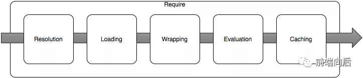

# require加载器实现原理

## 目录

- [1.node模块化的实现 ](#1node模块化的实现-)
- [2.require加载模块 ](#2require加载模块-)
- [3.require代码实现 ](#3require代码实现-)
- [4.手动实现require模块加载器 ](#4手动实现require模块加载器-)
- [5.给模块添加缓存 ](#5给模块添加缓存-)
- [6.自动补全路径 ](#6自动补全路径-)
- [7.分析实现步骤 ](#7分析实现步骤-)
  - [一.require()时发生了什么？ ](#一require时发生了什么-)
    - [循环依赖 ](#循环依赖-)
  - [二.Node.js 内部是怎么实现的？ ](#二Nodejs-内部是怎么实现的-)
    - [Module.\_load ](#Module_load-)
    - [Module.prototype.\_compile ](#Moduleprototype_compile-)
  - [三.知道这些有什么用？ ](#三知道这些有什么用-)
    - [虚拟模块 ](#虚拟模块-)
    - [模块别名 ](#模块别名-)
    - [清掉缓存 ](#清掉缓存-)

只是javascript的运行时，运行时你可以简单地理解为运行javascript的环境

# 1.node模块化的实现&#x20;

         node中是自带模块化机制的，每个文件就是一个单独的模块，并且它遵循

的是CommonJS规范，也就是使用require的方式导入模块，通过module.export的方式导出模块。&#x20;

          node模块的运行机制也很简单，其实就是在每一个

模块外层包裹了一层函数

，有了函数的包裹就可以实现代码间的作用域隔离。&#x20;

        你可能会说，我在写代码的时候并没有包裹函数呀，是的的确如此，这一层函数是node自动帮我们实现的，我们可以来测试一下。&#x20;

我们新建一个js文件，在第一行打印一个并不存在的变量，比如我们这里打印window，在node中是没有window的。&#x20;

```javascript 
 console.log(window);
//通过node执行该文件，会发现报错信息如下。(请使用系统默认cmd执行命令)。
(function (exports, require, module, __filename, __dirname) { console.log(window);
ReferenceError: window is not defined
    at Object.<anonymous> (/Users/choice/Desktop/node/main.js:1:75)
    at Module._compile (internal/modules/cjs/loader.js:689:30)
    at Object.Module._extensions..js (internal/modules/cjs/loader.js:700:10)
    at Module.load (internal/modules/cjs/loader.js:599:32)
    at tryModuleLoad (internal/modules/cjs/loader.js:538:12)
    at Function.Module._load (internal/modules/cjs/loader.js:530:3)
    at Function.Module.runMain (internal/modules/cjs/loader.js:742:12)
    at startup (internal/bootstrap/node.js:279:19)
    at bootstrapNodeJSCore (internal/bootstrap/node.js:752:3)
```


           可以看到报错的

顶层有一个自执行的函数

，, 函数中包含

exports, require, module, \_\_filename, \_\_dirname这些我们常用的全局变量。 (并不是真正的全局变量；只是每个模块不需要引用直接可以用而已)

          自执行函数也是前端模块化的实现方案之一，在早期前端没有模块化系统的时代，自执行函数可以很好的解决命名空间的问题，并且模块依赖的其他模块都可以通过参数传递进来。cmd和amd规范也都是依赖自执行函数实现的。

在模块系统中，每个文件就是一个模块，每个模块外面会自动套一个函数，并且定义了导出方式 module.exports或者exports，同时也定义了导入方式require。&#x20;

```javascript 
 let moduleA = (function() {
    module.exports = Promise;
    return module.exports;
})();
```


# 2.require加载模块&#x20;

require依赖node中的fs模块来加载模块文件，fs.readFile读取到的是一个字符串。&#x20;

在javascrpt中我们可以通过eval或者new Function的方式来将一个字符串转换成js代码来运行。&#x20;

- eval

```javascript 
 const name = 'yd';
const str = 'const a = 123; console.log(name)';
eval(str); // yd;
```


- new Function

          new Function接收的是一个要执行的字符串，返回的是一个新的函数，调用这个新的函数字符串就会执行了。如果这个函数需要传递参数，可以在new Function的时候依次传入参数，最后传入的是要执行的字符串。比如这里传入参数b，要执行的字符串str。&#x20;

```javascript 
 const b = 3;
const str = 'let a = 1; return a + b';
const fun = new Function('b', str);
console.log(fun(b, str)); // 4
```


          可以

看到eval和Function实例化都可以用来执行javascript字符串，

似乎他们都可以来实现require模块加载。不过在node中并没有选用他们来实现模块化，原因也很简单因为他们都有一个致命的问题，就是都

容易被不属于他们的变量所影响。&#x20;

         如下str字符串中并没有定义a，但是确可以使用上面定义的a变量，这显然是不对的，在模块化机制中，str字符串应该具有自身独立的运行空间，自身不存在的变量是不可以直接使用的。&#x20;

```javascript 
 const a = 1;
const str = 'console.log(a)';
eval(str);
const func = new Function(str);
func();
```


- vm 内置模块

虽然我们在外部定义了hello，但是str是一个独立的模块，并不在村hello变量，所以会直接报错。&#x20;

```javascript 
 // 引入vm模块， 不需要安装，node 自建模块
const vm = require('vm');
const hello = 'yd';
const str = 'console.log(hello)';
wm.runInThisContext(str); // 报错
```


所以node执行javascript模块时可以采用vm来实现。就可以保证模块的独立性了。

# 3.require代码实现&#x20;

介绍require代码实现之前先来回顾两个node模块的用法，因为下面会用得到。&#x20;

- path模块

用于处理文件路径。&#x20;

basename: 基础路径, 有文件路径就不是基础路径，基础路劲是1.js

extname: 获取扩展名&#x20;

dirname: 父级路劲&#x20;

join: 拼接路径&#x20;

resolve: 当前文件夹的绝对路径，注意使用的时候不要在结尾添加/

\_\_dirname: 当前文件所在文件夹的路径&#x20;

\_\_filename: 当前文件的绝对路径&#x20;

```javascript 
 const path = require('path', 's');
console.log(path.basename('1.js'));
console.log(path.extname('2.txt'));
console.log(path.dirname('2.txt'));
console.log(path.join('a/b/c', 'd/e/f')); // a/b/c/d/e/
console.log(path.resolve('2.txt'));
```


- fs模块

用于操作文件或者文件夹，比如文件的读写，新增，删除等。常用方法有readFile和readFileSync，分别是异步读取文件和同步读取文件。&#x20;

```javascript 
 const fs = require('fs');
const buffer = fs.readFileSync('./name.txt', 'utf8'); // 如果不传入编码，出来的是二进制
console.log(buffer);    
```


fs.access: 判断是否存在，node10提供的，exists方法已经被废弃, 原因是不符合node规范，所以我们采用access来判断文件是否存在。

```javascript 
 try {
    fs.accessSync('./name.txt');
} catch(e) {
    // 文件不存在
}
```


# 4.手动实现require模块加载器&#x20;

首先导入依赖的模块path，fs, vm, 并且创建一个Require函数，这个函数接收一个modulePath参数，表示要导入的文件路径。&#x20;

```javascript 
  // 导入依赖
const path = require('path'); // 路径操作
const fs = require('fs'); // 文件读取
const vm = require('vm'); // 文件执行

// 定义导入类，参数为模块路径
function Require(modulePath) {
    ...
}
```


在Require中获取到模块的绝对路径，方便使用fs加载模块，这里读取模块内容我们使用new Module来抽象，使用tryModuleLoad来加载模块内容，Module和tryModuleLoad我们稍后实现，Require的返回值应该是模块的内容，也就是module.exports。&#x20;

```javascript 
 // 定义导入类，参数为模块路径
function Require(modulePath) {
    // 获取当前要加载的绝对路径
    let absPathname = path.resolve(__dirname, modulePath);
    // 创建模块，新建Module实例
    const module = new Module(absPathname);
    // 加载当前模块
    tryModuleLoad(module);
    // 返回exports对象
    return module.exports;
}            
```


Module的实现很简单，就是给模块创建一个exports对象，tryModuleLoad执行的时候将内容加入到exports中，id就是模块的绝对路径。

```javascript 
 // 定义模块, 添加文件id标识和exports属性
function Module(id) {
    this.id = id;
    // 读取到的文件内容会放在exports中
    this.exports = {};
}
```


之前我们说过node模块是运行在一个函数中，这里我们给Module挂载静态属性wrapper，里面定义一下这个函数的字符串，wrapper是一个数组，数组的第一个元素就是函数的参数部分，其中有exports，module. Require，\_\_dirname, \_\_filename, 都是我们模块中常用的全局变量。注意这里传入的Require参数是我们自己定义的Require。&#x20;

第二个参数就是函数的结束部分。两部分都是字符串，使用的时候我们将他们包裹在模块的字符串外部就可以了。&#x20;

```javascript 
 Module.wrapper = [
    "(function(exports, module, Require, __dirname, __filename) {",
    "})"
]
```


\_extensions用于针对不同的模块扩展名使用不同的加载方式，比如JSON和javascript加载方式肯定是不同的。JSON使用JSON.parse来运行。&#x20;

javascript使用vm.runInThisContext来运行，可以看到fs.readFileSync传入的是module.id也就是我们Module定义时候id存储的是模块的绝对路径，读取到的content是一个字符串，我们使用Module.wrapper来包裹一下就相当于在这个模块外部又包裹了一个函数，也就实现了私有作用域。&#x20;

使用call来执行fn函数，第一个参数改变运行的this我们传入module.exports，后面的参数就是函数外面包裹参数exports, module, Require, \_\_dirname, \_\_filename&#x20;

```javascript 
             Module._extensions = {
    '.js'(module) {
        const content = fs.readFileSync(module.id, 'utf8');
        const fnStr = Module.wrapper[0] + content + Module.wrapper[1];
        const fn = vm.runInThisContext(fnStr);
        fn.call(module.exports, module.exports, module, Require,_filename,_dirname);
    },
    '.json'(module) {
        const json = fs.readFileSync(module.id, 'utf8');
        module.exports = JSON.parse(json); // 把文件的结果放在exports属性上
    }
}
```


tryModuleLoad函数接收的是模块对象，通过path.extname来获取模块的后缀名，然后使用Module.\_extensions来加载模块。&#x20;

```javascript 
 // 定义模块加载方法
function tryModuleLoad(module) {
    // 获取扩展名
    const extension = path.extname(module.id);
    // 通过后缀加载当前模块
    Module._extensions[extension](module);
}
            
```


         至此Require加载机制我们基本就写完了，我们来重新看一下。Require加载模块的时候传入模块名称，在Require方法中使用path.resolve(\_\_dirname, modulePath)获取到文件的绝对路径。然后通过new Module实例化的方式创建module对象，将模块的绝对路径存储在module的id属性中，在module中创建exports属性为一个json对象。&#x20;

         使用tryModuleLoad方法去加载模块，tryModuleLoad中使用path.extname获取到文件的扩展名，然后根据扩展名来执行对应的模块加载机制。&#x20;

        最终将加载到的模块挂载module.exports中。tryModuleLoad执行完毕之后module.exports已经存在了，直接返回就可以了。&#x20;

```javascript 
      // 导入依赖
const path = require('path'); // 路径操作
const fs = require('fs'); // 文件读取
const vm = require('vm'); // 文件执行

// 定义导入类，参数为模块路径
function Require(modulePath) {
    // 获取当前要加载的绝对路径
    let absPathname = path.resolve(__dirname, modulePath);
    // 创建模块，新建Module实例
    const module = new Module(absPathname);
    // 加载当前模块
    tryModuleLoad(module);
    // 返回exports对象
    return module.exports;
}
// 定义模块, 添加文件id标识和exports属性
function Module(id) {
    this.id = id;
    // 读取到的文件内容会放在exports中
    this.exports = {};
}
// 定义包裹模块内容的函数
Module.wrapper = [
    "(function(exports, module, Require, __dirname, __filename) {",
    "})"
]
// 定义扩展名，不同的扩展名，加载方式不同，实现js和json
Module._extensions = {
    '.js'(module) {
        const content = fs.readFileSync(module.id, 'utf8');
        const fnStr = Module.wrapper[0] + content + Module.wrapper[1];
        const fn = vm.runInThisContext(fnStr);
        fn.call(module.exports, module.exports, module, Require,_filename,_dirname);
    },
    '.json'(module) {
        const json = fs.readFileSync(module.id, 'utf8');
        module.exports = JSON.parse(json); // 把文件的结果放在exports属性上
    }
}
// 定义模块加载方法
function tryModuleLoad(module) {
    // 获取扩展名
    const extension = path.extname(module.id);
    // 通过后缀加载当前模块
    Module._extensions[extension](module);
}
       
```


# 5.给模块添加缓存&#x20;

添加缓存也比较简单，就是文件加载的时候将文件放入缓存在，再去加载模块时先看缓存中是否存在，如果存在直接使用，如果不存在再去重新嘉爱，加载之后再放入缓存。&#x20;

```javascript 
          // 定义导入类，参数为模块路径
function Require(modulePath) {
    // 获取当前要加载的绝对路径
    let absPathname = path.resolve(__dirname, modulePath);
    // 从缓存中读取，如果存在，直接返回结果
    if (Module._cache[absPathname]) {
        return Module._cache[absPathname].exports;
    }
    // 尝试加载当前模块
    tryModuleLoad(module);
    // 创建模块，新建Module实例
    const module = new Module(absPathname);
    // 添加缓存
    Module._cache[absPathname] = module;
    // 加载当前模块
    tryModuleLoad(module);
    // 返回exports对象
    return module.exports;
}
   
```


# 6.自动补全路径&#x20;

自动给模块添加后缀名，实现省略后缀名加载模块，其实也就是如果文件没有后缀名的时候遍历一下所有的后缀名看一下文件是否存在。&#x20;

```javascript 
             // 定义导入类，参数为模块路径
function Require(modulePath) {
    // 获取当前要加载的绝对路径
    let absPathname = path.resolve(__dirname, modulePath);
    // 获取所有后缀名
    const extNames = Object.keys(Module._extensions);
    let index = 0;
    // 存储原始文件路径
    const oldPath = absPathname;
    function findExt(absPathname) {
        if (index === extNames.length) {
           return throw new Error('文件不存在');
        }
        try {
            fs.accessSync(absPathname);
            return absPathname;
        } catch(e) {
            const ext = extNames[index++];
            findExt(oldPath + ext);
        }
    }
    // 递归追加后缀名，判断文件是否存在
    absPathname = findExt(absPathname);
    // 从缓存中读取，如果存在，直接返回结果
    if (Module._cache[absPathname]) {
        return Module._cache[absPathname].exports;
    }
    // 尝试加载当前模块
    tryModuleLoad(module);
    // 创建模块，新建Module实例
    const module = new Module(absPathname);
    // 添加缓存
    Module._cache[absPathname] = module;
    // 加载当前模块
    tryModuleLoad(module);
    // 返回exports对象
    return module.exports;
}

```


# 7.分析实现步骤&#x20;

- 1.导入相关模块，创建一个Require方法。&#x20;
- 2.抽离通过Module.\_load方法，用于加载模块。&#x20;
- 3.Module.resolveFilename 根据相对路径，转换成绝对路径。&#x20;
- 4.缓存模块 Module.\_cache，同一个模块不要重复加载，提升性能。&#x20;
- 5.创建模块 id: 保存的内容是 exports = {}相当于this。&#x20;
- 6.利用tryModuleLoad(module, filename) 尝试加载模块。&#x20;
- 7.Module.\_extensions使用读取文件。&#x20;
- 8.Module.wrap: 把读取到的js包裹一个函数。&#x20;
- 9.将拿到的字符串使用runInThisContext运行字符串。&#x20;
- 10.让字符串执行并将this改编成exports。&#x20;

[Node模块加载机制，一文带你彻底理解 Node.js 里面最重要的机制之一！ https://mp.weixin.qq.com/s/nu3RRpLPncPSdeIoHeTU9Q](https://mp.weixin.qq.com/s/nu3RRpLPncPSdeIoHeTU9Q "Node模块加载机制，一文带你彻底理解 Node.js 里面最重要的机制之一！ https://mp.weixin.qq.com/s/nu3RRpLPncPSdeIoHeTU9Q")

## 一.require()时发生了什么？&#x20;

Node.js 中，模块加载过程分为 5 步：&#x20;



1. 路径解析（Resolution）：根据模块标识找出对应模块（入口）文件的绝对路径&#x20;
2. 加载（Loading）：如果是 JSON 或 JS 文件，就把文件内容读入内存。如果是内置的原生模块，将其共享库动态链接到当前 Node.js 进程&#x20;
3. 包装（Wrapping）：将文件内容（JS 代码）包进一个函数，建立模块作用域，exports, require, module等作为参数注入&#x20;
4. 执行（Evaluation）：传入参数，执行包装得到的函数&#x20;
5. 缓存（Caching）：函数执行完毕后，将module缓存起来，并把module.exports作为require()的返回值返回&#x20;

其中，模块标识（Module Identifiers）就是传入require(id)的第一个字符串参数id，例如require('./myModule')中的'./myModule'，无需指定后缀名（但带上也无碍）&#x20;

对于.、..、/开头的文件路径，尝试当做文件、目录来匹配，具体过程如下：&#x20;

1. 若路径存在并且是个文件，就当做 JS 代码来加载（无论文件后缀名是什么，require(./myModule.abcd)完全正确）&#x20;
2. 若不存在，依次尝试拼上.js、.json、.node（Node.js 支持的二进制扩展）后缀名&#x20;
3. 如果路径存在并且是个文件夹，就在该目录下找package.json，取其main字段，并加载指定的模块（相当于一次重定向）&#x20;
4. 如果没有package.json，就依次尝试index.js、index.json、index.node

对于模块标识不是文件路径的，先看是不是 Node.js 原生模块（fs、path等）。如果不是，就从当前目录开始，逐级向上在各个node\_modules下找，一直找到顶层的/node\_modules，以及一些全局目录：&#x20;

- NODE\_PATH环境变量中指定的位置&#x20;
- 默认的全局目录：\$HOME/.node\_modules、\$HOME/.node\_libraries和\$PREFIX/lib/node

P.S.关于全局目录的更多信息，见Loading from the global folders&#x20;

找到模块文件后，读取内容，并包一层函数：&#x20;

```javascript 
 (function(exports, require, module, __filename, __dirname) {  // Module code actually lives in here  });  
```


（摘自The module wrapper）&#x20;

执行时从外部注入这些模块变量（exports, require, module, \_\_filename, \_\_dirname），模块导出的东西通过module.exports带出来，并将整个module对象缓存起来，最后返回require()结果&#x20;

### 循环依赖&#x20;

特殊的，模块之间可能会出现循环依赖，对此，Node.js 的处理策略非常简单：&#x20;

```javascript 
 // module1.js
exports.a = 1;
require('./module2');
exports.b = 2;
exports.c = 3;

// module2.js
const module1 = require('./module1');
console.log('module1 is partially loaded here', module1);

```


module1.js执行中引用了module2.js，module2又引了module1，此时module1尚未加载完（exports.b = 2; exports.c = 3;还没执行）。而在 Node.js 里，只加载了一部分的模块也可以正常引用：&#x20;

When there are circular require() calls, a module might not have finished executing when it is returned.&#x20;

所以module1.js执行结果是：&#x20;

```javascript 
 module1 is partially loaded here { a: 1 }  
```


P.S.关于循环引用的更多信息，见Cycles&#x20;

## 二.Node.js 内部是怎么实现的？&#x20;

实现上，模块加载的绝大多数工作都是由module模块来完成的：&#x20;

```javascript 
 const Module = require('module');  console.log(Module);  
```


Module是个函数/类：&#x20;

```javascript 
 function Module(id = '', parent) {
  this.id = id;
  this.path = path.dirname(id);
  // 即module.exports
  this.exports = {};
  this.parent = parent;
  updateChildren(parent, this, false);
  this.filename = null;
  this.loaded = false;
  this.children = [];
}

```


每加载一个模块都创建一个Module实例，模块文件执行完后，该实例仍然保留，模块导出的东西依附于Module实例存在&#x20;

模块加载的所有工作都是由module原生模块来完成的，包括Module.*load、Module.prototype.* compile

### Module.\_load&#x20;

Module.\_load()负责加载新模块、管理缓存，具体如下：&#x20;

```javascript 
 Module._load = function(request, parent, isMain) {
  // 0.解析模块路径
  const filename = Module._resolveFilename(request, parent, isMain);
  // 1.优先找缓存 Module._cache
  const cachedModule = Module._cache[filename];
  // 2.尝试匹配原生模块
  const mod = loadNativeModule(filename, request, experimentalModules);
  // 3.未命中缓存，也没匹配到原生模块，就创建一个新的 Module 实例
  const module = new Module(filename, parent);
  // 4.把新实例缓存起来
  Module._cache[filename] = module;
  // 5.加载模块
  module.load(filename);
  // 6.如果加载/执行出错了，就删掉缓存
  if (threw) {
    delete Module._cache[filename];
  }
  // 7.返回 module.exports
  return module.exports;
};

Module.prototype.load = function(filename) {
  // 0.判定模块类型
  const extension = findLongestRegisteredExtension(filename);
  // 1.按类型加载模块内容
  Module._extensions[extension](this, filename);
};

```


支持的类型有.js、.json、.node3 种：&#x20;

```javascript 
 // Native extension for .js
Module._extensions['.js'] = function(module, filename) {
  // 1.读取JS文件内容
  const content = fs.readFileSync(filename, 'utf8');
  // 2.包装、执行
  module._compile(content, filename);
};

// Native extension for .json
Module._extensions['.json'] = function(module, filename) {
  // 1.读取JSON文件内容
  const content = fs.readFileSync(filename, 'utf8');
  // 2.直接JSON.parse()完事
  module.exports = JSONParse(stripBOM(content));
};

// Native extension for .node
Module._extensions['.node'] = function(module, filename) {
  // 动态加载共享库
  return process.dlopen(module, path.toNamespacedPath(filename));
};

```


P.S.process.dlopen具体见process.dlopen(module, filename\[, flags])&#x20;

### Module.prototype.\_compile&#x20;

```javascript 
 Module.prototype._compile = function(content, filename) {
  // 1.包一层函数
  const compiledWrapper = wrapSafe(filename, content, this);
  // 2.把要注入的参数准备好
  const dirname = path.dirname(filename);
  const require = makeRequireFunction(this, redirects);
  const exports = this.exports;
  const thisValue = exports;
  const module = this;
  // 3.注入参数、执行
  compiledWrapper.call(thisValue, exports, require, module, filename, dirname);
};

```


包装部分的实现如下：&#x20;

```javascript 
 function wrapSafe(filename, content, cjsModuleInstance) {
  let compiled = compileFunction(
    content,
    filename,
    0,
    0,
    undefined,
    false,
    undefined,
    [],
    [
      'exports',
      'require',
      'module',
      '__filename',
      '__dirname',
    ]
  );

  return compiled.function;
}

```


P.S.模块加载的完整实现见node/lib/internal/modules/cjs/loader.js&#x20;

## 三.知道这些有什么用？&#x20;

知道了模块的加载机制，在一些需要

~~扩展~~

篡改加载逻辑的场景很有用，比如用来实现虚拟模块、模块别名等&#x20;

### 虚拟模块&#x20;

比如，VS Code 插件通过require('vscode')来访问插件 API：&#x20;

```javascript 
 // The module 'vscode' contains the VS Code extensibility API  
import * as vscode from 'vscode';  
```


而vscode模块实际上是不存在的，是个运行时扩展出来的虚拟模块：&#x20;

```javascript 
 // ref: src/vs/workbench/api/node/extHost.api.impl.ts
function defineAPI() {
  const node_module = <any>require.__$__nodeRequire('module');
  const original = node_module._load;
  // 1.劫持 Module._load
  node_module._load = function load(request, parent, isMain) {
    if (request !== 'vscode') {
      return original.apply(this, arguments);
    }

    // 2.注入虚拟模块 vscode
    // get extension id from filename and api for extension
    const ext = extensionPaths.findSubstr(parent.filename);
    let apiImpl = extApiImpl.get(ext.id);
    if (!apiImpl) {
      apiImpl = factory(ext);
      extApiImpl.set(ext.id, apiImpl);
    }
    return apiImpl;
  };
}

```


具体见

[API 注入机制及插件启动流程\_VSCode 插件开发笔记 2](http://mp.weixin.qq.com/s?__biz=MzIwMTM5MTM1NA==\&mid=2649472927\&idx=1\&sn=b40f69bc2ca3247406adfec60c43e2ca\&chksm=8ef1b20ab9863b1cff5c30883ba888450de6ad0e51e6d760e949a5146ad0eadd42d404bc7b03\&scene=21#wechat_redirect "API 注入机制及插件启动流程_VSCode 插件开发笔记 2")

，这里不再赘述&#x20;

### 模块别名&#x20;

类似的，可以通过重写Module.\_resolveFilename来实现模块别名，比如把proj/src中的@lib/my-module模块引用映射到proj/lib/my-module：&#x20;

```javascript 
 // src/index.js
require('./patchModule');

const myModule = require('@lib/my-module');
console.log(myModule);

```


patchModule具体实现如下：&#x20;

```javascript 
 const Module = require('module');
const path = require('path');

const _resolveFilename =  Module._resolveFilename;
Module._resolveFilename = function(request) {
  const args = Array.from(arguments);
  // 别名映射
  const LIB_PREFIX = '@lib/';
  if (request.startsWith(LIB_PREFIX)) {
    console.log(request);
    request = path.resolve(__dirname, '../' + request.slice(1));
    args[0] = request;
    console.log(` => ${request}`);
  }
  return _resolveFilename.apply(null, args);
}

```


P.S.当然，一般不需要这样做，可以通过Webpack等构建工具来完成&#x20;

### 清掉缓存&#x20;

默认 Node.js 模块加载过就有缓存，而有些时候可能想要禁掉缓存，强制重新加载一个模块，比如想要读取能被用户频繁修改的 JS 文件（如webpack.config.js）&#x20;

此时可以手动删掉挂在require.cache身上的module.exports缓存：&#x20;

```javascript 
 delete require.cache[require.resolve('./b.js')]  
```


然而，如果b.js还引用了其它外部（非原生）模块，也需要一并删除：&#x20;

```javascript 
 const mod = require.cache[require.resolve('./b.js')];
// 把引用树上所有模块缓存全都删掉
(function traverse(mod) {
  mod.children.forEach((child) => {
    traverse(child);
  });

  console.log('decache ' + mod.id);
  delete require.cache[mod.id];
}(mod));

```


P.S.或者采用decache模块&#x20;
