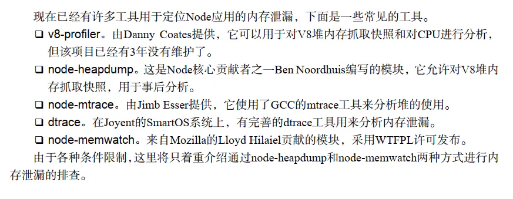
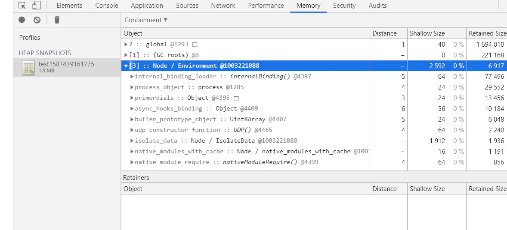
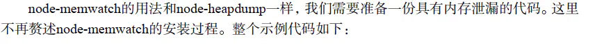
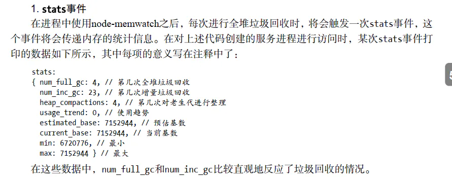
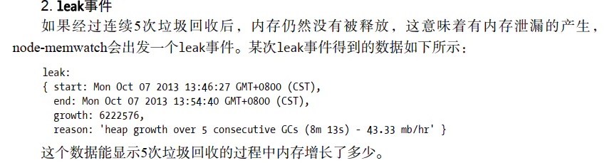
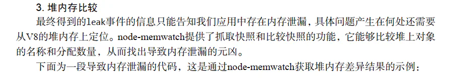

# 内存泄漏

**一：内存泄漏**

    node的内存泄漏十分敏感；一旦有成千上万的流量；哪怕是一个字节的泄漏也会造成堆积，垃圾回收机制将耗费更多的时间进行对象扫描，应用响应缓慢，知道进程内存溢出，应用崩溃；

\*\*  很少出现内存泄漏，较难排查；通常产生于无意间，但是实质就是一个，那就是应当回收的对象出现意外没有回收，变成了常驻在老生代中的对象；\*\* ​

&#x20;  通常造成内存泄漏的原因有以下几个：

- [ ]         缓存
- [ ]         队列消费不及时
- [ ]         作用域未释放

网上有一篇参考：

[https://itbilu.com/nodejs/core/Ey\_SnYXnx.html](https://itbilu.com/nodejs/core/Ey_SnYXnx.html "https://itbilu.com/nodejs/core/Ey_SnYXnx.html")

    写的不错；

**1.慎将内存当缓存使用；**

        cache 缓存不能无限制的添加

```纯文本 
 var LimitableMap = function (limit) { 
     this.limit = limit || 10; 
     this.map = {}; 
     this.keys = []; 
 }; 
 var hasOwnProperty = Object.prototype.hasOwnProperty; 
 LimitableMap.prototype.set = function (key, value) { 
     var map = this.map; 
     var keys = this.keys; 
     if (!hasOwnProperty.call(map, key)) { // 如果map 找不到key 
         if (keys.length === this.limit) { 
             // 如果超出限制就删除 
             var firstKey = keys.shift(); 
             delete map[firstKey]; 
         } 
         keys.push(key); 
     } 
     map[key] = value; 
 }; 
 LimitableMap.prototype.get = function (key) { 
     return this.map[key]; 
 };
```


        由于模块机制；模块是被缓存的常驻老生代

```纯文本 
 var leakArray = []; 
 exports.leak = function () { 
     leakArray.push("leak" + Math.random()); 
 }; 
 如果不可避免的需要这么设计，那么请添加清空队列的响应接口，以供调用者释放内存；
```


**缓存的解决方案：**

        除了限制缓存的大小外，另外要考虑的是，

**进程之间无法共享内存。如果在进程内使用缓存无可避免的会出现重复的，对物理内存是一种浪费；**

        如何大量的使用缓存：目前比较好的解决方法是

**采用进程外的缓存，进程自身不储存状态**

。

\*\* 外部的缓存软件有着良好的缓存过期淘汰策略以及自身的内存管理\*\*​

，不影响node

**的性能，主要解决以下两个问题;**

- [ ]         将缓存转移到外部，减少常驻内存的大小和数量，让垃圾回收更加高效；
- [ ]         进程之间可以共享缓存

目前市面上较好的有redis和memcached；且node生态系统十分完善；都有对应的客户端

**2.关注队列状态：**

其实就是消费速度远远小于生产速度；产能过剩；

**表层的解决方案是换用消费速度更高的技术。**

但是如果生产速度因为某些原因激增；或者消费速度因为某些原因突然降低，内存泄漏还是可能出现的；

**深度的解决原因是监控队列的长度，**

一旦堆积，应当通过监控系

**统产生报警并通知相关人员**

。另一个

**解决方案是任意异步调用都应该包含超时机制**

，一旦在限定的时间内未完成响应，通过

**回调函数传递超时异常，使得任意异步调用都具备可控的响应时间，给消费速度一个下限值**

    例如：Bagpipe.js 提供了拒绝模式和超时模式；

**3.内存泄漏排查**



**4.node-heapdump**

安装node-heapdump  过程中有报错  

**npm install heapdump**

\*\*    注意：这个地方涉及到node-gyp的应用；（详细见node的安装使用中的跨平台调用）\*\* ​

使用： 

    安装node-heapdump后，在代码第一行添加：var heapdump = require('heapdump');

参考文档     

[https://blog.csdn.net/zdhsoft/article/details/56671395](https://blog.csdn.net/zdhsoft/article/details/56671395 "https://blog.csdn.net/zdhsoft/article/details/56671395")

[heapdump.js](./assets/file/heapdump_YTy_4pElUX.js "heapdump.js")



**5. node-memwatch**



```纯文本 
 var memwatch = require('memwatch'); 
 memwatch.on('leak', function (info) { 
     console.log('leak:'); 
     console.log(info); 
 }); 
 memwatch.on('stats', function (stats) { 
     console.log('stats:') 
     console.log(stats); 
 }); 
 var http = require('http'); 
     var leakArray = []; 
 var leak = function () { 
     leakArray.push("leak" + Math.random()); 
 }; 
 http.createServer(function (req, res) { 
     leak(); 
     res.writeHead(200, {'Content-Type': 'text/plain'}); 
     res.end('Hello World\n'); 
 }).listen(1337); 
 console.log('Server running at http://127.0.0.1:1337/');
```








```纯文本 
 var memwatch = require('memwatch'); 
 var leakArray = []; 
 var leak = function () { 
     leakArray.push("leak" + Math.random()); 
 }; 
 // Take first snapshot 
 var hd = new memwatch.HeapDiff(); 
 for (var i = 0; i < 10000; i++) { 
    leak(); 
 } 
 // Take the second snapshot and compute the diff 
 var diff = hd.end(); 
 console.log(JSON.stringify(diff, null, 2));
```


```纯文本 
 node diff.js 
 { 
     "before": { 
         "nodes": 11719, 
         "time": "2013-10-07T06:32:07.000Z", 
         "size_bytes": 1493304, 
         "size": "1.42 mb" 
     }, 
     "after": { 
         "nodes": 31618, 
         "time": "2013-10-07T06:32:07.000Z", 
         "size_bytes": 2684864, 
         "size": "2.56 mb" 
     }, 
     "change": { 
         "size_bytes": 1191560, 
         "size": "1.14 mb", 
         "freed_nodes": 129, 
         "allocated_nodes": 20028, 
         "details": [ 
             { 
                 "what": "Array", 
                 "size_bytes": 323720, 
                 "size": "316.13 kb", 
                 "+": 15, 
                 "-": 65 
             }, 
             { 
                 "what": "Code", 
                 "size_bytes": -10944, 
                 "size": "-10.69 kb", 
                 "+": 8, 
                 "-": 28 
             }, 
             { 
                 "what": "String", 
                 "size_bytes": 879424,"size": "858.81 kb", 
                 "+": 20001, 
                 "-": 1 
             } 
         ] 
     } 
 }
```


```纯文本 
 { 
     "what": "String" 
     "size_bytes": 87 
     "size": "858.81 
     "+": 20001, 
     "-": 1 
 }
```


**6.大内存应用**

    在node中，不可避免的还是会存在操作大文件的场景。由于node的内存限制，操作大文件也需小心，好在node提供了stream模块用于处理大文件；

    stream继承自EventEmitter
