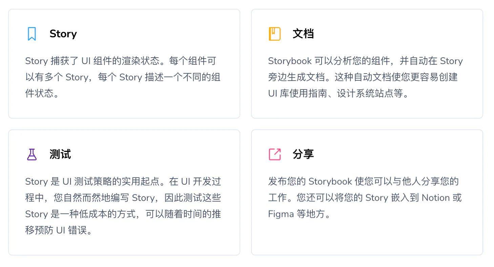

# Storybook

## 目录

- [什么是 Storybook？](#什么是-Storybook)
- [安装 Storybook](#安装-Storybook)
- [主要概念](#主要概念)

[ 开始使用 Storybook | Storybook 文档 - Storybook 中文  https://storybook.org.cn/docs](https://storybook.org.cn/docs " 开始使用 Storybook | Storybook 文档 - Storybook 中文  https://storybook.org.cn/docs")

## [什么是 Storybook？](https://storybook.org.cn/docs#what-is-storybook "什么是 Storybook？")

Storybook 是一个**用于独立构建 UI 组件和页面的前端工作台**。它帮助您在无需运行整个应用的情况下开发和分享难以触及的状态和边界情况。成千上万的团队使用它进行 UI 开发、测试和文档编写。它是开源且免费的。

## [安装 Storybook](https://storybook.org.cn/docs#install-storybook "安装 Storybook")

Storybook 是一个独立工具，与您的应用并行运行。它是一个零配置环境，适用于任何现代前端框架。您可以将 Storybook 安装到现有项目或从头开始创建一个新项目。

```bash 
npm create storybook@latest

```


## [主要概念](https://storybook.org.cn/docs#main-concepts "主要概念")

Storybook 是一个强大的工具，可以在 UI 开发工作流程的许多方面提供帮助。以下是一些主要概念，可帮助您入门。



[Storybook 是什么？](<./Storybook 是什么？/index.md> "Storybook 是什么？")
