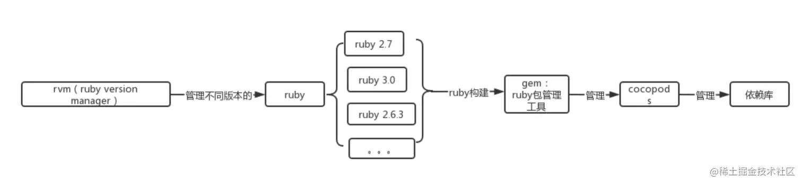
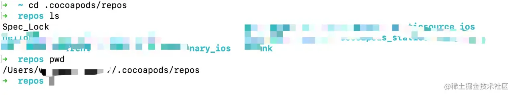
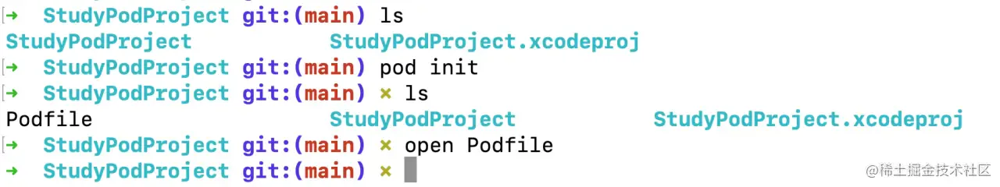
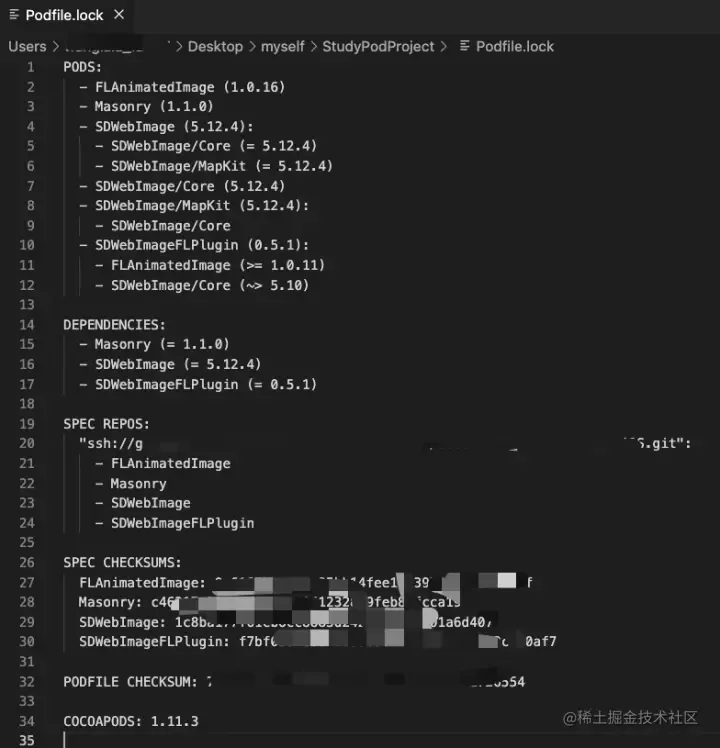

# cocoapods简介，环境配置，使用

## 目录

- [一、简介（是什么）](#一简介是什么)
- [二、cocoapods环境配置流程](#二cocoapods环境配置流程)
  - [第一步：更新gem源](#第一步更新gem源)
  - [第二步：安装cocoapods](#第二步安装cocoapods)
  - [常见安装出错的问题：](#常见安装出错的问题)
- [三、作用（解决什么问题）](#三作用解决什么问题)
- [四、使用（如何使用pod去解决这个问题）](#四使用如何使用pod去解决这个问题)
  - [1、安装好cocoapods之后，我们就可以通过cocoapods来管理我们工程中的依赖库们，那首先了解一下使用cocoapods时的一些简单命令：](#1安装好cocoapods之后我们就可以通过cocoapods来管理我们工程中的依赖库们那首先了解一下使用cocoapods时的一些简单命令)
  - [2、了解cocoapods管理的文件：](#2了解cocoapods管理的文件)
  - [3、创建一个项目，生成对应的podfile，然后在podfile里添加需要依赖的三方库：](#3创建一个项目生成对应的podfile然后在podfile里添加需要依赖的三方库)
    - [创建一个xcode项目：不会的话可以网上找找，有各种教程](#创建一个xcode项目不会的话可以网上找找有各种教程)
    - [生成podfile，在项目的根目录下按照如下操作，执行pod init](#生成podfile在项目的根目录下按照如下操作执行pod-init)
    - [podfile的默认内容](#podfile的默认内容)
    - [编写完podfile文件后执行pod install：](#编写完podfile文件后执行podinstall)

## **一、简介（是什么）**

> cocoapods是**为iOS程序提供依赖管理，帮助我们集中管理第三方依赖库的工具**；解决库与库之间的依赖关系，下载库的源码，并通过创建一个`xcode`的`workspace`来将这些第三方库与我们的工程连接起来，方便开发使用。

## **二、cocoapods环境配置流程**

cocopos是用ruby实现的，并划分成了若干个Gem包。如果要使用cocoapods的话，就必须具备ruby环境。苹果系统已经具备ruby环境，但是ruby的版本低和或者源不对也会导致安装出错。一般的安装流程如下：

#### 第一步：更新gem源

> gem是一个管理ruby库和程序的标准包，通过ruby gem源来查找、安装、升级和卸载软件包；

> Ruby 是一种面向对象的脚本语言，简单易用，功能强大。能跨平台和可移植性好等等。其实就是种脚本语言。

`gem source -l：`查询ruby源

第一次查询结果应该是：`https://rubygems.org/`

但是在国内需要更换为：`https://gems.ruby-china.com/`

`gem source remove https://rubygems.org/：` 移除ruby源

`gem source -a https://gems.ruby-china.com/：`添加可用ruby源

`sudo gem updates —system：`更新ruby源

#### 第二步：安装cocoapods

`sudo gem install cocoapods (osx 10.11以前)`

`sudo gem install -n /usr/local/bin cocoapods （10.11后苹果升级了安全策略）`

#### 常见安装出错的问题：

- ruby版本不支持；

> rvm：是一个命令行工具，可以提供一个便捷的多版本ruby环境的管理和切换；ruby版本管理以及安装工具.

安装rvm：

`curl -l get.rvm.io | bash -s stable`.  翻墙&#x20;

`source ~/.bashrc`

`source ~/.bash_profile`

新版系统默认shell都是zsh `source ~/.zshrc` `source ~/.profile`

`更新ruby版本：rvm install 3.0.3(版本号)`



## **三、作用（解决什么问题）**

对于一个iOS工程，或多或少都会用到一些第三方库，在cocoapods之前，需要我们手动去处理以下的问题：

- **下载开源库源码并引入工程中；（建立依赖关系）**
- **向工程中添加开源库使用到的framework；**
- **解决开源库和工程，开源库和开源库之间的依赖关系，检查重复添加的framework等问题；**

利用cocoapods能够做到\_**快速，自动管理，集中**\_的管理第三方库。

## **四、使用（如何使用pod去解决这个问题）**

#### 1、安装好cocoapods之后，我们就可以通过cocoapods来管理我们工程中的依赖库们，那首先了解一下使用cocoapods时的一些简单命令：

`pod setup：` 将所有第三方的podspec索引文件更新到本地的.\~/cocoapods/repos目录下；



`pod repo update：` 执行 pod repo update更新本地仓库，本地仓库完成后，能够搜索到指定的第三方库，作用类似pod setup。不过���个命令经常不会单独使用。比如执行pod setup、pod search、pod install、pod update会默认执行pod repo update。

`pod search 库名：` 查找某一个开源库。查找开源库之前，默认会执行pod repo update指令；

`pod install：`

- 根据podfile.lock文件中列举的版本号来安装第三方框架；
- 如果一开始podfile.lock不存在，执行完pod install 就会按照Podfile文件列举的版本号来安装第三方框架
- 安装开源库之前，默认会执行pod repo update来更新本地仓库；

`pod install都做了什么：`

- 准备环境
- 解析依赖冲突
- 下载相关的依赖
- 验证target
- 生成对应的工程文件
- 写入相关的依赖
- 结束回调

`pod update：`

- 将所有第三方库更新到最新版本，并且创建一个podfile.lock文件；
- 安装开源库之前，默认会执行pod repo update来更新本地仓库；

`pod list：`列出所有可用的第三方库；

#### 2、了解cocoapods管理的文件：

`podfile：`项目的第三库的依赖以及项目的基本配置；

`podfile.lock：`最新一次更新pods时，保存所有第三方框架的版本号；

`pod目录：`保存通过pod install或者pod update下载下来的第三方开源库的源代码

`.podspec文件：`Podspec 是用于 描述一个 Pod 库的源代码和资源将如何被打包编译成链接库或 framework 的文件 ，而 Podspec 中的这些描述内容最终将映会映射到 Specification 类中。 每个依赖库都有自己的podspec配置文件，发布，本地使用读取都会通过podspec的配置文件来读取；

***参考链接：关于podspec：***[***zhuanlan.zhihu.com/p/265338343***](https://link.juejin.cn/?target=https://zhuanlan.zhihu.com/p/265338343 "zhuanlan.zhihu.com/p/265338343")

#### 3、创建一个项目，生成对应的podfile，然后在podfile里添加需要依赖的三方库：

##### 创建一个xcode项目：不会的话可以网上找找，有各种教程

##### 生成podfile，在项目的根目录下按照如下操作，执行pod init



##### podfile的默认内容


**这里我们了解一下关于podfile书写一些基础的语法内容：**

`source:` 指定specs的位置,自定义添加自己的podspec。公司内部使用cocoapods 官方source是隐式的需要的，一旦你指定了其他source 你就需要也把官方的指定上;

`platform :ios, '9.0':`

- 指定编译的代码被指定到了哪个平台以及该平台的最低版本；
- 若不指定平台版本，官方文档里写明各平台默认值为iOS：4.3,OS X：10.6,tvOS：9.0,watchOS：2.0

`inhibit_all_warnings！：`屏蔽cocoapods库里面的所有警告；

`user_frameworks!:`使用frameworks动态库替换静态库链接；

`workspace：`

- 指定应该包含所有projects的Xcode workspace；
- 如果没有显示指定workspace并且在Podfile所在目录只有一个project，那么project的名称会被用作于workspace的名称

`project：`默认情况下是没有指定的，当没有指定时，会使用Podfile目录下与target同名的工程；

`target：`： 指定特定Target的依赖库并且可以嵌套子Target的依赖库

```javascript 
`target ‘XXXX’ do

    依赖的三方库书写

    #pod '库名' ,'版本号',:source => '链接' （其中版本号和source可省略）

    #pod '库名' ,:path => '文件目录' （添加本地依赖库）

end

```


`inherit! :search_paths:`明确指定继承于父层的所有pod，默认就是继承的

> `注意⚠️：podfile和podfile.local区别：（目前接触到的工程内部会有podfile，然后也可以创建podfile.local来管理本地配置文件）
> `
> podfile是一个ruby的脚本，里面添加了库以及其对应的依赖库的相关信息；
>
> podfile.local是一个本地配置文件，将本地的仓库路径配置；
>
> `pod install或者update的时候，优先读取podfile.local配置文件，拉取本地仓库，获取对应的版本；再去通过podfile读取依赖库的相关信息，去做依赖分析；
> `
> 举例：
>
> （1）A依赖C的0.0.1版本，B依赖C的0.0.2版本，此时pod的时候会报依赖出错；
>
> （2）A依赖C的大于0.0.1版本，B依赖C的0.0.2，此时pod的时候会拉取到C的0.0.2版本；
>
> （3）A依赖C的大于0.0.1版本，B依赖C的0.0.2，podfile.local内部指定本地路径（此时本地路径是0.0.1版本），此时依赖分析的时候也会报错；
>
> （4）A依赖C的大于0.0.1版本，B依赖C的0.0.2，podfile.local内部指定本地路径（此时本地路径是0.0.1版本），此时依赖分析的时候也会报错；
>
> （5）A依赖C的大于0.0.1版本，B依赖C的大于0.0.2版本，podfile.local内部指定本地路径（此时本地路径是0.0.3版本），此时pod的时候会拉取到C的0.0.2版本；

##### 编写完podfile文件后执行pod install：


执行pod install：&#x20;


如下是生成的podfile.lock文件内容：


