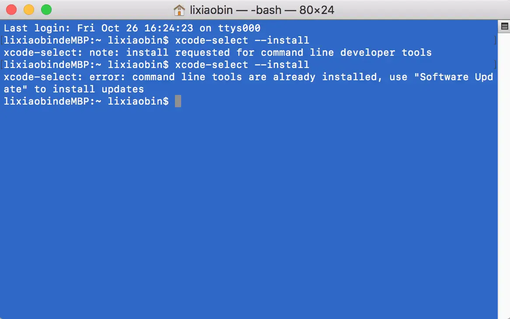
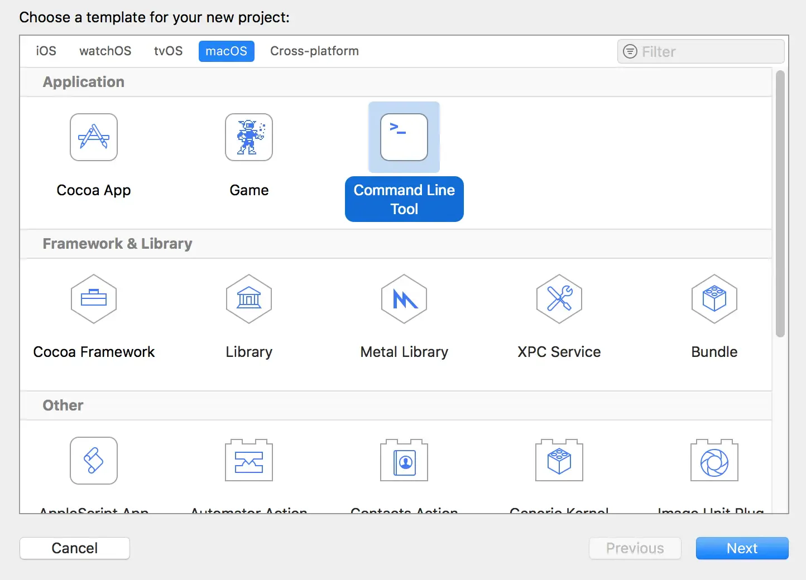
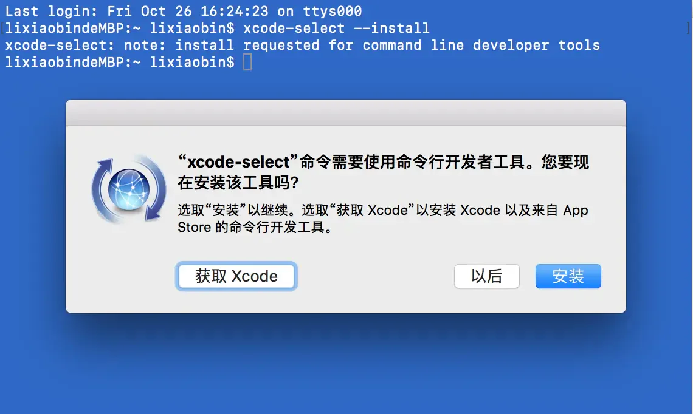

# xcode-select

## 目录

- [Xcode Command Line Tools](#Xcode-Command-Line-Tools)
  - [一、检验是否安装了Command Line Tools](#一检验是否安装了Command-Line-Tools)
    - [二、安装Command Line Tools](#二安装Command-Line-Tools)

# Xcode Command Line Tools

## 一、检验是否安装了Command Line Tools

方法一  打开终端，输入 xcode-select --install 执行命令，如果安装了会显示 command line tools are already installed



方法二  打开XCode 新建工程，如果安装了，在新建窗口可以看到



方法三 检查一下/Library/Developer/CommandLineTools文件夹是否存在。


#### 二、安装Command Line Tools

实际上是启动了 /System/Library/CoreServices/Install Command Line Developer Tools.app 应用，该应用从Apple服务器上下载进行安装。

在终端中输入以下命令：xcode-select --install ，按回车。



```javascript 
xcode-select --install  // 安装命令

xcode-select --version  // 查看版本

```


有时Command Line Tools出了问题，可以先尝试恢复默认设置来解决：

```javascript 
// 恢复默认设置（需要sudo权限）
sudo xcode-select --reset

```


还是解决不了，可以考虑删掉后重新安装：

```javascript 
// 强制删除安装目录下的文件
sudo rm -rf /Library/Developer/CommandLineTools

// 重新安装
xcode-select --install

```


除了终端命令的安装方式，也可以到苹果开发者官网的下载专区搜索Command Line Tools并下载安装包。
