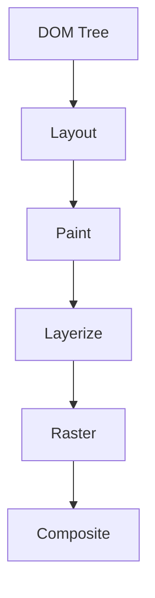

# 图层（Layer）概念及优化策略

## 目录

- [一、图层的核心概念](#一图层的核心概念)
  - [1. 图层的作用](#1-图层的作用)
  - [2. 图层的生成条件](#2-图层的生成条件)
- [二、浏览器渲染流水线与图层](#二浏览器渲染流水线与图层)
- [三、图层优化策略](#三图层优化策略)
  - [1. 减少不必要的图层](#1-减少不必要的图层)
  - [2. 优先使用 GPU 友好属性](#2-优先使用-GPU-友好属性)
  - [3. 合理使用will-change](#3-合理使用will-change)
  - [4. 优化图层尺寸](#4-优化图层尺寸)
  - [5. 避免隐式合成](#5-避免隐式合成)

#### **一、图层的核心概念**

**图层（Layer）是浏览器渲染流水线中的关键数据结构**，用于将页面分解为多个独立的绘制单元。**每个图层可以单独栅格化（Rasterize）、合成（Composite），最终由 GPU 组合成最终画面。**

##### **1. 图层的作用**

- **隔离渲染**：避免**单个元素变化导致整个页面重绘。**
- **硬件加速**：利用 **GPU 并行处理图层变换（** 如`transform`、`opacity`）。
- **滚动优化**：固定**定位元素（****`position: fixed`****）可独立于主文档流滚动。**

##### **2. 图层的生成条件**

浏览器会根据**以下规则将元素提升为独立图层：**

| **触发条件**​                       | **示例**​                           | **优化场景**​              |
| ------------------------------- | --------------------------------- | ---------------------- |
| 3D/透视变换                         | \`transform: translate3d(0,0,0)\` | 动画性能优化                 |
| \`will-change\`声明               | \`will-change: transform\`        | 提前分配 GPU 资源            |
| \`video\`/\`canvas\`/\`iframe\` | 多媒体元素                             | 避免频繁重绘                 |
| \`position: fixed\`             | 固定导航栏                             | 滚动性能优化                 |
| \`filter\`或\`backdrop-filter\`  | \`filter: blur(5px)\`             | 特效隔离渲染                 |
| 重叠且需合成的元素                       | 高\`z-index\`元素                    | 避免层爆炸（Layer Explosion） |

#### **二、浏览器渲染流水线与图层**

浏览器的渲染流程（以 Chromium 为例）：




1. **Layout（重排）** &#x20;

   计算元素几何信息（大小、位置）。触发条件：修改`width`、`margin`等布局属性。
2. **Paint（重绘）** &#x20;

   填充像素（颜色、边框等）。触发条件：修改`color`、`background`等非几何属性。
3. **Layerize（图层化）** &#x20;

   符合条件**的元素被提升为独立图层。**
4. **Raster（栅格化）** &#x20;

   将图层转换为位图（由 GPU 或 CPU 执行）。
5. **Composite（合成）** &#x20;

   将多个图层按`z-index`顺序组合成最终画面。

#### **三、图层优化策略**

##### **1. 减少不必要的图层**

- **问题**：过多的图层（如滥用`translateZ(0)`）会导致内存占用高（“层爆炸”）。
- **解决**：

```css 
/* 避免 */
.over-optimized {
  transform: translateZ(0); /* 强制提升所有元素 */
}

/* 推荐 */
.target-only {
  will-change: transform; /* 仅提升需要动画的元素 */
}

```


##### **2. 优先使用 GPU 友好属性**

- **高效属性**（仅触发 Composite）：

```css 
.gpu-friendly {
  transform: translateX(10px);
  opacity: 0.5;
}
```


- **低效属性**（触发 Layout/Paint）：

```css 
.cpu-heavy {
  left: 10px;       /* 触发 Layout */
  background: red;  /* 触发 Paint */
}
```


##### **3. 合理使用**\*\*`will-change`\*\*

- **正确用法**（动态启用/禁用）：

```javascript 
// 动画开始前启用
element.style.willChange = 'transform';
// 动画结束后清理
element.addEventListener('animationend', () => {
  element.style.willChange = 'auto';
});
```


##### **4. 优化图层尺寸**

- **裁剪不需要的区域**：

```css 
.clipped {
  overflow: hidden;      /* 减少图层绘制区域 */
  clip-path: circle(50%); /* 进一步优化 */
}
```


##### **5. 避免隐式合成**

- **问题**：下层元素变化导致上层元素被迫提升为图层。

```css 
/* 下层元素 */
.bottom {
  filter: drop-shadow(0 0 5px red);
}
/* 上层元素会被隐式提升为图层 */
.top {
  position: relative;
}
```
