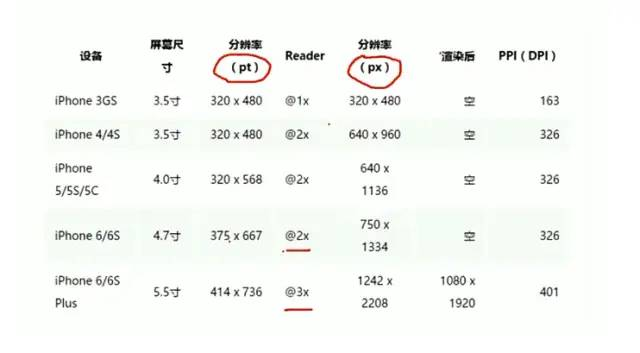
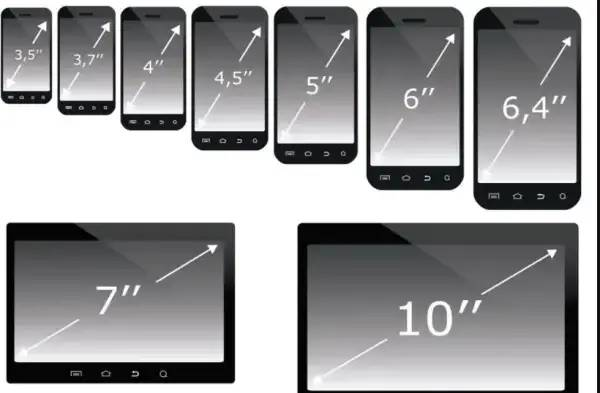
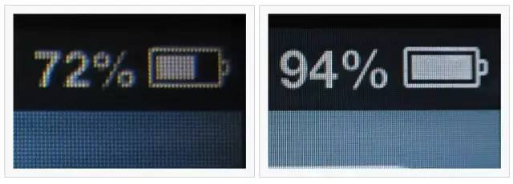
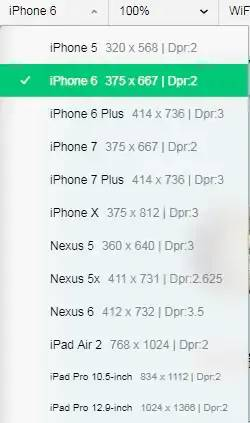
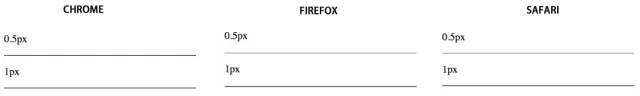
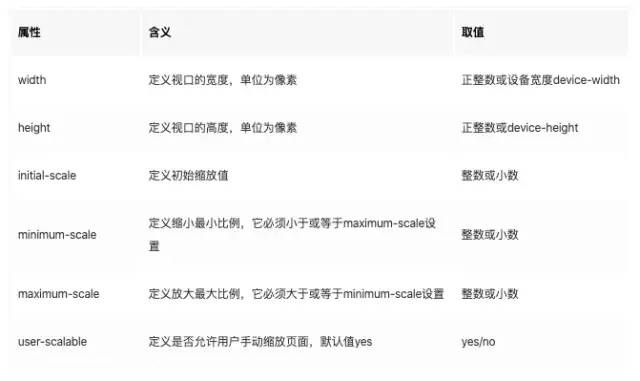
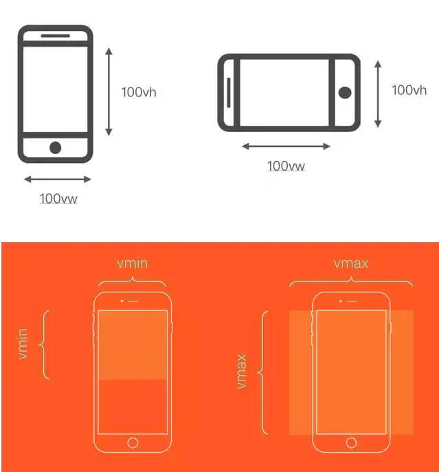

# 移动端适配

## 目录

- [前言](#前言)
- [一、为什么要移动端适配？](#一为什么要移动端适配)
  - [1.1 屏幕尺寸](#11-屏幕尺寸)
  - [1.2 像素](#12-像素)
    - [1.2.2 什么叫分辨率呢?](#122-什么叫分辨率呢)
    - [1.2.3 设备物理分辨率（设备像素）](#123-设备物理分辨率设备像素)
    - [1.2.4 逻辑分辨率（设备独立像素）](#124-逻辑分辨率设备独立像素)
    - [1.2.5 设备像素比](#125-设备像素比)
- [二、如何适配](#二如何适配)
  - [2.1 viewport](#21-viewport)
  - [2.2 适配方法](#22-适配方法)
    - [2.2.1 rem 适配](#221-rem-适配)
    - [2.2.2 vw，vh 布局](#222-vwvh-布局)
    - [2.2.3 px 为主，vx 和 vxxx（vw/vh/vmax/vmin）为辅，搭配一些 flex（推荐）](#223-px-为主vx-和-vxxxvwvhvmaxvmin为辅搭配一些-flex推荐)
  - [2.3 移动端适配流程](#23-移动端适配流程)

## **前言**

手机市场日渐丰富的同时，给我们前端开发人员带来的 “网页内容自适应屏幕尺寸进行显示的问题” 也日渐凸显出来，接下来我们就要细说移动端适配的前世今生及方案。

## **一、为什么要移动端适配？**

> 一般情况下设计稿的设计师按照 375 的尺寸设计，然而，在现在移动终端（就是手机）快速更新的时代，每个品牌的手机都有着不同的物理分辨率，这样就会导致，每台设备的逻辑分辨率也不尽相同，此时 375 的设计稿，如果想要还原那基本是不可能了，因为如果一个左右布局，左边如果写死，右边自适应的话，每个设备的右边所展示的内容大小就不尽相同，这时移动端适配就显得尤其重要。

既然要了解前世今生，我们就从几个概念说起，先上一张图。



下面我们一个个解析

### **1.1 屏幕尺寸**

> 屏幕尺寸是以屏幕对角线的长度来计量，计量单位为英寸。

如图所示两个对角线的长度就是这个屏幕的尺寸



### **1.2 像素**

我们看到上图 320x480 叫分辨率，而这个所谓的分辨率说白了就是横向320个像素纵向480个像素组成 

1.2.1 什么叫像素呢？

> 像素（Pel, pixel, pictureelement），**为组成一幅图像的全部亮度和色度的最小图像单元**。电视的图像是由按一定间隔排列的亮度不同的像点构成的，形成像点的单位也就是像素，**组成图像的最小单位就是像素**。从计算机技术的角度来解释，**像素是硬件和软件所能控制的最小单位**。它指显示屏的画面上表示出来的最小单位，不是图画上的最小单位。**一幅图像通常包含成千上万个像素，每个像素都有自己的颜色信息**，它们紧密地组合在一起。由于人眼的错觉，这些组合在一起的像素被当成一幅完整的图像。当修改图像的某区域，实际上是在修改该区域内的像素。对这些像素修改的好与坏将决定最终图片的质量。单位面积内的像素越多，图像的效果就越好。彩色电视图像是由成千个像素点所组成的，**而且每个像素都是由红绿蓝三种颜色并排组成的**。(**注意每个像素的大小是不固定的，他是根据设备的分辨率决定的，知识点，后面要考**)

#### **1.2.2 什么叫分辨率呢?**

> 屏幕分辨率是**指纵横向上的像素点数**，单位是 px。屏幕分辨率确定计算机屏幕上显示多少信息的设置，以水平和垂直像素来衡量。就相同大小的屏幕而言，当屏幕分辨率低时（例如 640 x 480），在屏幕上显示的像素少，单个像素尺寸比较大。屏幕分辨率高时（例如 1600 x 1200），**在屏幕上显示的像素多，单个像素尺寸比较小。**

知道什么叫做分辨率后，有人就会奇怪，我记得苹果的苹果官网上的苹果 6 的分辨率为 750x1334 啊，但是设计稿上苹果 6 的分辨率为 375x667 啊，而且各个设备的分辨率都比实际分辨率小很多，这就牵扯到一些历史原因了

#### **1.2.3 **设备物理分辨率**（设备像素）**

相信我们所有前端开发者，都是见证了手机这个移动设备发展的过程。从蓝屏手机，到彩屏手机，到诺基亚研发出来触屏手机，再到智能手机一步步发展下来，我们的我们的手越来越清晰，越来越大，所以我们的屏幕发展也越来越迅速。



上图可以清楚的看到，不同分辨率所带来的的差距

从最初的颗粒感相当大的屏幕，到 720p 再到 1080p，甚至于现在各家旗舰手机的 2k 屏幕，我们的物理分辨率在变得原来越大。这样就暴露出来一个问题，**我们如果手机分辨率翻倍，我们的图像不就要被缩小一倍**，我们难道要在每个设备上就出个设计稿，每个设备的分辨不尽相同啊，其实你担忧的问题，我们的乔帮主在很多年前就想到了。这**就是我们的逻辑分辨率**

#### **1.2.4 逻辑分辨率（****设备独立像素****）**

如下图所示，**虽然设备物理分辨不同，但是他的这个逻辑分辨率却都差不多**，这就要感谢乔帮主了。



乔布斯在 `iPhone4` 的发布会上首次提出了 `Retina Display(视网膜屏幕)`的概念，在 iPhone4 使用的**视网膜屏幕中，把 2x2 个像素当 1 个像素使用**，这样让屏幕看起来更精致，但是元素的大小却不会改变。从此以后高分辨率的设备，多了一个逻辑像素。这些设备**逻辑像素的差别虽然不会跨度很大，但是仍然有点差别，**于是便**诞生了移动端页面需要适配这个问题**，既然逻辑像素由物理像素得来，那他们就会有一个像素比值。

#### **1.2.5 设备像素比**

设备像素比 device pixel ratio 简称 dpr，即**物理像素**和设备**独立像素**的比值。为什么要知道设备像素比呢？因为这个像素比会产生一个非常经典的问题，1 像素边框的问题。

1. 1px 边框问题

> 当我们 css 里写的 **1px 的时候，由于它是逻辑像素，导致我们的逻辑像素根据这个设备像素比（dpr）去映射到设备上就为 2px，或者 3px，** 由于每个设备的屏幕尺寸不一样，就导致每个物理像素渲染出来的大小也不同（记得上面的知识点吗，设备的像素大小是不固定的），这样如果在尺寸比较大的设备上，1px 渲染出来的样子相当的粗矿，这就是经典的一像素边框问题。

1. 如何解决

核心思路，就是**在 web 中，浏览器为我们提供了 window\.devicePixelRatio 来帮助我们获取 dpr。在 css 中，可以使用媒体查询 min-device-pixel-ratio，区分 dpr：**

我们根据这个像素比，来算出他对应应该有的大小，但是暴露个非常大的兼容问题。



> **其中 Chrome 把 0.5px 四舍五入变成了 1px，而 firefox/safari 能够画出半个像素的边，并且 Chrome 会把小于 0.5px 的当成 0，而 Firefox 会把不小于 0.55px 当成 1px，Safari 是把不小于 0.75px 当成 1px，进一步**在手机上观察 iOS 的 Chrome 会画出 0.5px 的边，而安卓(5.0)原生浏览器是不行的。所以直接设置 0.5px 不同浏览器的差异比较大，并且我们看到**不同系统的不同浏览器对小数点的 px 有不同的处理**。**所以如果我们把单位设置成小数的 px 包括宽高等，其实不太可靠，因为不同浏览器表现不一样**。

至于其他解决一像素边框问题网上有一堆答案，**在这里我推荐一种非常好用，并且没有副作用的解决方案。**

**transform: scale(0.5) 方案**

```css 
 div { 
     height:1px; 
     background:#000; 
     -webkit-transform: scaleY(0.5); 
     -webkit-transform-origin:00; 
     overflow: hidden; 
 }
```


css 根据设备像素比媒体查询后的解决方案

```css 
 /* 2倍屏 */ 
 @media only screen and (-webkit-min-device-pixel-ratio: 2.0) { 
     .border-bottom::after { 
         -webkit-transform: scaleY(0.5); 
         transform: scaleY(0.5); 
     } 
 } 
 /* 3倍屏 */ 
 @media only screen and (-webkit-min-device-pixel-ratio: 3.0) { 
     .border-bottom::after { 
         -webkit-transform: scaleY(0.33); 
         transform: scaleY(0.33); 
     } 
 } 

```


如此，完美的解决一像素看着粗的问题。

> **扩展补充**
> CSS 最新的规范中正在计划通过标准的属性实现一像素边框，通过给border-width属性添加hairline关键字属性来实现，具体如下**链接\[1]**。之所以叫hairline，是因为一像素边框就跟头发丝一样。
> 练习使用方案时，也要多多关注最新发展哟。

## **二、如何适配**

### **2.1 viewport**

> 视口(`viewpo``rt`)代表当前可见的计算机图形区域。在 Web 浏览器术语中，通常与浏览器窗口相同，但不包括浏览器的 UI， 菜单栏等——即指你正在浏览的文档的那一部分。

那么在移动端如何配置视口呢？简单的一个 meta 标签即可！

```html 
 <meta name="viewport" content="width=device-width; initial-scale=1; maximum-scale=1; minimum-scale=1; user-scalable=no;">
```


他们分别什么含义呢？



我们在移动端视口要想视觉效果和体验好，那么我们的视口宽度必须无限接近理想视口。

**理想视口：一般来讲，这个视口其实不是真是存在的，它对设备来说是一个最理想布局视口尺寸，在用户不进行手动缩放的情况下，可以将页面理想地展示。那么所谓的理想宽度就是浏览器（屏幕）的宽度了。**

于是上述的 meta 设置，就是我们的理想设置，他规定了我们的视口宽度为屏幕宽度，初始缩放比例为 1，就是初始时候我们的视觉视口就是理想视口！

**其中 user-scalable 设置为 no 可以解决移动端点击事件延迟问题**（拓展）

### **2.2 适配方法**

#### **2.2.1 rem 适配**

> `rem` 是 `CSS3` 新增的一个相对单位，这个单位引起了广泛关注。这个单位与 `em`有什么区别呢？区别在于使用 rem 为元素设定字体大小时，仍然是相对大小，但相对的只是 HTML 根元素。这个单位可谓集相对大小和绝对大小的优点于一身，**通过它既可以做到只修改根元素就成比例地调整所有字体大小，又可以避免字体大小逐层复合的连锁反应。** 目前，除了 IE8 及更早版本外，所有浏览器均已支持`rem`。对于不支持它的浏览器，应对方法也很简单，就是多写一个绝对单位的声明。这些浏览器会忽略用 rem 设定的字体大小。

举个例子：

```css 
 //假设我给根元素的大小设置为14px 
 html{ 
     font-size：14px 
 } 
 //那么我底下的p标签如果想要也是14像素 
 p{ 
     font-size:1rem 
 } 
 //如此即可
```


rem 的布局，不得不提 flexible，flexible 方案是阿里早期开源的一个移动端适配解决方案，引用 flexible 后，我们在页面上统一使用 rem 来布局。

他的原理非常简单

```css 
 // set 1rem = viewWidth / 10 
 function setRemUnit () { 
     var rem = docEl.clientWidth / 10 
     docEl.style.fontSize = rem + 'px' 
 } 
 setRemUnit();
```


rem 是相对于 html 节点的 font-size 来做计算的。所以在页面初始话的时候给根元素设置一个 font-size，接下来的元素就根据 rem 来布局，这样就可以保证在页面大小变化时，布局可以自适应。

如此我们只需要给设计稿的 px 转换成对应的 rem 单位即可。

当然，这个方案只是个过渡方案，为什么说是过渡方案

**因为当年 viewport 在低版本安卓设备上还有兼容问题，而 vw，vh 还没能实现所有浏览器兼容**，所以 flexible 方案用 rem 来模拟 vmin 来实现在不同设备等比缩放的“过度”方案，之所以说是过度方案，是因为这个他这个根据设备大小去判断页面的方案是根据屏幕大小去百分百还原设计稿，从而让人看到的大小效果是一样的，但是 苹果 5 和苹果 6p 虽然看到的设计稿还原是一样的，但是他在一个合适距离上看到的效果能一样吗，本质上，

**用户使用更大的屏幕，是想看到更多的内容，而不是更大的字。** so，这个用缩放来解决问题的方案是个过渡方案，注定被时代所淘汰。

#### **2.2.2 vw，vh 布局**

> vh、vw 方案即将视觉视口宽度 `window.innerWidth` 和视觉视口高度 `window.innerHeight` 等分为 100 份。



vh 和 vw 方案和 rem 类似也是相当麻烦需要做单位转化，**而且 px 转换成 vw 不一定能完全整除，因此有一定的像素差。**

不过在工程化的今天，`webpack` 解析 `css` 的时候用 `postcss-loader` 有个` postcss-px-to-viewport` 能自动实现 px 到 vw 的转化

```纯文本 
 { 
     loader: 'postcss-loader',z 
     options: { 
         plugins: ()=>[ 
             require('autoprefixer')({ 
                 browsers: ['last 5 versions'] 
         }), 
         require('postcss-px-to-viewport')({ 
             viewportWidth: 375, //视口宽度（数字) 
             viewportHeight: 1334, //视口高度（数字） 
             unitPrecision: 3, //设置的保留小数位数（数字） 
             viewportUnit: 'vw', //设置要转换的单位（字符串） 
             selectorBlackList: ['.ignore', '.hairlines'], //不需要进行转换的类名（数组） 
             minPixelValue: 1, //设置要替换的最小像素值（数字） 
             mediaQuery: false//允许在媒体查询中转换px（true/false） 
         }) 
     ] 
 }
```


#### **2.2.3 px 为主，vx 和 vxxx（vw/vh/vmax/vmin）为辅，搭配一些 flex（推荐）**

之所以推荐使用此种方案，是由于我们要去考虑用户的需求，

**用户之所以去买大屏手机，不是为了看到更大的字，而是为了看到更多的内容**，这样直接使用 px 是最明智的方案，使用 vw，rem 等布局手段无可厚非，但是，flex 这种弹性布局大行其道的今天，如果如果还用这种传统的思维去想问题显然是有两个原因（个人认为 px 是最好的，可能有大佬，能用 vw，或者 rem 写出精妙的布局，也说不准）。

1. **为了偷懒，不愿意去做每个手机的适**
2. **不愿意去学习新的布局方式，让 flex 等先进的布局和你擦肩而过**

### **2.3 移动端适配流程**

**1. 在 head 设置 width=device-width 的 viewport**‘

**2. 在 css 中使用 px**

**3. 在适当的场景使用 flex 布局，或者配合 vw 进行自适应**

**4. 在跨设备类型的时候（pc <-> 手机 <-> 平板）使用媒体查询**

**5. 在跨设备类型如果交互差异太大的情况，考虑分开项目开发**
