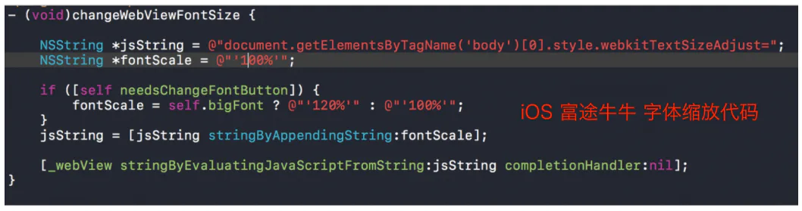
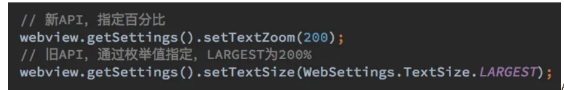

# 移动屏开发细节二

## 目录

- [手机h5页面唤起打电话、发短信功能](#手机h5页面唤起打电话发短信功能)
- [手机字体和横屏问题](#手机字体和横屏问题)
  - [H5的字体大小 受到手机系统字体大小的影响](#H5的字体大小-受到手机系统字体大小的影响)
    - [针对iOS](#针对iOS)
    - [Android](#Android)
    - [Android微信](#Android微信)

# **手机h5页面唤起打电话、发短信功能**

```javascript 
//在web页面里面实现拨打电话的功能
<a href="tel:139xxxxxxxx">一键拨打号码</a>
<a href="sms:139xxxxxxx">一键发送短信</a>
//或者说
window.location.href = 'tel:15082810674'
```


# 手机字体和横屏问题

            近期遇到一个问题，在H5页面给字体设置了固定的尺寸15px，**在andriod手机上横竖屏字体大小不变**，**但是在苹果手机上，横屏字体会变大，**在网上查了资料才知道，需要设置一个属性**text-size-adjust**

[https://www.cnblogs.com/nlyangtong/p/10393741.html](https://www.cnblogs.com/nlyangtong/p/10393741.html "https://www.cnblogs.com/nlyangtong/p/10393741.html")

```css 
text-size-adjust：-webkit-text-size-adjust: 100%;
p{
    -webkit-text-size-adjust: none; //禁用Webkit内核浏览器的文字大小调整功能
} 
```


          这属性现在的一般用处是防止i**Phone在坚屏转向横屏时放大文字**（注意，就算viewport设置了maximum-scale=1.0 文字还是会放大的） \*\*。而且iPhone和iPad的默认设定是不一样的iPhone默认设定`-webkit-text-size-adjust: auto;iPad`\*\***默认设定-webkit-text-size-adjust: none;所以iPad默认是不调节的**。

            此属性还支持百分比，这在当前的桌面版的webkit浏览器是不支持的，所以如果不想让iPhone横坚屏切换的时候调节文字，**用**\*\*`-webkit-text-size-adjust: 100%`;绝对不能用-webkit-text-size-adjust: none;这会导致仍然支持 -webkit-text-size-adjust: none;的桌面版的webkit浏览器无法人为放大文字大小，严重影响可用性。\*\*​

说明：

- 检索或设置移动端页面中对象文本的大小调整。
- 该属性只在移动设备上生效；仅支持webkit内核！
- 如果你的页面没有定义meta viewport，此属性定义将无效；
- 对应的脚本特性为textSizeAdjust。

## **H5的字体大小 受到手机系统字体大小的影响**

[https://blog.csdn.net/xxlyzgt/article/details/82492342](https://blog.csdn.net/xxlyzgt/article/details/82492342 "https://blog.csdn.net/xxlyzgt/article/details/82492342")      react-native webview设置字体不受系统字体大小影响

[https://www.cnblogs.com/axl234/p/7753187.html](https://www.cnblogs.com/axl234/p/7753187.html "https://www.cnblogs.com/axl234/p/7753187.html")     原生解决方案 可以参考

[https://www.cnblogs.com/axl234/p/7753187.html](https://www.cnblogs.com/axl234/p/7753187.html "https://www.cnblogs.com/axl234/p/7753187.html")     一篇好文

### 针对iOS

iOS上**需要调整 ****`webview`**** 的字体大小时，是通过给 ****`body`**** 设置 ****`-webkit-text-size-adjust`**** 属性实现的**：（估计浏览器也是）

调整字体大小本身只是改变body的css属性，因此可以通过覆盖样式来控制。



```handlebars 
body {     
  -webkit-text-size-adjust: 100% !important; 
}
```


### Android

`Android`通过给 `webview` 设置字体的缩放来完成，具体的`API`是`setTextZoom(int)`。**手机字体设置大小，影响App的页面**。

`Android`的可以通过`webview`配置`webview.getSettings().setTextZoom(100)`就可以禁止缩放，按照百分百显示。



**浏览器设置字体大小，影响浏览器打开的页面**。通过js可控制用户修改字体大小，使页面不受影响。

        Android因为改变的是字体的大小，所以可以考虑将字体大小在设置的时候进行等比例缩小。例如，一个文字希望以10px来进行渲染，当webview被放大两倍时，此时font-size会变为20px。因此我们可以在取到这个放大比例之后，对原样式进行等比缩小，比如将原文字大小设置为5px，渲染的时候就变成了10px。

```javascript 
 (function(){
    var $dom = document.createElement('div');
    $dom.style = 'font-size:10px;';
    document.body.appendChild($dom);
    // 计算出放大后的字体
    var scaledFontSize = parseInt(window.getComputedStyle($dom, null).getPropertyValue('font-size'));
    document.body.removeChild($dom);
    // 计算原字体和放大后字体的比例
    var scaleFactor = 10 / scaledFontSize;

    // 取html元素的字体大小
    // 注意，这个大小也经过缩放了
    // 所以下方计算的时候 *scaledFontSize是原来的html字体大小
    // 再次 *scaledFontSize才是我们要设置的大小
    var originRootFontSize = parseInt(window.getComputedStyle(document.documentElement, null).getPropertyValue('font-size'));
    document.documentElement.style.fontSize = originRootFontSize * scaleFactor * scaleFactor + 'px';
})();


(function(doc, win) {
//      用原生方法获取用户设置的浏览器的字体大小(兼容ie)
        if(doc.documentElement.currentStyle) {
            var user_webset_font=doc.documentElement.currentStyle['fontSize'];
        }
        else {
            var user_webset_font=getComputedStyle(doc.documentElement,false)['fontSize'];
        }
//      取整后与默认16px的比例系数
        var xs=parseFloat(user_webset_font)/16;
//      设置rem的js设置的字体大小
        var view_jsset_font,result_font;
        var docEl = doc.documentElement,
        resizeEvt = 'orientationchange' in window ? 'orientationchange' : 'resize',
        clientWidth,
        recalc = function() {
            clientWidth = docEl.clientWidth;
            if(!clientWidth) return;
            if(!doc.addEventListener) return;
            if(clientWidth<750){
//              设置rem的js设置的字体大小
                view_jsset_font=100 * (clientWidth / 750);
//              最终的字体大小为rem字体/系数
                result_font=view_jsset_font/xs;
//              设置根字体大小
                docEl.style.fontSize = result_font + 'px';
                }
            else{
                docEl.style.fontSize = 100 + 'px';
                }
        };
    win.addEventListener(resizeEvt, recalc, false);
    doc.addEventListener('DOMContentLoaded', recalc, false);
})(document, window);
```


除了在Android webview以外，以上代码在 Android 微信中实测也有效。

### Android微信

            在编写本文时，通过网上一些资料，发现在Android微信中，也可以借助WeixinJSBridge对象来阻止字体大小调整。实测也有效。

```javascript 
 (function() {
    if (typeof WeixinJSBridge == "object" && typeof WeixinJSBridge.invoke == "function") {
        handleFontSize();
    } else {
        document.addEventListener("WeixinJSBridgeReady", handleFontSize, false);
    }
    function handleFontSize() {
        // 设置网页字体为默认大小
        WeixinJSBridge.invoke('setFontSizeCallback', { 'fontSize' : 0 });
        // 重写设置网页字体大小的事件
        WeixinJSBridge.on('menu:setfont', function() {
            WeixinJSBridge.invoke('setFontSizeCallback', { 'fontSize' : 0 });
        });
    }
 })();
```
