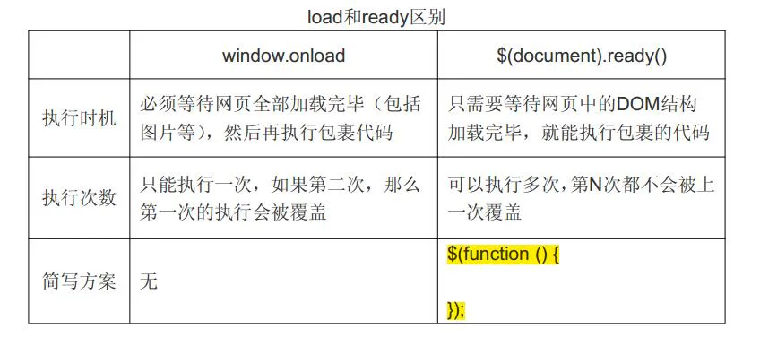

# ready

其中，`ready`仅作用于`document`对象。由于`ready`事件在DOM完成初始化后触发，且只触发一次，所以非常适合用来写其他的初始化代码。假设我们想给一个`<form>`表单绑定`submit`事件，下面的代码没有预期的效果：

```html 
<html>
<head>
    <script>
        // 代码有误:
        $('#testForm').on('submit', function () {
            alert('submit!');
        });
    </script>
</head>
<body>
    <form id="testForm">
        ...
    </form>
</body>
```


因为JavaScript在此执行的时候，`<form>`**尚未载入浏览器**，所以`$('#testForm)`返回`[]`，并没有绑定事件到任何DOM上。

所以我们自己的初始化代码必须放到`document`对象的`ready`事件中，保证DOM已完成初始化：

```javascript 
<html>
<head>
    <script>
        $(document).on('ready', function () {
            $('#testForm).on('submit', function () {
                alert('submit!');
            });
        });
    </script>
</head>
<body>
    <form id="testForm">
        ...
    </form>
</body>
```


这样写就没有问题了。因为相关代码会在DOM树初始化后再执行。

由于`ready`事件使用非常普遍，所以可以这样简化：

```javascript 
$(document).ready(function () {
    // on('submit', function)也可以简化:
    $('#testForm).submit(function () {
        alert('submit!');
    });
});
```


**甚至还可以再简化为：**

```javascript 
$(function () {
    // init...
});
```


上面的这种写法最为常见。如果你遇到`$(function () {...})`的形式，牢记这是`document`对象的`ready`事件处理函数。

完全可以反复绑定事件处理函数，它们会依次执行：

```javascript 
$(function () {
    console.log('init A...');
});
$(function () {
    console.log('init B...');
});
$(function () {
    console.log('init C...');
});


```


&#x20;JavaScript 的 window\.onload 事件是等到所有内容，包括外部图片之类的文件加载完后，才会执行。


