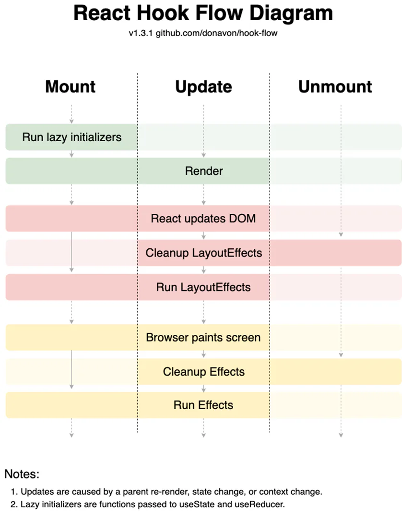

# hooks

[方案](./方案/index.md "方案")

[内置hooks](./内置hooks/index.md "内置hooks")

[精读hooks](./精读hooks/index.md "精读hooks")

[ahooks](./ahooks/index.md "ahooks")

[自定义Hooks](./自定义Hooks/index.md "自定义Hooks")
