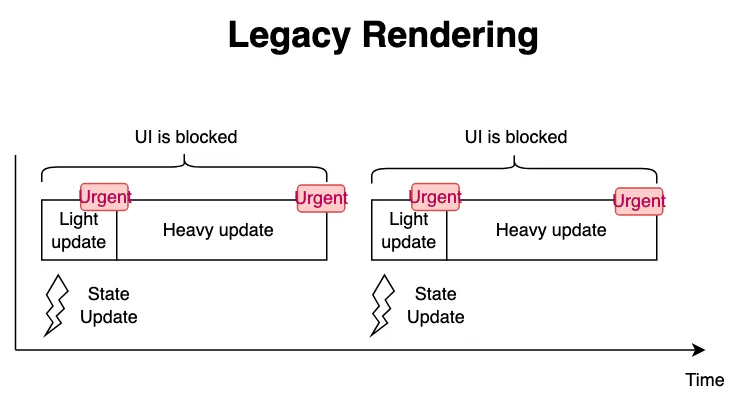
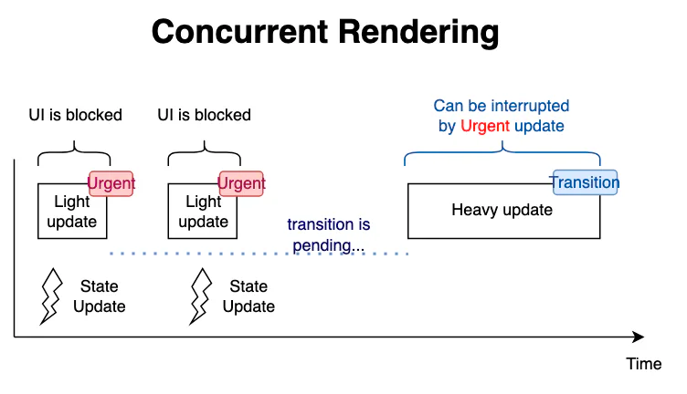

# useTransition

## 目录

- [如何使用React useTransition()hook](#如何使用React-useTransitionhook)
  - [useTransition() 钩子](#useTransition-钩子)
    - [返回值 ](#返回值-)
    - [注意事项 ](#注意事项-)
  - [用法 ](#用法-)
    - [将状态更新标记为非阻塞转换状态 ](#将状态更新标记为非阻塞转换状态-)
    - [在转换中更新父组件 ](#在转换中更新父组件-)
    - [在转换期间显示待处理的视觉状态 ](#在转换期间显示待处理的视觉状态-)
    - [避免不必要的加载指示器 ](#避免不必要的加载指示器-)
    - [构建一个Suspense-enabled 的路由 ](#构建一个Suspense-enabled-的路由-)
  - [疑难解答 ](#疑难解答-)
    - [在转换过程中更新输入无法正常工作](#在转换过程中更新输入无法正常工作)
    - [React 没有将我的状态更新视为转换](#React-没有将我的状态更新视为转换)
    - [我想在组件外部调用 useTransition ](#我想在组件外部调用-useTransition-)
    - [我传递给 startTransition 的函数会立即执行 ](#我传递给-startTransition-的函数会立即执行-)

# 如何使用React useTransition()hook

有些**UI更新应该尽可能快地执行**（在输入框中打字，从下拉菜单中选择一个值），而其他的**UI更新可以有较低的优先级**（过滤一个列表）。

## *useTransition()* 钩子

默认情况下，React中的所有更新都被认为是紧急的。当**快速更新被重度更新拖慢**时，这可能会产生一个问题。



然而，从React 18和新的并发功能开始，你可以将一些**更新标记**为**可中断**的和**非紧急**的--所谓的过渡期。这对**繁重的UI更新**特别有用，比如过滤一个大列表。



`useTransition()` 是让你在React组件内部访问并发模式功能的钩子。

调用`const [isPending, startTransition] = useTransitionHook()` ，返回一个包含2个项目的数组。

- `isPending`: 表示过渡正在等待
- `startTransition(callback)`: 允许你将`callback` 里面的任何UI更新标记为过渡。

```javascript 
import { useTransition } from 'react';
function MyComponent() {
  const [isPending, startTransition] = useTransition();
  // ...
  const someEventHandler = (event) => {
    startTransition(() => {
      // Mark updates as transitions
      setValue(event.target.value);
    });
  }
  return <HeavyComponent value={value} />;
}

```


为了使用`useTransition()` 钩子，请确保[启用并发模式](https://link.juejin.cn/?target=https://github.com/reactwg/react-18/discussions/5 "启用并发模式")。

#### 返回值&#x20;

`startTransition` **不会返回任何值。**

#### 注意事项&#x20;

- `useTransition` 是一个 Hook，因此**只能在组件或自定义 Hook 内部调用**。如果你需要在其他地方启动转换（例如从数据库），请调**用独立的 **[**startTransition**](https://react.docschina.org/reference/react/startTransition "startTransition")** 函数。**
- 只有**在你可以访问该状态的 ****`set`**** 函数时**，才能将更新包装为转换状态。如果你想响应某个 prop 或自定义 Hook 值启动转换，**请尝试使用 **[**useDeferredValue**](https://react.docschina.org/reference/react/useDeferredValue "useDeferredValue")**。**
- 你传递给 `startTransition` 的函数**必须是同步的。React 立即执行此函数**，**标记**其执行期间**发生的所有状态更新**为**转换状态**。如果你**稍后尝试**执行更多的状态更新（例如在一个定时器中），它们将不会被标记为转换状态。
- 标记为转换状态的状态更新**将被其他状态更新打断**。例如，如果你在转换状态中更新图表组件，但在图表正在重新渲染时开始在输入框中输入，React 将在处理输入更新后重新启动对图表组件的渲染工作。
- 转换状态更新**不能用于控制文本输入**。
- 如果有**多个正在进行的转换状态**，React 目前会将它们**批处理在一起**。这是一个限制，可能会在未来的版本中被删除。

## 用法&#x20;

### 将状态更新标记为非阻塞转换状态&#x20;

在组件的顶层调用 `useTransition`，将状态更新标记为非阻塞的转换状态。

```react tsx 
import { useState, useTransition } from 'react';

function TabContainer() {
  const [isPending, startTransition] = useTransition();
  // ...
}

```


`useTransition` 返回一个具有两个项的数组：

1. `isPending` 标志，告诉你**是否存在挂起的转换状态**。
2. `startTransition` 方法 **允许你将状态更新标记为转换状态**。

你可以按照以下方式将状态更新标记为转换状态：

```react tsx 
function TabContainer() {
  const [isPending, startTransition] = useTransition();
  const [tab, setTab] = useState('about');

  function selectTab(nextTab) {
    startTransition(() => {
      setTab(nextTab);
    });
  }
  // ...
}

```


### 在转换中更新父组件&#x20;

你也可以通过 `useTransition` 调用来**更新父组件的状态**。例如，`TabButton` 组件在一个转换中包装了它的onClick逻辑：

```react tsx 
  const [isPending, startTransition] = useTransition();
  if (isActive) {
    return <b>{children}</b>
  }
  return (
    <button onClick={() => {
      startTransition(() => {
        onClick();
      });
    }}>
      {children}
    </button>
  );
}

```


因为父组件在 `onClick` 事件处理程序内更新了它的状态，所以该状态更新被标记为一个转换。这就是为什么，就像之前的例子一样，你可以单击“帖子”，然后立即单击“联系人”。更新选定选项卡被标记为一个转换，因此它不会阻止用户交互。

### 在转换期间显示待处理的视觉状态&#x20;

你可以使用 `useTransition` 返回的 `isPending` 布尔值来向用户指示转换正在进行中。例如，选项卡按钮可以有一个特殊的“待处理”视觉状态：

```react tsx 
function TabButton({ children, isActive, onClick }) {
  const [isPending, startTransition] = useTransition();
  // ...
  if (isPending) {
    return <b className="pending">{children}</b>;
  }
  // ...

```


### 避免不必要的加载指示器&#x20;

在这个例子中，`PostsTab` 组件使用启用了 [Suspense-enabled](https://react.docschina.org/reference/react/Suspense "Suspense-enabled") 的数据源获取一些数据。当你单击“帖子”选项卡时，`PostsTab` 组件将 **挂起**，导致最近的加载占位符出现：

[https://react.docschina.org/reference/react/useTransition#preventing-unwanted-loading-indicators](https://react.docschina.org/reference/react/useTransition#preventing-unwanted-loading-indicators "https://react.docschina.org/reference/react/useTransition#preventing-unwanted-loading-indicators")

这个例子很经典；完全符合react**设计这个hooks**的思想；**紧急的优先更新；**

### 构建一个Suspense-enabled 的路由&#x20;

如果你正在构建一个 React 框架或路由，我们建议将页面导航标记为转换效果。

```react tsx 
function Router() {
  const [page, setPage] = useState('/');
  const [isPending, startTransition] = useTransition();

  function navigate(url) {
    startTransition(() => {
      setPage(url);
    });
  }
  // ...

```


这么做有两个好处：

- [转换效果是可中断的](https://react.docschina.org/reference/react/useTransition#marking-a-state-update-as-a-non-blocking-transition "转换效果是可中断的")，这样用户可以在等待重新渲染完成之前点击其他地方。
- [转换效果可以防止不必要的加载指示符](https://react.docschina.org/reference/react/useTransition#preventing-unwanted-loading-indicators "转换效果可以防止不必要的加载指示符")，这样用户就可以避免在导航时产生不协调的跳转。

## 疑难解答&#x20;

### 在转换过程中更新输入无法正常工作

你不能使用转换来控制输入的状态变量：

```react tsx 
const [text, setText] = useState('');
// ...
function handleChange(e) {
  // ❌ Can't use transitions for controlled input state
  startTransition(() => {
    setText(e.target.value);
  });
}
// ...
return <input value={text} onChange={handleChange} />;

```


这是因为转换是非阻塞的，但是在**响应更改事件时更新输入应该是同步**的。如果你想在输入时运行一个转换，有两个选项：

1. 你可以**声明两个分开的状态变量**：一个用于输入状态（它总是同步更新），另一个用于在转换中更新的状态变量。这样，你可以使用同步状态控制输入，并将转换状态变量（它将“滞后”于输入）传递给其余的渲染逻辑。
2. 或者，你可以有一个状态变量，并添加 [useDeferredValue](https://react.docschina.org/reference/react/useDeferredValue "useDeferredValue")，**它将“滞后”于实际值**。它会自动**触发非阻塞的重新渲染以“追赶”新值。**

### React 没有将我的状态更新视为转换

当你在转换中包装一个状态更新时，请确保它发生在 `startTransition` 调用期间：

```react tsx 
startTransition(() => {
  // ✅ Setting state *during* startTransition call
  setPage('/about');
});

```


传递给 `startTransition` 的函数必须是同步的。

你不能像这样将更新标记为转换：

```react tsx 
startTransition(() => {
  // ❌ Setting state *after* startTransition call
  setTimeout(() => {
    setPage('/about');
  }, 1000);
});

```


相反，你可以这样做：

```react tsx 
setTimeout(() => {
  startTransition(() => {
    // ✅ Setting state *during* startTransition call
    setPage('/about');
  });
}, 1000);

```


类似地，你不能像这样将更新标记为转换：

```react tsx 
startTransition(async () => {
  await someAsyncFunction();
  // ❌ Setting state *after* startTransition call
  setPage('/about');
});

```


然而，使用以下方法可以正常工作：

```react tsx 
await someAsyncFunction();
startTransition(() => {
  // ✅ Setting state *during* startTransition call
  setPage('/about');
});

```


### 我想在组件外部调用 `useTransition`&#x20;

你不能在组件外部调用 `useTransition`，因为它是一个 Hook。在这种情况下，请改用独立的 [startTransition](https://react.docschina.org/reference/react/startTransition "startTransition") 方法。它的工作方式相同，但不提供 `isPending` 指示器。

### 我传递给 `startTransition` 的函数会立即执行&#x20;

如果你运行这段代码，它将会打印 1, 2, 3：

```react tsx 
console.log(1);
startTransition(() => {
  console.log(2);
  setPage('/about');
});
console.log(3);

```


**期望打印 1, 2, 3**。 传递给 `startTransition` 的函数不会被延迟执行。与浏览器的 `setTimeout` 不同，它不会延迟执行回调。React 会立即执行你的函数，但是在它运行的同时安排的**任何状态更新都被标记为转换**。你可以将其想象为以下方式：

```react tsx 
// A simplified version of how React works

let isInsideTransition = false;

function startTransition(scope) {
  isInsideTransition = true;
  scope();
  isInsideTransition = false;
}

function setState() {
  if (isInsideTransition) {
    // ... schedule a transition state update ...
  } else {
    // ... schedule an urgent state update ...
  }
}

```
