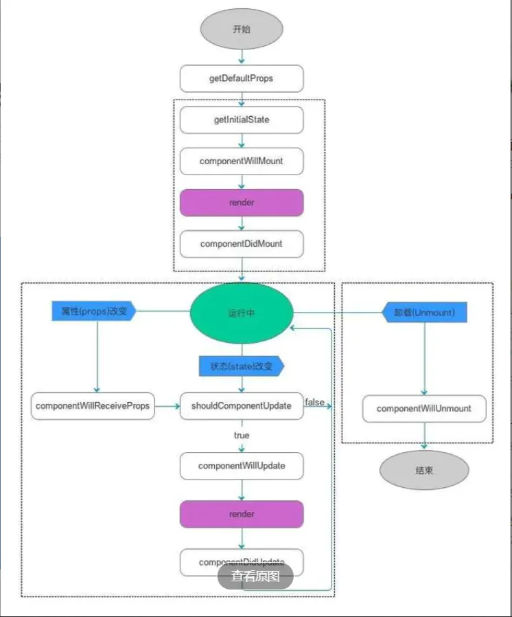
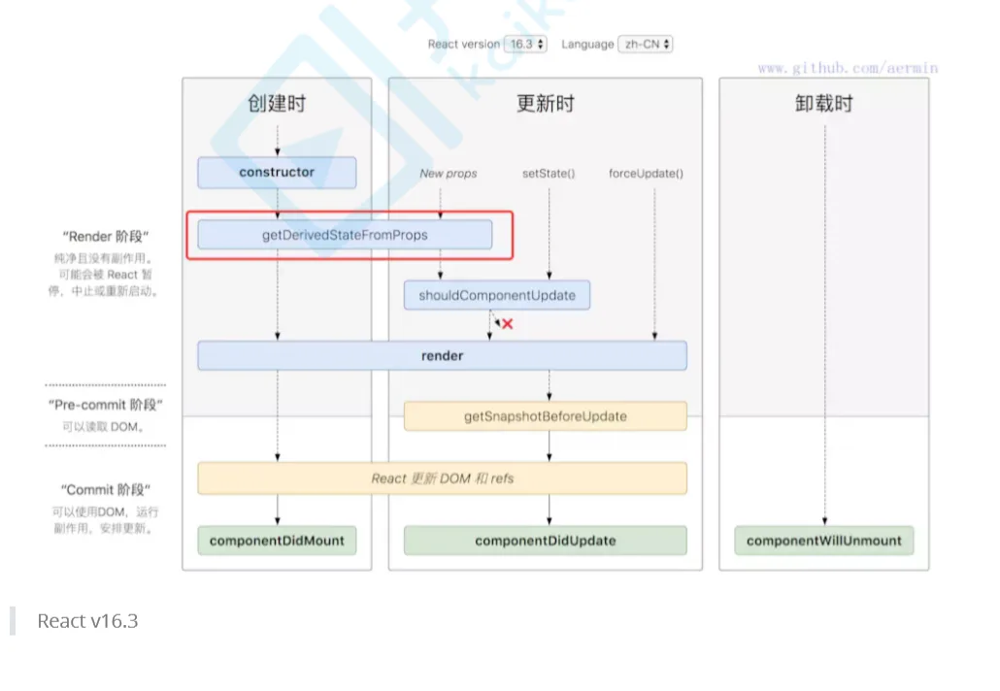
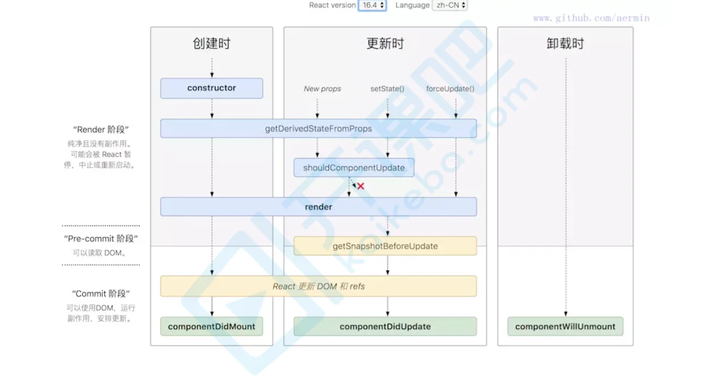

# 生命周期详解

## 目录

- [React V16.3之前的生命周期：](#React-V163之前的生命周期)
- [React v16.3 的生命周期](#React-v163-的生命周期)
- [React v16.4 的生命周期](#React-v164-的生命周期)
  - [getDerivedStateFromProps](#getDerivedStateFromProps)
  - [getSnapshotBeforeUpdate](#getSnapshotBeforeUpdate)
- [边界处理 错误捕获](#边界处理错误捕获)

[https://projects.wojtekmaj.pl/react-lifecycle-methods-diagram/](https://projects.wojtekmaj.pl/react-lifecycle-methods-diagram/ "https://projects.wojtekmaj.pl/react-lifecycle-methods-diagram/")   生命周期官网

[https://www.cnblogs.com/onesea/p/12859416.html](https://www.cnblogs.com/onesea/p/12859416.html "https://www.cnblogs.com/onesea/p/12859416.html")  参考文档

# **React V16.3之前的生命周期：**



```typescript 
 子组件先 mounted  父组件在 mounted 这点和vue 相同 
 
 import React, { Component } from "react"; 
 export default class Lifecycle extends Component {   
     constructor(props) {     
         super(props);     
         // 常用于初始化状态     
         console.log("1.组件构造函数执行");   
     }   
     componentWillMount() {     
         // 此时可以访问状态和属性，可进行api调用等     
         console.log("2.组件将要挂载");   
     }   
     componentDidMount() {     
         // 组件已挂载，可进行状态更新操作     
         console.log("3.组件已挂载");   
     }   
     componentWillReceiveProps(nextProps, nextState) {     
         // 父组件传递的属性有变化，做相应响应     
         console.log("4.将要接收属性传递");   
     }   
     shouldComponentUpdate(nextProps, nextState) {      
          // 组件是否需要更新，需要返回布尔值结果，优化点      
          console.log("5.组件是否需要更新？");     
         return true;   
     }   
     componentWillUpdate() {     
         // 组件将要更新，可做更新统计     
         console.log("6.组件将要更新");   
     }   
     componentDidUpdate() {     
         // 组件更新     
         console.log("7.组件已更新");   
     }   
     componentWillUnmount() {     
         // 组件将要卸载, 可做清理工作     
         console.log("8.组件将要卸载");   
     }   
     render() {     
         console.log("组件渲染");     
         return <div>生命周期探究</div>; 
     } 
 } 
 
 
 生命周期: 
 实例化期: getdefaultprops-->getInitailState -->componentwillmount--->render---->componentDidMount 
 更新期: 有props改变时:componentWillRecevieProps路由监测-->shouldComponentUpdate ---> componentWillUpdate--->render----->componentDidUpdate 
 卸载时:componentDidUnmount() 
 
 
 生命周期流程: 
     实例化 ->  更新期  -> 销毁时 
     实例化: 
         es5: 
             1.取得默认属性(getDefaultProps) 外部传入的props 
             2.初始状态(getInitailState)  state状态 
             3.即将挂载 componentWillMount 
             4.描画VDOM  render 
             5.挂载完毕 componentDidMount 
         es6: 
             1.取得默认属性(getDefaultProps) 外部传入的props 
             2.初始状态(getInitailState)  state状态 
                 1 && 2 都在构造器里面完成 
                 constructor(props){ 
                     super(props) == getDefaultProps 
                     this.state={} == getInitailState 
                 } 
             3.即将挂载 componentWillMount 
             4.描画DOM  render 
             5.挂载完毕 componentDidMount 
     更新期: 
         0.props改变 componentWillReceiveProps(nextProps) 
             初始化render时不执行 这里调用更新状态是安全的，并不会触发额外的render调用 
             nextProps 更新后  this.props更新前 
         1.是否更新 shouldComponentUpdate  指视图 
         2.即将更新 componentWillUpdate 
         3.描画Vdom  render 
         4.描画结束 componentDidUpdate 
     销毁时: 
         即将卸载 componentWillUnmount 
         可以做一些组件相关的清理工作，例如取消计时器、网络请求等
```


# **React v16.3 的生命周期**



        getDerivedStateFromProps

本来（React v16.3中）是只在创建和更新（由父组件引发部分），也就是不是不由父组件引发，那么getDerivedStateFromProps也不会被调用，如自身setState引发或者forceUpdate引发。

这样的话理解起来有点乱，在React v16.4中改正了这一点，让getDerivedStateFromProps无论是Mounting还是Updating，也无论是因为什么引起的Updating，全部都会被调用，具体可看React v16.4 的生命周期图。

# **React v16.4 的生命周期**



**变更缘由**

原来（React v16.0前）的生命周期在React v16推出的[Fiber](https://links.jianshu.com/go?to=https%3A%2F%2Fzhuanlan.zhihu.com%2Fp%2F26027085 "Fiber")之后就不合适了，因为如果要开启async rendering，在render函数之前的所有函数，都有可能被执行多次。

原来（React v16.0前）的生命周期有哪些是在render前执行的呢？

- componentWillMount
- componentWillReceiveProps
- shouldComponentUpdate
- componentWillUpdate

如果开发者开了async rendering，而且又在以上这些render前执行的生命周期方法做AJAX请求的话，那AJAX将被无谓地多次调用。。。明显不是我们期望的结果。而且在componentWillMount里发起AJAX，不管多快得到结果也赶不上首次render，而且componentWillMount在服务器端渲染也会被调用到（当然，也许这是预期的结果），这样的IO操作放在componentDidMount里更合适。

禁止不能用比劝导开发者不要这样用的效果更好，所以除了shouldComponentUpdate，其他在render函数之前的所有函数（componentWillMount，componentWillReceiveProps，componentWillUpdate）都被getDerivedStateFromProps替代。

也就是用一个静态函数getDerivedStateFromProps来取代被deprecate的几个生命周期函数 **，就是强制开发者在render之前只做无副作用的操作**，而且能做的操作局限在根据props和state决定新的state

React v16.0刚推出的时候，是增加了一个componentDidCatch生命周期函数，这只是一个增量式修改，完全不影响原有生命周期函数；但是，到了React v16.3，大改动来了，引入了两个新的生命周期函数： 

getDerivedStateFromProps，

getSnapshotBeforeUpdate

**新引入了两个新的生命周期函数： getDerivedStateFromProps ， getSnapshotBeforeUpdate**

## **getDerivedStateFromProps**

\*        static getDerivedStateFromProps(props, state)\* ​

 在组件创建时和更新时的render方法之前调用，它应该返回一个对象来更新状态，或者返回null来不更新任何内容。

        getDerivedStateFromProps前面要加上static保留字，声明为静态方法，不然会被react忽略掉


- getDerivedStateFromProps里面的this为undefined

    static静态方法只能Class(构造函数)来调用(App.staticMethod✅)，而实例是不能的( (new App()).staticMethod ❌ )；当调用React Class组件时，改组件会实例化；

所以  React Class组件中，静态方法getDerivedStateFromProps无权访问Class实例的this，即this为undefined。

也并不推荐直接访问属性。而是应该通过参数提供的nextProps以及prevState来进行判断，根据新传入的props来映射到state。

需要注意的是，

**如果props传入的内容不需要影响到你的state，那么就需要返回一个null**，这个返回值是必须的，所以尽量将其写到函数的末尾。

```纯文本 
 static getDerivedStateFromProps(nextProps, prevState) { 
     const {type} = nextProps; 
     // 当传入的type发生变化的时候，更新state 
     if (type !== prevState.type) { 
         return { 
             type, 
         }; 
     } 
     // 否则，对于state不进行任何操作 
     return null; 
 }
```


可以看react issue相关讨论 

[https://github.com/facebook/react/issues/12612%20https://github.com/facebook/react/issues/14730](https://github.com/facebook/react/issues/12612%20https://github.com/facebook/react/issues/14730 "https://github.com/facebook/react/issues/12612%20https://github.com/facebook/react/issues/14730")

## **getSnapshotBeforeUpdate**

*getSnapshotBeforeUpdate()*

**被调用于render之后**，可以读取但无法使用DOM的时候。它使您的组件可以在可能

**更改之前**从DOM捕获一些信息（**例如滚动位置**）。此生命周期返回的任何值都将作为参数传递给componentDidUpdate（）。

有点像vue 的nextTick

官网给的例子: 

```javascript 
class ScrollingList extends React.Component {   
    constructor(props) {     
        super(props);     
        this.listRef = React.createRef();   
    }
    getSnapshotBeforeUpdate(prevProps, prevState) {    //prev 之前的
         //我们是否要添加新的 items 到列表?     
         // 捕捉滚动位置，以便我们可以稍后调整滚动.     
         if (prevProps.list.length < this.props.list.length) {       
             const list = this.listRef.current;       
             return list.scrollHeight - list.scrollTop;     （更新前；旧的）
        }     
        return null;   
    }
    componentDidUpdate(prevProps, prevState, snapshot) {     //之前的
        //如果我们有snapshot值, 我们已经添加了 新的items.     
        // 调整滚动以至于这些新的items 不会将旧items推出视图。     
        // (这边的snapshot是 getSnapshotBeforeUpdate方法的返回值)     
        if (snapshot !== null) {       
            const list = this.listRef.current;       
            list.scrollTop = list.scrollHeight - snapshot;     
        }   
    }
    render() {     
        return (       
            <div ref={this.listRef}>{/* ...contents... */}</div>     
        ); }
}
```


# **边界处理 错误捕获**

        错误边界是一种 React 组件，这种组件

**可以捕获并打印发生在其子组件树任何位置的 JavaScript 错误，并且，它会渲染出备用 UI**

，而不是渲染那些崩溃了的子组件树。错误边界在渲染期间、生命周期方法和整个组件树的构造函数中捕获错误

```纯文本 
 注意 
 错误边界无法捕获以下场景中产生的错误： 
     * 事件处理（了解更多） 
     * 异步代码（例如 setTimeout 或 requestAnimationFrame 回调函数） 
     * 服务端渲染 
     * 它自身抛出来的错误（并非它的子组件）
```


```javascript 
class ErrorBoundary extends React.Component {
  constructor(props) {
    super(props);
    this.state = { hasError: false };
  }
    return this.props.children;
  static getDerivedStateFromError(error) {
    // 更新 state 使下一次渲染能够显示降级后的 UI
    return { hasError: true };
  }
  componentDidCatch(error, errorInfo) {
    // 你同样可以将错误日志上报给服务器
    logErrorToMyService(error, errorInfo);
  }
  render() {
    if (this.state.hasError) {
      // 你可以自定义降级后的 UI 并渲染
      return <h1>Something went wrong.</h1>;
    }
  }}

然后你可以将它作为一个常规组件去使用：
<ErrorBoundary>
  <MyWidget />
</ErrorBoundary>
```
