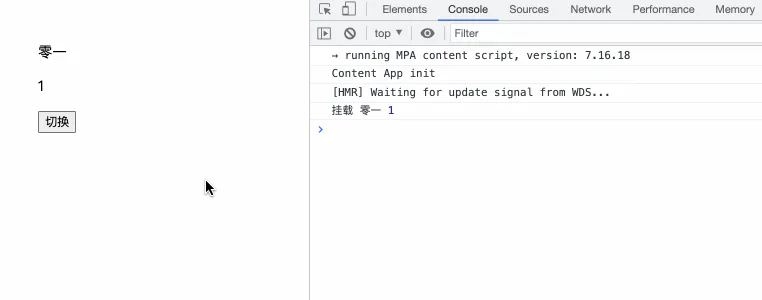

# 位置顺序

## 目录

- [挂载与更新](#挂载与更新)

## 挂载与更新

三元运算符在 `JSX` 中经常被我们拿来用于两种不同状态的组件切换，例如：

```javascript 
import { Component, useState } from 'react'

class Child extends Component {
  
  componentDidMount() {
    console.log('挂载', this.props.name, this.props.age);
  }

  componentDidUpdate() {
    console.log('更新', this.props.name, this.props.age);
  }
  
  render () {
    const { name, age } = this.props
    return (
     <div>
       <p>{name}</p>
        <p>{age}</p>
      </div>
    )
  }
}

function App () {
  const [year, setYear] = useState('1999')
  return (
   <div>
     { 
        year === '1999' 
          ? <Child name="零一" age={1} />
          : <Child name="01" age={23} />
      }
      <button onClick={() => {
          setYear(year === '1999' ? '2022' : '1999')
        }}>
        切换
      </button>
    </div>
  )
}

```


看到这个代码，你是不是**觉得当变量 year 切换时，一个组件会卸载，另一个组件会挂载**？但其实不是，我们来验证一下：



可以看到，我们在切换了变量 year 时，<Child/> **组件只挂载了一次，** 而不是不停地挂载、卸载。其实这是React做的处理，虽然写了两个 <Child/> 组件，但React只认为是一个，并直接进行更新，**即上述代码等价于：**

```javascript 
// ... 省略大部分代码
function App () {
  // ...
  return (
   <div>
       <Child 
        name={year === '1999' ? "零一" : "01"} 
        age={year === '1999' ? 1 : 23} 
      /> 
   // ...
    </div>
  )
}
```


这种情况需要特别注意，当你真的想写两次同一个组件并传递不同的参数时，你可以\*\*给这两个组件赋予不同的 ****`key`**** \*\*，那么React就不会认为它俩是同一个组件实例了，例如：

```javascript 
function App () {
  // ...
  return (
   <div>
     { 
        year === '1999' 
          ? <Child name="零一" age={1}  key="0"/>
           : <Child name="01" age={23}  key="1"/>
       }
    </div>
  )
}
```


如果本意就是不想让两个组件实例不停卸载和挂载，那么就不需要做额外操作了\~
