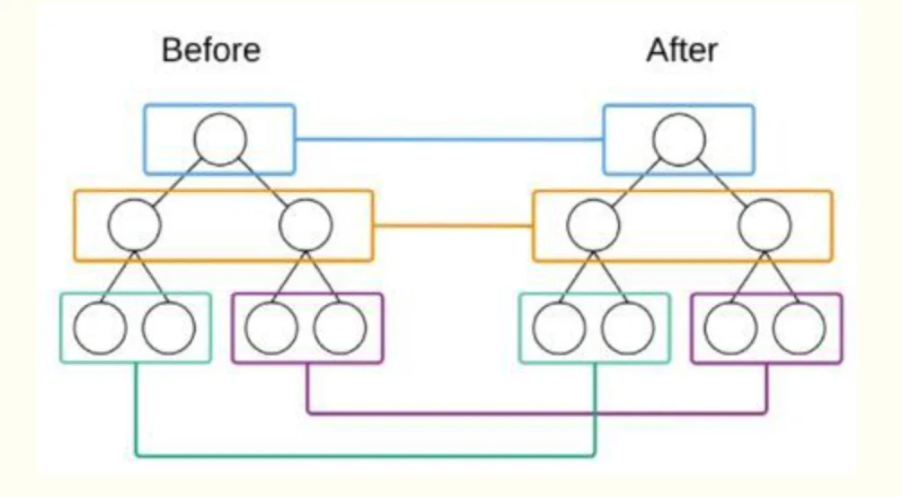

# Diff算法

## 目录

- [不同节点类型](#不同节点类型)
- [相同节点类型](#相同节点类型)
  - [DOM元素类型 ](#DOM元素类型-)
  - [自定义组件类型 ](#自定义组件类型-)
- [React Diff 算法详解](#React-Diff-算法详解)
  - [Diff 算法的基本策略](#Diff-算法的基本策略)
  - [具体 Diff 步骤](#具体-Diff-步骤)
    - [1. 元素类型不同时的处理](#1-元素类型不同时的处理)
    - [2. 相同类型的 DOM 元素](#2-相同类型的-DOM-元素)
    - [3. 相同类型的组件元素](#3-相同类型的组件元素)
    - [4. 子节点递归比较（列表对比）](#4-子节点递归比较列表对比)
      - [1. 第一轮遍历：寻找头部相同节点](#1-第一轮遍历寻找头部相同节点)
  - [Diff 算法的优化策略](#Diff-算法的优化策略)
  - [5. 为什么 React 的 Diff 算法高效？](#5-为什么-React-的-Diff-算法高效)
  - [6. React Fiber 架构下的 Diff](#6-React-Fiber-架构下的-Diff)

`React`基于两个假设：&#x20;

- 两个\*\*相同的组件产生类似的`DOM`\*\***结构**，不同组件产生不同`DOM`结构&#x20;
- **通过 key 属性标识稳定元素**：key 帮助 React 识别哪些元素只是移动了位置，而不是被完全替换

发明了一种叫**Diff的算法来比较两棵DOM tree**，它极大的优化了这个比较的过程，将算法复杂度从O(n^3)降低到O(n)。&#x20;

**`Diff`****算法只会对****同层的节点进行比较。如图，它只会对颜色相同的节点进行比较**\*\*。 \*\*



下面，我们具体看下`Diff`算法是怎么做的，这里分为三种情况考虑 （也可以看性能优化部分，[官网也有diff介绍）](https://react.docschina.org/docs/reconciliation.html "官网也有diff介绍）")

- 节点类型不同&#x20;
- 节点类型相同&#x20;
- 子节点比较&#x20;
- 不同节点类型&#x20;

## 不同节点类型

- 对于不同的节点类型，`react`会基于第一条假设，直接删去旧的节点，新建一个新的节点。

React会直接删掉A节点（**包括它所有的子节点**）,然后新建一个B节点插入&#x20;

由此可以看出，A与其子节点C会被直接删除，然后重新建一个B，C插入。这样就给我们的性能优化提供了一个思路，就是我们要保持DOM标签的稳定性。&#x20;

打个比方，如果写了一个`<div><List /></div>`（List 是一个有几千个节点的组件），切换的时候变成了`<section><List /></section>`，**此时即使List的内容不变，它也会先被卸载在创建，其实是很浪费的**

## 相同节点类型

          当**对比相同的节点类型**比较简单，这里分为两种情况，一种是DOM元素类型，对应html直接支持的元素类型：div，span和p，还有一种是自定义组件。&#x20;

### DOM元素类型&#x20;

react会对比\*\*它们的属性，只改变需要改变的属性 \*\*

### 自定义组件类型&#x20;

          由于React此时并不知道如何去更新DOM树，因为这些逻辑都在React组件里面，所以它能做的就是**根据新节点的props去更新原来根节点的组件实例**，\*\*触发一个更新的过程，最后在对所有的child节点在进行diff的递归比较更新。 \*\*

```javascript 
 <div>
  <A />
  <B />
</div>
// 列表一到列表二<div>
  <A />
  <C />
  <B />
</div>

```


因为React在没有key的情况下对比节点的时候，\*\*是一个一个按着顺序对比的。从列表一到列表二，只是在中间插入了一个C，但是如果没有key的时候，react会把B删去，新建一个C放在B的位置，然后重新建一个节点B放在尾部。 \*\*

当节点很多的时候，这样做是非常低效的。有两种方法可以解决这个问题：&#x20;

1、保持DOM结构的稳定性，我们来看这个变化，由两个子节点变成了三个，其实是一个不稳定的DOM结构，我们可以通过**通过加一个null，保持DOM结构的稳定**。这样按照顺序对比的时候，B就不会被卸载又重建回来。&#x20;

2、key&#x20;

通过给节点配置key，**让React可以识别节点是否存在。**&#x20;

果然，配上key之后，列表二的生命周期就如我所愿，只在指定的位置创建C节点插入。&#x20;

这里要注意的一点是，**key值必须是稳定**（所以我们不能用Math.random()去创建key），**可预测，并且唯一的。**&#x20;

这里给我们性能优化也提供了两个非常重要的依据：&#x20;

- 保持DOM结构的稳定性&#x20;
- \*\*map的时候，加key \*\*

# React Diff 算法详解

React 的 Diff 算法（协调算法）是**虚拟 DOM 实现高效更新的核心机制**，它通过**比较新旧虚拟 DOM 树来**确定需要更新**的最小部分。**

## Diff 算法的基本策略

React 采用三个核心策略来优化 Diff 过程：

1. **同级比较**：只比较**同一层级的节点，不跨层级比较**
2. **类型不同则直接替换**：**节点类型不同时直接重建整个子树**
3. **key 属性优化**：使**用 key 来识别稳定元素，提高复用率**

## 具体 Diff 步骤

### 1. 元素类型不同时的处理

当根节点类型不同时：

```markdown 
// 旧树
<div>
  <Counter />
</div>

// 新树
<span>
  <Counter />
</span>
```


**直接卸载整个子树并重建**

### 2. 相同类型的 DOM 元素

当 DOM 元素类型相同时，React 会保留 DOM 节点，仅更新变化的属性：

```javascript 
// 旧
<div className="before" title="stuff" />

// 新
<div className="after" title="stuff" />
```


React 只会修改`className`属性，不会重建整个 div。

### 3. 相同类型的组件元素

当组件类型相同时：

```javascript 
// 旧
<Counter count={10} />

// 新
<Counter count={20} />
```


React 会**保留组件实例，更新 props**，然后调用`componentWillReceiveProps()`和`componentWillUpdate()`，最后重新渲染。

**不同组件类型**：

- 直接卸载旧组件，挂载新组件
- 触发完整的组件卸载/挂载生命周期

### 4. 子节点递归比较（列表对比）

这是 Diff 算法最复杂的部分，React 使用**双端比较算法**来高效处理子节点列表：

#### 1. 第一轮遍历：寻找头部相同节点

**从列表头部开始比对，直到遇到不能复用的节点**

```text 
// 旧：A B C D
// 新：A B E C D
// 会先复用 A、B，然后在 C 处停止
```


1. **最后一轮遍历**：从列表尾部开始比对，直到遇到不能复用的节点

```javascript 
// 继续上面的例子
// 从尾部比较会复用 D、C，然后在 E 处停止
```


1. **剩余节点处理**：
   - 如果旧列表先遍历完，将新列表剩余节点插入
   - 如果新列表先遍历完，将旧列表剩余节点删除
   - 如果都有剩余，进入 key 比对阶段
2. **key 比对**：
   - 根据 key 建立旧节点的索引图（`key -> index`的映射）
   - 遍历新列表剩余节点，通过 key 查找可复用的旧节点
   - 记录节点移动的位置，生成最小操作序列

## Diff 算法的优化策略

1. **Key 的重要性**：

```javascript 
// 不好的做法（使用索引作为 key）
{items.map((item, index) => (
  <Item key={index} {...item} />
))}

// 好的做法（使用唯一稳定标识）
{items.map(item => (
  <Item key={item.id} {...item} />
))}
```


1. **跳过子树 Diff**：
   - 类组件可以通过`shouldComponentUpdate()`返回 false 跳过比较
   - 函数组件可以使用`React.memo`进行记忆化
2. **批量更新**：
   - React 会将多个 setState 调用合并为一次更新
   - 使用事件委托减少事件监听器的创建/销毁

## 5. 为什么 React 的 Diff 算法高效？

1. **O(n) 复杂度**：通过层级比较和 key 优化，将传统 Diff 的 O(n³) 降到 O(n)
2. **最小化 DOM 操作**：只更新实际发生变化的部分
3. **批处理机制**：将多个更新合并为单个渲染周期

## 6. React Fiber 架构下的 Diff

React 16 引入的 Fiber 架构使 Diff 过程可以：

1. **可中断**：将\*\* Diff 工作分成小 chunk，避免长时间阻塞主线程\*\*
2. **优先级调度**：高**优先级更新（如用户输入）可以打断低优先级更新**
3. **渐进式渲染**：**可以部分渲染未完成的树，提高用户体验**

理解 React 的 Diff 算法有助于编写更高效的 React 代码，特别是正确处理 key 和优化组件更新策略。
