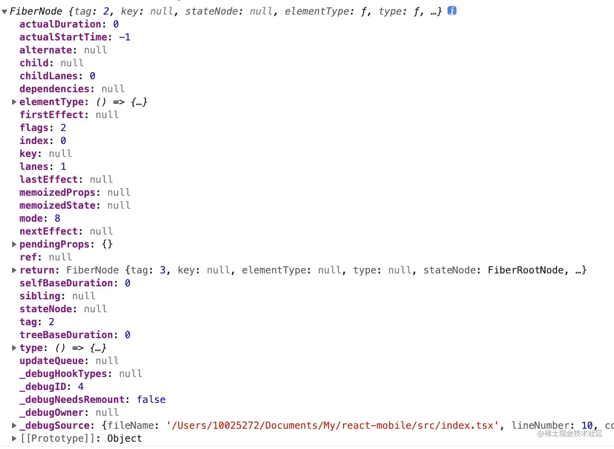

# Fiber

## 目录

- [走进 Fiber](#走进-Fiber)
  - [什么是Fiber](#什么是Fiber)
  - [v16之前，React是如何遍历节点的？](#v16之前React是如何遍历节点的)
  - [知悉fiber](#知悉fiber)
    - [虚拟DOM是如何转化成fiber的](#虚拟DOM是如何转化成fiber的)
    - [element、fiber和DOM元素 的关系](#elementfiber和DOM元素-的关系)
      - [element 和 fiber 的对应表](#element-和-fiber-的对应表)
    - [fiber 保存了什么？](#fiber-保存了什么)
      - [Instance](#Instance)
      - [Fiber](#Fiber)
      - [Effect](#Effect)
      - [Priority](#Priority)
    - [链表之间如何连接的？](#链表之间如何连接的)
- [Fiber 执行阶段](#Fiber-执行阶段)
  - [初始化（mount）阶段](#初始化mount阶段)

在`React v16`以上的版本引入了一个非常重要的概念，那就是`fiber`，实际上`fiber`是`react`团队花费两年的时间重构的架构，在之前的文章中也提及到了`fiber`，那么`fiber`架构究竟是什么，为什么要使用`fiber`


> 本文基于[React v17.0.1](https://link.juejin.cn/?target=https://github.com/facebook/react/tree/v17.0.1 "React v17.0.1")源码

# 走进 Fiber

## 什么是Fiber

在一个庞大的项目中，如果有某个节点发生变化，就会给`diff`带来巨大的压力，此时想要要找到真正变化的部分就会耗费大量的时间，也就是说此时，`js`会占据主线程去做对比，导致无法正常的页面渲染，此时就会发生页面卡顿、页面响应变差、动画、手势等应用效果差

为了解决这一问题，`react`团队花费两年时间，重写了`react`的核心算法`reconciliation`，在`v16`中发布，为了区分`reconciler`(调和器)，将之前的`reconciler`称为`stack reconciler`，之后称作`fiber reconciler`(简称：`fiber`)

简而言之，**`fiber`****就是****`v16`****之后的****`虚拟DOM`**（`React`在遍历的节点的时候，并不是`真正的DOM`，而是采用`虚拟的DOM`）

## v16之前，React是如何遍历节点的？

我们先看看下面这张图：


遍历的顺序为：**A => B => D => E => C => F => G**

在`v16`之前，`react`采用的是**深度优先遍历**去遍历节点，转化为代码为：

```typescript 
  const root = {
    key: 'A',
    children: [
      {
        key: 'B',
        children: [
          {
            key: 'D',
          },
          {
            key: 'E',
          },
        ],
      },
      {
        key: 'C',
        children: [
          {
            key: 'F',
          },
          {
            key: 'G',
          },
        ],
      },
    ],
  };

  const walk = dom => dom.children.forEach(child => walk(dom));
  walk(root);
```


可以看出这种遍历采取的`递归`遍历，如果这**颗树非常的庞大**，那么对应的栈也会越来越深，如果其中发生中断，那么整颗树都不能恢复。

也就是说，在传统的方法中，在寻找节点的过程中，花费了1s，那么这1s就是浏览器无法响应的，同时**树越庞大，卡顿的效果也就越明显**

所以在`v16`之前的版本，无法**解决中断和树庞大的问题**

## 知悉fiber

在上面的介绍中，我们知道`fiber`实际上是一种核心算法，为了解决**中断**和**树庞大**的问题，那么接下来我们先来了解下fiber

### 虚拟DOM是如何转化成fiber的

先看看最常见的一段`jsx`代码：

### element、fiber和DOM元素 的关系

1. `element`对象就是我们的`jsx`代码，上面保存了`props`、`key`、`children`等信息
2. `DOM元素`就是最终呈现给用户展示的效果
3. 而`fiber`就是充当`element`和`DOM元素`的桥梁，简单的说，只要`elemnet`发生改变，就会通过`fiber`做一次调和，使对应的`DOM`元素发生改变

#### element 和 fiber 的对应表

在这里总结了一些比较常用的对照表，供大家参考：

| fiber                      | element                          |
| -------------------------- | -------------------------------- |
| `FunctionComponent` = 0    | 函数组件                             |
| `ClassComponent` = 1       | 类组件                              |
| IndeterminateComponent = 2 | 初始化的时候不知道是函数组件还是类组件              |
| HostRoot = 3               | 根元素，通过reactDom.render()产生的根元素    |
| HostPortal = 4             | ReactDOM.createPortal 产生的 Portal |
| HostComponent = 5          | dom 元素（如`<div>`）                 |
| HostText = 6               | 文本节点                             |
| Fragment = 7               | `<React.Fragment>`）              |
| Mode = 8                   | `<React.StrictMode>`             |
| ContextConsumer = 9        | `<Context.Consumer>`             |
| ContextProvider = 10       | `<Context.Provider>`             |
| ForwardRef = 11            | React.ForwardRef                 |
| Profiler = 12              | `<Profiler>`                     |
| SuspenseComponent = 13     | `<Suspense>`                     |
| MemoComponent = 14         | `React.memo` 返回的组件               |
| SimpleMemoComponent = 15   | `React.memo` 没有制定比较的方法，所返回的组件    |
| LazyComponent = 16         | `<lazy />`                       |

### fiber 保存了什么？

接下来我们看看`fiber`中保存了什么，如：



然后简单的分为四个部分，分别是`Instance`、`Fiber`、`Effect`、`Priority`

#### Instance

**Instance**：这个部分是用来存储一些对应`element`元素的属性

```typescript 
export type Fiber = {
  tag: WorkTag,  // 组件的类型，判断函数式组件、类组件等（上述的tag）
  key: null | string, // key
  elementType: any, // 元素的类型
  type: any, // 与fiber关联的功能或类，如<div>,指向对应的类或函数
  stateNode: any, // 真实的DOM节点
  ...
}
```


#### Fiber

**Fiber**：这部分内容存储的是关于`fiber`链表相关的内容和相关的`props`、`state`

```typescript 
export type Fiber = {
  ...
  return: Fiber | null, // 指向父节点的fiber
  child: Fiber | null, // 指向第一个子节点的fiber
  sibling: Fiber | null, // 指向下一个兄弟节点的fiber
  index: number, // 索引，是父节点fiber下的子节点fiber中的下表
  
  ref:
    | null
    | (((handle: mixed) => void) & {_stringRef: ?string, ...})
    | RefObject,  // ref的指向，可能为null、函数或对象
    
  pendingProps: any,  // 本次渲染所需的props
  memoizedProps: any,  // 上次渲染所需的props
  updateQueue: mixed,  // 类组件的更新队列（setState），用于状态更新、DOM更新
  memoizedState: any, // 类组件保存上次渲染后的state，函数组件保存的hooks信息
  dependencies: Dependencies | null,  // contexts、events（事件源） 等依赖

  mode: TypeOfMode, // 类型为number，用于描述fiber的模式 
  ...
}
```


#### Effect

**Effect**：副作用相关的内容

```typescript 
export type Fiber = {
  ...
   flags: Flags, // 用于记录fiber的状态（删除、新增、替换等）
   subtreeFlags: Flags, // 当前子节点的副作用状态
   deletions: Array<Fiber> | null, // 删除的子节点的fiber
   nextEffect: Fiber | null, // 指向下一个副作用的fiber
   firstEffect: Fiber | null, // 指向第一个副作用的fiber
   lastEffect: Fiber | null, // 指向最后一个副作用的fiber
  ...
}
```


#### Priority

**Priority**: 优先级相关的内容

```typescript 
export type Fiber = {
  ...
  lanes: Lanes, // 优先级，用于调度
  childLanes: Lanes,

  alternate: Fiber | null,

  actualDuration?: number,

  actualStartTime?: number,
  selfBaseDuration?: number,

  treeBaseDuration?: number,
  ...
}
```


### 链表之间如何连接的？

在 `Fiber`中我们看到有`return`、`child`、`sibling`这三个参数，分别指向父级、子级、兄弟，也就是说每个`element`通过这三个属性进行连接

# Fiber 执行阶段

## 初始化（mount）阶段

在上文已经说过，`react`首次执行（初始化阶段）会以`ReactDOM.render`为入口，然后开始执行，由于调用的函数实在过多，这里我就简化一些，方便我们更好理解

[深入探究 React Fiber](<./深入探究 React Fiber/index.md> "深入探究 React Fiber")
