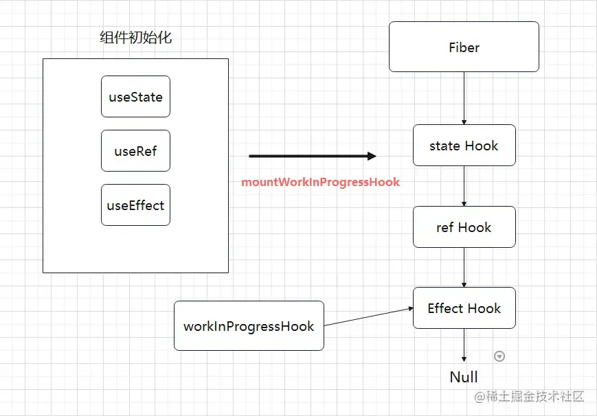
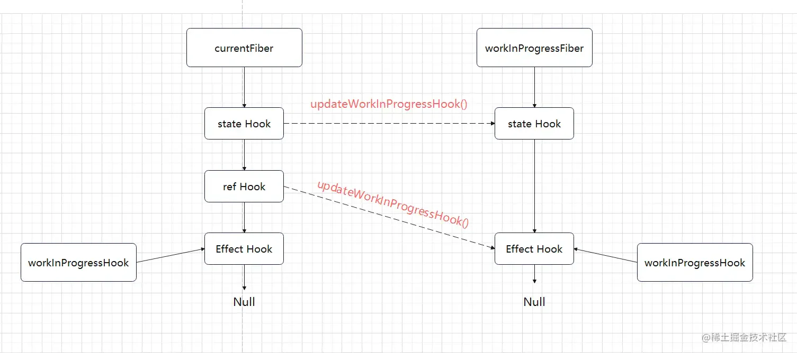

# hooks 链表

## 目录

- [为什么不能在条件、循环里面使用 hook](#为什么不能在条件循环里面使用-hook)

**hooks 为什么只能在组件中使用**



## 为什么不能在条件、循环里面使用 hook

在上述例子中，我们把 `useRef` 放入条件语句中

```react tsx 
let ref = null;
let isFirst = true;
if (isFirst) {
    curRef = useRef(1);
    //初始化后将条件改为 false
    isFirst = false;
}

```


后续组件重新 render 时，if 判断进不去，会发生下面的情况：



上面的图解看出：一旦在条件语句中声明`hooks`，函数组件更新时，`hooks` **链表结构被破坏**，`currentFiber树` 的 `memoizedState` 缓存 `hooks链表` 的信息，和 `workInProgress` **不一致**，如果涉及到读取`state`等操作，就会发生异常。`因此不能在条件、循环语句中使用 hooks。`

```react tsx 
function mountWorkInProgressHook() {
  // 注意，单个 hook 是以对象的形式存在的
  var hook = {
    memoizedState: null,
    baseState: null,
    baseQueue: null,
    queue: null,
    next: null
  };
  if (workInProgressHook === null) {
        firstWorkInProgressHook = workInProgressHook = hook;
        /* 等价
            let workInProgressHook = hooks
            firstWorkInProgressHook = workInProgressHook
        */
  } else {
    workInProgressHook = workInProgressHook.next = hook;
  }
  // 返回当前的 hook
  return workInProgressHook;
}

```


\*\*每个 hook 都会有一个 next 指针，****hook 对象之间以单向链表的形式相互串联****， 同时也能发现 useState \*\***底层依然是 useReducer** 再看看更新阶段发生了什么

```react tsx 
// ReactFiberHooks.js
const HooksDispatcherOnUpdate: Dispatcher = {
      // ...
     useState: updateState,
  }
  function updateState(initialState) {
    return updateReducer(basicStateReducer, initialState);
  }

function updateReducer(reducer, initialArg, init) {
    const hook = updateWorkInProgressHook();
    const queue = hook.queue;
    if (numberOfReRenders > 0) {
        const dispatch = queue.dispatch;
        if (renderPhaseUpdates !== null) {
            // 获取Hook对象上的 queue，内部存有本次更新的一系列数据
            const firstRenderPhaseUpdate = renderPhaseUpdates.get(queue);
            if (firstRenderPhaseUpdate !== undefined) {
                renderPhaseUpdates.delete(queue);
                let newState = hook.memoizedState;
                let update = firstRenderPhaseUpdate;
                // 获取更新后的state
                do {
                    // useState 第一个参数会被转成 useReducer
                    const action = update.action;
                    newState = reducer(newState, action);
                    //按照当前链表位置更新数据
                    update = update.next;
                } while (update !== null);
                hook.memoizedState = newState;
                // 返回新的 state 以及 dispatch
                return [newState, dispatch];
            }
        }
    }
    // ...
}

```
