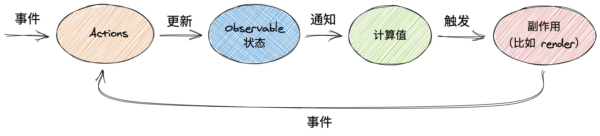

# mobx

## 目录

- [原则](#原则)
- [创建 Derivations 以便自动对 State 变化进行响应](#创建-Derivations-以便自动对-State-变化进行响应)
  - [通过 computed 对派生值进行建模](#通过-computed-对派生值进行建模)
  - [使用 reaction 对副作用建模](#使用-reaction-对副作用建模)
  - [自定义 Reaction](#自定义-Reaction)
- [理解响应性](#理解响应性)
- [mobx-persist-store](#mobx-persist-store)
- [react-mobx](#react-mobx)
  - [函数式组件](#函数式组件)
  - [class组件](#class组件)
- [中文文档](#中文文档)

[ 含参数的计算值 🚀 | MobX 中文文档 React状态管理更便捷 https://www.mobx.org.cn/computeds-with-args.html](https://www.mobx.org.cn/computeds-with-args.html " 含参数的计算值 🚀 | MobX 中文文档 React状态管理更便捷 https://www.mobx.org.cn/computeds-with-args.html")

*任何可以从应用状态中派生出来的值都应该被自动派生出来。*

MobX 是一个身经百战的库，它通过运用透明的函数式响应编程（Transparent Functional Reactive Programming，TFRP）使状态管理变得简单和可扩展。



## 原则

Mobx 使用单向数据流，利用 *action* 改变 *state* ，进而更新所有受影响的 *view*


1. 所有的 *derivations* 将在 *state* 改变时**自动且原子化地更新**。因此**不可能观察中间值**。
2. 所有的 *derivations* 默认将会**同步**更新，这意味着 *action* 可以在 *state* 改变 之后安全的直接获得 computed 值。
3. *computed value* 的更新是**惰性**的，任何 computed value 在需要他们的副作用发生之前都是不激活的。
4. 所有的 *computed value* 都应是**纯函数**,他们不应该修改 *state*。

# 创建 Derivations 以便自动对 State 变化进行响应

*任何* 来源是\_State(状态)\_ 并且不需要进一步交互的东西都是 Derivation(派生)。

Derivations 包括许多方式:

- *用户界面*
- *派生数据* , 比如剩余未完成`todos`的数量
- *后端集成* , 比如发送改变到服务器端

Mobx 区分了两种 Derivation :

- *Computed values*,总是可以通过纯函数从当前的可观测 State 中派生。
- *Reactions*, 当 State 改变时需要自动运行的副作用 (命令式编程和响应式编程之间的桥梁)

当最开始使用MobX时，人们容易过度使用 *Reaction*。

黄金法则是，**如果要基于当前 State 创建值，请始终使用 *****computed*****。**

#### 通过 computed 对派生值进行建模

你可以通过定义 getter 方法并使用 `makeObservable` 将其标记为 `computed` 的方式创建一个 *computed* 值

```react jsx 
import { makeObservable, observable, computed } from "mobx"

class TodoList {
    todos = []
    get unfinishedTodoCount() {
        return this.todos.filter(todo => !todo.finished).length
    }
    constructor(todos) {
        makeObservable(this, {
            todos: observable,
            unfinishedTodoCount: computed
        })
        this.todos = todos
    }
}

```


Mobx 会确保 `unfinishedTodoCount` 会在todos数组发生变化中或者 todos中的一个对象中的 `finished`属性被修改时自动更新。

这些计算类似于 Excel 单元格中的公式。它们仅在需要时自动更新。也就是说，**如果有观察者使用其结果时才会更新。也就是说，如果有有人关心其结果时才会更新。**

#### 使用 reaction 对副作用建模

作为用户，要想在屏幕上看到状态或计算值的变化，就需要一个重新绘制部分GUI的 *reactions* 。

**Reaction 和 computed 类似，但并不产生信息，而是产生副作用，如打印到控制台、发出网络请求、增量更新 React 组件树以便更新DOM等。**

\*\*简而言之，*****reaction***** 是 \*\*[**响应式编程**](https://en.wikipedia.org/wiki/Reactive_programming "响应式编程")**和**[**指令式编程**](https://en.wikipedia.org/wiki/Imperative_programming "指令式编程")**之间的桥梁。**

到目前为止，最常用的 reaction 形式是UI组件。 注意，**action 和 reaction 都可能引起副作用。 副作用应有一个清晰的、显式的起源**，例如在提交表单时发出网络请求，应该从相关的事件处理程序显式触发。

#### 自定义 Reaction

通常情况下你不需要使用它们，可以使用 [autorun](https://zh.mobx.js.org/reactions.html#autorun "autorun") ,[reaction](https://zh.mobx.js.org/reactions.html#reaction "reaction") 或 [when](https://zh.mobx.js.org/reactions.html#when "when") 方法来订制你的特殊业务场景。

比如，下面的 `autorun` 将在`unfinishedTodoCount`的数量发生变化时输出日志。

```react jsx 
// 一个自动观察state的函数
autorun(() => {
  console.log("Tasks left: " + todos.unfinishedTodoCount)
})
```


# 理解响应性

Mobx 通常会像你所期待的那样对确定的一些事物做出响应，这意味着在 90% 的用例中 Mobx 都应该能正常工作。 但是在不确定的某个时间，你可能会遇到一些情况，Mobx 并没有在这些情况下做出你所预想的响应。 面对这些情况，理解 Mobx 如何确定要对哪些事物做出响应是十分重要的。

> Mobx 会对跟踪函数执行时读取的任何 *存在的* **可观察的** *属性* 做出响应。

- *“读取”* 使用一个对象的属性, “读取”有两种方式。一种是点访问（dotting into），例如 `user.name` 。另一种是方括号访问，例如 `user['name']`、`todos[3]`。
- *“跟踪函数”* 其可以是 `computed` 的表达式、作为 `observer` 的 React 函数式组件的渲染（rendering）、作为 `observer` 的 React 类组件的 `render()` 方法，也可以是作为第一个参数传递给 `autorun` 、 `reaction` 和 `when` 的函数。
- *“跟踪函数执行时”* 这意味着只有那些在跟踪函数执行时读取的可观察对象才会被跟踪。这些值在跟踪函数中是直接使用还是间接使用并不重要。但是从函数“引发”出来的东西将不会被跟踪（例如， `setTimeout` `promise.then`， `await` 等）。

换句话说，MobX 将不会对下面的情况做出响应：

- 从可观察对象中获取到，但是并没有在跟踪函数中使用的值
- 在异步调用的代码块中读取的可观察值

[ 理解响应性 · MobX \<script async type="text/javascript" src="//cdn.carbonads.com/carbon.js?serve=CEBD4KQ7\&placement=mobxjsorg" id="\_carbonads\_js">\</script> https://zh.mobx.js.org/understanding-reactivity.html](https://zh.mobx.js.org/understanding-reactivity.html " 理解响应性 · MobX <script async type=\"text/javascript\" src=\"//cdn.carbonads.com/carbon.js?serve=CEBD4KQ7\&placement=mobxjsorg\" id=\"_carbonads_js\"></script> https://zh.mobx.js.org/understanding-reactivity.html")

# [mobx-persist-store](https://www.npmjs.com/package/mobx-persist-store "mobx-persist-store")

数据持久化存储

```react jsx 
import { makePersistable } from 'mobx-persist-store';
import localForage from "localforage";

...
makePersistable(
  this,
  {
    name: 'SampleStore',
    properties: ['someProperty'],
    storage: localForage,  // localForage, window.localStorage, AsyncStorage all have the same interface
    expireIn: 86400000, // One day in milliseconds
    removeOnExpiration: true,
    stringify: false,
    debugMode: true,
  },
  { delay: 200, fireImmediately: false },
);

```


# react-mobx

[ react-Mobx基本使用\_CH\_咯的博客-CSDN博客\_react-mobx 十分钟交互式的 MobX + React 教程mobx 的核心理念是 简单、可扩展的状态管理库。比redux和react-redux方便许多先create-react-app 构建一个项目1.装包1.1安装mobx mobx-react  npm install  mobx mobx-react -S1.2安装装饰器装包搭配依赖去解析(可选),装饰器作用\&gt;代码更简洁  npm... https://blog.csdn.net/weixin\_43774460/article/details/95067250](https://blog.csdn.net/weixin_43774460/article/details/95067250 " react-Mobx基本使用_CH_咯的博客-CSDN博客_react-mobx 十分钟交互式的 MobX + React 教程mobx 的核心理念是 简单、可扩展的状态管理库。比redux和react-redux方便许多先create-react-app 构建一个项目1.装包1.1安装mobx mobx-react  npm install  mobx mobx-react -S1.2安装装饰器装包搭配依赖去解析(可选),装饰器作用\&gt;代码更简洁  npm... https://blog.csdn.net/weixin_43774460/article/details/95067250")

[ npm: mobx-react React bindings for MobX. Create fully reactive components.. Latest version: 7.5.3, last published: a month ago. Start using mobx-react in your project by running \`npm i mobx-react\`. There are 2075 oth https://www.npmjs.com/package/mobx-react](https://www.npmjs.com/package/mobx-react " npm: mobx-react React bindings for MobX. Create fully reactive components.. Latest version: 7.5.3, last published: a month ago. Start using mobx-react in your project by running `npm i mobx-react`. There are 2075 oth https://www.npmjs.com/package/mobx-react")

## 函数式组件

```react jsx 
export default inject("todoStore")(observer(NavLayout))
```


## class组件

```react jsx 
@inject("toolStore")
@inject("todoStore")
@inject("userStore")
@observer
class Home extends Component<Props,null> {}

```


# 中文文档

[ 关于 MobX | MobX中文文档 | MobX中文网 简单，可扩展的状态管理 https://www.mobxjs.com/](https://www.mobxjs.com/ " 关于 MobX | MobX中文文档 | MobX中文网 简单，可扩展的状态管理 https://www.mobxjs.com/")

[文档和理解](./文档和理解/index.md "文档和理解")

[实践](./实践/index.md "实践")

[library](./library/index.md "library")

[集成](./集成/index.md "集成")

[常见问题/使用注意](./常见问题-使用注意/index.md "常见问题/使用注意")

[mobx推荐](./mobx推荐/index.md "mobx推荐")
