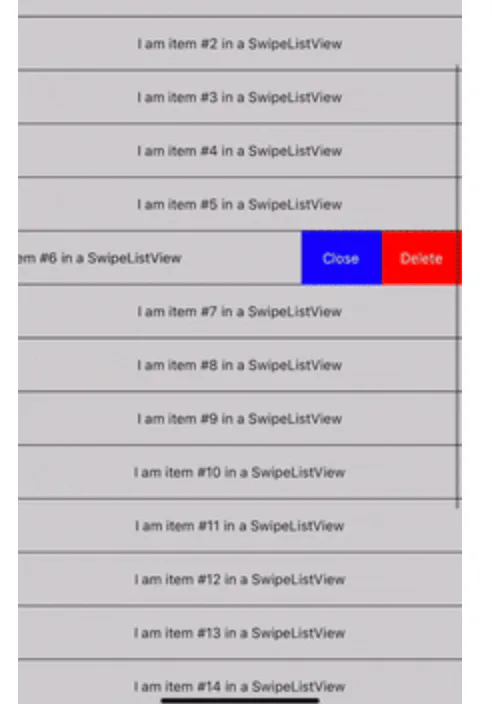

# 业务常用类（一）

## 目录

- [轮播图](#轮播图)
- [进度条](#进度条)
- [启动页](#启动页)
- [侧滑组件](#侧滑组件)
- [键盘遮挡输入框](#键盘遮挡输入框)
- [拖拽：](#拖拽)

# 轮播图

[https://blog.csdn.net/hzxOnlineOk/article/details/104019665](https://blog.csdn.net/hzxOnlineOk/article/details/104019665 "https://blog.csdn.net/hzxOnlineOk/article/details/104019665")

[https://github.com/leecade/react-native-swiper](https://github.com/leecade/react-native-swiper "https://github.com/leecade/react-native-swiper")

   github

renderPagination   props 可以完全控制pagination

或者：

react-native-snap-carousel

[https://www.npmjs.com/package/react-native-snap-carousel](https://www.npmjs.com/package/react-native-snap-carousel "https://www.npmjs.com/package/react-native-snap-carousel")

   npm 地址

# 进度条

react-native-progress

[react-native 圆形进度条 项目中录制视频需要用到圆形进度条，从网上搜了很多，终于发现一个好用的组件react-native-progress，这个组件支持线形和圆形多种形式的进度条，先来看看效果图\~ ... https://www.jianshu.com/p/d0742d421b7c](https://www.jianshu.com/p/d0742d421b7c "react-native 圆形进度条 项目中录制视频需要用到圆形进度条，从网上搜了很多，终于发现一个好用的组件react-native-progress，这个组件支持线形和圆形多种形式的进度条，先来看看效果图~ ... https://www.jianshu.com/p/d0742d421b7c")

[https://github.com/oblador/react-native-progress](https://github.com/oblador/react-native-progress "https://github.com/oblador/react-native-progress")

import \* as Progress from 'react-native-progress';

let seconds = 0;

...

\<View&#x20;

    style={{

        justifyContent: 'center',

        alignItems: 'center'

    }}>

    \<Progress.Circle

        style={{

            borderRadius: 42,

            width: 84,

            height: 84

        }}

        size={84} // 圆的直径

        progress={this.state.progress} // 进度

        unfilledColor="rgba(255,255,255,0.5)" // 剩余进度的颜色

        color={"#008aff"} // 颜色

        thickness={6} // 内圆厚度

        direction="clockwise" // 方向

        borderWidth={0} // 边框

        children={ // 子布局

            \<View style={{

                position: 'absolute',

                top: 6,

                left: 6,

            }}>

                \<TouchableOpacity

                    activeOpacity={0.75}

                    onPressIn={() => {

                        console.log("onPressIn");

                        this.countDown();

                    }}

                    onPressOut={() => {

                        console.log("onPressOut");

                        this.timer && clearInterval(this.timer);

                    }}

                    onPress={() => {}}

                    onLongPress={() => console.log("onLongPress")}

                >

                    \<Image

                        style={{width:72,height:72}}

                        source={StaticImage.solidCircle}

                    />

                \</TouchableOpacity>

            \</View>

        }

    >

    \</Progress.Circle>

\</View> &#x20;

...

    // 计时

    countDown() {

        this.timer = setInterval(() => {

            seconds += 0.1;

            console.log('seconds=',seconds);

            console.log('progress---',this.state.progress);

            if(seconds <= 15){

                this.setState({

                    progress: seconds / 15,

                });

            }

            if(seconds > 15){

                this.timer && clearInterval(this.timer);

            }

        },100);

    }

# 启动页

react-native-splash-screen

[npm: react-native-splash-screen A splash screen for react-native, hide when application loaded ,it works on iOS and Android.. Latest version: 3.3.0, last published: 3 months ago. Start using react-native-splash-screen in your projec https://www.npmjs.com/package/react-native-splash-screen](https://www.npmjs.com/package/react-native-splash-screen "npm: react-native-splash-screen A splash screen for react-native, hide when application loaded ,it works on iOS and Android.. Latest version: 3.3.0, last published: 3 months ago. Start using react-native-splash-screen in your projec https://www.npmjs.com/package/react-native-splash-screen")

[https://blog.csdn.net/guokaigdg/article/details/89324132](https://blog.csdn.net/guokaigdg/article/details/89324132 "https://blog.csdn.net/guokaigdg/article/details/89324132")

# 侧滑组件

react-native-swipe-list-view

[npm: react-native-swipe-list-view A ListView with rows that swipe open and closed.. Latest version: 3.2.9, last published: 8 months ago. Start using react-native-swipe-list-view in your project by running \`npm i react-native-swipe-lis https://www.npmjs.com/package/react-native-swipe-list-view](https://www.npmjs.com/package/react-native-swipe-list-view "npm: react-native-swipe-list-view A ListView with rows that swipe open and closed.. Latest version: 3.2.9, last published: 8 months ago. Start using react-native-swipe-list-view in your project by running `npm i react-native-swipe-lis https://www.npmjs.com/package/react-native-swipe-list-view")



api文档：

SwipeRow

[react-native-swipe-list-view/SwipeRow.md at master · jemise111/react-native-swipe-list-view A React Native ListView component with rows that swipe open and closed - react-native-swipe-list-view/SwipeRow.md at master · jemise111/react-native-swipe-list-view https://github.com/jemise111/react-native-swipe-list-view/blob/master/docs/SwipeRow.md](https://github.com/jemise111/react-native-swipe-list-view/blob/master/docs/SwipeRow.md "react-native-swipe-list-view/SwipeRow.md at master · jemise111/react-native-swipe-list-view A React Native ListView component with rows that swipe open and closed - react-native-swipe-list-view/SwipeRow.md at master · jemise111/react-native-swipe-list-view https://github.com/jemise111/react-native-swipe-list-view/blob/master/docs/SwipeRow.md")

example:

没有按钮；直接侧滑删除的demo：

[ react-native-swipe-list-view/actions.js at master · jemise111/react-native-swipe-list-view A React Native ListView component with rows that swipe open and closed - react-native-swipe-list-view/actions.js at master · jemise111/react-native-swipe-list-view https://github.com/jemise111/react-native-swipe-list-view/blob/master/SwipeListExample/examples/actions.js](https://github.com/jemise111/react-native-swipe-list-view/blob/master/SwipeListExample/examples/actions.js " react-native-swipe-list-view/actions.js at master · jemise111/react-native-swipe-list-view A React Native ListView component with rows that swipe open and closed - react-native-swipe-list-view/actions.js at master · jemise111/react-native-swipe-list-view https://github.com/jemise111/react-native-swipe-list-view/blob/master/SwipeListExample/examples/actions.js")

SwipeListView

[https://github.com/jemise111/react-native-swipe-list-view/blob/master/docs/SwipeListView.md](https://github.com/jemise111/react-native-swipe-list-view/blob/master/docs/SwipeListView.md "https://github.com/jemise111/react-native-swipe-list-view/blob/master/docs/SwipeListView.md")

```javascript 
 import { SwipeListView } from 'react-native-swipe-list-view';

//... note: your data array objects MUST contain a key property 
//          or you must pass a keyExtractor to the SwipeListView to ensure proper functionality
//          see: https://reactnative.dev/docs/flatlist#keyextractor

  this.state.listViewData = Array(20)
    .fill("")
    .map((_, i) => ({ key: `${i}`, text: `item #${i}` }));

//...
render() {
    return (
        <SwipeListView
            data={this.state.listViewData}
            renderItem={ (data, rowMap) => (
                <View style={styles.rowFront}>
                    <Text>I am {data.item.text} in a SwipeListView</Text>
                </View>
            )}
            renderHiddenItem={ (data, rowMap) => (
                <View style={styles.rowBack}>
                    <Text>Left</Text>
                    <Text>Right</Text>
                </View>
            )}
            leftOpenValue={75}
            rightOpenValue={-75}
        />
    )

```


```javascript 
 _renderHiddenItem = ({ item, index }, rowMap: Object) => {
    const key = this.getKey(item,index)
    return (
      <View style={styles.hideRow}>
        {
          !this._isHideDel() ? (
            <Button
              title={'移除'}
              titleStyle={styles.rowBtnTitle}
              style={styles.rowBtnView}
              onPress={() => {
                rowMap[key].closeRow()
                const {
                  onDeletePress,
                } = this.props
                if (onDeletePress) {
                  onDeletePress(item)
                }
              }}
            />
          ) : null
        }
        {!this._isHideChange() ? (<View style={styles.lineStyle} />) : null}
        {
          !this._isHideChange() ? (
            <Button
              title={'修改取\n件码'}
              titleStyle={styles.rowBtnTitle}
              style={styles.rowBtnView}
              onPress={() => {
                rowMap[key].closeRow()
                const {
                  onChangePress,
                } = this.props
                if (onChangePress) {
                  onChangePress(item)
                }
              }}
            />
          ) : null
        }
      </View>
    )
}
```


注意

： 利用rowMap 很方便 ； key  和  keyExtractor  要保持一直：

# 键盘遮挡输入框

KeyboardAwareScrollView

[GitHub - APSL/react-native-keyboard-aware-scroll-view: A ScrollView component that handles keyboard appearance and automatically scrolls to focused TextInput. A ScrollView component that handles keyboard appearance and automatically scrolls to focused TextInput. - GitHub - APSL/react-native-keyboard-aware-scroll-view: A ScrollView component that handles ... https://github.com/APSL/react-native-keyboard-aware-scroll-view](https://github.com/APSL/react-native-keyboard-aware-scroll-view "GitHub - APSL/react-native-keyboard-aware-scroll-view: A ScrollView component that handles keyboard appearance and automatically scrolls to focused TextInput. A ScrollView component that handles keyboard appearance and automatically scrolls to focused TextInput. - GitHub - APSL/react-native-keyboard-aware-scroll-view: A ScrollView component that handles ... https://github.com/APSL/react-native-keyboard-aware-scroll-view")

```javascript 
 import { KeyboardAwareScrollView } from 'react-native-keyboard-aware-scroll-view'    
<KeyboardAwareScrollView
  style={{ flex: 1 }}
  contentContainerStyle={{ justifyContent: 'center', flex: 1 }}
  keyboardShouldPersistTaps={'handled'}
  extraScrollHeight={50}
  scrollEnabled={false}
>
                            
</KeyboardAwareScrollView>

```


或者：

```javascript 
 import React, {Component} from 'react';
import ReactNative, {
    AppRegistry,
    StyleSheet,
    Text,
    View,
    Image,
    TextInput,
    Dimensions,
    Platform,
    TouchableOpacity,
    ScrollView,
} from 'react-native';
import Icon from 'react-native-vector-icons/FontAwesome'
var {width, height}=Dimensions.get('window')
export default class Login extends Component {
    _reset() {
        this.refs.scrollView.scrollTo({y: 0});
    }
    _onFocus(refName) {
        setTimeout(() => {
            let scrollResponder = this.refs.scrollView.getScrollResponder();
            scrollResponder.scrollResponderScrollNativeHandleToKeyboard(
                ReactNative.findNodeHandle(this.refs[refName]), 10, true);
        }, 100);
    }
    render() {
        return (
            <ScrollView
                scrollEnabled={false}     //防止滑动
                contentContainerStyle={{flex:1}}
                ref="scrollView">
                <View style={styles.container}>
                        <TextInput
                            ref="textInput"
                            onBlur={this._reset.bind(this)}
                            onFocus={this._onFocus.bind(this, 'textInput')}
                            keyboardType={'numeric'}
                            placeholder='站点地址(URL)'
                            style={styles.username}/>
                </View>
            </ScrollView>
        );
    }
}

const styles = StyleSheet.create({
    container: {
        flex: 1,
        justifyContent: 'center',
        alignItems: 'center',
        backgroundColor: '#4396d3',
    },
    username: {
        width: width - 40,
        height: 40,
        backgroundColor: 'white',
        justifyContent: 'center',

    }
});
```


或者官方组件：

[KeyboardAvoidingView](https://www.react-native.cn/docs/next/keyboardavoidingview "KeyboardAvoidingView")

# 拖拽：

[react-native-sortable-grid ](https://github.com/ollija/react-native-sortable-grid/tree/master "react-native-sortable-grid ")

常用于拖拽替换

代码很少；可以看看源码；
