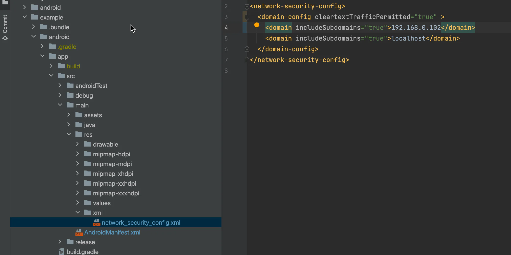

# 本地url

## 目录

- [android](#android)
- [net::ERR\_CLEARTEXT\_NOT\_PERMITTED](#netERR_CLEARTEXT_NOT_PERMITTED)

# android

1. 这一步是必须的，否则的话， WebView 加载不出来，手机界面会提示 Webpage not available。

AndroidManifest.xml

 清单文件中添加：

```javascript 
<uses-permission android:name="android.permission.INTERNET" />
<uses-permission android:name="android.permission.ACCESS_NETWORK_STATE" />
<uses-permission android:name="android.permission.ACCESS_WIFI_STATE" />
```


2.添加了权限之后，网页可能还是加载不出来，可能是因为对未加密的流量不信任，在 AndroidManifest.xml

的 application中添加一个属性：android:usesCleartextTraffic="true"。如下：

```javascript 
<?xml version="1.0" encoding="utf-8"?>   
<manifest ...>       
  <application            
    ...        
    android:usesCleartextTraffic="true"
  > 
   ...       
  </application>
</manifest>
```


# net::ERR\_CLEARTEXT\_NOT\_PERMITTED

[ net::ERR\_CLEARTEXT\_NOT\_PERMITTED 处理\_err cleartext not permitted-CSDN博客 文章浏览阅读7.4k次，点赞3次，收藏5次。安卓打包成功apk后显示net::ERR\_CLEARTEXT\_NOT\_PERMITTED1.网上查询各种方法，统一提示“在Android 的mainfest.xml中的application添加一句配置  android:usesCleartextTraffic=“true”   ”。以下是我项目文件mainfest.xml路径\<?xml version https://blog.csdn.net/wangjiecsdn/article/details/105864308](https://blog.csdn.net/wangjiecsdn/article/details/105864308 " net::ERR_CLEARTEXT_NOT_PERMITTED 处理_err cleartext not permitted-CSDN博客 文章浏览阅读7.4k次，点赞3次，收藏5次。安卓打包成功apk后显示net::ERR_CLEARTEXT_NOT_PERMITTED1.网上查询各种方法，统一提示“在Android 的mainfest.xml中的application添加一句配置  android:usesCleartextTraffic=“true”   ”。以下是我项目文件mainfest.xml路径<?xml version https://blog.csdn.net/wangjiecsdn/article/details/105864308")



```javascript 
<?xml version="1.0" encoding="utf-8"?>
<network-security-config>
    <base-config cleartextTrafficPermitted="true">
        <trust-anchors>
            <certificates src="system" />
        </trust-anchors>
    </base-config>
    <domain-config cleartextTrafficPermitted="true">
         <domain includeSubdomains="true">localhost</domain>
        <domain includeSubdomains="true">YOUR DOMAIN HERE/IP</domain> 
    </domain-config>
</network-security-config>
```
