# wechat

## 目录

- [前置环境](#前置环境)
- [安装配置](#安装配置)
  - [3.1.进入根目录安装：](#31进入根目录安装)
  - [3.2.Android版本安装配置方法](#32Android版本安装配置方法)
    - [在android/settings.gradle文件下添加以下代码：](#在androidsettingsgradle文件下添加以下代码)
    - [在android/app/build.gradle的dependencies部分添加以下代码：](#在androidappbuildgradle的dependencies部分添加以下代码)
    - [在MainActivity.java或者MainApplication.java（我是配置了在这个文件内）文件中添加以下代码：](#在MainActivityjava或者MainApplicationjava我是配置了在这个文件内文件中添加以下代码)
    - [在AndroidManifest.xml添加声明](#在AndroidManifestxml添加声明)
    - [在proguard-rules.pro中添加(代码为混淆设置)：](#在proguard-rulespro中添加代码为混淆设置)
  - [接下来看手动配置方法：](#接下来看手动配置方法)
    - [1.点击Libraries右侧的ADD Files to](#1点击Libraries右侧的ADD-Files-to)
    - [2.在工程Build Phases ➜ Link Binary With Libraries中添加libRCTWeChat.a](#2在工程Build-Phases--Link-Binary-With-Libraries中添加libRCTWeChata)
    - [3.在工程target的Build Phases->Link Binary with Libraries中加入下面库文件：](#3在工程target的Build-Phases-Link-Binary-with-Libraries中加入下面库文件)
    - [4.在TARGETS 下项目名 -> info ,添加我们申请得到的微信 AppId填写在 "URL type"的"URL Schema"处，ldentifier填写为：weixin](#4在TARGETS-下项目名---info-添加我们申请得到的微信-AppId填写在-URL-type的URL-Schema处ldentifier填写为weixin)
    - [5.iOS9 以上，添加 微信白名单](#5iOS9-以上添加-微信白名单)
    - [6.在项目的AppDelegate.m添加以下代码，启动\[LinkingIOS\]](#6在项目的AppDelegatem添加以下代码启动LinkingIOS)
- [插件使用：](#插件使用)
  - [API](#API)
  - [使用案例：](#使用案例)
    - [1.注册：](#1注册)
    - [2.检测安装：](#2检测安装)
    - [3.分享：](#3分享)
    - [4.微信好友分享链接](#4微信好友分享链接)
    - [5.微信朋友圈分享的文本](#5微信朋友圈分享的文本)
    - [6.微信朋友圈分享的链接'](#6微信朋友圈分享的链接)
    - [ 7.支付](#7支付)
    - [ 8.授权登陆](#8授权登陆)

[https://www.jianshu.com/p/6a792118fae4](https://www.jianshu.com/p/6a792118fae4 "https://www.jianshu.com/p/6a792118fae4")

&#x20;参考资料

# 前置环境

首先微信开发平台去注册账号并且创建一个移动应用。(地址:

<https://open.weixin.qq.com>

)

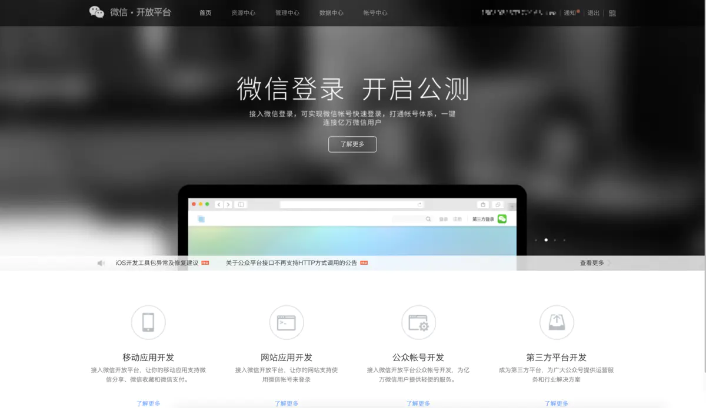

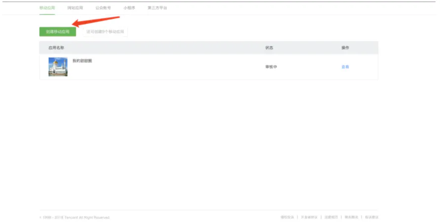

将所必填的信息填写完整，应用名称以及中英文（英文是选填的）的信息，移动应用图标分别为28x28何108x108的png格式图标。

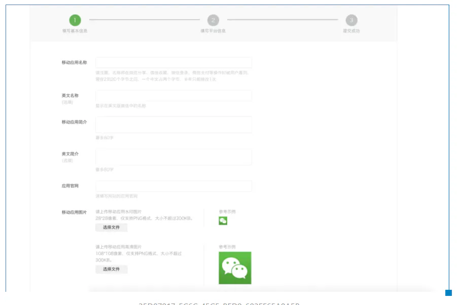

继续点击下一步填写iOS项目的bundle ID以及android项目的包名和应用签名。请注意应用签名获取需要安装一下获取签名信息的APK包，同时你的android应用也需要打包以后安装在手机上面，这样再去获取。具体获取方式见下面的图

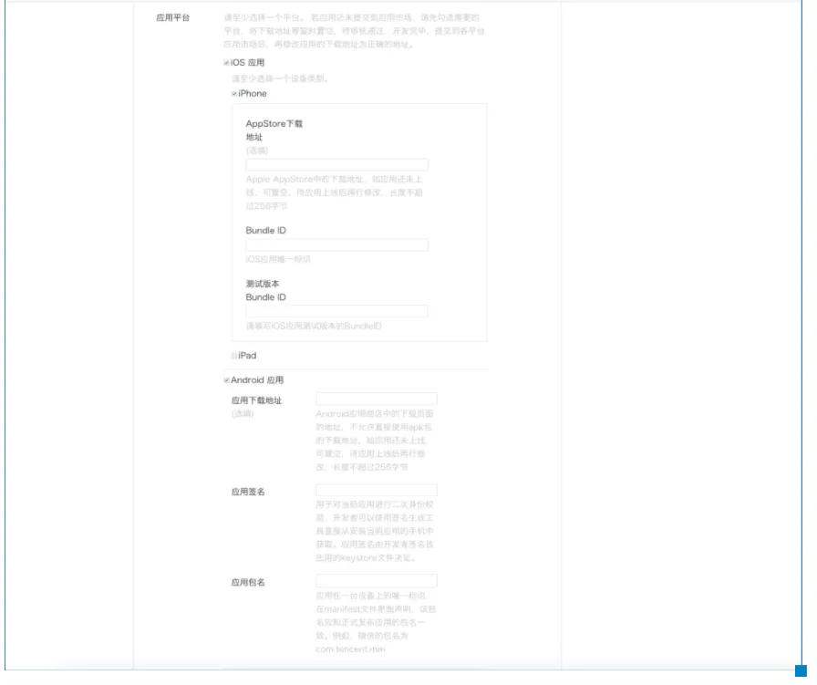

下载获取第三方应用的签名信息apk

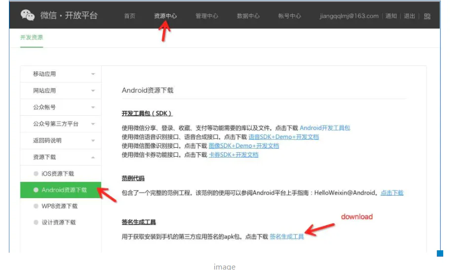

下载安装上面的签名信息包apk,然后在上面输入android项目的包名，点击获取签名信息

android项目的包名路径:android/app/build.gradle中的applicationId标签数据。

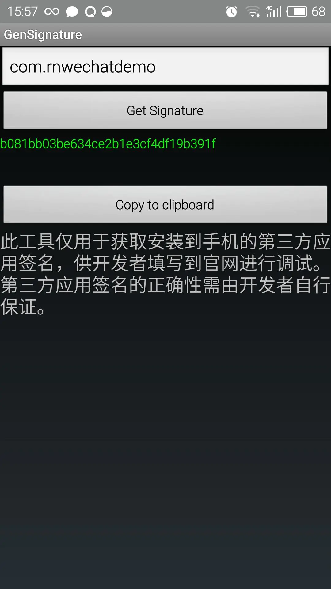

把上面的签名信息填写到下面的网页上面,点击提交审核即可。然后就是等待吧，官方说是7个工作日，不过一般也就是几个小时就可以通过审核了吧。

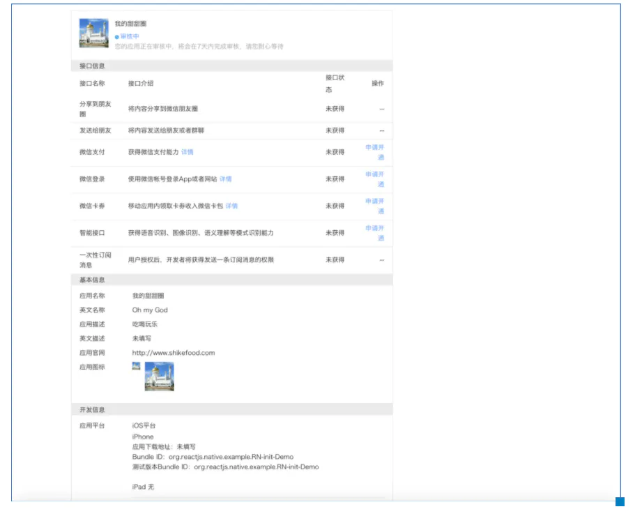

# 安装配置

官放项目地址:

[https://github.com/weflex/react-native-wechat](https://github.com/weflex/react-native-wechat "https://github.com/weflex/react-native-wechat")

该库不仅支持微信分享，还支持微信登录，收藏以及微信支付的。但登录，支付之类的功能需要开通开发者认证权限，需要300元一年。

## 3.1.进入根目录安装：

npm install react-native-wechat --save

## 3.2.Android版本安装配置方法

#### 在android/settings.gradle文件下添加以下代码：

include ':RCTWeChat'

project(':RCTWeChat').projectDir = new File(rootProject.projectDir, '../node\_modules/react-native-wechat/android')

#### 在android/app/build.gradle的dependencies部分添加以下代码：

dependencies {

compile project(':RCTWeChat')

}

#### 在MainActivity.java或者MainApplication.java（我是配置了在这个文件内）文件中添加以下代码：

import com.theweflex.react.WeChatPackage;

@Override

protected List\<ReactPackage> getPackages() {

return Arrays.\<ReactPackage>asList(

...

new WeChatPackage()

);

}

如下图所示：

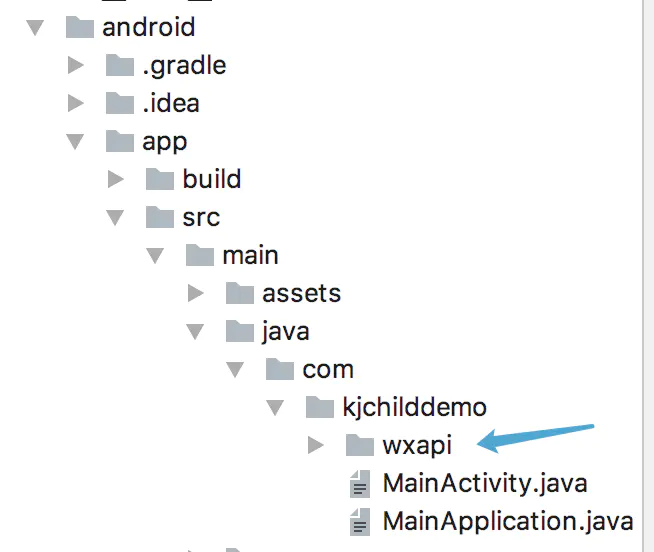

创建名为'wxapi'的文件夹，并在文件夹内创建WXEntryActivity.java，用于获得微信的授权和分享权限。

WXEntryActivity.java代码：

package your.package.wxapi;

import android.app.Activity;

import android.os.Bundle;

import com.theweflex.react.WeChatModule;

public class WXEntryActivity extends Activity {

@Override

protected void onCreate(Bundle savedInstanceState) {

super.onCreate(savedInstanceState);

WeChatModule.handleIntent(getIntent());

finish();

}

}

创建名为'wxapi'的文件夹，并在文件夹内创建WXPayEntryActivity.java，用于获得微信的授权和支付权限。

WXPayEntryActivity.java代码

package your.package.wxapi;

import android.app.Activity;

import android.os.Bundle;

import com.theweflex.react.WeChatModule;

public class WXPayEntryActivity extends Activity {

@Override

protected void onCreate(Bundle savedInstanceState) {

super.onCreate(savedInstanceState);

WeChatModule.handleIntent(getIntent());

finish();

}

}

#### 在AndroidManifest.xml添加声明

\<manifest>

\<application>

\<activity

android:name=".wxapi.WXEntryActivity"

android:label="@string/app\_name"

android:exported="true"

/>

\<activity

android:name=".wxapi.WXPayEntryActivity"

android:label="@string/app\_name"

android:exported="true"

/>

\</application>

\</manifest>

#### 在proguard-rules.pro中添加(代码为混淆设置)：

-keep class com.tencent.mm.sdk.\*\* {

\*;

}

ios配置

自动配置执行以下命令：

react-native link react-native-wechat

react-native-wechat ios dependency

本人不推荐自动配置，因为会报以下错误：

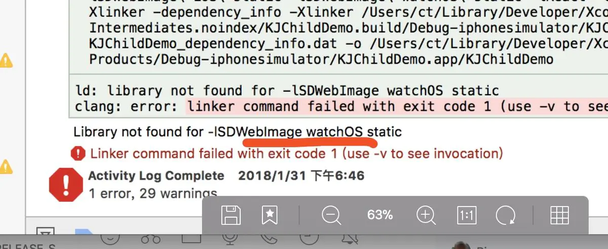

## 接下来看手动配置方法：

### 1.点击Libraries右侧的ADD Files to

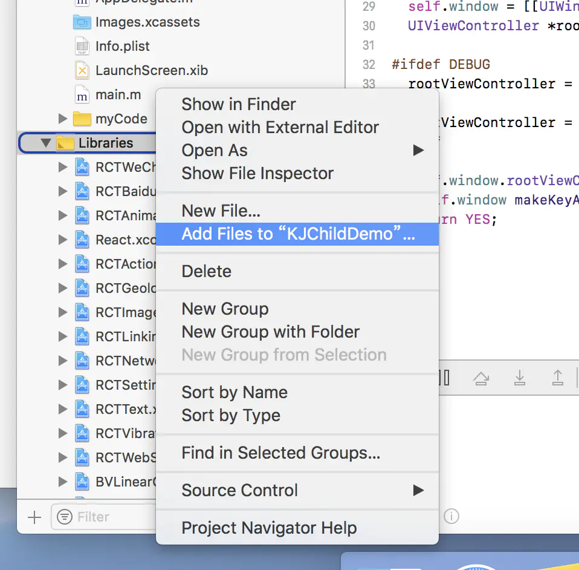

选择如下内容：

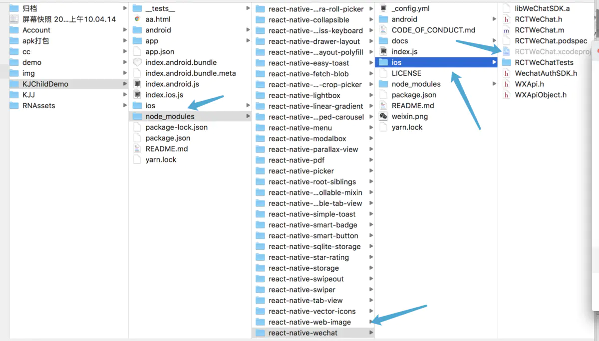

### 2.在工程Build Phases ➜ Link Binary With Libraries中添加libRCTWeChat.a

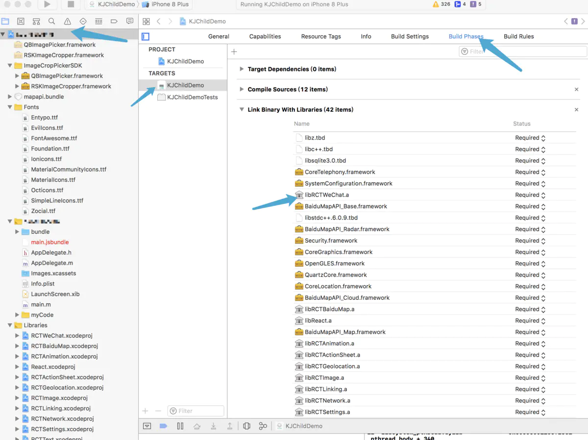

### 3.在工程target的Build Phases->Link Binary with Libraries中加入下面库文件：

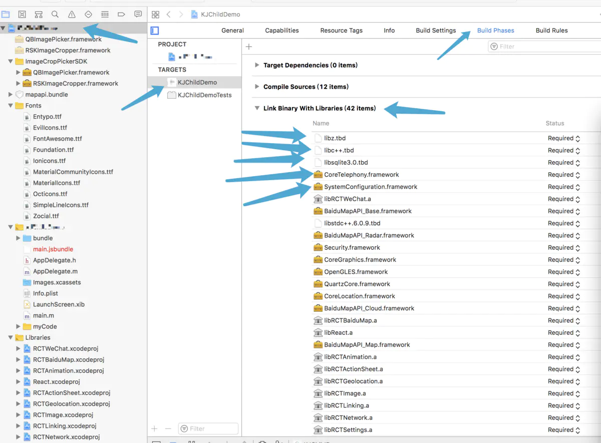

SystemConfiguration.framework

CoreTelephony.framework

libsqlite3.0

libc++

libz

### 4.在TARGETS 下项目名 -> info ,添加我们申请得到的微信 AppId填写在 "URL type"的"URL Schema"处，ldentifier填写为：weixin

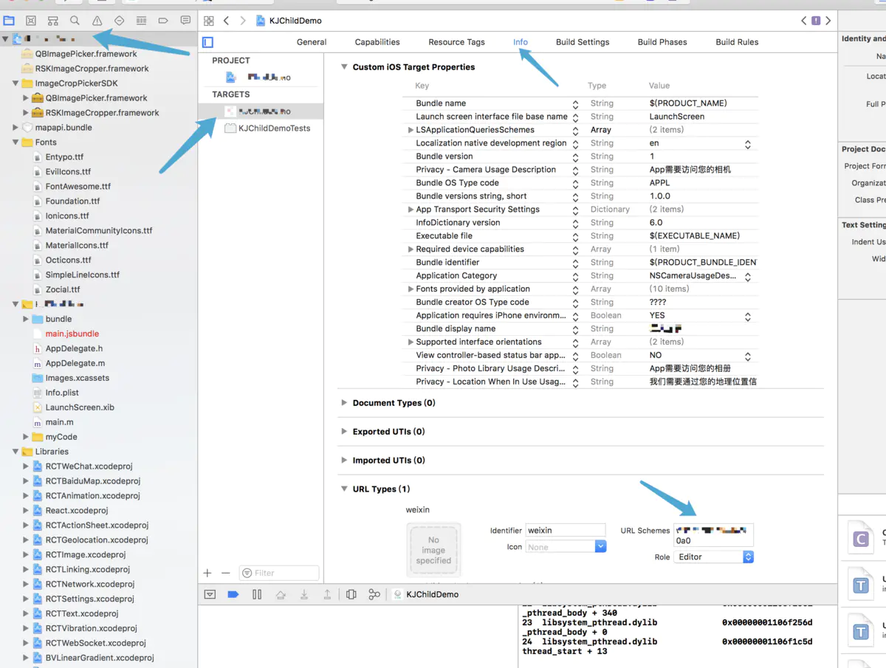

### 5.iOS9 以上，添加 微信白名单

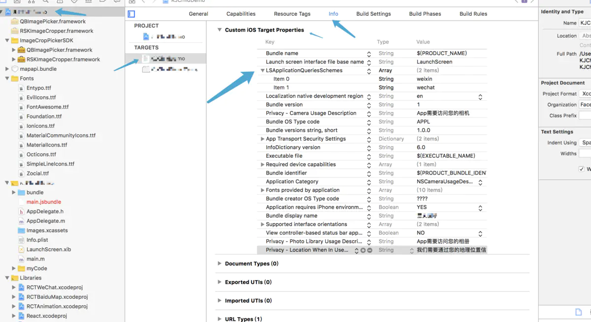

### 6.在项目的AppDelegate.m添加以下代码，启动\[LinkingIOS]

\#import \<React/RCTLinkingManager.h>

\- (BOOL)application:(UIApplication \*)application openURL:(NSURL \*)url

sourceApplication:(NSString \*)sourceApplication annotation:(id)annotation

{

return \[RCTLinkingManager application:application openURL:url

sourceApplication:sourceApplication annotation:annotation];

}

# 插件使用：

总结：

[https://github.com/yorkie/react-native-wechat](https://github.com/yorkie/react-native-wechat "https://github.com/yorkie/react-native-wechat")

   github 地址

[https://www.jianshu.com/p/3f424cccb888](https://www.jianshu.com/p/3f424cccb888 "https://www.jianshu.com/p/3f424cccb888")

     简书  比较详细

    引入import \* as weChat react-native-wechat ；

在微信开放平台穿件移动应用；原生方面：andorid 和 ios 需要进行配置 ------前置环境搭建非常重要

## API

- registerApp(appid) ：注册APP
- registerAppWithDescription(appid, appdesc) ： 注册APP（仅支持iOS）
- isWXAppInstalled() ：检查微信是否安装
- isWXAppSupportApi()
- getApiVersion() ：获得微信SDK的版本
- openWXApp() ：打开微信APP
- sendAuthRequest(\[scope\[, state]]) ：发送微信登录授权
- shareToTimeline(data) ： 分享到朋友圈
- shareToSession(data) ：分享到朋友
- pay(data) ：调用微信支付
- addListener(eventType, listener\[, context]) ：监听状态
- once(eventType, listener\[, context]) ：监听状态
- removeAllListeners() ：移除所有监听

## 使用案例：

### 1.注册：

        WeChat.registerApp('你的appid');

### 2.检测安装：

   WeChat.isWXAppInstalled()

        .then((isInstalled) => {

            if (isInstalled) {

            } else {

                Alert.alert('请安装微信');

            }

        });     

### 3.分享：

            微信好友分享的文本

     WeChat.shareToSession({type: 'text', description: '测试微信好友分享的文本内容'})

           .catch((error) => {

               Alert.alert(error.message);

           });  

### 4.微信好友分享链接

     WeChat.shareToSession({

        title:'微信好友测试的链接',

        description: '分享的标题内容',

        thumbImage: '分享的标题图片',

        type: 'news',

        webpageUrl: '分享的链接'

    })

    .catch((error) => {

        Alert.alert(error.message);

    });

### 5.微信朋友圈分享的文本

   WeChat.shareToTimeline({type: 'text', description: '测试微信朋友圈分享的文本内容'})

        .catch((error) => {

            Alert.alert(error.message);

        }); 

### 6.微信朋友圈分享的链接'

    WeChat.shareToTimeline({

        title:'分享的标题',

        description: '分享的标题内容',

        thumbImage: '分享的标题图片',

        type: 'news',

        webpageUrl: '分享的链接'

    })

    .catch((error) => {

        Alert.alert(error.message);

    });   

###  7.支付

        微信支付

    WeChat.pay({

        partnerId: 'xxxxxx',  // 商家向财付通申请的商家id

        prepayId: 'xxxxxx',   // 预支付订单

        nonceStr:'xxxxxx',   // 随机串，防重发

        timeStamp: 'xxxxxxx'    ,  // 时间戳，防重发.

        package: 'Sign=WXPay',    // 商家根据财付通文档填写的数据和签名

        sign: 'xxxxxxxxx'       // 商家根据微信开放平台文档对数据做的签名

    }).then((requestJson)=>{

                //支付成功回调                                           

        if (requestJson.errCode=="0"){

        //回调成功处理

        }

    }).catch((err)=>{

        Alert.alert('支付失败')

    })

###  8.授权登陆

   //微信登录示例

WXLogin = () => {

  let scope = 'snsapi\_userinfo';

  let state = 'wechat\_sdk\_demo';

  //判断微信是否安装

  wechat.isWXAppInstalled()

    .then((isInstalled) => {

      if (isInstalled) {

        //发送授权请求

        wechat.sendAuthRequest(scope, state)

          .then(responseCode => {

            //返回code码，通过code获取access\_token

            this.getAccessToken(responseCode.code);

          })

          .catch(err => {

            Alert.alert('登录授权发生错误：', err.message, \[

              {text: '确定'}

            ]);

          })

      } else {

        Platform.OS == 'ios' ?

          Alert.alert('没有安装微信', '是否安装微信？', \[

            {text: '取消'},

            {text: '确定', onPress: () => this.installWechat()}

          ]) :

          Alert.alert('没有安装微信', '请先安装微信客户端在进行登录', \[

            {text: '确定'}

          ])

      }

    })

};
