# CodePush 热更新

## 目录

- [RN中⽂文⽹网的Pushy：](#RN中文网的Pushy)
- [微软的CodePush](#微软的CodePush)
- [CodePush热更新组件详细接入教程](#CodePush热更新组件详细接入教程)
  - [什么是CodePush](#什么是CodePush)
  - [接入流程](#接入流程)
  - [CodePush 接入示例Demo地址：https://github.com/guangqiang-liu/CodePushDemo](#CodePush-接入示例Demo地址httpsgithubcomguangqiang-liuCodePushDemo)
    - [1、安装 CodePush CLI](#1安装-CodePush-CLI)
    - [2、注册 CodePush账号](#2注册-CodePush账号)
    - [3、在CodePush服务器注册App](#3在CodePush服务器注册App)
    - [4、RN代码中集成CodePush](#4RN代码中集成CodePush)
    - [5、原生应用中配置CodePush](#5原生应用中配置CodePush)
      - [配置iOS平台](#配置iOS平台)
      - [配置Android平台](#配置Android平台)
    - [6、发布更新的版本](#6发布更新的版本)
      - [更新时机](#更新时机)
      - [更新是否强制](#更新是否强制)
      - [更新是否要求即时](#更新是否要求即时)
      - [如何发布CodePush更新包](#如何发布CodePush更新包)
  - [注意事项](#注意事项)
- [app.js](#appjs)
- [demo](#demo)
- [私有化部署](#私有化部署)
  - [code-push-server](#code-push-server)

**热更新**

免费的热更更新⽅方案：微软的CodePush，RN中⽂文⽹网的Pushy

[React Native课程大纲-Day4【瑞客论坛 www.ruike1.com】.pdf](<https://github.com/scZhengChao/IT_Blogs/releases/download/assets-v1/React.Native.-Day4.www.ruike1.com._PzDMhxj.pdf> "React Native课程大纲-Day4【瑞客论坛 www.ruike1.com】.pdf")

[ ReactNative热更新发布应用(方式二CodePush:react-native-code-push) 前言：这里发布应用是配置热更新成功的前提下\~ 注：我们所说的根目录指的是package.json所在的目录\~ 先看一下流程图： 流程： 在根目录里右键-新建文件夹-bundl... https://www.jianshu.com/p/34d419448f44](https://www.jianshu.com/p/34d419448f44 " ReactNative热更新发布应用(方式二CodePush:react-native-code-push) 前言：这里发布应用是配置热更新成功的前提下~ 注：我们所说的根目录指的是package.json所在的目录~ 先看一下流程图： 流程： 在根目录里右键-新建文件夹-bundl... https://www.jianshu.com/p/34d419448f44")

# **RN中⽂文⽹网的Pushy：**

本节课我们使⽤用RN官⽅方推荐的Pushy热更更新服务 

react-native-update

    本组件是⾯面向 React Native 提供热更更新功能的组件，根据RN版本安装对应版本，如果你的RN是0.46以 上，就需要安装react-native-update 5.x版本

React Native版本 react-native-update版本

    0.26及以下 1.0.x

    0.27 - 0.28 2.x

    0.29 - 0.33 3.x

    0.34 - 0.45 4.x

    0.46及以上 5.x

# **微软的CodePush**

[https://blog.csdn.net/zcmain/article/details/89517634](https://blog.csdn.net/zcmain/article/details/89517634 "https://blog.csdn.net/zcmain/article/details/89517634")

[https://www.jianshu.com/p/6a5e00d22723](https://www.jianshu.com/p/6a5e00d22723 "https://www.jianshu.com/p/6a5e00d22723")     一篇非常详细的 文章 易懂

[https://www.jianshu.com/p/3f60da14edd9](https://www.jianshu.com/p/3f60da14edd9 "https://www.jianshu.com/p/3f60da14edd9")    进阶codePush

[https://www.cnblogs.com/guangqiang/p/9589404.html](https://www.cnblogs.com/guangqiang/p/9589404.html "https://www.cnblogs.com/guangqiang/p/9589404.html")   跟新进度

[https://www.jianshu.com/p/3f15ba5bd57f](https://www.jianshu.com/p/3f15ba5bd57f "https://www.jianshu.com/p/3f15ba5bd57f")    React-Native-Code-Push  项目配置及更新策略

[https:///](https: "https:///") [https://www.jianshu.com/p/6befb6eb6a6c](https://www.jianshu.com/p/6befb6eb6a6c "https://www.jianshu.com/p/6befb6eb6a6c")   code-push 集成 android statio

```纯文本 
 ios： 
 Name         Deployment Key                          
 Production   PEAb1yL5GxjtVYOxMp8kGmvp7lOzjSykbjtyBz  
 Staging      gzVSUzBgOVoZqmc5ybyvfm_d27TcjDb6gXJXR 
 
 android： 
 Name           Deployment Key                          
 Production     wSrZKcZErACA40jydR5MxgfyicXu_Cq2EEQxSE  
 Staging        p3OU_AKIhct0l1315yesLzlkhcQ6mjwIFNQLp 
 
 
 * code-push login 登陆 
 * code-push loout 注销 
 * code-push access-key ls 列出登陆的token 
 * code-push access-key rm <accessKye>     删除某个 access-key 
 
 $ code-push app add iOSRNHybrid ios react-native   添加iOS平台应用 
 $ code-push app add iOSRNHybridForAndroid Android react-native  添加Android平台应用 
 
 * code-push app add 在账号里面添加一个新的app 
 * code-push app remove 或者 rm 在账号里移除一个app 
 * code-push app rename 重命名一个存在app 
 * code-push app list 或则 ls 列出账号下面的所有app 
 * code-push app transfer 把app的所有权转移到另外一个账号 
 
 生成bundle命令   
 $ react-native bundle --platform 平台 --entry-file 启动文件 --bundle-output 打包js输出文件 --assets-dest 资源输出目录 --dev 是否调试 
 $  react-native bundle --entry-file index.ios.js --bundle-output ./bundle/ios/main.jsbundle --platform ios --assets-dest ./bundle/ios --dev false 
 
 * 将生成的bundle文件上传到CodePush，我们直接执行下面的命令即可(热更新) 
 $ code-push release-react <Appname> <Platform> --t <本更新包面向的旧版本号> --des <本次更新说明>  --dev 是否调试 
      CodePush默认是更新Staging 环境的，如果发布生产环境的更新包，需要指定--d参数：--d Production，如果发布的是强制更新包，需要加上 --m true强制更新 
 $  code-push release-react iOSRNHybrid ios --t 1.0.0 --dev false --d Production --des "这是第一个更新包" --m true 
 通过code-push release-react发布更新,这种方式将打包与发布两个命令合二为一,简化了操作流程，常用的就是这种方式，可以规避很多问题 
 复杂先打包后发布，2个步骤，两个命令： 
 
 1、 打包bundle文件 
 单纯打包bundle，如果不打包资源，在更新成功后会加载不到图片资源，所以基本不用此命令 
 react-native bundle --platform android --entry-file index_message.js --bundle-output ./android/bundles/index.android_message.bundle --dev false 
 打包bundles + 图片资源 
 react-native bundle --platform android --entry-file index_message.js --bundle-output ./android/bundles/index.android_message.bundle --assets-dest ./android/bundles/ --dev false 
 
 2、codePush发布命令： 
 code-push release <appName> <updateContentsPath> <targetBinaryVersion> [options] 
 例子： 
 code-push release bwt-android ./android/bundles 6.1.1 --deploymentName Production  --description "1.测试消" --mandatory true 
     1在发布的时候 指定的路径需要指定文件夹，不能指定到bundle，否则资源文件未上传在热更成功后会找不到图片 
     2在窗口中输入code-push release命令可以看到详细说明，可以自定义配置。 
     3版本号填写的应该是android工程的apk版本号，意思是指定在该版本上热更新，而不是热更的版本。 
 
 
 
 查看发布的历史记录，命令如下 
 查询Production 
       $ code-push deployment history projectName Production 
 查询Staging 
      $ code-push deployment history projectName Staging 
 
 查询app的key 
 查询Staging和Production的Key值： 
      code-push deployment ls App名称 -k 
 
 
 iOSRNHybrid 
 AndroidRNHybrid
```


**记一笔：这个地方心累；不懂android架构代码；报错只好网上找代码；很多过时的；感谢开源；感谢分享；太不容易了**

[**https://www.jianshu.com/p/a8cd94a7f8b3**](https://www.jianshu.com/p/a8cd94a7f8b3 "https://www.jianshu.com/p/a8cd94a7f8b3")\*\*    参考资料\*\*​

[**https://blog.csdn.net/weixin\_33895016/article/details/92001494**](https://blog.csdn.net/weixin_33895016/article/details/92001494 "https://blog.csdn.net/weixin_33895016/article/details/92001494")

android 平台配置：注意:

1. 在android/settings.gradle文件中添加下列代码，

一定要按着这个添加，不要想当然 觉得你的想法一样；不然报错你找不到原因

```纯文本 
 include ':app', ':react-native-code-push'project(':react-native-code-push').projectDir = new File(rootProject.projectDir, '../node_modules/react-native-code-push/android/app')
```


1. 在android/app/build.gradle文件中添加下列代码

```纯文本 
 ... 
 apply from: "../../node_modules/react-native/react.gradle" 
 apply from: "../../node_modules/react-native-code-push/android/codepush.gradle" 
 ...
```


- 在android { buildTypes {} }中，给配置环境添加CodePush的秘钥

```纯文本 
 android { 
     ... 
     buildTypes { 
         debug { 
             ... 
             // 注意：不应该在Debug模式下测试CodePush更新功能，因为这会被RN的程序所覆盖 
             resValue "string", "CodePushDeploymentKey", '""' 
             ... 
         } 
         releaseStaging { 
             ... 
             // StagingKey是CodePush处申请的Staging状态的下的秘钥 
             resValue "string", "CodePushDeploymentKey", '"StagingKey"' 
 
             // Note: It is a good idea to provide matchingFallbacks for the new buildType you create to prevent build issues 
             // Add the following line if not already there 
             matchingFallbacks = ['release'] 
             ... 
         } 
 
         release { 
             ... 
             // ProductionKey是CodePush处申请的Production状态的下的秘钥 
             resValue "string", "CodePushDeploymentKey", '"ProductionKey"' 
             ... 
         } 
     } 
     ...}
```


1. 更新MainApplication.java文件

```javascript 
 ...// 1. 导入插件import com.microsoft.codepush.react.CodePush; 
 
 public class MainApplication extends Application implements ReactApplication { 
     private final ReactNativeHost mReactNativeHost = new ReactNativeHost(this) { 
         ... 
         // 2. 重写getJSBundleFile方法，让CodePush确定从App哪里获取JS包 
         @Override 
         protected String getJSBundleFile() { 
             return CodePush.getJSBundleFile(); 
         } 
     };}
```


# CodePush热更新组件详细接入教程

## 什么是CodePush

> CodePush是一个微软开发的云服务器。通过它，开发者可以直接在用户的设备上部署手机应用更新。CodePush相当于一个中心仓库，开发者可以推送当前的更新（包括JS/HTML/CSS/IMAGE等）到CoduPush，然后应用将会查询是否有更新。

## 接入流程

- 安装 CodePush CLI
- 注册 CodePush账号
- 在CodePush服务器注册App
- RN代码中集成CodePush
- 原生应用中配置CodePush
- 发布更新的版本

## CodePush 接入示例Demo地址：[https://github.com/guangqiang-liu/CodePushDemo](https://github.com/guangqiang-liu/CodePushDemo "https://github.com/guangqiang-liu/CodePushDemo")

### 1、安装 CodePush CLI

> 安装CodePush指令，直接在终端上输入如下命令即可，注意：这个CodePush指令只需要全局安装一次即可，如果第一次安装成功了，那后面就不在需要安装

\$ npm install -g code-push-cli

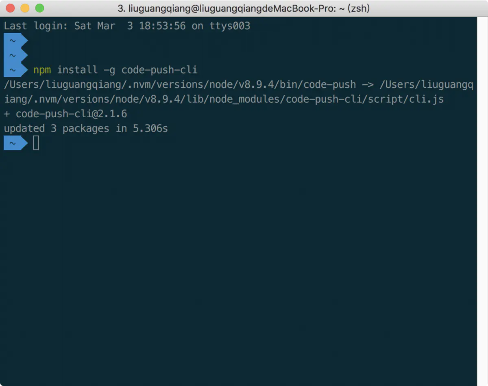

### 2、注册 CodePush账号

> 注册CodePush账号也很简单，同样是只需简单的执行下面的命令，同样这个注册操作也是全局只需要注册一次即可

\$ code-push register

注意：

当执行完上面的命令后，会自动打开一个授权网页，让你选择使用哪种方式进行授权登录，这里我们统一就选择使用GitHub即可

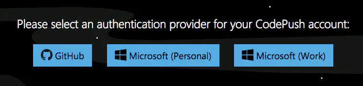

当注册成功后，CodePush会给我们一个key

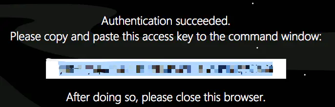

我们直接复制这个key，然后在终端中将这个key填写进去即可，填写key登录成功显示效果如下

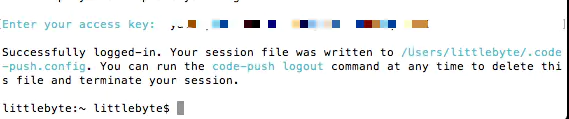

我们使用下面的命令来验证我的登录是否成功

\$ code-push login

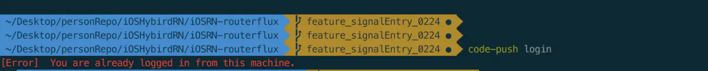

CodePush注册登录相关命令：

- code-push login 登陆
- code-push loout 注销
- code-push access-key ls 列出登陆的token
- code-push access-key rm \<accessKye> 删除某个 access-key

### 3、在CodePush服务器注册App

> 为了让CodePush服务器有我们的App，我们需要CodePush注册App，输入下面命令即可完成注册，这里需要注意如果我们的应用分为iOS和Android两个平台，这时我们需要分别注册两套key
> 应用添加成功后就会返回对应的production 和 Staging 两个key，production代表生产版的热更新部署，Staging代表开发版的热更新部署，在ios中将staging的部署key复制在info.plist的CodePushDeploymentKey值中，在android中复制在Application的getPackages的CodePush中

*添加iOS平台应用*

```javascript 
$ code-push app add iOSRNHybrid ios react-native
```


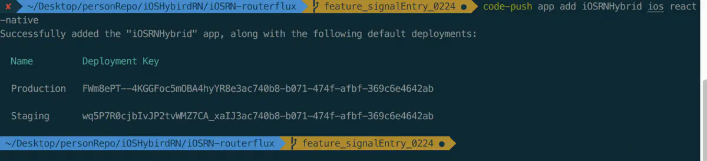

*添加Android平台应用*

```javascript 
$ code-push app   add  iOSRNHybridForAndroid Android react-native
```


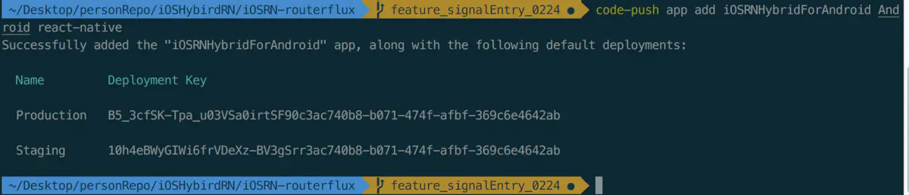

我们可以输入如下命令来查看我们刚刚添加的App

```javascript 
$ code-push app list
```


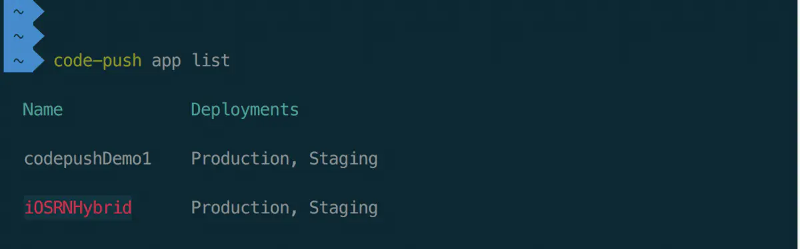

image

CodePush管理App的相关命令：

- code-push app add 在账号里面添加一个新的app
- code-push app remove 或者 rm 在账号里移除一个app
- code-push app rename 重命名一个存在app
- code-push app list 或则 ls 列出账号下面的所有app
- code-push app transfer 把app的所有权转移到另外一个账号

### 4、RN代码中集成CodePush

> 首先我们需要安装CodeoPush组件，然后通过link命令添加原生依赖，最后在RN根组件中添加热更新逻辑代码

*安装组件*

```javascript 
$ npm install react-native-code-push --save
```


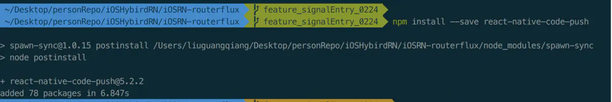

*添加原生依赖，这里添加依赖我们使用自动添加依赖的方式*

```javascript 
$ react-native link react-native-code-push
```


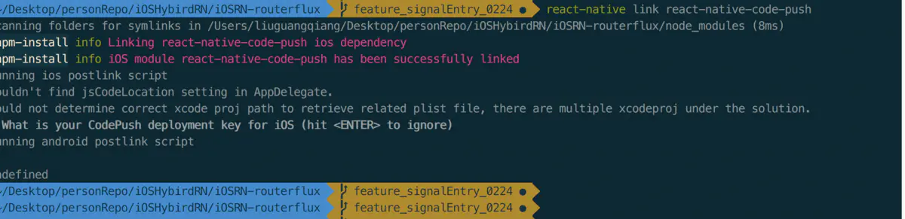

*我们在RN项目的根组件中添加热更新逻辑代码如下*

```javascript 
 import React, { Component } from 'react'; 
 import { 
     Platform, 
     StyleSheet, 
     Text, 
     View 
 } from 'react-native'; 
 import CodePush from "react-native-code-push"; // 引入code-push 
 let codePushOptions = { 
     //设置检查更新的频率 
     //ON_APP_RESUME APP恢复到前台的时候 
     //ON_APP_START APP开启的时候 
     //MANUAL 手动检查 
     checkFrequency : CodePush.CheckFrequency.ON_APP_RESUME 
 }; 
 const instructions = Platform.select({ 
     ios: 'Press Cmd+R to reload,\n' + 
 'Cmd+D or shake for dev menu', 
     android: 'Double tap R on your keyboard to reload,\n' + 
 'Shake or press menu button for dev menu', 
 }); 
 type Props = {}; 
 class App extends Component<Props> { 
 
     //如果有更新的提示 
     syncImmediate() { 
         CodePush.sync( { 
             //安装模式 
             //ON_NEXT_RESUME 下次恢复到前台时 
             //ON_NEXT_RESTART 下一次重启时 
             //IMMEDIATE 马上更新 
             installMode : CodePush.InstallMode.IMMEDIATE , 
              //对话框 
             updateDialog : { 
                 //是否显示更新描述 
                 appendReleaseDescription : true , 
                 //更新描述的前缀。 默认为"Description" 
                 descriptionPrefix : "更新内容：" , 
                 //强制更新按钮文字，默认为continue 
                 mandatoryContinueButtonLabel : "立即更新" , 
                 //强制更新时的信息. 默认为"An update is available that must be installed." 
                 mandatoryUpdateMessage : "必须更新后才能使用" , 
                 //非强制更新时，按钮文字,默认为"ignore" 
                 optionalIgnoreButtonLabel : '稍后' , 
                 //非强制更新时，确认按钮文字. 默认为"Install" 
                 optionalInstallButtonLabel : '后台更新' , 
                 //非强制更新时，检查到更新的消息文本 
                 optionalUpdateMessage : '有新版本了，是否更新？' , 
                 //Alert窗口的标题 
                 title : '更新提示' 
             } , 
         }); 
     } 
     componentWillMount() { 
         CodePush.disallowRestart();//禁止重启 
         this.syncImmediate(); //开始检查更新 
     } 
     componentDidMount() { 
         CodePush.allowRestart();//在加载完了，允许重启 
     } 
     render() { 
         return ( 
            <View style={styles.container}> 
                 <Text style={styles.welcome}> 
                     Welcome to React Native! 
                 </Text> 
                 <Text style={styles.instructions}> 
                     To get started, edit App.js 
                 </Text> 
                 <Text style={styles.instructions}> 
                     {instructions} 
                 </Text> 
                 <Text style={styles.instructions}> 
                     这是更新的版本 
                 </Text> 
         </View> 
         ); 
     } 
 } 
 // 这一行必须要写 
 App = CodePush(codePushOptions)(App) 
 export default App     
 
 const styles = StyleSheet.create({ 
     container: { 
         flex: 1, 
         justifyContent: 'center', 
         alignItems: 'center', 
         backgroundColor: '#F5FCFF', 
     }, 
     welcome: { 
         fontSize: 20, 
         textAlign: 'center', 
         margin: 10, 
     }, 
     instructions: { 
         textAlign: 'center', 
         color: '#333333', 
         marginBottom: 5, 
     }, 
 })
```


### 5、原生应用中配置CodePush

> 这里原生应用中配置CodePush我们需要分别配置iOS平台和Android平台

#### 配置iOS平台

- 使用Xcode打开项目，Xcode的项目导航视图中的PROJECT下选择你的项目，选择Info页签 ，在Configurations节点下单击 + 按钮 ，选择Duplicate "Release Configaration，输入Staging

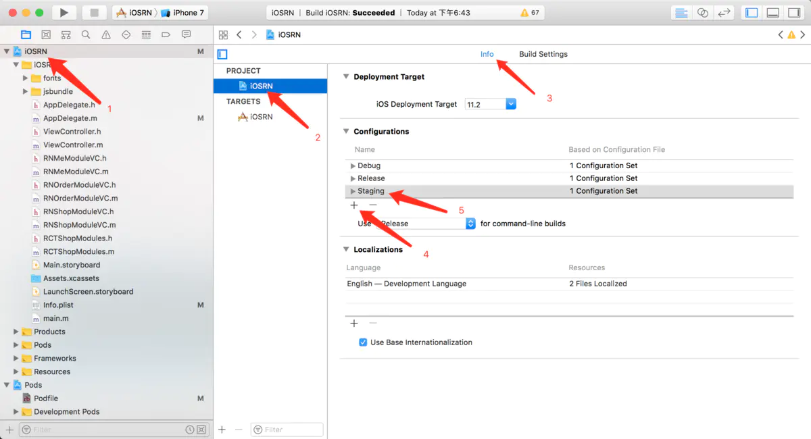

- 选择Build Settings tab，搜索Build Location -> Per-configuration Build Products Path -> Staging，将之前的值：\$(BUILD\_DIR)/\$(CONFIGURATION)\$(EFFECTIVE\_PLATFORM\_NAME) 改为：\$(BUILD\_DIR)/Release\$(EFFECTIVE\_PLATFORM\_NAME)

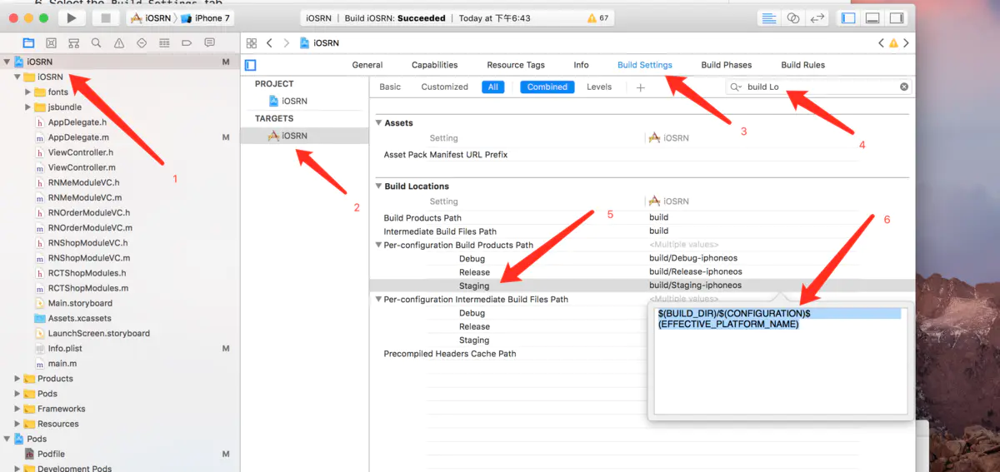

- 选择Build Settings tab，点击 + 号，选择Add User-Defined Setting，将key设置为CODEPUSH\_KEY，Release 和 Staging的值为前面创建的key，我们直接复制进去即可

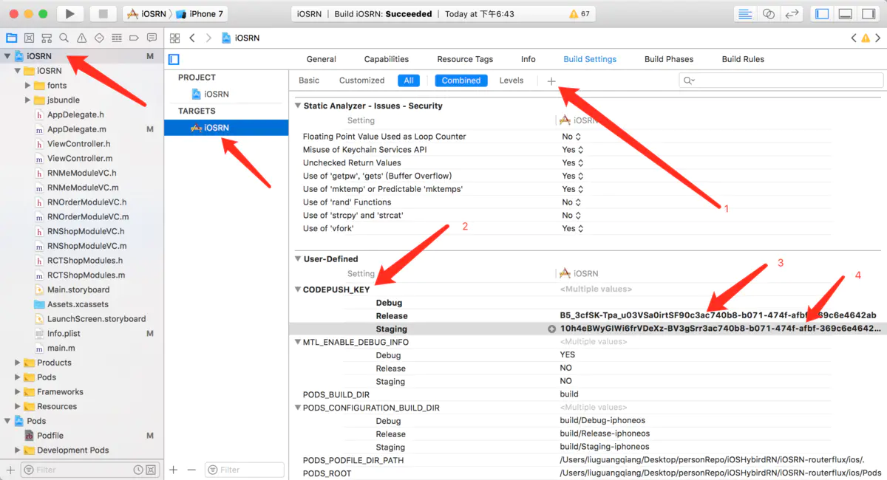

- 打开Info.plist文件，在CodePushDeploymentKey中输入\$(CODEPUSH\_KEY)，并修改Bundle versions为三位

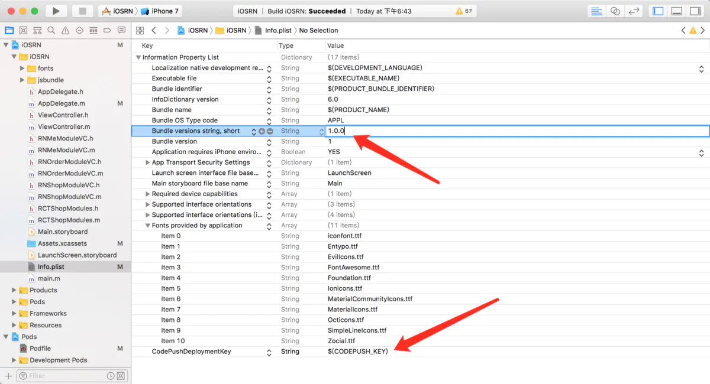

iOS平台CodePush环境集成完毕

#### 配置Android平台

### 6、发布更新的版本

> 在使用之前需要考虑的是检查更新时机，更新是否强制，更新是否要求即时等

#### 更新时机

> 一般常见的应用内更新时机分为两种，一种是打开App就检查更新，一种是放在设置界面让用户主动检查更新并安装

打开APP就检查更新

最为简单的使用方式在React Natvie的根组件的componentDidMount方法中通过

codePush.sync()（需要先导入codePush包：import codePush from 'react-native-code-push'）方法检查并安装更新，如果有更新包可供下载则会在重启后生效。不过这种下载和安装都是静默的，即用户不可见。如果需要用户可见则需要额外的配置。具体可以参考codePush官方API文档，部分代码，完整代码请参照文档上面

```纯文本 
 codePush.sync({ 
     updateDialog: { 
         appendReleaseDescription: true, 
         descriptionPrefix:'\n\n更新内容：\n', 
         title:'更新', 
         mandatoryUpdateMessage:'', 
         mandatoryContinueButtonLabel:'更新', 
     }, 
     mandatoryInstallMode:codePush.InstallMode.IMMEDIATE, 
     deploymentKey: CODE_PUSH_PRODUCTION_KEY, 
 });
```


        上面的配置在检查更新时会弹出提示对话框， mandatoryInstallMode表示强制更新，appendReleaseDescription表示在发布更新时的描述会显示到更新对话框上让用户可见

- 用户点击检查更新按钮
  在用户点击检查更新按钮后进行检查，如果有更新则弹出提示框让用户选择是否更新，如果用户点击立即更新按钮，则会进行安装包的下载（实际上这时候应该显示下载进度，这里省略了）下载完成后会立即重启并生效（也可配置稍后重启），部分代码如下

```javascript 
#### codePush.checkForUpdate(deploymentKey).then((update) => {

####     if (!update) {

####         Alert.alert("提示", "已是最新版本--", [

####             {

####                 text: "Ok", onPress: () => {

####                     console.log("点了OK");

####                 }

####             }

####         ]);

####     } else {

####         codePush.sync({

####             deploymentKey: deploymentKey,

####             updateDialog: {

####                 optionalIgnoreButtonLabel: '稍后',

####                 optionalInstallButtonLabel: '立即更新',

####                 optionalUpdateMessage: '有新版本了，是否更新？',

####                 title: '更新提示'

####             },

####             installMode: codePush.InstallMode.IMMEDIATE,

####         },

####         (status) => {

####             switch (status) {

####                 case codePush.SyncStatus.DOWNLOADING_PACKAGE:

####                     console.log("DOWNLOADING_PACKAGE");

####                     break;

####                 case codePush.SyncStatus.INSTALLING_UPDATE:

####                     console.log(" INSTALLING_UPDATE");

####                     break;

####                 }

####         },

####         (progress) => {

####             console.log(progress.receivedBytes + " of " + progress.totalBytes + " received.");

####             **注意这个地方的回调：不是立即执行的；亲测；因为更改过后的代码 下次加载才生效；所以上次的更改过的代码得下次热跟新才会生效**

####         });

####     }

#### }

```


#### 更新是否强制

> 如果是强制更新需要在发布的时候指定，发布命令中配置--m true

#### 更新是否要求即时

> 在更新配置中通过指定installMode来决定安装完成的重启时机，亦即更新生效时机

- codePush.InstallMode.IMMEDIATE ：安装完成立即重启更新
- codePush.InstallMode.ON\_NEXT\_RESTART ：安装完成后会在下次重启后进行更新
- codePush.InstallMode.ON\_NEXT\_RESUME ：安装完成后会在应用进入后台后重启更新

#### 如何发布CodePush更新包

> 在将RN的bundle放到CodePush服务器之前，我们需要先生成bundle，在将bundle上传到CodePush

生成bundle

- 我们在RN项目根目录下线创建bundle文件夹，再在bundle中创建创建ios和android文件夹，最后将生成的bundle文件和资源文件拖到我们的项目工程中

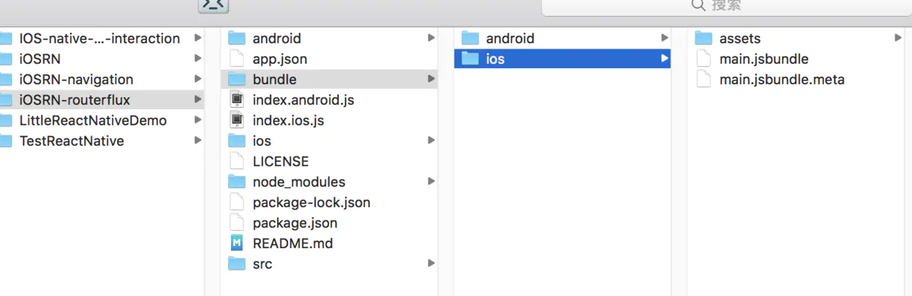

- 生成bundle命令 react-native bundle --platform 平台 --entry-file 启动文件 --bundle-output 打包js输出文件 --assets-dest 资源输出目录 --dev 是否调试

```javascript 
$ react-native bundle --entry -file index.ios.js --bundle -output ./bundle/ios/main .jsbundle --platform ios --assets -dest ./bundle/ios --dev false
```


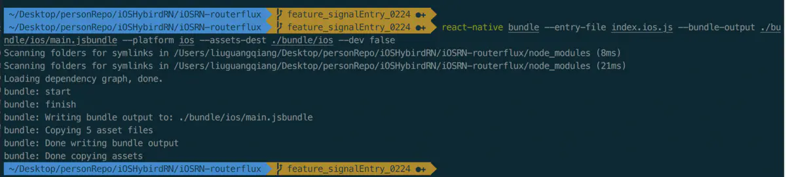

- 将生成的bundle文件和资源文件拖到我们的项目工程


上传bundle

- 将生成的bundle文件上传到CodePush，我们直接执行下面的命令即可

```javascript 
$ code-push release-react <Appname> <Platform> --t <本更新包面向的旧版本号> --des <本次更新说明>
```


注意：

CodePush默认是更新Staging 环境的，如果发布生产环境的更新包，需要指定--d参数：--d Production，如果发布的是强制更新包，需要加上 --m true强制更新

```javascript 
$ code-push release-react iOSRNHybrid ios --t 1.0.0 --dev false --d Production --des "这是第一个更新包" --m true
```


更新包上传到CodePush服务器成功后，效果图如下：

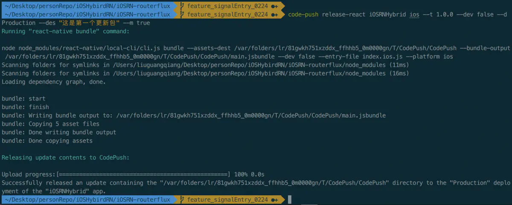

查看发布的历史记录，命令如下

*查询Production*

```javascript 
$ code-push deployment history projectName Production
```


*查询Staging*

```javascript 
$ code-push deployment history projectName Staging
```


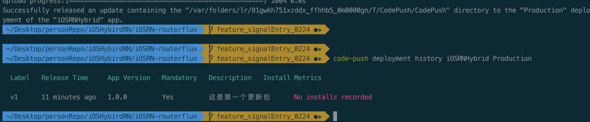

对1.0.0版本的应用如何发布第二个、第n个更新包

> 操作步骤和上面发布第一个更新包流程一样，我们任然先需要打出bundle包，将生成的bundle文件和资源文件拖到工程中，然后再将bundle发布到CodePush

```javascript 
$ react-native bundle --entry -file index.ios.js --bundle -output ./bundle/ios/main .jsbundle --platform ios --assets -dest ./bundle/ios --dev false

$ code-push release -react iOSRNHybrid ios --t 1.0.0 --dev false --d Production --des "这是第二个更新包" --m true
```


## 注意事项

- 当我们在生成更新包之前，我们需要先将JS代码打包成bundle，然后拖拽到项目中，打包之前我们需要先自己建立输出bundle的文件夹bundle -> ios，打bundle命令如下：

```javascript 
$ react-native bundle --entry -file index.ios.js --bundle -output ./bundle/ios/main .jsbundle --platform ios --assets -dest ./bundle/ios --dev false
```


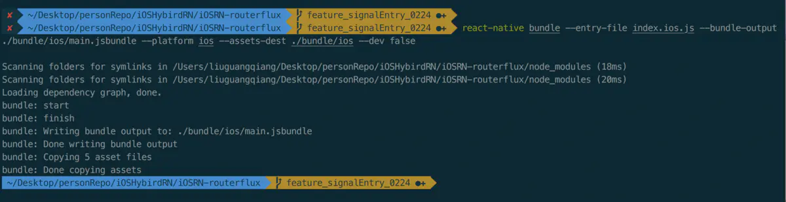

- 发布更新包命令中的 -- t 对应的参数是和我们项目中的版本号一致的，这个不要误理解为是更新包的版本号，例如项目中的版本号为1.0.0， 这时如果我们需要对这个1.0.0 版本的项目进行第一次热更新，那么命令中的 -- t 也为1.0.0，第二次热更新任然为1.0.0
- 项目的版本号需要改为三位的，默认是两位的，但是CodePush需要三位数的版本号
- 发布更新应用时，应用的名称必须要和之前注册过的应用名称一致

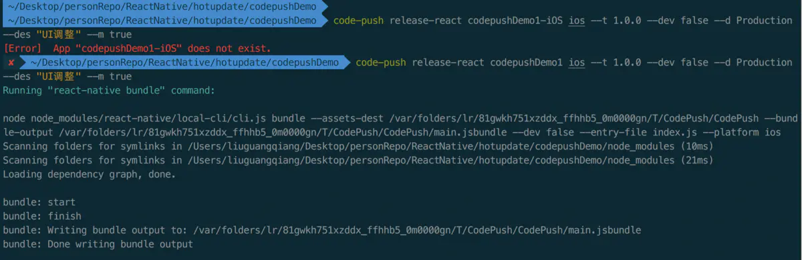

- 创建应用时，信息要填写正确

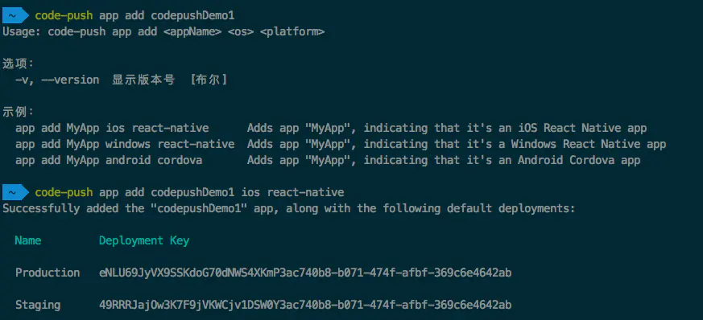

- 当执行link，命令卡住不执行时，这时直接按回车键先ignore key即可

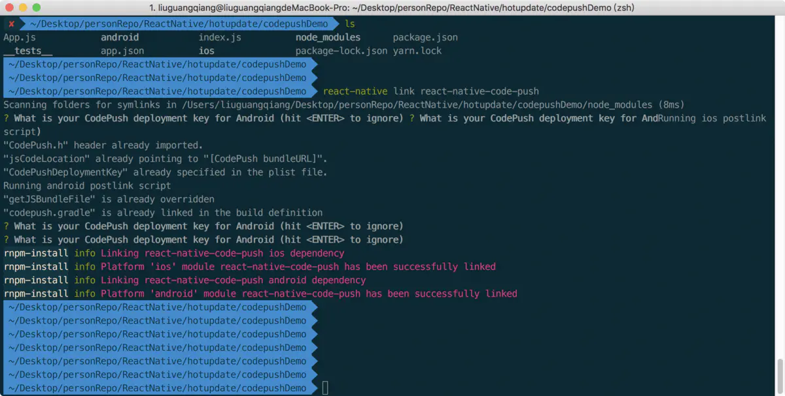

- 还有最重要的一点需要注意的，就是打包证书环境要是良好的，证书不能报错

**项目中代码Code**

[github api文档](https://github.com/microsoft/react-native-code-push/blob/master/docs/api-js.md "github api文档")

# app.js

```纯文本 
 
 /** 
  * @flow 
  */ 
 import React, { Component } from 'react' 
 import 'react-common/utils/textCompatibility' 
 import { View, StatusBar,  Platform } from 'react-native' 
 import { Provider } from 'react-redux' 
 import styleSheet from 'react-common/utils/styleSheet' 
 import { setStatusBarHeightAndroid } from 'react-common/const/ui-common' 
 import UpdateModalView from './pages/update/UpdateModalView' 
 import Loading from 'react-common/page/loading/Loading' 
 import CodePushStatusView from 'react-common/page/update/CodePushStatusView' 
 import AdAndGuidePage from './pages/launch/AdAndGuidePage' 
 import { checkIsFirstUseYZApp, apiDeps } from 'react-common/base/request/apiRequest' 
 import UserPrivacyProtocolTip from './pages/update/UserPrivacyProtocolTip' 
 import BackHandlerWith, { handleCheckUpdate } from 'react-common/components/BackHandlerWith' 
 import KeyboardPadding from 'react-common/navigation/KeyboardPadding' 
 import withNotingRender from 'react-common/base/hoc/withNotingRender' 
 import { getLaunchePage, initAppStore, parseBootOptions } from './setup-appStore' 
 import onLaunched from './onLaunched' 
 import onReadyEmitter from './launched/onReadyEmitter' 
 import { injectAppInfo } from 'react-common/base/enhance/withDevTools' 
 import { setYellowbox } from 'modern/enhance/devTools' 
 import InStockPermissionTip from './pages/update/InStockPermissionTip' 
 import toastUtils from 'modern/utils/toastUtils' 
 import AlertView from 'modern/components/AlertView' 
 import { SafeAreaProvider,  initialWindowMetrics } from 'react-native-safe-area-context' 
 import ListenWith from "./launched/ListenWith"; 
 
 
 const StatusBarView = withNotingRender(StatusBar) 
 const styles = styleSheet.create({ container: { flex: 1 } }) 
 
 
 
 class App extends Component { 
     constructor() { 
         super() 
         this.state = { isReady:false, closeAd: false } 
         this.needShowAd = false 
         setYellowbox() 
     } 
 
 
 
     needShowAd: boolean 
     props: { lanuchOptions: string } 
 
 
 
     getIsNeedShowAd = async () => { 
         this.needShowAd = await checkIsFirstUseYZApp() 
     } 
 
 
 
     componentWillMount() { 
         // isAndroidStatusBarHeight().then(setStatusBarHeightAndroid).catch(e => e) 
         if (Platform.OS === 'android') { 
             setStatusBarHeightAndroid(StatusBar.currentHeight) 
         } 
 
 
 
         this.getIsNeedShowAd() 
 
 
 
         const opt = parseBootOptions(this.props.lanuchOptions) 
         injectAppInfo(opt.initParams, opt.userInfo) 
         // toastUtils.showLongCenter(JSON.stringify(opt.initParams)) 
         if(Platform.OS==='ios') toastUtils.show('', toastUtils.durations.SHORT, toastUtils.positions.CENTER, 
           {containerStyle: {backgroundColor: 'transparent'}}) 
 
 
 
         const onComplete = async (store, AppWithState) => { 
             await onLaunched(store, opt) 
             this.store=store 
             this.AppWithState=AppWithState 
             this.setState({ isReady:true }, () => onReadyEmitter(store)) 
             handleCheckUpdate() 
         } 
         initAppStore(opt, onComplete) 
     } 
 
 
 
     renderAdView = () => { 
         let userInfo = {} 
         if (this.state.store) { 
             userInfo = this.state.store.userInfo 
         } 
         return ( 
             <AdAndGuidePage 
                 popTo={() => { 
                     this.setState({ closeAd: true }) 
                 }} 
                 userInfo={userInfo} 
             /> 
         ) 
     } 
 
 
 
     render() { 
         const { isReady, closeAd, } = this.state 
         const { lanuchOptions } = this.props 
         if (!closeAd && this.needShowAd === true)return this.renderAdView() 
         if (!isReady) return null 
         const  { AppWithState,store }=this 
         return ( 
             <Provider store={store}> 
                 <SafeAreaProvider initialMetrics={initialWindowMetrics}> 
                     <View style={styles.container}> 
                         <StatusBarView isRender={Platform.OS === 'android'} backgroundColor={'transparent'} translucent /> 
                          <CodePushStatusView /> 
                         <AppWithState /> 
                         <Loading /> 
                         <KeyboardPadding /> 
                         <UpdateModalView page={getLaunchePage(lanuchOptions)} /> 
                         <UserPrivacyProtocolTip /> 
                         <BackHandlerWith /> 
                         <ListenWith/> 
                         <InStockPermissionTip /> 
                         <AlertView /> 
                     </View> 
                 </SafeAreaProvider> 
             </Provider> 
         ) 
     } 
 } 
 
 
 export default App
```


# demo

```javascript 
/**
 * @flow  基础部分
 */

import React, { Component } from 'react'
import {
  View,
  TouchableOpacity,
  Text,
  StyleSheet,
  DeviceEventEmitter,
  AsyncStorage,
} from 'react-native'
import CodePush from 'react-native-code-push'
import _ from 'lodash'
import { connect } from 'react-redux'


export const setNeedRestart = () => AsyncStorage.setItem(restartKey, 'need')
export const setRestarted = () => AsyncStorage.setItem(restartKey, '')
export const isNeedRestart = async () => !_.isEmpty(await AsyncStorage.getItem(restartKey))
export const CodePushSyncEventKey = '_CodePushSyncEventKey'
const restartKey = 'systemInfo:isNeedRestart'

const codePushSingle = (() => {
  // 间隔请求，防止过多的请求热更新
  const min = 10 // 分钟
  const interval = min * 60 * 1000
  // 防止重复监听
  let pushEvent: Object
  let syncDate = 0
  let isSyncing = false
  const syncHandler = function syncHandler(force?: boolean = false) {
    if (__DEV__) {
      return
    }
    const ts = new Date().getTime()
    if ((isSyncing || ts - syncDate < interval) && !force) {
      return
    }
    isSyncing = true
    syncDate = ts
    CodePush.sync(
      {},
      this.codePushStatusDidChange,
      this.codePushDownloadDidProgress
    ).then(() => {
      isSyncing = false
    }).catch((err) => {
      this.setState({ syncMessage: err.message, progress: false })
      isSyncing = false
    })
  }
  return {
    viewCount: 0,
    pushEvent,
    syncHandler,
  }
})()


const styles = StyleSheet.create({
  container: {
    backgroundColor: 'gray',
    paddingTop: 40,
  },
  mainContent: {
    flexDirection: 'row',
    justifyContent: 'center',
  },
  messages: {
    fontSize: 13,
    lineHeight: 20,
    padding: 10,
    textAlign: 'center',
  },
  button: {
    textAlign: 'center',
    color: 'blue',
    borderRadius: 5,
    fontSize: 17,
    borderWidth: 1,
    margin: 5,
    padding: 5,
  },

})

```


```react jsx 
// 核心组件

class CodePushStatusView extends Component {
  props:{
    systemInfo:Object,
  }
  state:Object
  constructor(props) {
    super(props)
    codePushSingle.viewCount++
    this.state = {
      buttons: [
        {
          title: 'Apply',
          onPress: this.applyUpdate,
        }, {
          title: 'Background',
          onPress: () => { this.sync(true) },
        }, {
          title: 'Foreground',
          onPress: this.syncImmediate,
        }, {
          title: 'Metadata',
          onPress: this.getUpdateMetadata,
        }],
    }
  }

  codePushStatusDidChange = (syncStatus) => {
    switch (syncStatus) {
    case CodePush.SyncStatus.CHECKING_FOR_UPDATE:
      this.setState({ syncMessage: 'Checking for update.' })
      break
    case CodePush.SyncStatus.DOWNLOADING_PACKAGE:
      this.setState({ syncMessage: 'Downloading package.' })
      break
    case CodePush.SyncStatus.AWAITING_USER_ACTION:
      this.setState({ syncMessage: 'Awaiting user action.' })
      break
    case CodePush.SyncStatus.INSTALLING_UPDATE:
      this.setState({ syncMessage: 'Installing update.' })
      break
    case CodePush.SyncStatus.UP_TO_DATE:
      this.setState({ syncMessage: 'App up to date.', progress: false })
      break
    case CodePush.SyncStatus.UPDATE_IGNORED:
      this.setState({ syncMessage: 'Update cancelled by user.', progress: false })
      break
    case CodePush.SyncStatus.UPDATE_INSTALLED:
      setNeedRestart()
      this.setState({ syncMessage: 'Update installed and will be applied on restart.', progress: false })
      break
    case CodePush.SyncStatus.UNKNOWN_ERROR:
      this.setState({ syncMessage: 'An unknown error occurred.', progress: false })
      break
    default:
      break
    }
  }

  codePushDownloadDidProgress = (progress) => {
    this.setState({ progress })
  }
  getUpdateMetadata = () => {
    CodePush.getUpdateMetadata(CodePush.UpdateState.RUNNING)
      .then((metadata: Object) => {
        const syncMessage = 'Running binary version'
        const omitList = ['downloadUrl', 'bundlePath', 'packageHash']
        this.setState({
          syncMessage: metadata ? JSON.stringify(_.omit(metadata, omitList), null, 2) : syncMessage,
          progress: false,
        })
      }, (error: any) => {
        this.setState({ syncMessage: `Error: ${error}`, progress: false })
      })
  }

  /** Update is downloaded silently, and applied on restart (recommended) */
  sync = (force?: boolean = false) => {
    codePushSingle.syncHandler.call(this, force)
  }
  componentDidMount = () => {
    if (codePushSingle.viewCount === 1 && !codePushSingle.pushEvent) {
      codePushSingle.pushEvent = DeviceEventEmitter.addListener(CodePushSyncEventKey, this.sync)
    }
  }
  componentWillUnmount = () => {
    if (codePushSingle.viewCount === 1 && codePushSingle.pushEvent) {
      codePushSingle.pushEvent.remove()
    }
    codePushSingle.viewCount--
  }

  /** Update pops a confirmation dialog, and then immediately reboots the app */
  syncImmediate = () => {
    CodePush.sync(
      { installMode: CodePush.InstallMode.IMMEDIATE, updateDialog: true },
      this.codePushStatusDidChange,
      this.codePushDownloadDidProgress
    )
  }
  applyUpdate = () => {
    CodePush.restartApp(false)
  }
  renderButton = (item) => (
    <TouchableOpacity
      key={item.title}
      onPress={item.onPress}
    >
      <Text style={styles.button}>{item.title}</Text>
    </TouchableOpacity>
  )
  render() {
    let progressView
    const { systemInfo = {} } = this.props
    if (this.state.progress) {
      progressView = (
        <Text style={styles.messages}>{this.state.progress.receivedBytes} of {this.state.progress.totalBytes} bytes
          received</Text>
      )
    }

    return (
      <View style={{ height: systemInfo.isShowUpdatePanel === true ? null : 0 }}>
        <View style={styles.container}>
          <View style={styles.mainContent}>
            {this.state.buttons.map(this.renderButton)}
          </View>
          <Text style={styles.messages}>{this.state.syncMessage || ''}</Text>
          {progressView}
        </View>
      </View>
    )
  }
}


function mapProps(store) {
  const { systemInfo = {} } = store
  return {
    systemInfo,
  }
}

/* eslint-disable */
const codePushOptions = { checkFrequency: CodePush.CheckFrequency.MANUAL }
export default CodePush(codePushOptions)(connect(mapProps, null)(CodePushStatusView))
/* eslint-enable */


```


# 私有化部署

## code-push-server

[ code push部署\_使用微软code push和私有化部署code-push-server的过程\_weixin\_39664585的博客-CSDN博客 整个过程分为四个部分一：本地安装CodePush客户端二：部署code-push-server服务器(如果使用微软可以略过)三：客户端Android或者iOS项目集成CodePush SDK四：使用CodePush进行热更新一：安装 CodePush CLI客户端不管是使用微软的code push服务器还是部署自己的服务器，都要要安装CodePush客户端1.在本地终端(因为后面需要给自己项目打包 https://blog.csdn.net/weixin\_39664585/article/details/111851870](https://blog.csdn.net/weixin_39664585/article/details/111851870 " code push部署_使用微软code push和私有化部署code-push-server的过程_weixin_39664585的博客-CSDN博客 整个过程分为四个部分一：本地安装CodePush客户端二：部署code-push-server服务器(如果使用微软可以略过)三：客户端Android或者iOS项目集成CodePush SDK四：使用CodePush进行热更新一：安装 CodePush CLI客户端不管是使用微软的code push服务器还是部署自己的服务器，都要要安装CodePush客户端1.在本地终端(因为后面需要给自己项目打包 https://blog.csdn.net/weixin_39664585/article/details/111851870")
