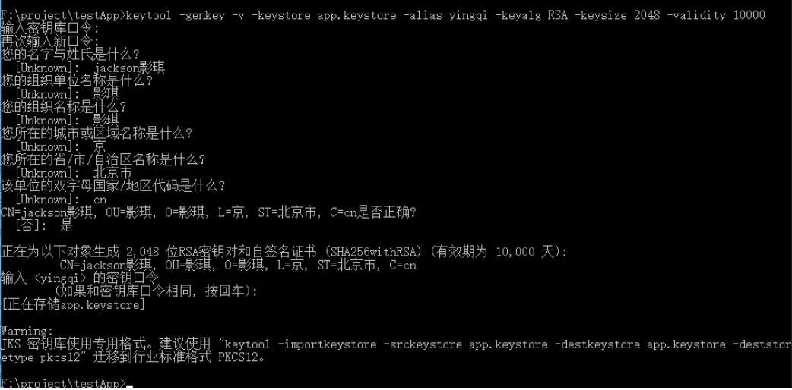
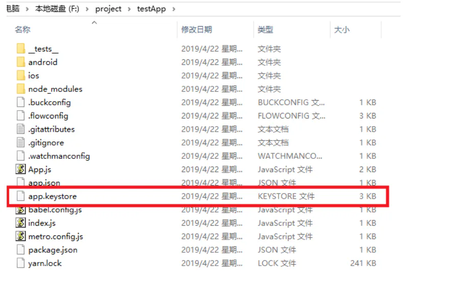
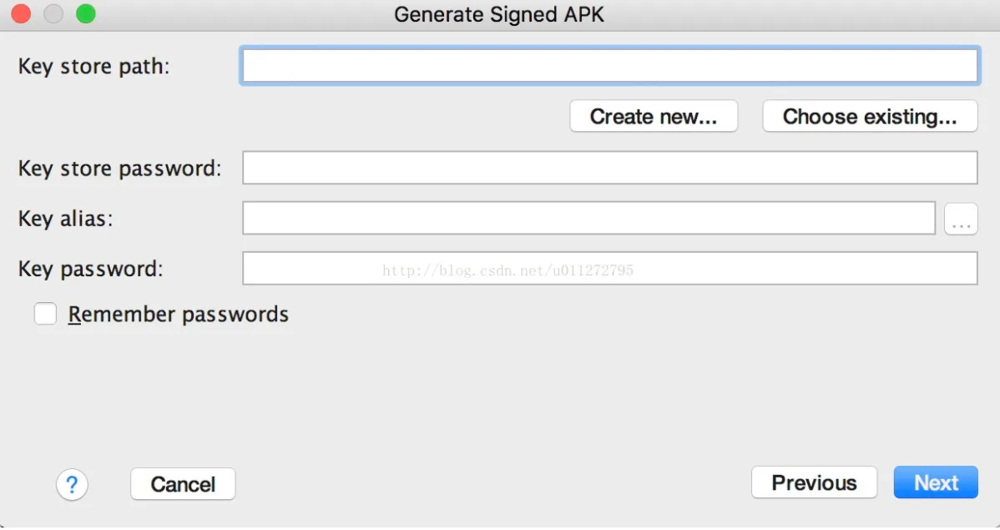
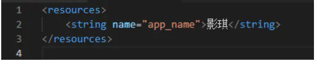
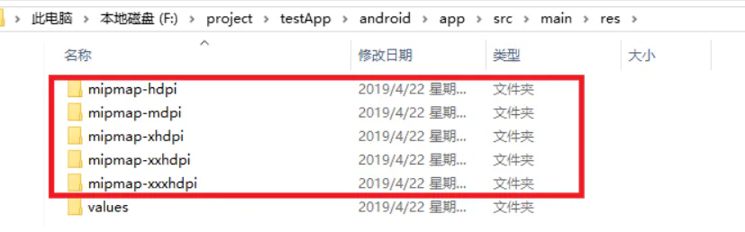
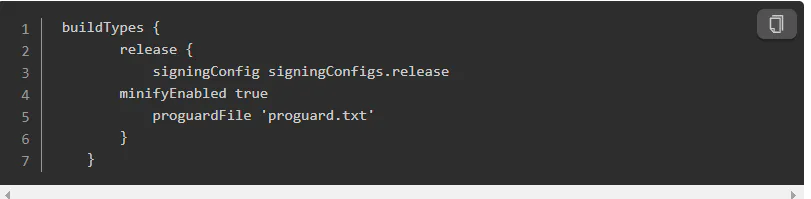

# 打包部署

## 目录

- [1,apk离线打包](#1apk离线打包)
- [2,生成签名](#2生成签名)
  - [命令行生成](#命令行生成)
  - [android studio 生成签名文件:](#android-studio-生成签名文件)
- [3,签名配置](#3签名配置)
  - [设置gradle变量:](#设置gradle变量)
  - [项目的gradle签名配置](#项目的gradle签名配置)
- [4,修改应用名称](#4修改应用名称)
- [5修改应用icon](#5修改应用icon)
- [6,代码混淆](#6代码混淆)
- [7,生成签名apk](#7生成签名apk)
- [8,打包命令配置](#8打包命令配置)
- [最后：过程中遇到的错误](#最后过程中遇到的错误)

参考资料：

[React-Native之打包发布(Android) - jackson影琪 - 博客园 React-Native之打包发布(Android) 一,介绍与需求 移动端打包发布到应用市场 二,发布配置 注意：以下所有操作都在win10下进行,React Native版本0.59.5,andr https://www.cnblogs.com/jackson-yqj/p/10750218.html](https://www.cnblogs.com/jackson-yqj/p/10750218.html "React-Native之打包发布(Android) - jackson影琪 - 博客园 React-Native之打包发布(Android) 一,介绍与需求 移动端打包发布到应用市场 二,发布配置 注意：以下所有操作都在win10下进行,React Native版本0.59.5,andr https://www.cnblogs.com/jackson-yqj/p/10750218.html")

[react-native 打包apk 之 安卓离线包全过程\_卓原的进化之旅-CSDN博客 前言:完成项目时,我们需要将项目打包成一个apk,方便测试以及发布版本.这时,需要把js代码和图片资源都放进apk中, 并且发布版本还需要签名,今天把这一系列操作记录下来.一.生成离线bundle包离线包就是把 ReactNative 和你写的 js文件、图片等资源都打包放入 App ，不需要走网络下载。首先看一下官方给的参数(中文版):react-native... https://blog.csdn.net/u011272795/article/details/77161942](https://blog.csdn.net/u011272795/article/details/77161942 "react-native 打包apk 之 安卓离线包全过程_卓原的进化之旅-CSDN博客 前言:完成项目时,我们需要将项目打包成一个apk,方便测试以及发布版本.这时,需要把js代码和图片资源都放进apk中, 并且发布版本还需要签名,今天把这一系列操作记录下来.一.生成离线bundle包离线包就是把 ReactNative 和你写的 js文件、图片等资源都打包放入 App ，不需要走网络下载。首先看一下官方给的参数(中文版):react-native... https://blog.csdn.net/u011272795/article/details/77161942")

[react native项目编译，打包成android APP 从同事那里转来的文章。 >>>我的博客<<< 编译react native项目，并最终打包成安卓的apk包 另一篇好博文 -entry-file 指定入口文件 因为要打包io... https://www.jianshu.com/p/2cd763f11004](https://www.jianshu.com/p/2cd763f11004 "react native项目编译，打包成android APP 从同事那里转来的文章。 >>>我的博客<<< 编译react native项目，并最终打包成安卓的apk包 另一篇好博文 -entry-file 指定入口文件 因为要打包io... https://www.jianshu.com/p/2cd763f11004")

更多高级配置见Rn 官网

[打包发布 · React Native 中文网 Android 要求所有应用都有一个数字签名才会被允许安装在用户手机上，所以在把应用发布到应用市场之前，你需要先生成一个签名的 AAB 或 APK 包（Google Play 现在要求 AAB 格式，而国内的应用市场目前仅支持 APK 格式。但无论哪种格式，下面的签名步骤是一样的）。Android 开发者官网上的如何给你的应用签名文档描述了签名的细节。本指南旨在提供一个简化的签名和打包的操作步骤， https://reactnative.cn/docs/signed-apk-android](https://reactnative.cn/docs/signed-apk-android "打包发布 · React Native 中文网 Android 要求所有应用都有一个数字签名才会被允许安装在用户手机上，所以在把应用发布到应用市场之前，你需要先生成一个签名的 AAB 或 APK 包（Google Play 现在要求 AAB 格式，而国内的应用市场目前仅支持 APK 格式。但无论哪种格式，下面的签名步骤是一样的）。Android 开发者官网上的如何给你的应用签名文档描述了签名的细节。本指南旨在提供一个简化的签名和打包的操作步骤， https://reactnative.cn/docs/signed-apk-android")

# 1,apk离线打包

离线包就是把 ReactNative 和你写的 js文件、图片等资源都打包放入 App ，不需要走网络下载。

具体bundle 命令 见热跟新 这里就不重复了

react-native bundle --entry-file index.js --platform android --dev false --bundle-output ./android/app/src/main/assets/index.android.bundle --assets-dest ./android/app/src/main/res/

打安卓包的话，react-native bundle 可以替换为 react-native unbundle 做到拆分功能 

react-native unbundle --entry-file index.js --platform android --devfalse--bundle-output ./android/app/src/main/assets/index.android.bundle --assets-dest ./android/app/src/main/res/

翻译成我们能理解的意思就是:入口文件是index.js(0.49以前是index.android.js 注意改一下代码) ,平台是安卓,不显示警告,bundle包输出路径(保存在)react-./android/app/src/main/assets/index.android.bundle  ,图片资源路径是: ./android/app/src/main/res/ .

很容易理解,但是要确保有assets这个文件夹,如果没有请先新建这个文件夹.成功之后会生成index.android.bundle文件.

# 2,生成签名

**Android要求所有应用都必须有一个签名证书才允许安装在手机上，所以，在把应用发布到应用市场之前必须生成1个签名的apk包**

。

## **命令行生成**

&#x20;keytool -genkey -v -keystore app.keystore -alias zhengchao-keyalg RSA -keysize 2048 -validity 10000

密钥口令：

附加说明：

-genkey    生成文件 

-keystore  文件名 

-alias         别名

-keyalg     加密算法

-validity    有效期（单位是天） 

输入如上命令以后,出现以下步骤：

注意：输入密钥库口令【很重要，要记住】

生成的的keystore文件默认是在项目的根目录中,如下图所示:

**注意：请记得妥善地保管好你的密钥库文件，不要上传到版本库或者其它的地方。**

## android studio 生成签名文件:

点击android stuido 菜单栏中的 build, 找到“Generate Signed APK”.

然后

”Create new…”新建一个签名文件”

Choose existing…”选择一个已经存在的签名文件

如果已经有签名文件,可以直接选择使用,没有的话就新建一个.

点击新建之后会有一个弹窗, 需要写很多信息:

- Key store path : 签名文件路径 &#x20;
- Password : 签名密码 &#x20;
- Confirm : 确认密码 &#x20;
- Alias : 别名 &#x20;
- Validity ( years ) : 有限期 （年） &#x20;
- First and Last Name : 全名 &#x20;
- Organizational Unit : 组织单位 &#x20;
- Organization : 组织 &#x20;
- City or Locality : 城市或地方 &#x20;
- State or Province : 州或省 &#x20;
- Country Code(XX) : 国家代码

要记住你填写的东西,有一些不是必填的可以不填.

填写完成之后回到上一个页面,将你填好的信息填进去即可生成一个签名文件.

# 3,签名配置

## 设置gradle变量:

现在是在android 目录下建 （当前项目）或是

编辑\~/.gradle/gradle.properties（没有这个文件你就创建一个，全局有效），

添加如下的代码（注意把其中的替换为相应密码）

注意：\~表示用户目录，比如windows上可能是C:\Users\用户名，而mac上可能是/Users/用户名。

MYAPP\_RELEASE\_STORE\_FILE=my-release-key.keystore

MYAPP\_RELEASE\_KEY\_ALIAS=my-key-alias

MYAPP\_RELEASE\_STORE\_PASSWORD=\*

MYAPP\_RELEASE\_KEY\_PASSWORD=\*

上面的这些会作为全局的gradle变量，我们在后面的步骤中可以用来给应用签名。

## 项目的gradle签名配置

**把app.keystore文件放到你工程中的android/app文件夹下。**

打开编辑项目目录下的android/app/build.gradle文件，添加如下的签名配置：

...

android {

    ...

    defaultConfig { ... }

    signingConfigs {

        release {

            keyAlias 'yingqi' //别名

            keyPassword '123456' //密钥密码 之前设置秘钥口令

            storeFile file('app.keystore') //my-release-key.keystore文件的绝对路径

            storePassword '123456' //存储密码

        }

    }

    buildTypes {

        release {

            ...

            minifyEnabled enableProguardInReleaseBuilds // 在 当前文件中，找到变量 enableProguardInReleaseBuilds ,将其值修改为 true

            signingConfig signingConfigs.release // 引用签名（原来有个debug注释掉）

        }

    }

}

...

# 4,修改应用名称

打开编辑项目目录下的android/app/src/main/res/values/strings.xml文件，修改名称

# 5修改应用icon

将如下文件夹中的icon替换成需要修改的图标即可,注意icon大小保持一致

# 6,代码混淆

启用Proguard代码混淆来缩小APK文件的大小（保护源代码，缩小APK包大小）  Proguard是一个Java字节码混淆压缩工具，它可以移除掉React Native Java (和它的依赖库中)中没有被使用到的部分，最终有效的减少APK的大小。  重要：每次启用Proguard之后，必须再次全面地测试你的应用。Proguard有时候需要为你引入的每个原生库做一些额外的配置。参见app/proguard-rules.pro文件。

**启用方法是修改android工程的**

**build.gradle**

**文件，设置**

**minifyEnabledd**

**选项为**

**true（老版）**

**启用方法是**

**android/app/build.gradle文件中，找到enableProguardInReleaseBuilds然后修改def （新版）enableProguardInReleaseBuilds = true**

# 7,生成签名apk

cd android && ./gradlew assembleRelease     ---生产包

cd android && ./gradlewassembleDebug  ---测试包

cd android表示进入android目录（如果你已经在android目录中了那就不用输入了）。

但是要注意:

**./gradlew assembleRelease在macOS、Linux或是windows的PowerShell环境中表示执行当前目录下的名为gradlew的脚本文件，且其运行参数为assembleRelease，注意这个./不可省略；而在windows的传统CMD命令行下则需要去掉./**

Gradle的assembleRelease参数会把所有用到的JavaScript代码都打包到一起，然后内置到APK包中。如果你想调整下这个行为（比如js代码以及静态资源打包的默认文件名或是目录结构等），可以看看android/app/build.gradle文件，然后琢磨下应该怎么修改以满足你的需求。

生成的APK文件位于android/app/build/outputs/apk/app-release.apk，它已经可以用来发布了。

也可以通过命令行直接安装到手机上：

adb install (apk在PC上的路径/) \*.apk

# 8,打包命令配置

"scripts": {

"start": "node node\_modules/react-native/local-cli/cli.js start",

"bundle-ios": "node node\_modules/react-native/local-cli/cli.js bundle --entry-file index.js --platform ios --dev false --bundle-output ./ios/main.jsbundle --bundle-encoding utf8 --assets-dest ./ios",

"bundle-android": "cd ./android && ./gradlew assembleRelease",

"bundle-win-android": "cd android && gradlew assembleRelease",

"test": "jest"

},

# 最后：过程中遇到的错误

- SHA-1 for file D:\H5\rn\app.js (D:\H5\rn\app.js) is not computed. Run CLI with --verbose flag for more details.

我一不小心搞成 app.js 离线打包了； 换成index.js  就没问题了
