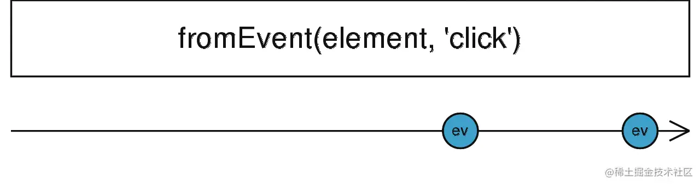
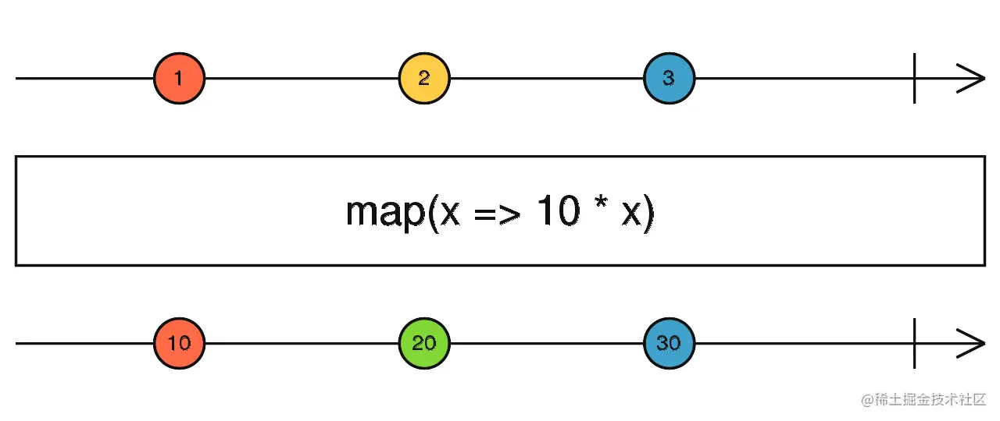

# 观察者模式与迭代器模式

观察者模式定了一个对象之间的一对多的依赖关系，当目标对象 `Subject` 更新时，所有依赖此 `Subject` 的 `Observer` 都会收到更新。

举个例子🌰

```javascript 
import { fromEvent } from "rxjs";

// 创建一个监听 document click 事件的 Observable
let Observable = fromEvent(document, "click");

// 通过 Observable.subscribe 时，接收一个 Observer 回调，当有点击事件（click）发生时
// 则调用传入的回调函数，即 Observer 会收到更新
let subscription = Observable.subscribe((e) => {
  console.log("dom clicked");
});

let subscription2 = Observable.subscribe((e) => {
  console.log("dom clicked");
});

let subscription3 = Observable.subscribe((e) => {
  console.log("dom clicked");
});

```


上述代码，当点击 DOM 时，三个 observer (回调函数）都会收到通知，然后打印 `dom clicked` 语句。

迭代器模式是指提供一种方法顺序访问一个聚合对象中各个元素，而不需要暴露该对象的具体表示，常见的为部署 `Symbol.iterator` 属性，调用对应 `Symbol.iterator` 的方法返回一个迭代器对象，然后就可以以统一的方式进行遍历：

```javascript 
let arr = ['a', 'b', 'c'];
let iterator = arr[Symbol.iterator]()

iterator.next(); // { value: 'a', done: false }
iterator.next(); // { value: 'b', done: false }
iterator.next(); // { value: 'c', done: false }
iterator.next(); // { value: undefined, done: true }

```


对应的 `RxJS` 里面就是 `Observable` 可观察对象，也就是我们后续将引出的 `Stream` 流的概念，每个 `Stream/Observable` 其实可以**看作是一个数组**，然后支持数组相关的各种操作、变换等，变成另外一个 `Stream/Observable`，拿 RxJS 举例：

```javascript 
import { fromEvent, map } from "rxjs";

// 创建一个监听 document click 事件的 Observable
let subscription = fromEvent(document, "click")
    .pipe(map(e => e.target)
    .subscribe(value => {
      console.log('click: ', value);
    });

```


`fromEvent(document, "click")` 会声明一个 `Observable` 对象，同时也创建了一个 `Stream`，类似下面的图片：



`fromEvent(document, "click")` 创建的 `Observable` 对应着**上面的带有箭头的线**，这条线就是一个 `Stream` 流，上面的一个个 `ev` 就是每次点击之后产生的事件，随着时间推移，不断的产生事件，在这个线上不断的流动下去 -- 之所以为 `Stream`，而这个 `Stream` 其实也可以看作是**一个 “数组”，上面的**一个**个事件即为 “数组” 的元素**，我们可以对这个 “`数组`”进行遍历，以统一的方式如 `map/filter`等进行遍历，所以**也叫融合了迭代器模式，** 而在`RxJS` 中，通过这种 “`迭代器`” 模式，我们可以方便的对一个 `Stream` 进行变换，如 `map` 操作效果如下图所示：



> map 将一个 Stream 变换为另外一个 Stream

而最后通过 `subscribe` 生成了 `observer` 观察者，当有事件发生时，`observer` 的回调函数会调用，打印 Log，即融合了观察者模式。

那么函数式是如何应用在 `RxJS` 里面的呢？细心地同学可能发现了，`RxJS` 其实提供了大量的 `Operators`，如 `map`、`filter`、`scan` 等，以 **函数式/声明式** 的方式来操作 `Stream`，且操作之后生成一个新 `Stream`，**不会突变原** `Stream`，此为融合了函数式编程思想。
