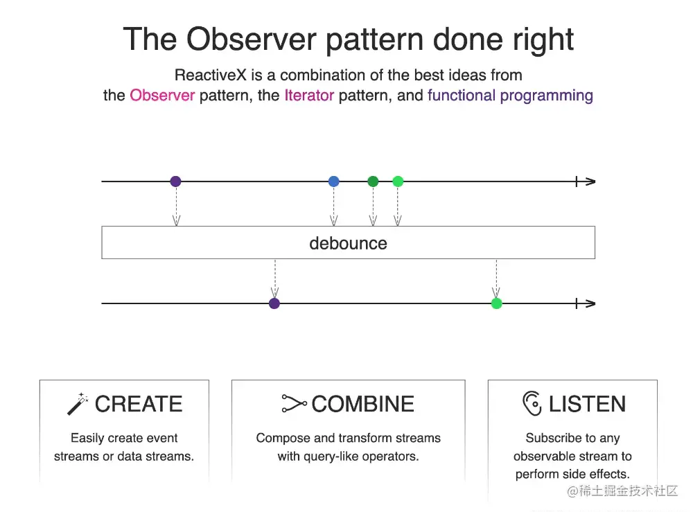

# 本文目标

## 目录

- [业务背景](#业务背景)

本文尝试从在线教室的现状出发，聊一聊引入 RxJS 的原因，并从 RxJS 最具高频的使用场景切入，尝试将 RxJS 的最为核心的概念弄清楚的同时，帮助读者、听众能够实际将 RxJS 应用在业务中，学以致用。

> 本文只是笔者作为一个初学者，在接手业务代码与看了**诸多业界的优秀实践文章之后的思考与沉淀**，**写的匆忙，许多地方没有经过细细钻研，所以行文难免有所疏漏、错误**，如果**你在看或听的过程中觉得有些不妥的地方**，可以随时在本文进行评论或打断我，一起探讨学习。💪

## 业务背景

最近团队接手了在线教室，从前辈们的思考中得知一个完善的在线教室符合如下特点：

1. 一个在线教室是**有状态**的，例如： 一个教室可能处于课前、课中，可能正在进行随堂测验、抢答；
2. 在线教室内的各个功能，可以触发教室状态的流转，即**事件驱动**；
3. 教室状态的流转存在一定的**规则**，例如，正在进行随堂测验，不能直接进入下课状态，必须先结束随堂测，然后下课；不同的业务形态，状态的流转规则可能不同，**规则可配置；**
4. 在线教室通过状态的定时广播，达到**广播老师端指令**的目的；

从上面我们可以认识到，在线教室抽象出来就是**一个状态机，状态包含各种状态**，如聊天、轮播、签到、课件与激励等数十个状态，每个状态可能是在时间维度上有先后关系，每个状态也会有推 / 拉的操作，从而**驱动状态的流转，状态的推 / 拉操作又是异步为主。**

针对这种复杂的、多状态、异步、注重时序控制的场景，天然有一种技术，或者说是一种编程思想是为此而生的，那就是 FRP（Functional Reactive Programming），而在 FRP 领域，ReactivX，**简称 Rx，是由微软推出的通过可观察的流来进行异步编程的 API 则是 FRP 最经典的实现范本之一。**



> 上述为 ReactiveX 的官方：[reactivex.io/](https://link.juejin.cn/?target=https://reactivex.io/ "reactivex.io/") 例子，主要通过最简洁的语言与动画描述什么是 ReactiveX。

而原教室中台的前端同学也是选择了 RxJS（Reactive Extension for JavaScript），通过 RxJS 整合了异步编程、时序控制以及各种遵循函数式编程思想的 Operators 的特性，优雅的实现了这种复杂的状态机。

如学生列表服务：

```javascript 
// packages/room/src/service/signalling/msg/fsm.ts
const fsmSubject = new Subject<classroom_common.IFsm | null>();
const behaviorFsmSubject = new BehaviorSubject<classroom_common.IFsm | null>(
  null
);
fsmSubject.subscribe(behaviorFsmSubject);

// packages/room/src/service/tools/stduent-list/index.ts
behaviorFsmSubject.subscribe((fsm) => {
  if (fsm) {
    const equipment = fsm.equipment;
    if (equipment) {
      const data = equipment.data;
      if (data) {
        const draftEquipment = EquipmentFsmField.decode(
          data
        ) as classroom_media_equipment.IEquipmentFsmField;
        this.subscribeEquipmentStateCb.forEach((cb) => cb(draftEquipment));
      }
    }
  }
});

export function pipeFsmMessage() {
  // ...
  const observable$$ = Emitter.on(MessageType.fsm);
  // ...
  
  observable$$.subscribe((payload) => {
    if (payload) {
      const currSeqId = Number(payload.seq_id);
      const biggerSeqIdComing = currSeqId > setId;

      if (biggerSeqIdComing) {
        fsmSubject.next(payload);
        setId = currSeqId;
      }
    }
  });
}

// packages/room/src/base.ts
export class RoomEngine {
  // ...
  async enterRoom() {
    // ...
    pipeFsmMessage(isBoe(), resp.fsm);
    // ...
  }
}

```


当状态机状态变化，即 `MessageType.fsm` 对应的状态变化，且现在服务端的 `seq_id` 大于前端保存的 `seq_id` 时，就会前端状态机对应的 `fsmSubject` 就会广播事件给到所有的订阅者，而 `behaviorFsmSubject` 订阅了 `fsmSubject`，之后在学生列表等其他状态中，又订阅了 `behaviorFsmSubject`，所以此时学生列表的相关状态就会变化，处理学生列表中设备信息的变化，如麦克风、摄像头、网络状况等，然后更新前端的 UI 显示。

当然上述逻辑只是在线教室庞大且复杂状态逻辑中的一小部分，像下面这样的代码随处可见：

```javascript 
startFollowWidthRetry = (
    retryCount: number,
    delayTime: number,
    errorCb?: (err: Partial<RecorderStartResponse>) => void
  ) => {
    const sub$ = new Observable((observer) => {
      this.startFollowAudioRecord()
        .then((res) => {
          if (res.err_no) {
            return observer.error(res);
          }
          observer.next(res);
          observer.complete();
        })
        .catch((e) => {
          return observer.error(wrapNetworkError(e));
        });
    });

    return sub$
      .pipe(
        retryWhen((err$) => {
          return err$.pipe(
            scan((errCount, err) => {
              if (errCount >= retryCount) {
                throw new Error(err);
              }
              console.log("follow::retry", errCount);
              errorCb && errorCb(err);
              return errCount + 1;
            }, 0),
            delay(delayTime)
          );
        })
      )
      .toPromise();
  };

```


上述代码是实现学生跟读时音频录音的上报的逻辑，在这段代码中进行了学生跟读音频的录制上报、处理了错误，并提供了错误重试的机制等等，这段复杂的代码其实包含了一个典型的 RxJS 流的处理过程，并使用了大量的函数式 Operators（操作符），如 `retryWhen` 、`scan` 、`delay` 等

上述代码乍一看其实是反直觉的，执行逻辑尚不明晰，再加上一大堆新名词，如 `Observable` 、`observer` 以及 `pipe` 还有上面提到的各种名为 Operators 的东西，更是让人头脑昏厥，拒绝食用。

最绝望的是，上述这种加了很多语法糖的代码，调试体验爆炸💥，出错了无从调起。


所以我意识到是时候好好学一下 RxJS 了，想了解一下 RxJS 是怎么运作的，它的 Operators（操作符）咋用，如何 Debug RxJS 应用，如何在业务中真实落地🤩。


