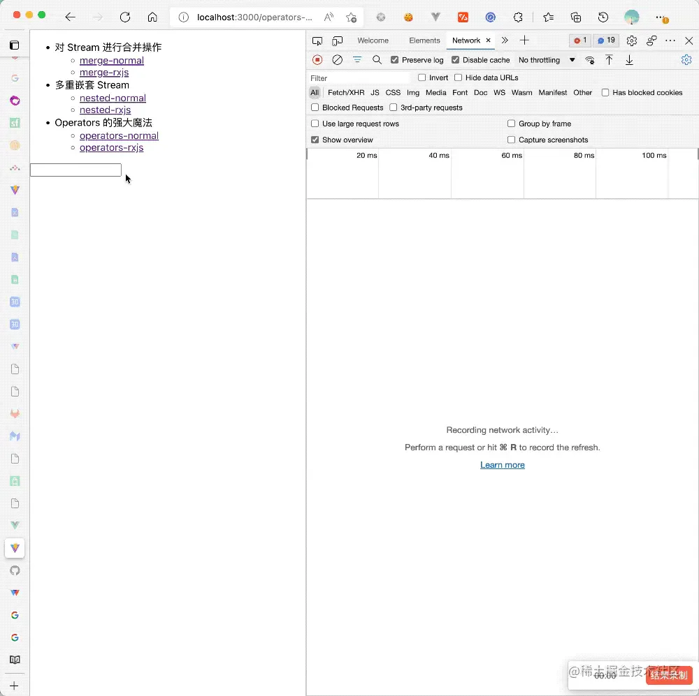

# 牛刀小试

1. 在正式讲解 RxJS 之前，让我们先来体会一下 RxJS 的魔法 👨🎨。首先抛出一个需求：

> 让我们实现一个带 AutoComplete 的搜索框，输入内容时，自动向服务器发请求搜索对应的内容，然后将内容处理之后以列表的形式展示在输入框下面。

实现效果大致如下：



让我们对这个需求进行一下需求分析，来趴一趴实现这样的一个搜索框需要那些技术点：

1. 首先最 naive 的，监听搜索框的 `input` 事件，每次有变化就发起一个请求，请求搜索服务器，拿到结果，然后丢给 UI 层去渲染
2. 接着我们需要过滤空输入、重复请求
3. 可能从性能方面考虑，我们需要加入防抖
4. 从容错性方面考虑，我们需要处理竟态
5. 更严谨一点，我们还需要处理失败重试
6. ....

一个实现上述 4 点功能的原生 JS 代码大概如下

```javascript 
const debounce = (fn, delay) => {
    let timer;

    return function (...args) {
      if (timer) clearTimeout(timer);
      timer = setTimeout(() => fn.apply(this, args), delay);
    };
  };

  const takeLatestRequest = (promiseCreator) => {
    let index = 0;
    return function () {
      index++;
      const promise = promiseCreator.apply(this, arguments);

      function guardLatest(func, reqIndex) {
        return function () {
          if (reqIndex === index) {
            func.apply(this, arguments);
          }
        };
      }

      return new Promise(function (resolve, reject) {
        promise.then(guardLatest(resolve, index), guardLatest(reject, index));
      });
    };
  };

  useEffect(() => {
    const inputSearch = document.querySelector(".search");
    const latestRequest = takeLatestRequest(searchWikiPedia);
    let lastInputValue = "";

    inputSearch.addEventListener(
      "input",
      debounce((e) => {
        if (!e.target.value) return;
        if (lastInputValue === e.target.value) return;
        else lastInputValue = e.target.value;

        latestRequest(e.target.value)
          .then((data) => setItems(data[1] || []))
          .catch((err) => console.log(err));
      }, 250)
    );
  }, []);

```


近 50 行代码，还过得去。


再看看一个实现上述 4 点功能的 RxJS 代码大致如下：

```javascript 
useEffect(() => {
    const inputSearch = document.querySelector(".search");
    fromEvent(inputSearch, "input")
      .pipe(
        map((e) => e.target.value),
        filter((val) => val),
        debounceTime(250),
        distinctUntilChanged(),
        switchMap((val) => searchWikiPedia(val))
      )
      .subscribe((data) => {
        setItems(data[1] || []);
      });
  }, []);

```


> 我们将在下面的 “体验 Operators 带来的魔法” 这一小节详细讲解这段实现过程，迫不及待想要了解的同学可以猛戳这个链接抢先体验。

短短 14 行搞定，不仅简洁，还清晰，就和搭积木似的，需要什么加个 Operators，不需要的时候把这行删掉，搞定！


这么无敌的 RxJS 还不学起来？


