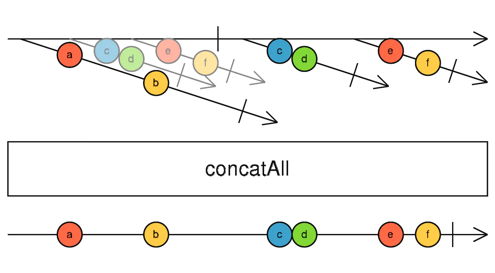
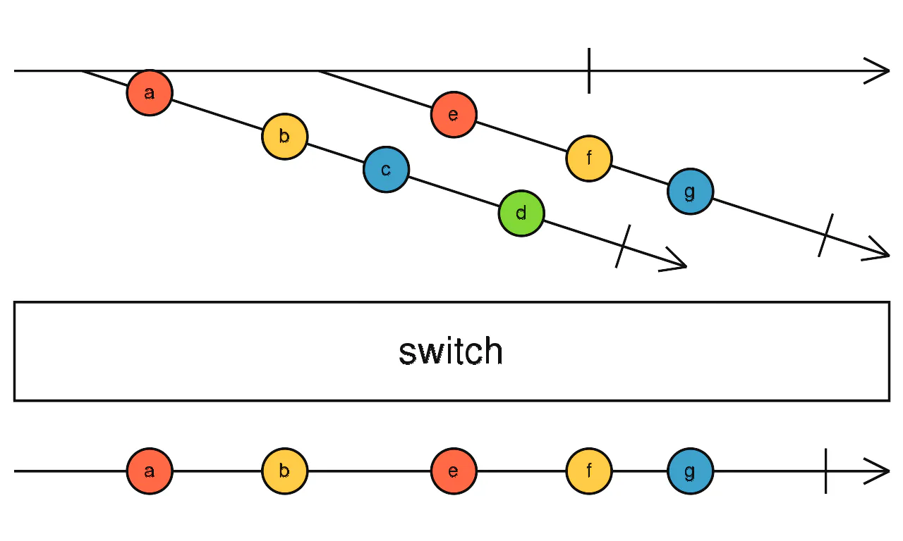

# 展平操作符

## 目录

- [1、map](#1map)
- [2、concatAll](#2concatAll)
- [3、concatMap](#3concatMap)
- [4、mergeAll](#4mergeAll)
- [5、mergeMap（又叫flatMap）](#5mergeMap又叫flatMap)
- [6、switchAll](#6switchAll)
- [7、switchMap](#7switchMap)
- [8、Exhaust](#8Exhaust)

#### 1、map

map和javascript中的数组的map方法类似，不过这里为了结合下面的demo，我先用map做一个我们不想要的效果：

```javascript 
const getData = (param) => {
  return of(`return: ${param}`).pipe(
    delay(Math.random() * 1000)
  )
};


from([1, 2, 3, 4,5])
  .pipe(
    map(param => getData(param)),
  )
  .subscribe(val => console.log(val));

```


控制台输出是： &#x20;


**getData返回的是observable, 但是如果我想拿到返回的observable里面的值，怎么办呢？就是下面的方法了：**

#### 2、concatAll

- [concatAll()](https://rxjs.tech/api/operators/concatAll "concatAll()") 操作符**订阅**从“外部” Observable **出来的每个“内部” Observable**，并**复制所有发出的值**，**直到该 ****`Observable`**** 完成，**然后**继续处理下一个**。**所有值都以这种方式连接**。

javascript中数组也有一个方法叫做[concat](https://so.csdn.net/so/search?q=concat\&spm=1001.2101.3001.7020 "concat")，实现的效果类似吧。



```typescript 
const getData = (param) => {
  return of(`return: ${param}`).pipe(
    delay(Math.random() * 1000)
  )
};


  from([1, 2, 3, 4, 5])
  .pipe(
    map(param => getData(param)),
    concatAll()  // 比上个例子多出的部分
  )
  .subscribe(val => console.log(val));


```


输出结果是：

```text 
return: 1
return: 2
return: 3
return: 4
return: 5

```


多跑几次代码，每次都是这个输出顺序。 &#x20;
和上个demo相比，直接拿到了getData返回的observable中的值，因为concatAll有个flatten效果。**不过可以把map和concatAll直接结合成一个操作符, 就是下面这个：**

#### 3、concatMap

> Maps each value to an Observable, then flattens all of these inner Observables using concatAll.

这个操作符可以传递好几个参数，我学的比较简单，就用一个的：

```javascript 
from([1,2,3,4,5])
   .pipe(
     concatMap(param => getData(param))
   )
   .subscribe(val => console.log(val));

```


#### 4、mergeAll

- [mergeAll()](https://rxjs.tech/api/operators/mergeAll "mergeAll()") — 在每个内部 `Observable` 抵达时订阅它，然后在每个值抵达时发出这个值

先跑代码，再分析吧：

```javascript 
from([1, 2, 3, 4, 5])
    .pipe(
          map(
             item => getData(item)
          ),
          mergeAll()
    )
    .subscribe(v => console.log(v));

```


多跑几次，就会发现每次的输出的顺序都是不一致的，并不是按照1 2 3 4 5的顺序输出的, 这点和concatAll不一致。为什么呢？


从上面的`marble`图可以看到，`mergeAll`接受2个`observable`，每个`observable`发射出来值之后，`mergeAll`之后产生的observable就直接emit了。而从concatAll的marble图可以看出，他等到发射完毕了先进入的observable发射出的所有值时候，才会发射后进入的observable发射的值。

> 其实也可以实现concatAll的效果，只要 mergeAll(1) 就可以了

map和mergeAll也可以和成一个操作符，就是下面这个了

#### 5、mergeMap（又叫flatMap）

> Maps each value to an Observable, then flattens all of these inner Observables using mergeAll.

```javascript 
  from([1, 2, 3, 4,5])
    .pipe(
      mergeMap(param => getData(param))
    )
    .subscribe(val => console.log(val));

```


#### 6、switchAll

- 在第一个内部 `Observable` 抵达时订阅它，并在每个值抵达时发出这个值，但是当下一个内部 Observable 抵达时，退订前一个，并订阅新的。

**喜新厌旧**



```javascript 
from([1,2,3,4,5]).pipe(
    map(param => getData(param)),
    switchAll()
  ).subscribe(val => console.log(val));

```


每次运行的结果都是：

> return 5

map之后产生的五个observable, 经过switchAll之后，由于五个observable的delay不同，所以还没来得及发射数据，就被最后的observable给‘踢’掉了。 &#x20;
和上面的差不多，map之后switchAll也可以合并成一个操作，就是下面的：

#### 7、switchMap

```javascript 
     from([1,2,3,4,5])
     .pipe(
           switchMap(param => getData(param))
     )
     .subscribe(val => console.log(val));

```


结果和上面的是一样的了。

#### 8、Exhaust

Exhaust
