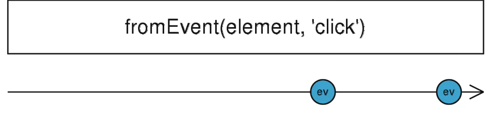

# fromEvent

义：

- `public static fromEvent(target: EventTargetLike, eventName: string, options: EventListenerOptions, selector: SelectorMethodSignature<T>): Observable<T>`

创建一个 `Observable`，该 `Observable` 发出来自给**定事件对象的指定类型事件**。可用于**浏览器环境**中的`Dom`事件或`Node`环境中的`EventEmitter`事件等。



fromEvent

假设我们有一个这样的需求，监听按钮点击事件，并打印出来：

```javascript 
const click = Rx.Observable.fromEvent(document.getElementById('btn'), 'click');
click.subscribe(x => console.log(x));
```


对比我们使用`addEventListener`方式来监听是不是这种写法更为流畅。
