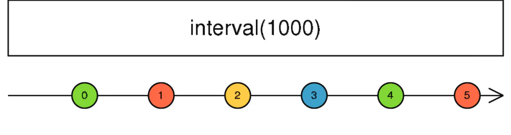

# interval

定义：

- `public static interval(period: number, scheduler: Scheduler): Observable`

使用该操作符创建的`Observable`可以在指定时间内发出连续的数字，其实就跟我们使用`setInterval`这种模式差不多。在我们**需要获取一段连续的数字时**，或者**需要定时做一些操作时**都可以使用该操作符实现我们的需求。



```javascript 
const source = Rx.Observable.interval(1000);
source.subscribe(v => console.log(v));

```


默认从0开始，这里设定的时间为1s一次，它会持续不断的按照指定间隔发出数据，一般我们可以结合`take`操作符进行限制发出的数据量。
