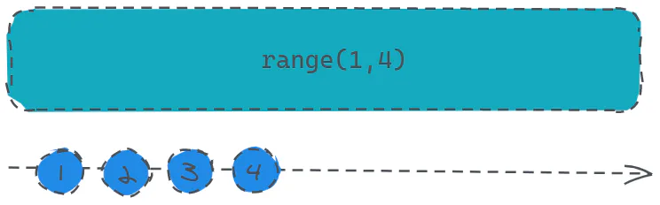

# range

定义：

- `public static range(start: number, count: number, scheduler: Scheduler): Observable`

创建一个 `Observable` ，它发出指定范围内的数字序列。

> 学过`Python`的小伙伴有木有一点似曾相识的感觉。



```javascript 
const source = Rx.Observable.range(1, 4);
source.subscribe(v => console.log(v));
```


打印结果：1、2、3、4。

是不是倍感简单呢。
