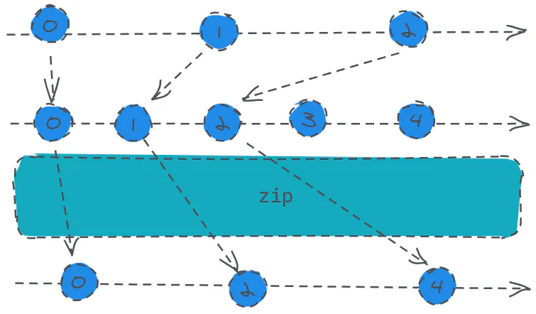

# zip

定义：

- `public static zip(observables: *): Observable<R>`

将多个 `Observable` 组合以创建一个 `Observable`，该 `Observable` 的值是由所有输入 `Observables` 的值按**顺序计算而来**的。如果最后一个参数是函数, 这个函数被用来计算最终发出的值.否则, 返回一个顺序包含所有输入值的数组.

通俗点说就是多个源**之间会进行顺位对齐计算**，跟前面的`combineLatest`有点差别。

话不多说，上码：



```javascript 
const s1 = Rx.Observable.interval(1000).take(3);
const s2 = Rx.Observable.interval(2000).take(5);
const result = s1.zip(s2, (a, b) => a + b);
result.subscribe(x => console.log(x));
```


打印结果依次是：`0、2、4。`

怎么理解呢，首先我们记住一句话，多个源之间用来计算的数是顺位对齐的，也就是说`s1`的第一个数对齐`s2`的第一个数，**这种一一对应的计算，** 最终订阅者收到的就是将多个对齐的数传入我们在调用`zip`的最后一个回调函数，也就是用来计算完值最终返回给用户的结果，这是可选的。

等到**两个源中的任意一个源结束了之后，整体就会发出结束信号，因为后续不存在可以对齐的数了。**
