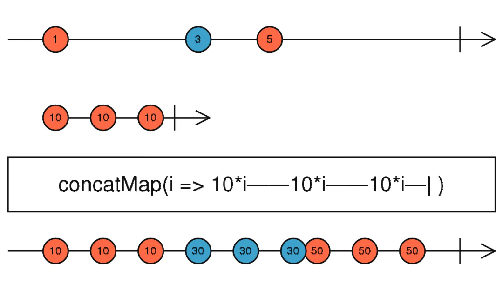

# concatMap

定义：

- `public concatMap(project: function(value: T, ?index: number): ObservableInput, resultSelector: function(outerValue: T, innerValue: I, outerIndex: number, innerIndex: number): any): Observable`

这个操作符还是有点意思的，我们先看看官网的描述：



concatMap

> 将源值**投射为一个合并到输出** `Observable` 的 `Observable`,以**串行的方式等待前一个完成再合并下一个** `Observable`。

不知道各位读者是否感受到了“一丝丝”的不好理解呢，不过等笔者举个小例子就能轻松的搞懂了：

假设你遇到了这样一个场景，你和女朋友一起在小吃街逛街，但是呢女朋友有个不好的毛病，她总喜欢这家买完吃一口然后剩下让你吃，然后另一家买一点吃一口然后剩下还是让你吃，而你呢每次吃东西也是要时间的，一般会心疼男朋友的女朋友就会等你吃完再去买下一家的，这种情况下，你还是能吃完再休息会；另一种情况呢，女朋友不管你吃完没，她继续买买买，然后你手里的吃的越来越多，你吃的速度完全赶不上女朋友买的速度，那这个时候呢就会导致你负重越来越大，最后顶不住心态爆炸了。

以上情景包含了`concatMap`的几个核心点以及需要注意的地方：

1. 源值发送一个数据，然后你传入的内部`Observable`就会**开始工作或者是发送数据**，订阅者就能收到数据了，也就是内部的`Observable`相当于总是要等源对象发送一个数据才会进行新一轮工作，并且要等本轮工作完成了才能继续下一轮。
2. 如果本轮工作**还未完成又接受到了源对象发送的数据，那么将会用一个队列保存，然后等本轮完成立即检查该队列里是否还有，如果有则立马开启下一轮。**
3. 如果内部`Observable`的工作时间大于源对象发送的数据的间隔时间，那么就会导致缓存队列越来越大，最后造成性能问题

其实通俗点理解就是，一个工厂流水线，一个负责发材料的，另一个负责制作产品的，发材料的就是源对象，制作产品的就是这个内部`Observable`，这个工厂里产出的只会是成品也就是制作完成的，所以订阅者要等这个制作产品的人做完一个才能拿到一个。

如果发材料的速度比制作的人制作一个产品要快就会产生材料堆积，那么随着时间推移就会越堆越多，导致工厂装不下。

借助代码理解：

```javascript 
const source = Rx.Observable.interval(3000);
const result = source.concatMap(val => Rx.Observable.interval(1000).take(2));
result.subscribe(x => console.log(x));
```


首先分析一下代码结构，我们先创建了一个每隔三秒发送一个数据的源对象，接着调用实例方法`concatMap`，并给该方法传入一个返回`Observable`对象的函数，最终获得经过`concatMap`转化后的`Observable`对象，并对其进行订阅。

运行结果为：首先程序运行的第三秒`source`会发送第一个数据，然后这时我们传入的内部`Observable`，开始工作，经过两秒发送两个递增的数，接着订阅函数逐步打印出这两个数，等待一秒后也就是程序运行的第6秒，`source`发送第二个数，这个时候重复上述流程。
