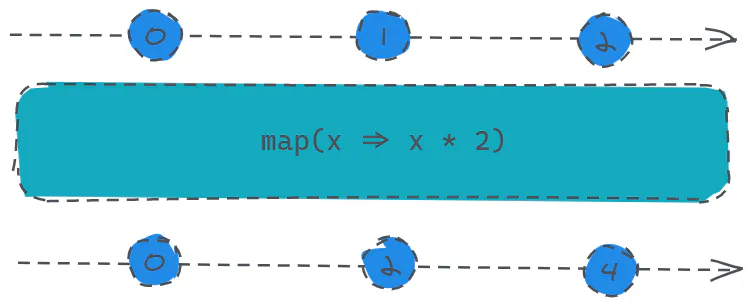

# map

定义：

- `public map(project: function(value: T, index: number): R, thisArg: any): Observable<R>`

如果说你使用`js`中数组的`map`方法较多的话，可能这里基本就不用看了，用法完全一致。

你只需要传入一个函数，那么函数的第一个参数就是数据源的每个数据，第二个参数就是该数据的索引值，你只需要返回一个计算或者其他操作之后的返回值即可作为订阅者实际获取到的值。



```javascript 
const source = Rx.Observable.interval(1000).take(3);
const result = source.map(x => x * 2);
result.subscribe(x => console.log(x));
```


> `take`操作符其实也就是限定拿多少个数就不在发送数据了。

这里用于演示将每个数据源的值都乘以2然后发送给订阅者，所以打印的值分别为：0、2、4。
