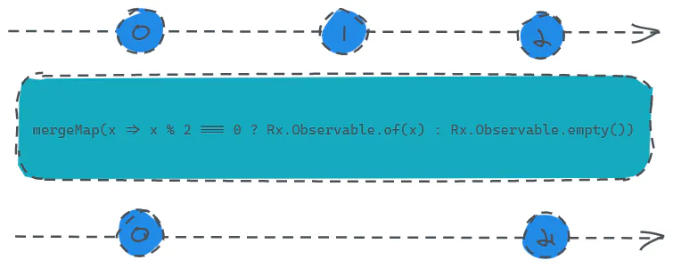

# mergeMap

定义：

- `public mergeMap(project: function(value: T, ?index: number): ObservableInput, resultSelector: function(outerValue: T, innerValue: I, outerIndex: number, innerIndex: number): any, concurrent: number): Observable`

这个定义看上有点吓人，不过我们不要慌，我们只需要了解他得大多数情况的用法即可。

> 这里你是否还记得前面在`empty`操作符介绍的部分提到的，笔者留了个坑没补，就是演示`mergeMap`与`empty`是如何进行配合的？这里就把这个坑填上。



```javascript 
const source = Rx.Observable.interval(1000).take(3);
const result = source.mergeMap(x => x % 2 === 0 ? Rx.Observable.of(x) : Rx.Observable.empty());
result.subscribe(x => console.log(x));
```


输入源是一个会发送0、1、2三个数的数据源，我们调用`mergeMap`操作符，并**传入一个函数，该函数的功能就是，如果输入源发送的当前值是偶数则发送给订阅者，否则就不发送。**

这里面`mergeMap`主要做了一个整合的能力，我们可以将它与`map`进行对比，我们可以发现`map`**的返回值必须是一个数值**，而`mergeMap`**返回值是要求是一个**`Observable`，也就是说，我们**可以返回任意转换或具备其他能力**的`Observable`。
