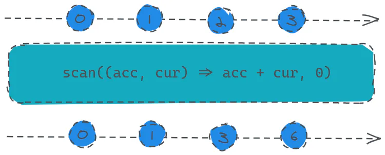

# scan

定义：

- `public scan(accumulator: function(acc: R, value: T, index: number): R, seed: T | R): Observable<R>`

累加器操作符，可以用来做状态管理，用处挺多。

> 就用法来看，我们可以参考一下`js`中数组的`reduce`函数。

假设我们现在有一个需求，我们想要将数据源发送过来的数据累加之后再返回给订阅者，这又该怎么做呢？



```javascript 
const source = Rx.Observable.interval(1000).take(4);
const result = source.scan((acc, cur) => acc + cur, 0);
result.subscribe(x => console.log(x));
```


从代码上看，数据源发送了四个值：0、1、2、3，而订阅者每次收到的值将分别是前面已接收到的数与当前数的和也就是：0、1、3、6。

然后再看用法，我们给`scan`操作符第一个参数传入了一个函数，接收两个值：`acc`（前一次累加的结果或初始值）、`cur`（当前值），第二个参数则是计算的初始值。
