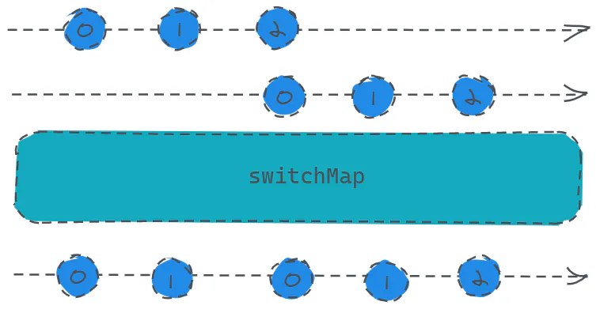

# switchMap

定义：

- `public switchMap(project: function(value: T, ?index: number): ObservableInput, resultSelector: function(outerValue: T, innerValue: I, outerIndex: number, innerIndex: number): any): Observable`

> 其实也就是`switch`操作符与`map`操作符的结合，`switch`操作符会在组合操作符中讲到。

主要作用首先会对多个`Observable`进行合并，并且具备打断能力，也就是说合并的这个几个`Observable`，某个`Observable`最先开始发送数据，这个时候订阅者能正常的接收到它的数据，**但是这个时候另一个**\*\*`Observable`\*\***也开始发送数据了**，那么第一个`Observable`**发送数据就被打断了，只会发送后来者发送的数据**。

> 用通俗的话来说就是，有人在说话，突然你大声开始说话，人家就被你打断了，这个时候大家就只能听到你说话了。



```javascript 
const btn = document.createElement('button');
btn.innerText = '我要发言！'
document.body.appendChild(btn);
const source = Rx.Observable.fromEvent(btn, 'click');
const result = source.switchMap(x => Rx.Observable.interval(1000).take(3));
result.subscribe(x => console.log(x));
```


代码实现的功能就是，当某位同学点击按钮，则开始从0开始发送数字，这个时候如果同学一还没发送完数据，同学二再点一下，则同学一的数据就不会再发了，开始发同学二的。

假设同学一点完之后，第二秒同学二点击了一下按钮，则打印结果：0、1、0、1、2，这里从第二个0开始就是同学二发送的数据了。
