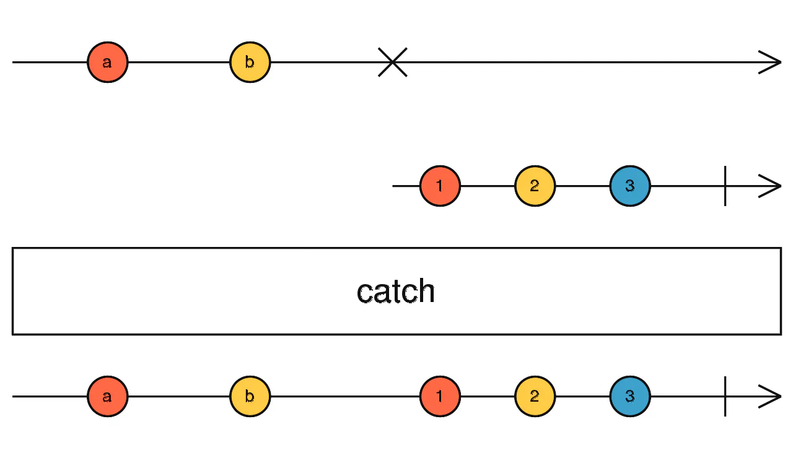

# catchError

## 目录

- [参数](#参数)
- [返回值](#返回值)
- [例子](#例子)

捕获要处理的 observable 上的错误，并返回新的 observable 或抛出错误。

> catchError\<T, O extends ObservableInput\<any>>(selector: (err: any, caught: Observable\<T>) => O): OperatorFunction\<T, T | ObservedValueOf\<O>>

#### 参数

|          |                                                                                                                                                          |
| -------- | -------------------------------------------------------------------------------------------------------------------------------------------------------- |
| selector | 一个函数，它的第一个参数是 `err`，这是错误对象，第二个参数是 `caught`，**这是源 ****`observable`****，这样你就可以再次返回它来“重试”那**个 `observable`。`selector` 返回的任何 observable 都将用作后续 observable 链。 |

#### 返回值

一个返回 Observable 的函数，该 Observable 或者来自源或者来自 `selector` 函数返回的 Observable。



该操作符会处理各种错误，但会把所有其它事件转发到结果 `observable`。如果源 `observable` 因出错而终止，它会将该错误映射成新的 `observable`，订阅这个新 `Observable`，并将其所有事件转发到结果 `observable`。

## 例子

出现错误时继续使用另一个 `Observable`

```javascript 
import { of, map, catchError } from 'rxjs';

of(1, 2, 3, 4, 5)
  .pipe(
    map(n => {
      if (n === 4) {
        throw 'four!';
      }
      return n;
    }),
    catchError(err => of('I', 'II', 'III', 'IV', 'V'))
  )
  .subscribe(x => console.log(x));
  // 1, 2, 3, I, II, III, IV, V
```


发生错误时再次重试所捕获的源 `Observable`，类似于 `retry()` 操作符

```javascript 
import { of, map, catchError, take } from 'rxjs';

of(1, 2, 3, 4, 5)
  .pipe(
    map(n => {
      if (n === 4) {
        throw 'four!';
      }
      return n;
    }),
    catchError((err, caught) => caught),
    take(30)
  )
  .subscribe(x => console.log(x));
  // 1, 2, 3, 1, 2, 3, ...
```


当源 `Observable` 抛出错误时抛出一个新的错误

```javascript 
import { of, map, catchError } from 'rxjs';

of(1, 2, 3, 4, 5)
  .pipe(
    map(n => {
      if (n === 4) {
        throw 'four!';
      }
      return n;
    }),
    catchError(err => {
      throw 'error in source. Details: ' + err;
    })
  )
  .subscribe({
    next: x => console.log(x),
    error: err => console.log(err)
  });
  // 1, 2, 3, error in source. Details: four!
```
