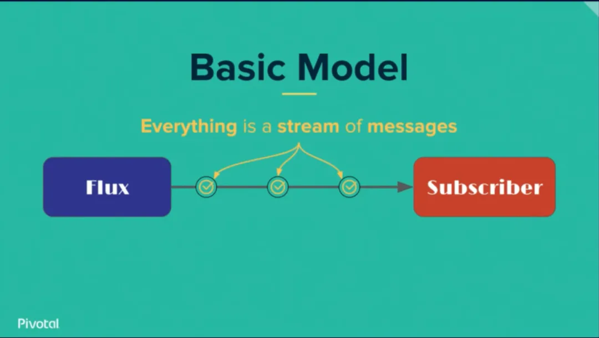

# 前置知识点

## 目录

- [响应式编程（Reactive Programming）](#响应式编程Reactive-Programming)
- [流（Stream）](#流Stream)
- [观察者模式](#观察者模式)
- [迭代器模式](#迭代器模式)

在正式进入`RxJS`的世界之前，我们首先需要明确和了解几个概念：

- 响应式编程（`Reactive Programming`）
- 流（`Stream`）
- 观察者模式（发布订阅）
- 迭代器模式

#### **响应式编程（Reactive Programming）**

响应式编程（`Reactive Programming`），它是一种基于事件的模型。在上面的异步编程模式中，我们描述了两种获得上一个任务执行结果的方式，一个就是主动轮训，我们把它称为 `Proactive` 方式。另一个就是被动接收反馈，我们称为 `Reactive`。简单来说，在 `Reactive` 方式中，上一个任务的结果的反馈就是一个事件，这个事件的到来将会触发下一个任务的执行。

响应式编程的思路大概如下：你可以用包括 `Click` 和 `Hover` 事件在内的任何东西创建 `Data stream`（也称“流”，后续章节详述）。`Stream` 廉价且常见，任何东西都可以是一个 `Stream`：变量、用户输入、属性、`Cache`、数据结构等等。举个例子，想像一下你的 `Twitter feed` 就像是 `Click events` 那样的 `Data stream`，你可以监听它并相应的作出响应。



响应式编程

结合实际，如果你使用过`Vue`，必然能够第一时间想到，`Vue`的设计理念不也是一种响应式编程范式么，我们在编写代码的过程中，只需要关注数据的变化，不必手动去操作视图改变，这种`Dom`层的修改将随着相关数据的改变而自动改变并重新渲染。

#### **流（****`Stream`****）**

流作为概念应该是语言无关的。文件`IO`流，`Unix`系统标准输入输出流，标准错误流(`stdin`, `stdout`, `stderr`)，还有一开始提到的 `TCP` 流，还有一些 `Web` 后台技术（如`Nodejs`）对`HTTP`请求/响应流的抽象，都可以见到流的概念。

**作为响应式编程的核心，流的本质是一个按时间顺序排列的进行中事件的序列集合。**


流

对于一流或多个流来说，我们可以对他们进行转化，合并等操作，生成一个新的流，在这个过程中，流是不可改变的，也就是只会在原来的基础返回一个新的`stream`。

#### **观察者模式**

在众多设计模式中，观察者模式可以说是在很多场景下都有着比较明显的作用。

> 观察者模式是一种行为设计模式， 允许你定义一种订阅机制， 可在对象事件发生时通知多个 “观察” 该对象的其他对象。

用实际的例子来理解，就比如你订了一个银行卡余额变化[短信](https://cloud.tencent.com/product/sms?from_column=20065\&from=20065 "短信")通知的服务，那么这个时候，每次只要你转账或者是购买商品在使用这张银行卡消费之后，银行的系统就会给你推送一条短信，通知你消费了多少多少钱，这种其实就是一种观察者模式，又称发布-订阅模式。

在这个过程中，银行卡余额就是被观察的对象，而用户就是观察者。


观察者模式

优点：

- 降低了目标与观察者之间的耦合关系，两者之间是抽象耦合关系。
- 符合依赖倒置原则。
- 目标与观察者之间建立了一套触发机制。
- 支持广播通信

不足：

- 目标与观察者之间的依赖关系并没有完全解除，而且有可能出现循环引用。
- 当观察者对象很多时，通知的发布会花费很多时间，影响程序的效率。

#### **迭代器模式**

迭代器（`Iterator`）模式又叫游标（`Sursor`）模式，在面向对象编程里，迭代器模式是一种设计模式，是一种最简单也最常见的设计模式。迭代器模式可以把迭代的过程从从业务逻辑中分离出来，它可以让用户透过特定的接口巡访[容器](https://cloud.tencent.com/product/tke?from_column=20065\&from=20065 "容器")中的每一个元素而不用了解底层的实现。


迭代器模式

```javascript 
const iterable = [1, 2, 3];
const iterator = iterable[Symbol.iterator]();
iterator.next(); // => { value: "1", done: false}
iterator.next(); // => { value: "2", done: false}
iterator.next(); // => { value: "3", done: false}
iterator.next(); // => { value: undefined, done: true}
```


作为前端开发者来说，我们最常遇到的部署了`iterator`接口的数据结构不乏有：`Map`、`Set`、`Array`、类数组等等，我们在使用他们的过程中，均能使用同一个接口访问每个元素就是运用了迭代器模式。

`Iterator`作用：

- 为各种数据结构，提供一个统一的、简便的访问接口；
- 使得数据结构的成员能够按某种次序排列；
- 为新的遍历语法 `for...of` 实现循环遍历

> 在许多文章中，有人会喜欢把迭代器和遍历器混在一起进行概念解析，其实他们表达的含义是一致的，或者可以说（迭代器等于遍历器)。
