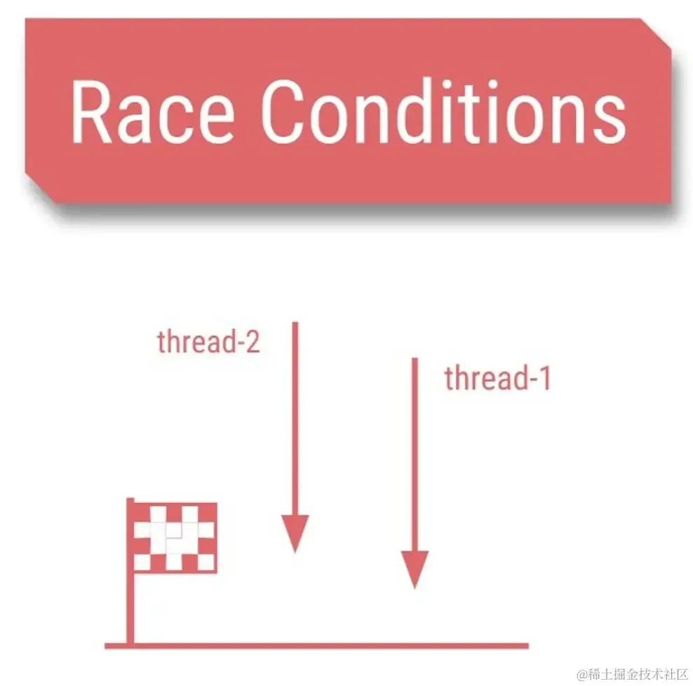
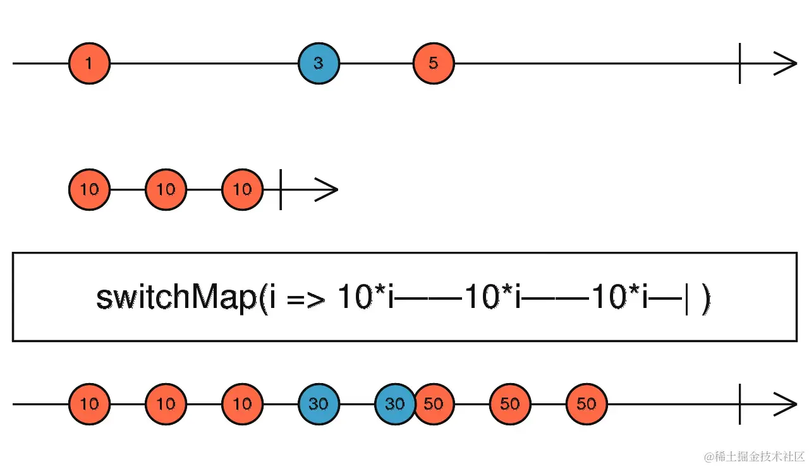
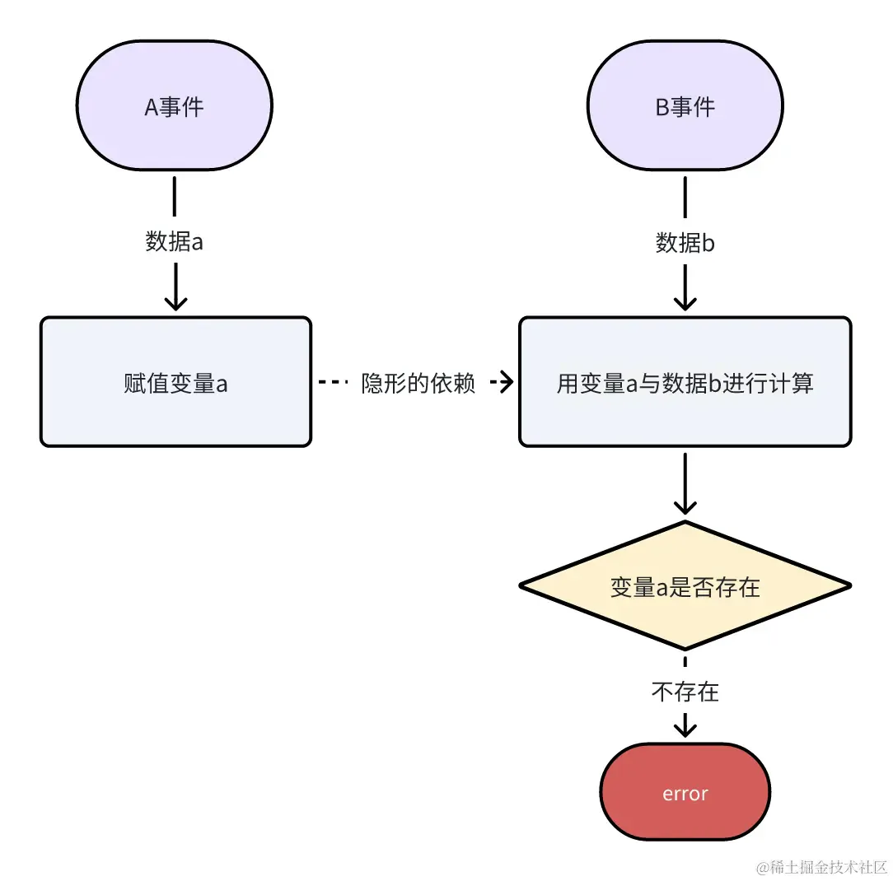

# 处理异步和并发：解决异步事件交叉而引发的隐秘、偶现的时序问题

## 目录

- [1. 竞态问题](#1-竞态问题)
  - [使用rxjs前：加上loading标识来处理并发](#使用rxjs前加上loading标识来处理并发)
  - [使用rxjs后：一个操作符即可处理并发](#使用rxjs后一个操作符即可处理并发)
- [2. 数据访问的时机不对](#2-数据访问的时机不对)
  - [隐藏问题：误以为多个事件之间存在时序依赖](#隐藏问题误以为多个事件之间存在时序依赖)
  - [combineLatest: 当 A 和 B 的数据都准备好时再计算](#combineLatest-当-A-和-B-的数据都准备好时再计算)

事件驱动编程不能很好地应对复杂繁多的异步逻辑，容易产生许多在时空上分散的切面。面对这类复杂问题/场景，使用rxjs能很好地去梳理异步代码逻辑。

### 1. 竞态问题

所谓竞态问题（`race condition`），就是两个信号试着彼此竞争，互相影响谁先输出，导致无法保证异步操作的完成会按照他们开始时同样的顺序。



举一个例子，我们设计一个美金（`USD`）和欧元（`EUR`）实时转换的应用。美元与欧元之间，一个值的变化会引起另一个值的变化，变化前需要转换。每次转换时，我们通过网络请求获取最新的汇率，并使用这个汇率进行金额转换。

由于每次转换是有延迟的，就产生了竞态的问题。比如修改美元后马上修改欧元，二者先后发起请求 **，无法确定请求返回的快慢，所以无法确定最后的修改是来自美元还是欧元。**

解决竞态问题最常见的方式**是增加一个标识，在发生A事件时，忽略/取消其他有竞争关系的事件。** 下面我们先尝试使用这个方式来解决。

#### 使用rxjs前：加上loading**标识来处理并发**

```html 
<!DOCTYPE html>
<html lang="en">

<head>
  <meta charset="UTF-8">
  <meta name="viewport" content="width=device-width, initial-scale=1.0">
  <title>实时汇率转换示例</title>
</head>

<body>
  <div>
    <label for="usd">美金 (USD): </label>
    <input type="number" id="usd" placeholder="输入美金">
  </div>
  <div>
    <label for="eur">欧元 (EUR): </label>
    <input type="number" id="eur" placeholder="输入欧元">
  </div>

  <script>
    const usdInput = document.getElementById('usd');
    const eurInput = document.getElementById('eur');

    let isUSDChanging = false;
    let isEURChanging = false;

    const fetchExchangeRate = (fromCurrency) => {
      return new Promise((resolve) => {
        setTimeout(() => {
          // 模拟一个返回汇率数据的API请求
          // 实际情况应该使用fetch或axios进行HTTP请求
          const exchangeRate = Math.random() * (1.2 - 0.8) + 0.8; // 模拟随机汇率
          resolve(exchangeRate);
        }, 1000);
      });
    };

    usdInput.addEventListener('input', async (event) => {
      isUSDChanging = true
      isEURChanging = false;
      const usdAmount = parseFloat(event.target.value);
      if (!isNaN(usdAmount)) {
        const exchangeRate = await fetchExchangeRate('USD');
        if (isUSDChanging) {
          eurInput.value = (usdAmount * exchangeRate).toFixed(2);
        }
      } else {
        eurInput.value = '';
      }
      isUSDChanging = false;
    });

    eurInput.addEventListener('input', async (event) => {
      isEURChanging = true
      isUSDChanging = false;
      const eurAmount = parseFloat(event.target.value);
      if (!isNaN(eurAmount)) {
        const exchangeRate = await fetchExchangeRate('EUR');
        if (isEURChanging) {
          usdInput.value = (eurAmount * exchangeRate).toFixed(2);
        }
      } else {
        usdInput.value = '';
      }
      isEURChanging = false;
    });
  </script>
</body>

</html>

```


这样的代码拥有 **过多状态，导致状态管理复杂** ：使用`isUSDChanging`和`isEURChanging`标识来防止数据的竞态式更新，增加了**状态管理的复杂性。**如果**逻辑处理不严格，容易导致更新循环，造成性能问题或错误。**

过多的标识让代码 **不具有可扩展性** ，假如后面要新增货币种类，比如日元、人民币，原来的代码还得要加上isJPYChanging、isCNHChanging等**标识以及相关的判断。**

#### 使用rxjs后：一个操作符即可处理并发

switchMap **只关注最新的数据流，而忽略旧的数据流。** 这是switchMap的弹珠图，注意下面的30，被 50 给截断了。



接着用switchMap来解决这个问题。在使用switchMap之前，我们需要合并一下数据源。在用 switchMap 操作符处理合并后的数据流。

```html 
<!DOCTYPE html>
<html lang="en">

<head>
  <meta charset="UTF-8">
  <meta name="viewport" content="width=device-width, initial-scale=1.0">
  <title>实时汇率转换示例</title>
</head>

<body>
  <div>
    <label for="usd">美金 (USD): </label>
    <input type="number" id="usd" placeholder="输入美金">
  </div>
  <div>
    <label for="eur">欧元 (EUR): </label>
    <input type="number" id="eur" placeholder="输入欧元">
  </div>

  <script src="https://cdnjs.cloudflare.com/ajax/libs/rxjs/7.2.0/rxjs.umd.min.js"></script>
  <script>
    const { fromEvent, merge } = rxjs;
    const { map, switchMap, startWith } = rxjs.operators;

    const usdInput = document.getElementById('usd');
    const eurInput = document.getElementById('eur');

    // 模拟获取汇率的异步函数
    const fetchExchangeRate = (fromCurrency) => {
      return new Promise((resolve, reject) => {
        setTimeout(() => {
          const exchangeRate = Math.random() * (1.2 - 0.8) + 0.8; // 模拟随机汇率
          resolve(exchangeRate);
        }, 1000);
      });
    };

    // 转换函数（运用了策略模式）
    const convertCurrency = {
      USD: async (amount) => {
        const rate = await fetchExchangeRate('USD');
        return {
          usd: amount,
          eur: (amount * rate).toFixed(2)
        };
      },
      EUR: async (amount) => {
        const rate = await fetchExchangeRate('EUR');
        return {
          eur: amount,
          usd: (amount * rate).toFixed(2)
        };
      }
    };

    // 创建输入事件流并封装公共部分
    const createInputStream = (inputElement, currency) => {
      return fromEvent(inputElement, 'input').pipe(
        map(event => ({
          currency,
          value: parseFloat(event.target.value)
        })),
        startWith({
          currency,
          value: parseFloat(inputElement.value) || 0
        })
      );
    };

    const usdInput$ = createInputStream(usdInput, 'USD');
    const eurInput$ = createInputStream(eurInput, 'EUR');

    // 合并输入事件流
    const merged$ = merge(usdInput$, eurInput$);

    // 处理合并后的事件流
    merged$.pipe(
      switchMap(data => convertCurrency[data.currency](data.value))
    ).subscribe(result => {
      if (result.usd !== undefined) usdInput.value = result.usd;
      if (result.eur !== undefined) eurInput.value = result.eur;
    });
  </script>
</body>

</html>

```


### 2. 数据访问的时机不对

#### 隐藏问题：误以为多个事件之间存在时序依赖

想象一个场景，`模块C的计算依赖了 A、B 事件带的数据，于是模块C需要等待 A 、 B 事件都触发后时才计算。`

而代码的现状这个 A 事件总是在 B 之前被触发，然后消费者也是这么认为的（可能是写代码的时候偷懒--觉得能跑就行，也可能从事件名字面意思上理解错了）

所以代码里就写成了：先从 A 拿到数据保存到一个变量a中，B事件发生后，拿到来自B的数据再与变量a继续计算。但其实 A、B两个模块并没有前后加载顺序的约定。若哪天模块A的加载不先于B，就会发生bug。



```typescript 
let dataFromA = null;

// 模块消费事件的计算函数
function onAEvent(data) {
    dataFromA = data;
    console.log("Data from A received:", dataFromA);
}

function onBEvent(data) {
    const result = computeResult(dataFromA, data);
    console.log("Computed result:", result);
}

// 模拟依赖的计算函数
function computeResult(aData, bData) {
    if (aData === null || bData === null) {
        console.error("Error: B event received before A event.");
        return;
    }
    // 假设有一些计算逻辑
    return aData + bData;
}

// 事件触发模拟
function triggerEvents() {
    // 当前假设A事件总是在B事件之前触发
    onAEvent(100); // 正常情况下，A事件先触发
    onBEvent(50);  // 然后B事件触发
}

// 模拟场景
triggerEvents();

// 现在假设事件顺序被颠倒了
dataFromA = null; // 重置
function triggerEventsWithReversedOrder() {
    onBEvent(50);  // B事件先触发
    onAEvent(100); // 然后A事件触发
}

// 触发顺序被颠倒的场景，就会报错
triggerEventsWithReversedOrder();

```


懒惰的解决方式：直接加setTimeout解决，但这样会让你的代码更加不可预测。

#### combineLatest: 当 A 和 B 的数据都准备好时再计算

如果把这个事件驱动编程换成响应式编程，直接从A、B两个数据源中直接取出数据，用于计算，那就不存在这个风险了。

用rxjs的`combineLatest`操作符去解决这个问题，`combineLatest`可以等待传入的所有数据源都发出过一次数据后，才开始发出数据。

> `除了combineLatest，还有delayWhen、forkJoin等操作符，可以延迟访问数据的时机`

弹珠图如下


代码如下：

```typescript 
import { fromEvent, combineLatest  } from 'rxjs';
import { map, filter } from 'rxjs/operators';

// 创建事件源
const aEventSource = new EventTarget();
const bEventSource = new EventTarget();

// 监听 A 事件
const aEvent$ = fromEvent(aEventSource, 'AEvent').pipe(
    map(event => event.detail) // 将事件处理成其数据部分
);

// 监听 B 事件
const bEvent$ = fromEvent(bEventSource, 'BEvent').pipe(
    map(event => event.detail) // 将事件处理成其数据部分
);

// 结合 A 和 B 事件的数据
const combined$ = combineLatest([aEvent$, bEvent$]);

// 进行计算，当 A 和 B 的数据都准备好时触发
combined$.pipe(
    filter(([aData, bData]) => aData !== null && bData !== null),
    map(([aData, bData]) => computeResult(aData, bData))
).subscribe(result => {
    console.log("Computed result:", result);
});

// 模拟计算函数
function computeResult(aData, bData) {
    return aData + bData;
}

// 模拟触发事件函数
function triggerEvents() {
    // 模拟按正确顺序触发事件
    aEventSource.dispatchEvent(new CustomEvent('AEvent', { detail: 100 }));
    bEventSource.dispatchEvent(new CustomEvent('BEvent', { detail: 50 }));
}

function triggerEventsWithReversedOrder() {
    // 模拟按颠倒顺序触发事件
    bEventSource.dispatchEvent(new CustomEvent('BEvent', { detail: 50 }));
    aEventSource.dispatchEvent(new CustomEvent('AEvent', { detail: 100 }));
}

// 测试正常顺序
triggerEvents();

// 测试顺序颠倒
triggerEventsWithReversedOrder();

```
