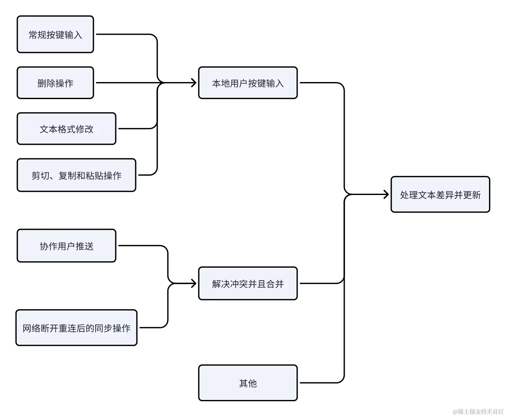
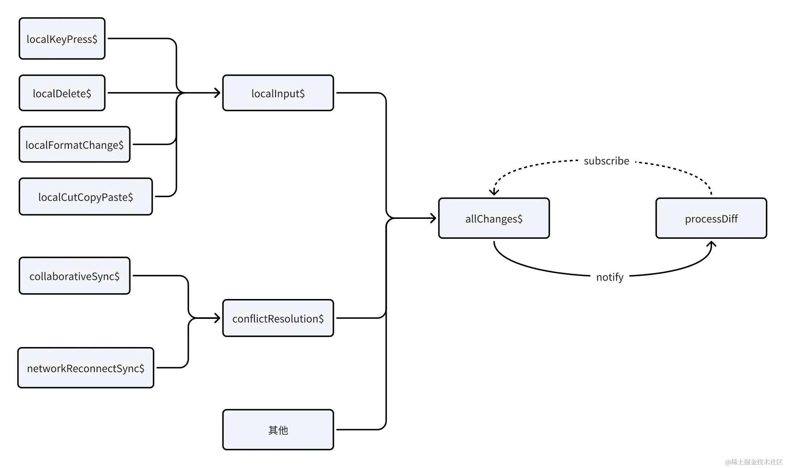

# 组合数据源：多个数据/事件来源为一个数据流

## 目录

- [使用rxjs前：以命令式的方式直接调用](#使用rxjs前以命令式的方式直接调用)
- [使用rxjs后：用响应式的方式写](#使用rxjs后用响应式的方式写)

在许多情况下，对同一数据的更新调用，可能发生在代码的多个地方，如果采用命令式编程的方式，这使得阅读、修改这个数据更新流程的代码变得困难。因此，问题的排查和新功能的迭代也变得相当麻烦。

举一个例子，在一个实时协作文本编辑器中，造成文本差异（diff）的来源是多样且复杂的，尤其在多人协作的环境中。以下是diff来源：

- 本地用户按键输入
  - 常规按键输入
  - 删除操作
  - 文本格式修改
  - 剪切、复制和粘贴操作
- 协作用户推送
  - 解决冲突并且合并
- 网络断开重连后的同步操作
  - 解决冲突并且合并
- 其他：版本管理（撤回、重做）、导入文件等等

画一下文本差异（diff）的输入输出的流程图如下：



### 使用rxjs前：以命令式的方式直接调用

以下是伪代码

```typescript 
// 常规按键输入
editor.addEventListener('keypress', () => {
    handleKeyPress()
    processDiff()
);

// 删除操作
editor.addEventListener('delete', () => {
    handleDelete()
    processDiff()
});

// 文本格式修改
editor.addEventListener('formatChange', () => {
    handleFormatChange()
    processDiff()
});

// 剪切、复制和粘贴操作
editor.addEventListener('cutCopyPaste', () => {
    handleCutCopyPaste()
    processDiff()
});

// 协作用户推送
collaborativeService.addEventListener('sync', () => {
    handleSync()
    handleConflict()
});


// 网络断开重连后的同步操作
collaborativeService.addEventListener('reconnectSync', () => {
    handleReconnectSync()
    handleConflict()
});

functionhandleConflict() {
    // ...处理冲突
    processDiff()
}


functionprocessDiff(diff) {
  // 处理具体的变更逻辑
  console.log('Processing change:', diff);
  updateDocument(diff); // 文本更新函数
}

```


可以看到，如果命令式地在每个数据diff源中去调用`，每多一个数据源，就可能要调用一次processDiff`。比较难维护，随着数据源地增加、代码量的增加，很容易造成更新逻辑分散、更新时机随意。

### 使用rxjs后：用响应式的方式写

数据流动图



以下是伪代码

```typescript title="// 常规按键输入
const localKeyPress$ = fromEvent(editor, 'keypress').pipe(handleKeyPress);
// 删除操作
const localDelete$ = fromEvent(editor, 'delete').pipe(handleDelete);
// 文本格式修改
const localFormatChange$ = fromEvent(editor, 'formatChange').pipe(handleFormatChange);
// 剪切、复制和粘贴操作
const localCutCopyPaste$ = fromEvent(editor, 'cutCopyPaste').pipe(handleCutCopyPaste);

// 本地用户按键输入数据源的合并
const localInput$ = merge(
localKeyPress,
    localDelete,
localFormatChange,
    localCutCopyPaste,
);

// 协作用户推送
const collaborativeSync$ = fromEvent(collaborativeService, 'sync');

// 网络断开重连后的同步操作
const networkReconnectSync$ = fromEvent(networkService, 'reconnectSync');

// 将可能需要解决冲突的数据源合并
const conflictResolution$ = merge(
collaborativeSync,
    networkReconnectSync,
).pipe(hanldeConflict);

// 合并所有事件源
const allChanges$ = merge(
conflictResolution,
    localInput,
);

// 订阅并且处理文本diff
const allChanges$.subscribe(functionprocessDiff(diff) {
// 处理具体的变更逻辑
console.log('Processing change:', diff);
updateDocument(diff); // 文本更新函数
});"
// 常规按键输入
const localKeyPress$ = fromEvent(editor, 'keypress').pipe(handleKeyPress);
// 删除操作 
const localDelete$ = fromEvent(editor, 'delete').pipe(handleDelete);
// 文本格式修改
const localFormatChange$ = fromEvent(editor, 'formatChange').pipe(handleFormatChange);
// 剪切、复制和粘贴操作
const localCutCopyPaste$ = fromEvent(editor, 'cutCopyPaste').pipe(handleCutCopyPaste);  

// 本地用户按键输入数据源的合并
const localInput$ = merge(
    localKeyPress$,
    localDelete$,
    localFormatChange$,
    localCutCopyPaste$,
);

// 协作用户推送
const collaborativeSync$ = fromEvent(collaborativeService, 'sync'); 

// 网络断开重连后的同步操作
const networkReconnectSync$ = fromEvent(networkService, 'reconnectSync');  

// 将可能需要解决冲突的数据源合并
const conflictResolution$ = merge(
    collaborativeSync$,
    networkReconnectSync$,
).pipe(hanldeConflict);

// 合并所有事件源
const allChanges$ = merge(
    conflictResolution$,
    localInput$,
);

// 订阅并且处理文本diff
const allChanges$.subscribe(functionprocessDiff(diff) {
    // 处理具体的变更逻辑
    console.log('Processing change:', diff);
    updateDocument(diff); // 文本更新函数
});

```


而通过 `rxjs` 的 `merge` **操作符来汇总不同的数据源**，合并成一个数据流，就像所有支流汇进一个江河一样，让数据的输入输出被组织、被监控。 不仅数据的来源非常清晰，也更容易维护和迭代。在merge函数中可以看到所有的数据来源，每次有新的数据源也只需在 merge 中添加。 同时也更加方便日志建设和排除问题。
