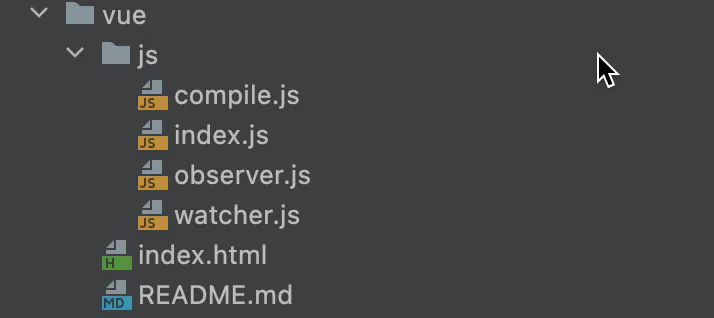

# defineProperty

## 目录

- [proxy](#proxy)
  - [特点:](#特点)
  - [ 优势:](#-优势)
- [defineProperty](#defineProperty)
  - [目录结构](#目录结构)
  - [代码](#代码)
    - [index.html](#indexhtml)
    - [watcher.js](#watcherjs)
    - [observer.js](#observerjs)
    - [index.js](#indexjs)
    - [compile.js](#compilejs)

[https://mp.weixin.qq.com/s/SPoxin9LYJ4Bp0goliEaUw](https://mp.weixin.qq.com/s/SPoxin9LYJ4Bp0goliEaUw "https://mp.weixin.qq.com/s/SPoxin9LYJ4Bp0goliEaUw")      ----详细
[http://www.cnblogs.com/xiaoyuchen/p/10547696.html](http://www.cnblogs.com/xiaoyuchen/p/10547696.html "http://www.cnblogs.com/xiaoyuchen/p/10547696.html")         

## proxy

在数据劫持这个问题上，**Proxy 可以被认为是 Object.defineProperty() 的升级版。**

#### **特点:**

**和Object.defineProperty的区别****1.外界对某个对象的访问，都必须经过这层拦截。****因此它是针对 整个对象，而不是 对象的某个属性**，所以也就不需要对 keys 进行遍历。这解决了上述 Object.defineProperty() 的第二个问题。
**2.支持数组Proxy 不需要对数组的方法进行重载，省去了众多 hack；原生就支持**，减少代码量等于减少了维护成本，而且标准的就是最好的。
**3****.Proxy 也是不支持嵌套的,需要递归**

#### **优势:**

**1.** Proxy 的第二个参数可以有 13 种拦截方法，这比起 Object.defineProperty() 要更加丰富**2**.Proxy 作为新标准受到浏览器厂商的重点关注和性能优化，相比之下 Object.defineProperty() 是一个已有的老方法。

```typescript 
 let obj = {
  info: {
    name: 'eason',
    blogs: ['webpack', 'babel', 'cache']
  }
}
let handler = {
  get (target, key, receiver) {
    console.log('get', key)
    // 递归创建并返回
     if (typeof target[key] === 'object' && target[key] !== null) {
      return new Proxy(target[key], handler)
    }
    return Reflect.get(target, key, receiver)
   },
  set (target, key, value, receiver) {
    console.log('set', key, value)
     return Reflect.set(target, key, value, receiver)
   }
}
let proxy = new Proxy(obj, handler)
// 以下两句都能够进入 set
proxy.info.name = 'Zoe'
proxy.info.blogs.push('proxy')
```


## defineProperty

```typescript 
//核心api： 
object.defineProperty(data,key,{
    configurable:true , //configrable 描述属性是否配置，以及可否删除 他本身就是一个配置项
    enumerable:true, //属性是否会出现在for in 或者Object。keys（） 的遍历中
    get:function getter(){ //参考computed 中的get
        if(Dep.target){
            dep.addSub(Dep.target)
        }
        return val
    },
    set:function setter(newVal){
        if(newVal === val){
            return
        }
        val = newVal
        dep.notify()
    }
})

```


[vue的双向绑定.rar](./assets/file/vue的双向绑定_Sr_AKCLSNl.rar "vue的双向绑定.rar")

[testLib.rar](./assets/file/testLib_ArCWdSNERN.rar "testLib.rar")

```纯文本 


关键要看懂 compile.js  和 index.js  配合 observer.js
watcher 的作用是 配合 Dep ，进行一个添加并更新，执行跟新后的回调，否者毫无作用，
其实单独触发get 并没有特定的作用，watcher 的存在就是让dep 配合watcher 缓存自己，释放自己，watcher 谁，就把data 和 {{data}} 给动态绑定在一起了，实现了一个数据驱动
```


### 目录结构



### 代码

#### index.html

```typescript 
<!DOCTYPE html>
<html lang="en">
<head>
    <meta charset="UTF-8">
    <title>self-vue</title>
</head>
<style>
    #app {
        text-align: center;
    }
</style>
<body>
    <div id="app">
        <h2>{{title}}</h2>
        <input v-model="name">
        <h1>{{name}}</h1>
        <button v-on:click="clickMe">click me!</button>
    </div>
</body>
<script src="js/observer.js"></script>
<script src="js/watcher.js"></script>
<script src="js/compile.js"></script>
<script src="js/index.js"></script>
<script type="text/javascript">

     new SelfVue({
        el: '#app',
        data: {
            title: 'hello world',
            name: 'canfoo'
        },
        methods: {
            clickMe: function () {
                this.title = 'hello world';
            }
        },
        mounted: function () {
            window.setTimeout(() => {
                this.title = '你好';
            }, 1000);
        }
    });

</script>
</html>

```


#### watcher.js

订阅者 Watcher，可以**收到属性的变化通知并执行相应的方法，从而更新视图；**

```typescript 
function Watcher(vm, exp, cb) {
    this.cb = cb;
    this.vm = vm;
    this.exp = exp;
    this.value = this.get();  //  将自己添加到订阅器的操作 
}

Watcher.prototype = {
    update: function() {
        this.run();
    },
    run: function() {
        var value = this.vm.data[this.exp];
        var oldVal = this.value;
        if (value !== oldVal) {
            this.value = value;
            this.cb.call(this.vm, value, oldVal);
        }     
    },
    get: function() {
        Dep.target = this;  // 缓存自己
        var value = this.vm.data[this.exp]  // 强制执行observe里的get函数
        Dep.target = null;  // 释放自己
        return value;
    }
};
```


#### observer.js

监听器 Observer ，**用来劫持并监听所有属性，如果属性发生变化**，就通知订阅者

```typescript 
function Observer(data) {
    this.data = data;
    this.walk(data);
}

Observer.prototype = {
    walk: function(data) {
        var self = this;
         // 遍历data中的每个key；每一个key也对应一个订阅器；订阅里面收集了该key订阅者；哪里使用key；就收集到订阅器里来；这个过程称作为依赖收集
         Object.keys(data).forEach(function (key) {
            self.defineReactive(data, key, data[key]);
        });
    },
    defineReactive: function(data, key, val) {
        var dep = new Dep();

        //  这里是递归的观测 val 是object的情况 
        var childObj = observe(val);
        Object.defineProperty(data, key, {
            enumerable: true,
            configurable: true,
            get: function getter () {
                // 读取data中数据的时候,
                if (Dep.target) {
                    // 如果Dep.target存在就把他添加到容器里,且Dep.target 有一个update方法 
                    dep.addSub(Dep.target);
                }
                // 返回读取的值
                return val;
            },
            set: function setter(newVal) {
                // 设置data中数据的时候
                if (newVal === val) {
                    return;
                }
                // 如果两次的值对比不一样,就把新的值赋给老值;
                val = newVal;
                / / 容器里所有的值跟新 
                dep.notify();
            }
        });
    }
};


//index 那边过来先执行这里 ,value ==this.data 存在且是个数组对象
function observe(value, vm) {
    if (!value || typeof value !== 'object') {
        return;
    }
    // value  --> vm.$data
    return new Observer(value);
};

 //订阅器 Dep，用来收集订阅者，对监听器 Observer 和 订阅者 Watcher 进行统一管理； 
function Dep() {
    // 一个数组容器
    this.subs = [];
}
Dep.prototype = {
    // 把sub添加到容器里
    addSub: function(sub) {
        this.subs.push(sub);
    },
    // 更新容器里所有的值
    notify: function() {
        this.subs.forEach(function(sub) {
            sub.update();
        });
    }
};
// 这个地方相当于 一个开关；其值就是watcher实例 
 Dep.target = null; 


```


#### index.js

```typescript 
function SelfVue (options) {
    var self = this;
    this.data = options.data;
    this.methods = options.methods;

    //  通过 selfvue实例,循环劫持所有的data中的key;使其能够通过实例的this 直接能访问到data里的属性； 
    Object.keys(this.data).forEach(function(key) {
        self.proxyKeys(key);
    });

    //  观测this.data,
     observe(this.data);
    //  编译类  
    new Compile(options.el, this);
    options.mounted.call(this); //  所有事情处理好后执行mounted函数 
}
SelfVue.prototype = {
    proxyKeys: function (key) {
        var self = this;
        Object.defineProperty(this, key, {
            enumerable: false,
            configurable: true,
            get: function getter () {
                return self.data[key];
            },
            set: function setter (newVal) {
                self.data[key] = newVal;
            }
        });
    }
}
```


#### compile.js

解析器 Compile，**可以解析每个节点的相关指令，对模板数据和订阅器进行初始化。**

```typescript 
function Compile(el, vm) {
    // 把根元素和,vm实例穿过来 
    this.vm = vm;
    this.el = document.querySelector(el);
    this.fragment = null;
    this.init();
}

Compile.prototype = {
    init: function () {
        if (this.el) {
            this.fragment = this.nodeToFragment(this.el);
            this.compileElement(this.fragment);
            this.el.appendChild(this.fragment);
        } else {
            console.log('Dom元素不存在');
        }
    },
    // 把el 移动到 一个新的元素片段里；但是没有添加到文档里
    nodeToFragment: function (el) {
        var fragment = document.createDocumentFragment();
        var child = el.firstChild;
        while (child) {
            // 将Dom元素移入fragment中
            fragment.appendChild(child);
            child = el.firstChild
        }
        return fragment;
    },
    / / 递归的编译挂载节点下的所有元素 
    compileElement: function (el) {
        var childNodes = el.childNodes;
        var self = this;
        [].slice.call(childNodes).forEach(function(node) {
            var reg = /\{\{(.*)\}\}/;
            var text = node.textContent;
            if (self.isElementNode(node)) {  
                self.compile(node);
            } else if (self.isTextNode(node) && reg.test(text)) {
                self.compileText(node, reg.exec(text)[1]);
            }
            if (node.childNodes && node.childNodes.length) {
                self.compileElement(node);
            } 
        });
    },
    compile: function(node) {
        var nodeAttrs = node.attributes;
        var self = this;
        Array.prototype.forEach.call(nodeAttrs, function(attr) {
            var attrName = attr.name;
            if (self.isDirective(attrName)) {
                var exp = attr.value;
                var dir = attrName.substring(2);
                if (self.isEventDirective(dir)) {  // 事件指令
                    self.compileEvent(node, self.vm, exp, dir);
                } else {  // v-model 指令
                    self.compileModel(node, self.vm, exp, dir);
                }
                node.removeAttribute(attrName);
            }
        });
    },
    compileText: function(node, exp) {
        var self = this;
        var initText = this.vm[exp];
        this.updateText(node, initText); // 初始化
         // 每new 一次 watcher 就是把exp的订阅者添加到订阅器Dep里面；也称作为依赖收集； 文本依赖 
         new Watcher(this.vm, exp, function (value) {
            self.updateText(node, value);
        });
    },
    compileEvent: function (node, vm, exp, dir) {
      var eventType = dir.split(':')[1];
        var cb = vm.methods && vm.methods[exp];
        if (eventType && cb) {
            node.addEventListener(eventType, cb.bind(vm), false);
        }
    },
    compileModel: function (node, vm, exp, dir) {
        var self = this;
        var val = this.vm[exp];
        this.modelUpdater(node, val);
         // 每new 一次 watcher 就是把exp的订阅者添加到订阅器Dep里面；也称作为依赖收集；v-modal 指令依赖；都是订阅者 
        new Watcher(this.vm, exp, function (value) {
            self.modelUpdater(node, value);
        });
        node.addEventListener('input', function(e) {
            var newValue = e.target.value;
            if (val === newValue) {
                return;
            }
            self.vm[exp] = newValue;
            val = newValue;
        });
    },
    updateText: function (node, value) {
        node.textContent = typeof value == 'undefined' ? '' : value;
    },
    modelUpdater: function(node, value, oldValue) {
        node.value = typeof value == 'undefined' ? '' : value;
    },
    isDirective: function(attr) {
        return attr.indexOf('v-') == 0;
    },
    isEventDirective: function(dir) {
        return dir.indexOf('on:') === 0;
    },
    isElementNode: function (node) {
        return node.nodeType == 1;
    },
    isTextNode: function(node) {
        return node.nodeType == 3;
    }
}
```
