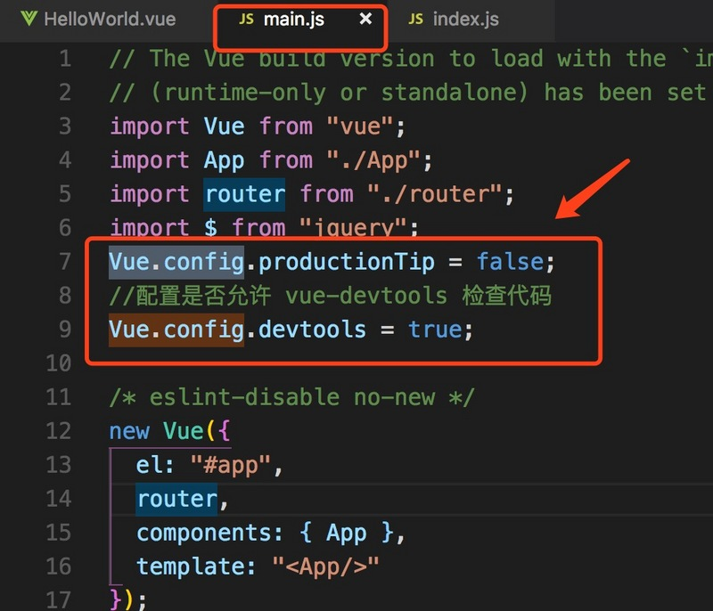
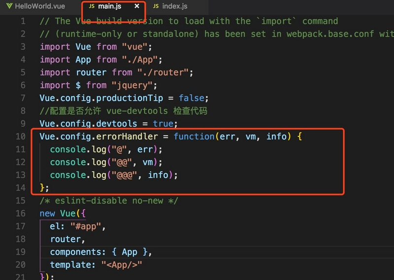
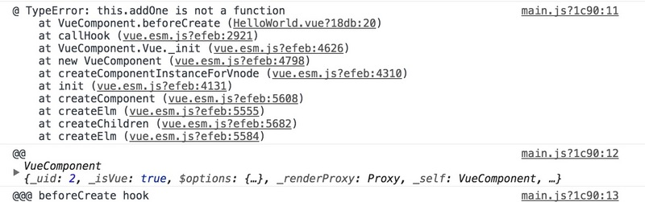

# Vue官方文档——详解&#x20;

## 目录

- [Vue官方文档——详解](#Vue官方文档详解)
  - [Vue官方文档——详解 ( Vue 2.\*版本 )](#Vue官方文档详解--Vue-2版本-)
    - [〇、Vue中不能使用箭头函数地方](#〇Vue中不能使用箭头函数地方)
    - [一、全局配置](#一全局配置)
    - [二、全局API](#二全局API)
    - [三、选项/数据](#三选项数据)
    - [四、选项/DOM](#四选项DOM)
    - [你可能感兴趣的](#你可能感兴趣的)
  - [推广链接](#推广链接)

# [Vue官方文档——详解](https://segmentfault.com/a/1190000014542373 "Vue官方文档——详解")

[原创](https://segmentfault.com/a/1190000014542373 "原创")

[vue.js](https://segmentfault.com/t/vue.js/blogs "vue.js")

3.1k 次阅读  ·  读完需要 27 分钟

### Vue官方文档——详解 ( Vue 2.\*版本 )

#### 〇、Vue中不能使用箭头函数地方

**1、生命周期函数中不能使用箭头函数**

**2、data函数不能使用箭头函数**

**3、watch中不能使用箭头函数**

**4、methods中不能使用箭头函数**

**5、computed不能使用箭头函数**

#### 一、全局配置

Vue.config 是一个对象，包含 Vue 的全局配置，vue.config的配置全部在在main.js中设置的，如下：

官网中给出的常用配置如下：

**(1)、devtools**

//用法

// 务必在加载 Vue 之后，立即同步设置以下内容

Vue

.config.devtools =

true

//devtools可以通过开发环境配置

Vue

.config.devTools = process.env.

NODE\_ENV

!==

'productio

n'

配置是否允许 vue-devtools 检查代码。开发版本默认为 true，生产版本默认为 false。生产版本设为 true 可以启用检查。

**(2)、errorHandler**

//用法

Vue.config.errorHandler =

function

(err, vm, info)

{

// handle error

// \`info\` 是 Vue 特定的错误信息，比如错误所在的生命周期钩子

// 只在 2.2.0+ 可用

}

> 实例如下：

首先在全局中配置errorHandler，并输出全部参数项。

然后，在组件中的beforeCreate周期时调用methods中的方法，这样操作肯定会报错

最后，得到的报错信息如下：（这样是我们通过errorHandler抓到的错误信息啦，so easy \~\~\~）

**注意：info 是 Vue 特定的错误信息，比如错误所在的生命周期钩子，即控制台中显示的：“@@@ beforeCreate hook"**

**(3)、productionTip**

对于开发版本，会默认向控制台打印：

//设置为

false

就不会提示了

Vue.

config

.productionTip =

false

;

**(4)、performance**

//通过环境配置 performance是否可用

Vue

.config.performance = process.env.

NODE\_ENV

!==

'productio

n'

Chrome需要安装插件：

通过插件Vue performance可以看到每个组件的时间分配：

描述：

Init：在beforeCreate和created周期花费的总时长。

Render:

在js中创建实例的时长。

Patch:

页面渲染的时长。

#### 二、全局API

> **定义：**
> 全局API并不在构造器里，而是先声明全局变量或者直接在Vue上定义一些新功能，Vue内置了一些全局API，简而言之就是，在构造器外部用Vue提供给我们的API函数来定义新的功能。

**1、Vue.extend用于创建一个子类Vue,用\$mount来挂载**

> 注意：Vue.extend()中的data是函数。

**2、Vue.nextTick(\[callback,context])在下次 DOM 更新循环结束之后执行延迟回调。在修改数据之后立即使用这个方法，获取更新后的DOM。**

**3、Vue.set( target, key, value) :设置对象的属性，确保属性被创建后是响应式的，同时触发视图更新。这个方法主要用于避开 Vue 不能检测属性被添加的限制。**

> Vue.set为什么存在？原因：由于Javascript的限制，Vue不能自动检测以下变动的数组。改变下标的时候vue不能再检测到。因此Vue.set可以检测到并更新视图。

> 注意：（1）、普通方式直接改属性值，数据并不会更新，DOM也不会更新。

//普通方式如下

methods：{

setFunction (){

//这种修改方式,控制台通过Vue扩展工具不能得到最新的data.

this

.arr\[

0

] =

'北京紫禁城'

}

}

> （2）、Vue 不允许在已经创建的实例上动态添加新的根级响应式属性(root-level reactive property)。然而它可以使用 Vue.set(object, key, value) 方法将响应属性添加到嵌套的对象上。
> 即Vue.set 不能直接在给data添加新的属性，只能在data已有属性上进行嵌套。

**4、Vue.delete(target,key):删除对象的属性。如果对象是响应式的，确保删除能触发更新视图。这个方法主要用于避开 Vue 不能检测到属性被删除的限制。**

**5、Vue.delete(target,key):删除对象的属性。如果对象是响应式的，确保删除能触发更新视图。这个方法主要用于避开 Vue 不能检测到属性被删除的限制。**

**6、Vue. directive :注册全局指令**

> 定义的指令中 "el" 属性指所绑定的元素，可以用来直接操作DOM。

**bind：只调用一次，指令第一次绑定到元素时调用，用这个钩子函数可以定义一个在绑定时执行一次的初始化动作。**

**inserted:被绑定元素插入父节点是调用（父节点存在即可调用，不必存在于document中）。【插入完之后调用】**

**update:被绑定元素所在模板更新时调用，而无论绑定值是否变化。通过比较更新前后的绑定值，可以忽略不必要的模板更新。【常用】**

**componentUpdated：被绑定元素所在模板完成一次更新周期时调用。**

**unbind: 只调用一次， 指令与元素解绑时调用。**

**7、Vue.filter注册全局过滤器**

**过滤器可以管道式链接过滤，管道符："|"**

**8、Vue.component注册全局组件**

> 全局注册的组件可以在多个构造器中使用，但是局部注册的组件只能在组件注册的作用域里进行使用，其他作用域使用无效。

> 从代码中你可以看出，局部注册其实就是写在构造器。但是需要注意，构造器里的components 是加s的，而全局注册是不加s的。

**9、Vue.use安装Vue插件**

比如：使用vue-router,首先npm install vue-router --save-dev,然后在main.js文件中通过import引入vue,vue-router模块和需要使用的组件，必须通过Vue.use()安装相应功能，如：Vue.use(VueRouter)。

**10、Vue.version获取安装的Vue版本号**

**11、Vue.compile**

**12、Vue.mixin**

#### 三、选项/数据

**1、data 数据**

//直接创建一个实例

var

vm = new

Vue

({

//

data

为对象

data

:{

a

:1}

})

//

Vue

.extend中

data

是函数

var

myVue =

Vue

.extend({

data

:function(){

return

{

a

:1}

}

})

//vue-cli搭建的项目中单个组件的

data

是函数

\<template>

\

\<h1>我是：{{msg}}\</h1>

\

\</template>

\

\

**2、props : 父传子信息**

**3、propsData**

propsData在实际开发中我们使用的并不多，我们在后边会学到Vuex的应用，他的作用就是在单页应用中保持状态和数据的。

**4、computed**

> computed有 get和 set属性

**5、methods**

> 定义方法

**6、watch**

> watch 监听data属性变化

#### 四、选项/DOM

**1、el**

为实例提供挂载元素

**2、template**

> 模版三种方法:

(1)、直接在构造器的template中编写，其中，模板的标识符使用的是tab键上的键：\`\`

var

app=

new

Vue({

el:

'#app'

,

data:{

message:

'hello Vue!'

},

template:

\`\<h1 style="color:red">我是选项模板\</h1>\`

})

(2)、写在\<Template>标签里的模板：

<

template

id

\=

"demo2"

\>

<

h2

style

\=

"color:red"

\>

我是template标签模板

\</

h2

\>

\</

template

\>

<

script

type

\=

"text/javascript"

\>

var

app=

new

Vue({

el:

'#app'

,

data:{

message:

'hello Vue!'

},

template:

'#demo2'

})

\</

script

\>

（3）、script标签模板：

<

script

type

\=

"x-template"

id

\=

"demo3"

\>

<

h2

style

\=

"color:red"

\>

我是script标签模板

\</

h2

\>

\</

script

\>

<

script

type

\=

"text/javascript"

\>

var

app=

new

Vue({

el:

'#app'

,

data:{

message:

'hello Vue!'

},

template:

'#demo3'

})

\</

script

\>

**3、render**

官方文档：

[https://vuefe.cn/v2/guide/ren...](https://vuefe.cn/v2/guide/render-function.html "https://vuefe.cn/v2/guide/ren...")

（1）、 createElement参数：{String | Object | Function}，string必选。基础用法如下：

得到的前端页面结构如下：

（2）、Object参数，可选

<

body

\>

<

div

id

\=

"app"

\>

<

elem

\>

\</

elem

\>

\</

div

\>

<

script

\>

Vue.component(

"elem"

, {

render:

function

(createElement)

{

return

createElement(

"strong"

,

//设置object对象中包含的属性

{

// 和 \`v-bind:class\` 的 API 相同

"class"

: {

foo:

true

,

bar:&#x20;

false

},

// 和 \`v-bind:style\` 的 API 相同

style: {

color:

"red"

,

fontSize:&#x20;

"20px"

},

// 普通的 HTML 属性

attrs: {

id:&#x20;

"foo"

},

// DOM 属性

domProps: {

innerHTML:&#x20;

"我是测试，我是测试，我是测试"

}

})

}

});

new

Vue({

el:&#x20;

"#app"

})

\</

script

\>

\</

body

\>

这样得到的结果如下：（标签属性值已设置）

（3）、createElement函数构建而成的数组

<

body

\>

<

div

id

\=

"app"

\>

<

elem

\>

\</

elem

\>

\</

div

\>

<

script

\>

Vue.component(

"elem"

, {

render:

function

(createElement)

{

//使用字符串生成文本节点

// return createElement('div', '文本');

return

createElement(

"div"

,

//由createElement函数构建而成的数组

\[

//createElement函数返回VNode对象

createElement(

"h1"

,

"主标题"

),

createElement(

"h2"

,

"副标题"

)

])

}

});

new

Vue({

el:&#x20;

"#app"

})

\</

script

\>

\</

body

\>

这样得到的结果如下：

（4）、两种组件写法

[新浪微博](http://loadhtml/# "新浪微博")

[微信](http://loadhtml/# "微信")

[Twitter](http://loadhtml/# "Twitter")

[Facebook](http://loadhtml/# "Facebook")

#### 你可能感兴趣的

- [**亲力亲为 vue 生命周期**](http://segmentfault.com/a/1190000012282412 "亲力亲为 vue 生命周期")hack\_qtxz[vue.js](https://segmentfault.com/t/vue.js "vue.js")[javascript](https://segmentfault.com/t/javascript "javascript")
- [**vue 父组件通过props向子组件传递方法的方式**](http://segmentfault.com/a/1190000010507616 "vue 父组件通过props向子组件传递方法的方式")睁眼的不二[vue.js](https://segmentfault.com/t/vue.js "vue.js")[javascript](https://segmentfault.com/t/javascript "javascript")
- [**详解vue生命周期**](http://segmentfault.com/a/1190000011381906 "详解vue生命周期")fsrookie[vue.js](https://segmentfault.com/t/vue.js "vue.js")[前端](https://segmentfault.com/t/%E5%89%8D%E7%AB%AF "前端")[javascript](https://segmentfault.com/t/javascript "javascript")
- [**vue中extend，mixins，extends，components,install的几个操作**](http://segmentfault.com/a/1190000015608340 "vue中extend，mixins，extends，components,install的几个操作")火狼[vue.js](https://segmentfault.com/t/vue.js "vue.js")[javascript](https://segmentfault.com/t/javascript "javascript")[html](https://segmentfault.com/t/html "html")
- [**VUE 相关问题积累**](http://segmentfault.com/a/1190000013814586 "VUE 相关问题积累")toutouping[vue.js](https://segmentfault.com/t/vue.js "vue.js")
- [**vue学习笔记(2)--vue简介**](http://segmentfault.com/a/1190000014099015 "vue学习笔记(2)--vue简介")ghost0423[vue.js](https://segmentfault.com/t/vue.js "vue.js")
- [**Vue学习第二天**](http://segmentfault.com/a/1190000015725439 "Vue学习第二天")1461433958[vue.js](https://segmentfault.com/t/vue.js "vue.js")
- [**Vue 教程第八篇—— 自定义指令**](http://segmentfault.com/a/1190000014463049 "Vue 教程第八篇—— 自定义指令")DK\_Lan[vue.js](https://segmentfault.com/t/vue.js "vue.js")

**评论**

[默认排序](http://loadhtml/# "默认排序")

[时间排序](http://loadhtml/# "时间排序")

[想在上方展示你的广告？](https://segmentfault.com/sponsor "想在上方展示你的广告？")

### 推广链接

[**iView 实战系列课程**](https://sponsor.segmentfault.com/ck.php?oaparams=2__bannerid=53__zoneid=7__cb=981302e53b__oadest=https%3A%2F%2Fsegmentfault.com%2Fls%2F1650000016424063 "iView 实战系列课程")

[\[限时优惠\]](https://sponsor.segmentfault.com/ck.php?oaparams=2__bannerid=53__zoneid=7__cb=981302e53b__oadest=https%3A%2F%2Fsegmentfault.com%2Fls%2F1650000016424063 "\[限时优惠]")

[知名开源组件库作者讲授](https://sponsor.segmentfault.com/ck.php?oaparams=2__bannerid=53__zoneid=7__cb=981302e53b__oadest=https%3A%2F%2Fsegmentfault.com%2Fls%2F1650000016424063 "知名开源组件库作者讲授")

[**Java 微服务实践课**](https://sponsor.segmentfault.com/ck.php?oaparams=2__bannerid=57__zoneid=9__cb=4ec17af7d9__oadest=https%3A%2F%2Fsegmentfault.com%2Fls%2F1650000011387052 "Java 微服务实践课")

[上千人学习过的微服务实栈课](https://sponsor.segmentfault.com/ck.php?oaparams=2__bannerid=57__zoneid=9__cb=4ec17af7d9__oadest=https%3A%2F%2Fsegmentfault.com%2Fls%2F1650000011387052 "上千人学习过的微服务实栈课")

[**大神的PHP 进阶之路**](https://sponsor.segmentfault.com/ck.php?oaparams=2__bannerid=56__zoneid=10__cb=0317cb962d__oadest=https%3A%2F%2Fsegmentfault.com%2Fls%2F1650000011318558 "大神的PHP 进阶之路")

[亿级 PV 项目的架构梳理，性能提升实战](https://sponsor.segmentfault.com/ck.php?oaparams=2__bannerid=56__zoneid=10__cb=0317cb962d__oadest=https%3A%2F%2Fsegmentfault.com%2Fls%2F1650000011318558 "亿级 PV 项目的架构梳理，性能提升实战")

[**Vue 技术栈开发实战**](https://sponsor.segmentfault.com/ck.php?oaparams=2__bannerid=47__zoneid=15__cb=4206a53bb6__oadest=https%3A%2F%2Fsegmentfault.com%2Fls%2F1650000016221751 "Vue 技术栈开发实战")

[iView 核心开发者带你掌握 Vue 精髓](https://sponsor.segmentfault.com/ck.php?oaparams=2__bannerid=47__zoneid=15__cb=4206a53bb6__oadest=https%3A%2F%2Fsegmentfault.com%2Fls%2F1650000016221751 "iView 核心开发者带你掌握 Vue 精髓")

