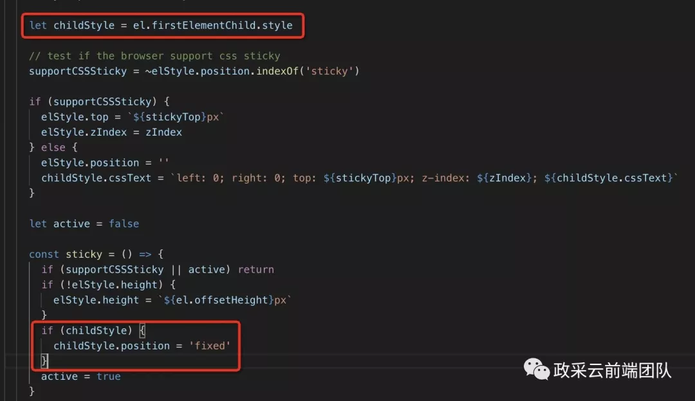

# 吸顶

## 目录

- [实现方式](#实现方式)
- [生效条件](#生效条件)
- [问题汇总](#问题汇总)
  - [◎ 吸顶“叠罗汉” ](#-吸顶叠罗汉-)
  - [◎ 吸顶“舍不得离开” ](#-吸顶舍不得离开-)
  - [◎ 吸顶“难舍难分” ](#-吸顶难舍难分-)
  - [◎ 吸顶“变形” ](#-吸顶变形-)
- [注意事项](#注意事项)
- [优化点](#优化点)

近日，在做活动页的过程中遇到两层吸顶的需求，并且要兼容 IE9 及以上的浏览器。乍一看不就是个吸顶嘛，应该不难吧，事实证明还是踩了很多坑才出来。兼容性问题多到吐血，我太难了。废话不多说，先看一下两层吸顶的最终实现效果，如下图所示。&#x20;


功能点：两层吸顶，因为 Tabs 区域比较长所以在滚动过程中点击一层 Tabs 会回弹至一层吸顶刚吸顶的位置，这个功能点和锚点有些类似。二层 Tabs 通过 hover 切换，没有回弹效果。&#x20;

## 实现方式

本文主要通过  VueSticky  插件来实现吸顶，实现步骤描述如下：&#x20;

- 安装：npm install vue-sticky --save
- 引入:   import VueSticky from "vue-sticky"
- 使用：

```javascript 
 directives: {      'sticky': VueSticky,  },   
```


```javascript 
 <ELEMENT  v-sticky="{ zIndex: NUMBER, stickyTop: NUMBER, disabled: [true|false]}"]]>  <div]]> <!-- sticky wrapper, IMPORTANT -->     CONTENT    </div]]></ELEMENT]]>
```


看了  VueSticky  的源码后将该插件的实现原理简要概括如下：&#x20;

首先判断该浏览器是否支持  position:sticky;，若支持就用  position:sticky;  来实现，若不支持就用  position:fixed;  的方式实现&#x20;

所以大家不用担心兼容性问题，因为我已经帮大家测试过了，IE9 及以上的浏览器都可以支持。&#x20;

## 生效条件

需要注意的是，使用 v-sticky 有几个必要条件，否则会失效：&#x20;

- 父元素不能设置  overflow:hidden  或者  overflow:auto  属性
- 至少指定 top 、bottom 、left 、right  4  个值中的一个，否则只会处于相对定位
- 父元素的高度不能低于 sticky 元素的高度
- sticky 元素仅在其父元素内生效

## 问题汇总

### ◎ 吸顶“叠罗汉”&#x20;

吸顶元素在滚动到组件底部时，在谷歌、火狐等浏览器中，两层吸顶在消失过程中有重叠现象，具体现象如下图所示:&#x20;


主要原因：第一层吸顶还符合吸顶条件，第二层吸顶已经开始消失解决方案：给第一层吸顶元素添加  minHeight  属性，其大小为第一层吸顶元素的高度与第二层吸顶元素的高度的和。这里有一个需要注意的点在于：一开始第一层吸顶元素的高度并非两者之和，所以这里就需要监听滚动事件，在吸顶元素距离底部的距离为两者高度之和的位置处给第一层吸顶元素添加   minHeight  属性

以下代码块中，sumHeight 表示两个吸顶元素的高度和，initialHeight 表示的是第一层吸顶元素的高度&#x20;

```javascript 
 const offsetTop = document.querySelector(".xxx").offsetBottom;    
if (offsetBottom <= sumHeight) {        
  document.querySelector(".xxx").style.minHeight = sumHeight;   
} else {        
  document.querySelector(".xxx").style.minHeight = initialHeight;    
}   
```


### ◎ 吸顶“舍不得离开”&#x20;

在 IE 浏览器中，吸顶元素滚动到组件底部时不消失，具体现象如下图所示&#x20;


主要原因：在滚动过程中吸顶元素的 position:sticky; 属性始终存在

解决方案：监听滚动事件，当滚动到组件底部时，将 v-sticky="{ stickyTop: 0, disabled: false }" 中的 disabled 的值设为 true 即可&#x20;

### ◎ 吸顶“难舍难分”&#x20;

在 IE 浏览器中，两层吸顶元素始终吸在一起&#x20;


主要原因：第二层吸顶元素在不需要吸顶的区域，它的 position 值也为 sticky

解决方案：监听滚动事件，在不需要吸顶的区域设置它的 position 值为 static 即可&#x20;

### ◎ 吸顶“变形”&#x20;

同样 DOM 结构的吸顶元素，在 IE 浏览器中，吸顶会变形&#x20;

查看 vue-sticky 的源码，发现 position:fixed; 是设置在要吸顶的元素的第一个子元素上&#x20;



因此为了兼容IE需要多加一层 div 结构&#x20;

```javascript 
 <div  v-sticky="{ stickyTop: 0, disabled: false }">      
  <div>   <!-- sticky wrapper, IMPORTANT -->        
 content  
</div>
</div>
```


## 注意事项

- 组件的监听与移除

```javascript 
 mounted() {      // handleScroll 为页面滚动的监听回调   
      window.addEventListener('scroll', this.handleScroll);  
},  
  beforeDestroy() {      
      removeEventListener("scroll", this.handleScroll);  
  },  
```


- 同时要在 destroy 回调中移除监听&#x20;
- 在 mounted 回调中加入以下代码

## 优化点

- 用监听事件监听滚动时，吸顶消失的很突兀

```javascript 
 
let supportCSSSticky = document.querySelector(".xxx").style.position === "sticky";  
if (!supportCSSSticky) {      
      // 不支持的情况下监听滚动 
}  
```


- 判断浏览器是否支持 sticky ，若支持用 position:sticky; 实现，否则用 position:fixed;
- 图片懒加载&#x20;
  - 对于图片过多的页面，为了加速页面的加载速度，我们需要将页面内未出现在可视区域内的图片先不做加载， 等到滚动到可视区域后再去加载。这样子对于页面加载性能上会有很大的提升，也提高了用户体验，关于图片优化方面内容可以阅读我们团队另一篇文章 [为你重新系统梳理下， Web 体验优化中和图有关的那些事（万字长文）](http://mp.weixin.qq.com/s?__biz=MzI0NTE5NzYyMw==\&mid=2247483845\&idx=1\&sn=68555732cbb5ac0c47830ad75e3cdc70\&chksm=e9537f9dde24f68b756386332496fdb1011550f654c6a9768e1f12d6b9e793cd543f6a0e38c6\&scene=21#wechat_redirect "为你重新系统梳理下， Web 体验优化中和图有关的那些事（万字长文）")
