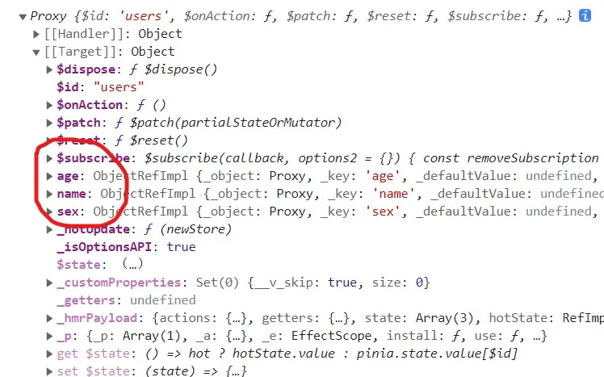
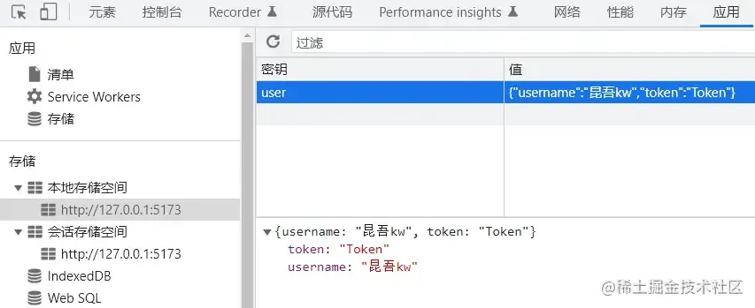

# pinia

## 目录

- [优点：](#优点)
- [项目搭建：](#项目搭建)
- [store](#store)
  - [创建](#创建)
  - [modules](#modules)
    - [state](#state)
      - [修改使用state](#修改使用state)
      - [重置state](#重置state)
      - [批量更改state数据](#批量更改state数据)
      - [直接替换整个state](#直接替换整个state)
      - [响应式](#响应式)
    - [getters属性](#getters属性)
      - [使用getter](#使用getter)
      - [getter中调用其它getter](#getter中调用其它getter)
      - [getter传参](#getter传参)
    - [actions属性](#actions属性)
      - [使用actions](#使用actions)
  - [setup store](#setup-store)
- [持久化](#持久化)
  - [基本用法](#基本用法)
  - [高级用法](#高级用法)
- [案例](#案例)

[ 一文搞懂pinia状态管理（保姆级教程） 前言Vue3已经推出很长时间了，它周边的生态也是越来越完善了。之前我们使用Vue2的时候，Vuex可以说是必备的，它作为一个状态管理工具，给我们带来了极大的方便。Vue3推出后，虽然相对于Vue2很多东西都变了，但是核… https://zhuanlan.zhihu.com/p/533233367](https://zhuanlan.zhihu.com/p/533233367 " 一文搞懂pinia状态管理（保姆级教程） 前言Vue3已经推出很长时间了，它周边的生态也是越来越完善了。之前我们使用Vue2的时候，Vuex可以说是必备的，它作为一个状态管理工具，给我们带来了极大的方便。Vue3推出后，虽然相对于Vue2很多东西都变了，但是核… https://zhuanlan.zhihu.com/p/533233367")

[ Pinia 🍍 Intuitive, type safe, light and flexible Store for Vue https://pinia.web3doc.top/introduction.html#为什么要使用-pinia？](https://pinia.web3doc.top/introduction.html#为什么要使用-pinia？ " Pinia 🍍 Intuitive, type safe, light and flexible Store for Vue https://pinia.web3doc.top/introduction.html#为什么要使用-pinia？")

# **优点：**

- Vue2和Vue3都支持，这让我们同时使用Vue2和Vue3的小伙伴都能很快上手。
- pinia中只有state、getter、action，抛弃了Vuex中的Mutation，Vuex中mutation一直都不太受小伙伴们的待见，pinia直接抛弃它了，这无疑减少了我们工作量。
- pinia中action支持同步和异步，Vuex不支持
- 良好的Typescript支持，毕竟我们Vue3都推荐使用TS来编写，这个时候使用pinia就非常合适了
- 无需再创建各个模块嵌套了，Vuex中如果数据过多，我们通常分模块来进行管理，稍显麻烦，而pinia中每个store都是独立的，互相不影响。
- 体积非常小，只有1KB左右。
- pinia支持插件来扩展自身功能。
- 支持服务端渲染。

# **项目搭建：**

```typescript 
npm create vite@latest my-vite-app --template vue-ts
npm install
npm install pinia
npm run dev


```


# store

## 创建

```javascript 
 // store/index.ts

import type { App } from 'vue'
import { createPinia } from 'pinia'
import piniaPluginPersist from 'pinia-plugin-persist'

const store = createPinia()

store.use(piniaPluginPersist)

export const setupStore = (app: App<Element>) => {
  app.use(store)
}

export { store }
```


修改main.js，引入pinia提供的setupStore方法，创建根存储。

```javascript 
//main.ts

import { createApp } from "vue";
import App from "./App.vue";
import { setupStore } from "./store";

// 创建实例
const setupAll = async () => {
  const app = createApp(App)
  setupStore(app)
  app.mount('#app')
}
setupAll()

```


## modules

`Pinia` 中没有 `module` 的概念，是一个拍平的 `store` 结构。`Pinia` 推荐按照功能去划分一个个的 `store` ，这样更方便管理和使用。

使用 `defineStore` 方法创建 `store`，`store` 的命名遵循 `useXXX` 的形式。创建时需要指定一个唯一的 `id`，有两种方式：

```typescript 
//src/store/user.ts


import { defineStore } from 'pinia'


// 第一个参数是应用程序中 store 的唯一 id
export const useUsersStore = defineStore('users', {
  // 其它配置项
})

const useStore = defineStore({
   id: 'users'
  // other options...
})


```


创建store很简单，调用pinia中的defineStore函数即可，该函数接收两个参数：

- name：一个字符串，必传项，该store的唯一id。
- options：一个对象，store的配置项，比如配置store内的数据，修改数据的方法等等。

我们可以定义任意数量的store，因为我们其实一个store就是一个函数，这也是pinia的好处之一，让我们的代码扁平化了，这和Vue3的实现思想是一样的。

### state

```typescript 
export const useUsersStore = defineStore("users", {
  state: () => {
    return {
      name: "小猪课堂",
      age: 25,
      sex: "男",
    };
  },
});
```


#### 修改使用state

使用store很简单，直接引入我们声明的useUsersStore 方法即可，我们可以先看一下执行该方法输出的是什



**利用pinia的storeToRefs函数，将state中的数据变为了响应式的**。

```typescript 
<template>
  <h1>我是child组件</h1>
  <p>姓名：{{ name }}</p>
  <p>年龄：{{ age }}</p>
  <p>性别：{{ sex }}</p>
  <button @click="changeName">更改姓名</button>
</template>
<script setup lang="ts">
 import { useUsersStore } from "../src/store/user";
import { storeToRefs } from 'pinia';
const store = useUsersStore();
const { name, age, sex } = storeToRefs(store);
const changeName = () => {
  store.name = "小猪课堂";
}; 
</script>
```


#### 重置state

有时候我们修改了state数据，想要将它还原，这个时候该怎么做呢？就比如用户填写了一部分表单，突然想重置为最初始的状态。

此时，我们直接调用store的\$reset()方法即可，继续使用我们的例子，添加一个重置按钮。

```typescript 
<button @click="reset">重置store</button>
// 重置store
const reset = () => {
   store.$reset(); 
};
```


#### 批量更改state数据

前面我们修改state的数据是都是一条一条修改的，比如store.name="张三"等等，如果我们一次性需要修改很多条数据的话，有更加简便的方法，使用store的\$patch方法，修改app.vue代码，添加一个批量更改数据的方法。

```typescript 
<button @click="patchStore">批量修改数据</button>
// 批量修改数据
const patchStore = () => {
   store.$patch({
    name: "张三",
    age: 100,
    sex: "女",
  });
 };
```


有经验的小伙伴可能发现了，我们采用这种批量更改的方式似乎代价有一点大，假如我们state中有些字段无需更改，但是按照上段代码的写法，我们必须要将state中的所有字段例举出了。

为了解决该问题，pinia提供的\$patch方法还可以接收一个回调函数，它的用法有点像我们的数组循环回调函数了。

```typescript 
store.$patch((state) => {
  state.items.push({ name: 'shoes', quantity: 1 })
  state.hasChanged = true
})
```


上段代码中我们即批量更改了state的数据，又没有将所有的state字段列举出来。

#### 直接替换整个state

pinia提供了方法让我们直接替换整个state对象，使用store的\$state方法。

```typescript 
store.$state = { counter: 666, name: '张三' }
```


上段代码会将我们提前声明的state替换为新的对象，可能这种场景用得比较少

#### 响应式

请注意，`store` 是一个用`reactive` 包裹的对象，这意味着不需要在getter 之后写`.value`，但是，就像`setup` 中的`props` 一样，**我们不能对其进行解构：**

```javascript 

export default defineComponent({
  setup() {
    const store = useStore()
    
    / / ❌ 这不起作用，因为它会破坏响应式
    // 这和从 props 解构是一样的 
    const { name, doubleCount } = store

    name // "eduardo"
    doubleCount // 2

    return {
      // 一直会是 "eduardo"
      name,
      // 一直会是 2
      doubleCount,
      // 这将是响应式的
      doubleValue: computed(() => store.doubleCount),
      }
  },
})
```


为了从 Store 中提取属性同时保持其响应式，您需要使用`storeToRefs()`。 它将为任何响应式属性创建 refs。 当您仅使用 store 中的状态但不调用任何操作时，这很有用：

```javascript 
import { storeToRefs } from 'pinia'
 
export default defineComponent({
  setup() {
    const store = useStore()
    // `name` 和 `doubleCount` 是响应式引用
    // 这也会为插件添加的属性创建引用
     // 但跳过任何 action 或 非响应式（不是 ref/reactive）的属性
    const { name, doubleCount } = storeToRefs(store) 

    return {
      name,
      doubleCount
    }
  },
})
```


### getters属性

getter属性值是一个对象，该对象里面是各种各样的方法。大家可以把getter想象成Vue中的计算属性，它的作用就是返回一个新的结果，既然它和Vue中的计算属性类似，那么它肯定也是会被缓存的，就和computed一样。

这里的getter就是处理state数据。

```typescript 
export const useUsersStore = defineStore("users", {
  state: () => {
    return {
      name: "小猪课堂",
      age: 25,
      sex: "男",
    };
  },
  getters: {
    getAddAge: (state) => {
      return state.age + 100;
    },
  },
});
```


上段代码中我们在配置项参数中添加了getter属性，该属性对象中定义了一个getAddAge方法，该方法会默认接收一个state参数，也就是state对象，然后该方法返回的是一个新的数据。

#### 使用getter

```typescript 
<template>
   <p>新年龄：{{ store.getAddAge }}</p> 
  <button @click="patchStore">批量修改数据</button>
</template>
<script setup lang="ts">
import { useUsersStore } from "../src/store/user";
const store = useUsersStore();
// 批量修改数据
const patchStore = () => {
  store.$patch({
    name: "张三",
    age: 100,
    sex: "女",
  });
};
</script>
```


上段代码中我们直接在标签上使用了store.gettAddAge方法，这样可以保证响应式，其实我们**state中的name等属性也可以以此种方式直接在标签上使用，也可以保持响应式。**

当我们点击批量修改数据按钮时，页面上的新年龄字段也会跟着变化

#### getter中调用其它getter

前面我们的getAddAge方法只是简单的使用了state方法，但是有时候我们需要在这一个getter方法中调用其它getter方法，这个时候如何调用呢？

其实很简单，我们可以直接在getter方法中调用this，this指向的便是store实例，所以理所当然的能够调用到其它getter。

```typescript 
export const useUsersStore = defineStore("users", {
  state: () => {
    return {
      name: "小猪课堂",
      age: 25,
      sex: "男",
    };
  },
  getters: {
    getAddAge: (state) => {
      return state.age + 100;
    },
     getNameAndAge(): string {
      return this.name + this.getAddAge; // 调用其它getter
    },
   },
});
```


细心的小伙伴可能会发现我们这里没有使用箭头函数的形式，这**是因为我们在函数内部使用了this，箭头函数的this指向问题相信大家都知道吧！所以这里我们没有采用箭头函数的形式。**

#### getter传参

既然getter函数做了一些计算或者处理，那么我们很可能会需要传递参数给getter函数，但是我们前面说getter函数就相当于store的计算属性，和vue的计算属性差不多，那么我们都知道Vue中计算属性是不能直接传递参数的，所以我们这里的getter函数如果要接受参数的话，也是需要做处理的。

```typescript 
export const useUsersStore = defineStore("users", {
  state: () => {
    return {
      name: "小猪课堂",
      age: 25,
      sex: "男",
    };
  },
  getters: {
     getAddAge: (state) => {
      return (num: number) => state.age + num;
    },
     getNameAndAge(): string {
      return this.name + this.getAddAge; // 调用其它getter
    },
  },
});
```


上段代码中我们getter函数getAddAge接收了一个参数num，这种写法其实有点闭包的概念在里面了，相当于我们整体返回了一个新的函数，并且将state传入了新的函数。

```typescript 
<p>新年龄：{{ store.getAddAge(1100) }}</p>
```


### actions属性

前面我们提到的state和getters属性都主要是数据层面的，并没有具体的业务逻辑代码，它们两个就和我们组件代码中的data数据和computed计算属性一样。

那么，如果**我们有业务代码的话**，最好就是写在actions属性里面，该属性就和我们组件代码中的methods相似，用来放置一些处理业务逻辑的方法。

actions属性值同样是一个对象，该对象里面也是存储的各种各样的方法，包括同步方法和异步方法。

```typescript 
export const useUsersStore = defineStore("users", {
  state: () => {
    return {
      name: "小猪课堂",
      age: 25,
      sex: "男",
    };
  },
  getters: {
    getAddAge: (state) => {
      return (num: number) => state.age + num;
    },
    getNameAndAge(): string {
      return this.name + this.getAddAge; // 调用其它getter
    },
  },
  actions: {
     saveName(name: string) {
      this.name = name;
    }, 
  },
});
```


上段代码中我们定义了一个非常简单的actions方法，在实际场景中，该方法可以是任何逻辑，比如发送请求、存储token等等。大家把actions方法当作一个普通的方法即可，特殊之处在于该方法内部的this指向的是当前store。

#### 使用actions

```typescript 
const saveName = () => {
  store.saveName("我是小猪");
};
```


## setup store

```typescript 
import store from "@/store"

export const useCounterStore = defineStore('counter', () => {
  const count = ref(0)
  const doubleCount = computed(() => count.value * 2)
  function increment() {
    count.value++
  }

  return { count, doubleCount, increment }
})

/** 在 setup 外使用 */
export function useCounterStoreHook() {
  return useCounterStore(store)
}
```


在这种语法中，`ref` 与 `state` 对应、`computed` 与 `getters` 对应、`function` 与 `actions` 对应。

想必写过 Vue3 朋友就能一眼看出来这和 Vue3 新推出的 Composition API（组合式 API）非常类似！这样的话，在使用 Vue3 和 Pinia 的时候，就能统一语法了。

# 持久化

[ Pinia Plugin Persist Persist pinia state data in sessionStorage or other storages. https://seb-l.github.io/pinia-plugin-persist/#vue2](https://seb-l.github.io/pinia-plugin-persist/#vue2 " Pinia Plugin Persist Persist pinia state data in sessionStorage or other storages. https://seb-l.github.io/pinia-plugin-persist/#vue2")

### 基本用法

```typescript 
npm i pinia-plugin-persist
```


```typescript 
// store/index.ts

import type { App } from 'vue'
import { createPinia } from 'pinia'
import piniaPluginPersist from 'pinia-plugin-persist'

const store = createPinia()

 store.use(piniaPluginPersist)
 
export const setupStore = (app: App<Element>) => {
  app.use(store)
}

export { store }
```


`Pinia` 中的状态是以 `store` 为单位进行管理的。哪个 `store` 中的数据需要持久化，就在哪个 `store` 中去开启。比如：

```typescript 
import { defineStore } from 'pinia'

export interface DictState {
  isSetDict: boolean
  dictObj: Recordable
}

export const useDictStore = defineStore({
  id: 'dict',
  state: (): DictState => ({
    isSetDict: false,
    dictObj: {}
  }),
   persist: {
    enabled: true
  }, 
  getters: {
    getDictObj(): Recordable {
      return this.dictObj
    },
    getIsSetDict(): boolean {
      return this.isSetDict
    }
  },
  actions: {
    setDictObj(dictObj: Recordable) {
      this.dictObj = dictObj
    },
    setIsSetDict(isSetDict: boolean) {
      this.isSetDict = isSetDict
    }
  }
})
```


默认，持久化的数据放在 `localStorage` 中，`key` 就是该 `store` 的 `id`，存储的结构就是 `state` 的类型：



## 高级用法

```typescript 
// store/use-user-store.ts
export const useUserStore = defineStore('storeUser', {
  state () {
    return {
      firstName: 'S',
      lastName: 'L',
      accessToken: 'xxxxxxxxxxxxx',
    }
  },
  persist: {
    enabled: true,
    strategies: [], // <- HERE
  },
})
```


Each strategy is an object like so:

```typescript 
interface PersistStrategy {
  key?: string; // Storage key
  storage?: Storage; // Actual storage (default: sessionStorage)
  paths?: string[]; // list ok state keys you want to store in the storage
}
```


```typescript 
// store/use-user-store.ts
export const useUserStore = defineStore('storeUser', {
  state () {
    return {
      firstName: 'S',
      lastName: 'L',
      accessToken: 'xxxxxxxxxxxxx',
    }
  },
   persist: {
    enabled: true,
    strategies: [
      { key:'userA',storage: sessionStorage, paths: ['firstName', 'lastName'] },
      { key:'userB',storage: localStorage, paths: ['accessToken'] },
    ],
  },
 })


//自定义storage
// store/use-user-store.ts
import Cookies from 'js-cookie'

const cookiesStorage: Storage = {
  setItem (key, state) {
    return Cookies.set('accessToken', state.accessToken, { expires: 3 })
  },
  getItem (key) {
    return JSON.stringify({
      accessToken: Cookies.getJSON('accessToken'),
    })
  },
}

export const useUserStore = defineStore('storeUser', {
  state () {
    return {
      firstName: 'S',
      lastName: 'L',
      accessToken: 'xxxxxxxxxxxxx',
    }
  },
   persist: {
    enabled: true,
    strategies: [
      {
        storage: cookiesStorage,
        paths: ['accessToken']
      },
    ],
  },
 })


```


# 案例

[一个登录案例包学会 Pinia  - 掘金 Pinia 删减了复杂的概念，简化了数据流转的过程，只剩下 store、state、getters、actions 这四个核心功能。本文使用一个用户登录的案例，来学习 Pinia 的使用。 https://juejin.cn/post/7154579554034515982](https://juejin.cn/post/7154579554034515982 "一个登录案例包学会 Pinia  - 掘金 Pinia 删减了复杂的概念，简化了数据流转的过程，只剩下 store、state、getters、actions 这四个核心功能。本文使用一个用户登录的案例，来学习 Pinia 的使用。 https://juejin.cn/post/7154579554034515982")

```javascript 
import { useDictStoreWithOut } from '@/store/modules/dict'

const dictStore = useDictStoreWithOut()


if (!dictStore.getIsSetDict) {
  // 获取所有字典
  const res = await getDictApi()
  if (res) {
    dictStore.setDictObj(res.data)
    dictStore.setIsSetDict(true)
  }
}


或者
const appStore = useAppStore()

// 初始化获取是否是暗黑主题
const isDark = ref(appStore.getIsDark)

// 设置switch的背景颜色
const blackColor = 'var(--el-color-black)'

const themeChange = (val: boolean) => {
  appStore.setIsDark(val)
}

```


store/modules/dict.ts

```javascript 
import { defineStore } from 'pinia'
import { store } from '../index'

export interface DictState {
  isSetDict: boolean
  dictObj: Recordable
}

export const useDictStore = defineStore({
  id: 'dict',
  state: (): DictState => ({
    isSetDict: false,
    dictObj: {}
  }),
  persist: {
    enabled: true
  },
  getters: {
    getDictObj(): Recordable {
      return this.dictObj
    },
    getIsSetDict(): boolean {
      return this.isSetDict
    }
  },
  actions: {
    setDictObj(dictObj: Recordable) {
      this.dictObj = dictObj
    },
    setIsSetDict(isSetDict: boolean) {
      this.isSetDict = isSetDict
    }
  }
})

```
